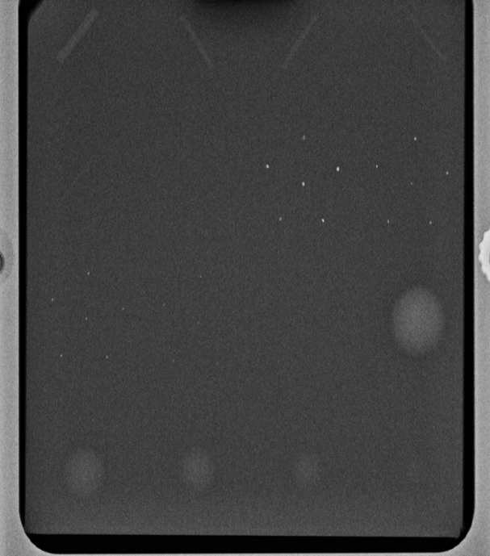
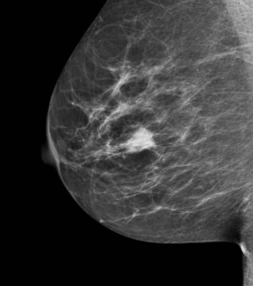

# (PART\*) ROC paradigm {-}

# Preliminaries {#preliminaries}

```{r setup, include = FALSE}
  knitr::opts_chunk$set(
  collapse = TRUE,
  comment = "#>"
  )
  library(ggplot2)
  library(kableExtra)
```


## TBA How much finished {#preliminaries-how-much-finished}
95%


## Introduction {#preliminariesIntro}
The question addressed by this book is "how good are radiologists using medical imaging devices at diagnosing disease?" Observer performance measurements, widely used for this purpose, require data collection and analyses methods that fall under the rubric of what is loosely termed "ROC analysis", where ROC is an abbreviation for Receiver Operating Characteristic [@metz1978rocmethodology]. ROC analysis and its extensions form a specialized branch of science encompassing knowledge of diagnostic medical physics, perception of stimuli  (commonly studied by psychologists), human observer modeling and statistics. Its importance in medical imaging is due to the evolution of technology and the need to objectively assess advances. The Food and Drug Administration, Center for Devices and Radiological Health (FDA/CDRH), which regulates medical-imaging devices, requires ROC studies as part of its device approval process . There are, conservatively, at least several hundred publications using ROC studies and a paper [@metz1978rocmethodology] by the late Prof. C.E. Metz has been cited over 1800 times. Numerous reviews and tutorial papers have appeared [@metz1978rocmethodology, @RN113, @RN1908, @metz1986rocmethodology] and there are books on the statistical analysis [@RN1443] of ROC data. However, in spite of the numbers of publications and books in this field, and in my experience, basic aspects of it are sometimes misunderstood, and lessons from the past have been sometimes forgotten, and these have seriously held back health care advances – as will be demonstrated in this book.

It is the aim of this book to describe the field in some depth while assuming little statistical background of the reader. That is a tall order. Key to accomplishing this aim is the ability to illustrate abstract statistical concepts and analysis methods with free, cross-platform, open-source software `R`, a programming language, and `RStudio`, "helper" software that makes it much easier to work with `R`, is very popular in the scientific community. 

This chapter provides background material and an overview of the book. It starts with diagnostic interpretations occurring everyday in hospitals. The process of imaging device development by manufacturers is described, stressing the role of physical measurements in optimizing the design. Once the device is deployed, medical physicists working in hospitals use phantom quality control measurements to maintain image quality. Lacking the complexity of clinical images, phantom measurements may not correlate with clinical image quality. Model observers, that reduce the imaging process to mathematical formulae, are intended to bridge the gap. However, since they are yet restricted to simple tasks, where the location of possible lesions is known, their potential is yet to be realized. Unlike physical, phantom and model observer measurements, observer performance methods measure the net effect of the entire imaging chain, including the critical role of the radiologist. Four observer performance paradigms are described. Physical and observer performance methods are put in the context of a hierarchy of efficacy levels, where the measurements become increasingly difficult, but more clinically meaningful, as one moves to higher levels. An overview of the book is presented and suggestions are made on how to best use it. 

## Clinical tasks
In hospital based radiology departments or freestanding imaging centers, imaging studies are conducted to diagnose patients for signs of disease. Examples are chest x-rays, computerized tomography (CT) scans, magnetic resonance imaging (MRI) scans, ultrasound (US) imaging, etc. A patient does not go directly to a radiology department; rather, the patient first sees a family doctor, internist or general practitioner about an ailment. After a physical examination, perhaps augmented with non-imaging tests (blood tests, electrocardiogram, etc.) the physician may recommend an imaging study. As an example, a patient suffering from persistent cough yielding mucus and experiencing chills may be referred for chest x-rays to rule out pneumonia. In the imaging suite a radiologic technician properly positions the patient with respect to the x-ray beam. Chest x-rays are taken, usually in two projections, back to front (posterior-anterior or PA-view) and sideways (lateral or LAT-view). 

Each x-ray image is a projection from, ideally a point source of x-rays, of patient anatomy in the path of the beam, onto a detector, e.g., x-ray film or digital detector. Because of differential attenuation, the shadow cast by the x-rays shows anatomical structures within the patient. The technician checks the images for proper positioning and technical quality. A radiologist (a physician who specializes in interpreting imaging studies) interprets them and dictates a report. 

Because of the referring physician's report, the radiologist knows why the patient was sent for chest x-rays in the first place, and interprets the image in that context. At the very outset one recognizes that images are not interpreted in a "vacuum", rather, for a symptomatic patient, the interpretation is done in the context of resolving a specific ailment. This is an example of a clinical task and it should explain why different specialized imaging devices are needed in a radiology department. Radiology departments in the US are usually organized according to body parts, e.g., a chest section, a breast imaging section, an abdominal imaging section, head CT, body CT, cardiac radiology, orthopedic radiology, etc. Additionally, for a given body part, different means of imaging are generally available. Examples are x-ray mammography, ultrasound and magnetic resonance imaging of the breast.

### Workflow in an imaging study 
The workflow in an imaging study can be summarized as follows. The patient's images are acquired. Nowadays almost all images in the US are acquired digitally, but some of the concepts are illustrated with analog images; this is not an essential distinction. The digital detector acquired image(s) are processed for optimality and displayed on one or more monitors. These are interpreted by a radiologist in the context of the clinical task implied by the referring physicians notes attached to the imaging request (such as "rule out pneumonia"). After interpreting the image(s), the radiologist makes a diagnosis, such as "patient shows no signs of disease" or "patient shows signs of disease". If signs of disease are found, the radiologist's report will contain a description of the disease and its location, extent, and other characteristics, e.g., "diffuse opacity near the bottom of the lungs, consistent with pneumonia". Alternatively, an unexpected finding can occur, such as "nodular lesion, possibly lung cancer, in the apex of the lungs". A diseased finding will trigger further imaging, e.g., a CT scan, and perhaps biopsy (excision of a small amount of tissue and examination by a pathologist to determine if it is malignant), to determine the nature and extent of the disease. In this book the terms non-diseased and diseased are used instead of "normal" and "abnormal", or "noise" and "signal plus noise", or "target absent" and "target present", etc. 

So far, patients with symptoms of disease were considered. Interpreting images of asymptomatic patients involves an entirely different clinical task, termed "screening", described next.

### The screening and diagnostic workup tasks
In the US, women older than 40 years are imaged at yearly intervals using a special x-ray machine designed to optimally image the breast. Here the radiologist's task is to find breast cancer, preferably when it is small and has not had an opportunity to spread, or metastasize, to other organs. Cancers found at an early stage are more likely to be treatable. Fortunately, the incidence of breast cancer is very low, about five per thousand women in the US, but, because most of the patients are non-diseased, this makes for a difficult task. The images are interpreted in context. The family history of the patient is available, the referring physician (the woman's primary care physician and / or gynecologist) has performed a physical examination of the patient, and in some cases it may be known whether the patient is at high-risk because she has a gene that predisposes her to breast cancer. The interpreting radiologist has to be MQSA-certified (Mammography Quality Standards Act) to interpret mammograms. If the radiologist finds one or more regions suspicious for breast cancer, the location of each suspicious region is recorded, as it provides a starting point for subsequent patient management. At my previous institution, The University of Pittsburgh, the images are electronically marked (annotated) on the digital images. The patient receives a dreaded letter or e-mail, perhaps preceded by a phone call from the imaging center, that she is being "recalled" for further assessment. When the woman arrives at the imaging center, further imaging, termed a diagnostic workup, is conducted. For example, magnification views, centered on the location of the suspicious region found at screening, may be performed. Magnifying the image reveals more detail. Additional x-ray projections and other types of imaging (e.g., ultrasound, MRI and perhaps breast CT – still in the research stage) may be used to resolve ambiguity regarding true disease status. If the suspicious region is determined to be benign, the woman goes home with the good news. This is the most common outcome. If ambiguity remains, a somewhat invasive procedure, termed a needle biopsy, is performed whereby a small amount of tissue is extracted from the suspicious region and sent to the pathology laboratory for final determination of malignancy status by a pathologist. Even here, the more common outcome is that the biopsy comes back negative for malignancy. About ten percent of women who are screened by experts are recalled for unnecessary diagnostic workups, in the sense that the diagnostic workup and / or biopsy end up showing no signs of cancer. These recalls cause some physical and much emotional trauma, and result in increased health care costs. About four of every five cancers are detected by experts, i.e., about 1 in 5 is missed. All of these numbers are for experts – there is considerable variability in skill-levels between MQSA-certified radiologists. If cancer is found radiation, chemotherapy or surgery may be initiated to treat the patient. Further imaging is usually performed to determine the response to therapy (has the tumor shrunk?).

The practice of radiology, and patients served by this discipline, has benefited tremendously from technological innovations. How these innovations are developed and adopted by radiology departments is the next topic.

## Imaging device development and its clinical deployment
Roentgen's 1895 discovery of x-rays found almost immediate clinical applications and started the new discipline of radiology. Initially, two developments were key: optimizing the production of x-rays, as the process is very inefficient, and efficiently detecting the photons that pass through the imaged anatomy: these photons form the radiological image. Consequently, initial developments were in x-ray tube and screen-film detector technologies. Over many decades these have matured and new modalities have emerged, examples of which are CT in the late 1960s, MRI in the 1970s, computed radiography and digital imaging in the late 1980s. 

### Physical measurements
There is a process to imaging device development and deployment into clinical practice. The starting point is to build a prototype of the new imaging device. The device is designed in the context of a clinical need and is based on physical principles suggesting that the device, perhaps employing new technology or new ideas, should be an improvement over what is already available, generically termed the conventional modality. The prototype is actually the end-point of much research involving engineers, imaging scientists and radiologists. 

The design of the prototype is optimized by physical measurements. For example, images are acquired of a block of Lucite™, termed a "phantom", with thickness equivalent in x-ray penetrability to an average patient. Ideally, the images would be noise free, but x-ray quantum fluctuations and other sources of noise influence the final image and cause them to have noise, termed radiographic mottle[16-18]. For conventional x-rays, the kind one might see the doctor putting up on a viewing panel (light box) in old movies, the measurement employs a special instrument called a microdensitometer, which essentially digitizes narrow strips of the film. The noise is quantified by the standard deviation of the digitized pixel values. This is compared to that expected based on the number of photons used to make the image; the latter number can be calculated from knowledge of the x-ray beam spectrum and the thickness of the phantom. If the measured noise equals the expected noise (if it is smaller, there is obviously something wrong with the calculation of the expected noise and / or the measurement), image quality is said to be quantum limited. Since a fundamental limit, dictated by the underlying imaging physics, has been reached, further noise reduction is only possible by increasing the number of photons. The latter can be accomplished trivially by increasing the exposure time, which, of course, increases radiation dose to the patient. Therefore, as far as image noise is concerned, in this scenario, the system is ideal and no further noise optimization is needed. In my experience teaching imaging physics to radiology residents, the preceding sentences cause confusion. In particular, the terms limited and ideal seem to be at odds, but the residents eventually understand it. The point is that if one is up against a fundamental limit, then things are ideal in the sense that they can get no better (physicists do have a sense of humor). In practice this level of perfection is never reached, as the screen-film system introduces its own noise, due to the granularity of the silver halide crystals that form the photographic emulsion and other factors – ever tried digitizing an old slide? Furthermore, there could be engineering limitations preventing attainment of the theoretical limit. Through much iteration, the designer reaches a point at which it is decided that the noise is about as low as it is going to get.  

Noise is but one factor limiting image quality. Another factor is spatial resolution – the ability of an imaging system to render sharp edges and/or resolve closely spaced small objects. For this measurement, one increases the number of photons (to minimize noise), or uses a thinner Lucite™ block superposed on an object with a sharp edge, e.g., a razor blade. When the resulting image is scanned with a microdensitometer, the trace should show an abrupt transition as one crosses the edge of the phantom. In practice, the transition is rounded or spread out, resembling a sigmoid function. This is due to several factors. The finite size of the focal spot producing the x-rays produces a penumbra effect, which blurs the edge. The spread of light, within the screen due to its finite thickness, also blurs the edge. The screen absorbs photons and converts them to visible light to which film is exquisitely sensitive. Without the screen, the exposure would have to increase about thousand fold. One can make the screen only so thin, because then it would lack the ability to stop the x-rays that have penetrated the phantom. These photons contain information regarding the imaged anatomy. Ideally, all photons that form the radiological image should be stopped in the detector. Again, an optimization process is involved until the equipment designer is convinced that a fundamental limit has been reached or engineering limitations prevent further improvement. 

Another factor affecting image quality is contrast – the ability of the imaging system to depict different levels of x-ray penetration. A phantom consisting of a step wedge, with varying thickness of Lucite™ is imaged and the image scanned with a microdensitometer. The resulting trace should show distinct steps as one crosses the different thickness parts of the step-wedge phantom (termed large area contrast, to distinguish it from the blurring occurring at the edges between the steps). The more steps that can be visualized, the better the system. The digital term for this is the gray-scale. For example, an 8-bit gray scale can depict 256 shades of gray. Once again design considerations and optimization is used to arrive at the design of the prototype.

The preceding is a simplified description of possible physical measurements. In fact, it is usual to measure the spatial frequency dependence of resolution, noise and overall photon usage efficiency[19, 20]. These involve quantities named modulation transfer function (MTF), noise power spectrum (NPS) and detective quantum efficiency (DQE), each of which is a function of spatial frequency (f, in cycles per mm). The frequency dependence is important in understanding, during the development process, the factors limiting image quality. 

After an optimized prototype has been made it needs approval from the FDA/CDRH for pre-clinical usage. This involves submitting information about the results of the physical measurements and making a case that the new design is indeed an improvement over existing methods. However, since none of the physical measurements involved radiologists interpreting actual patient images produced by the prototype, observer performance measurements are needed before machines based on the prototype can be marketed. Observer performance measurements, in which the prototype is compared to an existing standard, involve a group of about five or six radiologists interpreting a set of patient images acquired on the prototype and on the conventional modality. The truth (is the image of a diseased patient?) is unknown to them but is know to the researcher, i.e., the radiologist is "blinded" to the truth. The radiologists' decisions, classified by the investigator as correct or incorrect, are used to determine the average performance of the radiologists on the prototype and on the existing standard. Specialized statistical analysis is needed to determine if the difference in performance is in the correct direction and "statistically significant", i.e., unlikely to be due to chance. The measurements are unique in the sense that the entire imaging chain is being evaluated. In order to get a sufficiently large and representative sample of patients and radiologists, such studies are generally performed in a multi-institutional setting[21]. If the prototype's performance equals or exceeds that of the existing standard, it is approved for clinical usage. At this point, the manufacturer can start marketing the device to radiology departments. This is a simplified description of the device approval process. Most imaging companies have experts in this area that help them negotiate a necessarily more complex process.

### Quality Control and Image quality optimization
Once the imaging device is sold to a radiology department, both routine quality control (QC) and continuous image quality optimization are needed to assure proper utilization of the machine over its life span. The role of QC is to maintain image quality at an established standard. Initial QC measurements, termed acceptance testing[22-24], are made to establish base-line QC parameters and a medical physicist establishes a program of systematic checks to monitor them. The QC measurements are relatively simple, typically taking a few hours of technologist time, that look for changes in monitored variables. The role of continuous image quality optimization, which is the bread-and-butter of a diagnostic medical physicist, is to resolve site-specific image quality issues. The manufacturer cannot anticipate every issue that may arise when their equipment is used in the field, and it takes a medical physicist, working in collaboration with the equipment manufacturer, technologists and radiologists, to continually optimize the images and solve specific image quality related problems. Sometimes the result is a device that performs better than what the manufacturer was able to achieve. One example, from my experience, is the optimization, using special filters and an air-gap technique, of a chest x-ray machine in the 1980s by Prof. Gary T. Barnes, a distinguished medical physicist and the late Prof. Robert Fraser, a famous chest radiologist[25]. The subsequent evaluation of this machine vs. a prototype digital chest x-ray machine by the same manufacturer, Picker International, was my entry into the field of observer performance [26].

A good example of QC is the use of the American College of Radiology Mammography Quality Standards Act (ACR-MQSA) phantom to monitor image quality of mammography machines[27-29]. The phantom consists of a (removable) wax insert in an acrylic holder; the latter provides additional absorption and scattering material to more closely match the attenuation and beam hardening  of an average breast. Embedded in the wax insert are target objects consisting of 6 fibrils, five groups of microcalcifications, each containing six specks, and five spherical objects of different sizes, called masses. An image of the phantom, Fig. \@ref(fig:acrPhantomClinical) (A) is obtained daily, before the first patient is imaged, and is inspected by a technologist, who records the number of target objects of different types that are visible. There is a pass-fail criterion and if the image fails then patients cannot be imaged on that machine until the problem is corrected. At this point, the medical physicist is called in to investigate. 

```{r acrPhantomClinical, echo=FALSE,out.width="50%", fig.cap="(A) Image of an ACR phantom, (B) Clinical image.", fig.show='hold'}


``` 


Fig. \@ref(fig:acrPhantomClinical) (A – B): (A) Image of an American College of Radiology mammography accreditation phantom. The phantom contains target objects consisting of six fibrils, five groups of microcalcifications, and five nodule-like objects. An image of the phantom is obtained daily, before the first patient is imaged, and is inspected by a technologist, who records the number of target objects of different types that are visible. On his 27" iMac monitor, I see four fibrils, three speck groups and four masses, which would be graded as a "pass". This is greatly simplified version of the test. The scoring accounts for irregular fibril or partially visible masses borders, etc., all of which is intended to get more objectivity out of the measurement. (B) A breast image showing an invasive cancer, located roughly in the middle of the image. Note the lack of similarity between the two images (A) and (B). The breast image is much more complex and there is more information, and therefore more to go wrong than with the phantom image. Moreover, there is variability between patients in contrast to the fixed image in (A). In my clinical experience, the phantom images interpreted visually are a poor predictor of clinical image quality.

One can perhaps appreciate the subjectivity of the measurement. Since the target locations are known, the technologist can claim to have detected it and the claim cannot be disproved; unless a claim is falsifiable, it is not science. While the QC team is trained to achieve repeatable measurements, I have shown TBA [30-34] that computer analysis of mammography phantom images (CAMPI) can achieve far greater precision and repeatability than human observer readings. Commercial software is currently available from various vendors that perform proprietary analysis of phantom images for various imaging systems (e.g., mammography machines, CT scanners, MRI scanners, ultrasound, etc.). 

Fig. \@ref(fig:acrPhantomClinical) (B) shows a mammogram with a mass-like cancer visible near it center. It is characterized by complex anatomical background, quite unlike the uniform background in the phantom image in Fig. \@ref(fig:acrPhantomClinical) (A). In mammography 30% of retrospectively visible lesions are missed at initial screening and radiologist variability can be as large as 40% [35]. QC machine parameters (e.g., kVp, the kilovoltage accuracy) are usually measured to 1% accuracy. It is ironic that the weak link, in the sense of greatest variability, is the radiologist but quality control and much effort is primarily focused on measuring/improving the physical parameters of the machine. This comment is meant to motivate clinical medical physicists, most of who are focused on QC, to become more aware about observer performance methods, where achieving better than 5% accuracy is quite feasible[36]. The author believes there should be greater focus on improving radiologist performance, particularly those with marginal performance. Efforts in this direction, using ROC methods, are underway in the UK [37, 38] by Prof Alistair Gale and colleagues.

## Image quality vs. task performance
In this book, "image quality" is defined as the fidelity of the image with respect to some external gold standard of what the ideal image should look like, while "task performance" is how well a radiologist, using the image, accomplishes a given clinical task. For example, if one had an original Rembrandt and a copy, the image quality of the copy is perfect if even an expert appraiser cannot distinguish it from the original. The original painting is the “gold standard”. If an expert can distinguish the copy from the original, its image quality is degraded. The amount of degradation is related to the ease with which the expert can detect the fraud. 

A radiological image is the result of x-rays interactions within the patient and the image receptor. Here it is more difficult to define a gold standard. If it exists at all, the gold standard is expected to depend on what the image is being used for, i.e., the diagnostic task. An image suitable for soft-tissue disease diagnosis may not be suitable for diagnosis of bone disease. This is the reason why CT scanners have different soft-tissue and bone window/level  settings. With clinical images, a frequently used approach is to have an expert rank-order the images, acquired via different methods, with respect to "clinical appropriateness" or “clinical image quality”. The quotes are used to emphasize that these terms are hard to define objectively. In this approach, the gold standard is in the mind of the expert. Since experts have typically interpreted tens of thousands of images in the past, and have lived with the consequences of their decisions, there is considerable merit to using them to judge clinical image quality. However, experts do disagree and biases cannot be ruled out. This is especially true when a new imaging modality is introduced. The initial introduction of computed radiography (CR) was met with some resistance in the US among technologists, who had to learn a different way of obtaining the images that disrupted their workflow. There was also initial resistance from more experienced radiologists, who were uncomfortable with the appearance of the new images, i.e., their gold standard was biased in favor of the modality – plain films – that they were most familiar. The author is aware of at least one instance where CR had to be imposed by "diktat" from the Chairman of the department. Some of us are more comfortable reading printed material than viewing it on a computer screen, so this type of bias is understandable.

Another source of bias is patient variability, i.e., the gold standard depends on the patient. Some patients are easier to image than others are in the sense that their images are "cleaner", i.e., they depict anatomical structures that are known to be present more clearly. X-rays pass readily through a relatively slim patient (e.g., an athlete) and there are fewer scattered photons which degrade image quality[39, 40], than when imaging a larger patient  (e.g., an NFL linebacker). The image of the former will be clearer, the ribs, the heart shadow, the features of the lungs, etc., will be better visualized (i.e., closer to what is expected based on the anatomy) than the image of the linebacker. Similar differences exist in the ease of imaging women with dense breasts, containing a larger fraction of glandular tissue compared to women with fatty breasts. By imaging appropriately selected patients, one can exploit these facts to make one’s favorite imaging system look better. [Prof. Harold Kundel, one of my mentors, used to say: "Tell me which modality you want to come out better and I will prepare a set of patient images to help you make your case".]

  
## Why physical measures of image quality are not enough
Both high spatial resolution and low noise are desirable characteristics. However, imaging systems do not come unambiguously separated as high spatial resolution and low noise vs. low spatial resolution and high noise. There is generally an intrinsic imaging physics dictated tradeoff between spatial resolution and noise. Improving one makes the other worse. For example, if the digital image is smoothed with, for example, with a spatial filter, then noise will be smaller, because of the averaging of neighboring pixels, but the ability to resolve closely spaced structures will be compromised. Therefore, a more typical scenario is deciding whether the decreased noise justifies the accompanying loss of spatial resolution. Clearly the answer to this depends on the clinical task: if the task is detecting relatively large low contrast nodules, then some spatial smoothing may actually be beneficial, but if the task involves detecting small microcalcifications, often the precursors of cancer in the breast, then the smoothing will tend to reduce their visibility. 

The problem with physical measures of image quality lies in relating them to clinical performance. Phantom images have little resemblance to clinical images, compare Fig. \@ref(fig:acrPhantomClinical) (A) and (B). X-ray machines generally have automatic exposure control: the machines use a brief exposure to automatically sense the thickness of the patient from the detected x-rays. Based on this, the machine chooses the best combinations of technical factors (kVp and tube charge) and image processing. The machine has to be put in a special manual override mode to obtain reasonable images of phantoms, as otherwise the exposure control algorithm, which expects patient anatomy, is misled by the atypical nature of the "patient", compared to typical patient anatomy, into producing very poor phantom images. This type of problem makes it difficult to reproduce problems encountered using clinical images with phantom images. It has been my general experience that QC failures often lag clinical image quality reported problems: more often than not, clinical image quality problems are reported before QC measurements indicate a problem. This is not surprising since clinical images, e.g., Fig. \@ref(fig:acrPhantomClinical) (B) are more complex and have more information[41], both in the clinical and in the information theoretic sense[42], than the much simpler phantom image shown in Fig. \@ref(fig:acrPhantomClinical) (A), so there is more that can go wrong with clinical images than with phantom images. Manufacturers now design anthropomorphic phantoms whose images resemble human x-rays. Often these phantoms provide the option of inserting target objects at random locations; this is desired to get more objectivity out of the measurement. Now, if the technologist claims to have found the target, the indicated location can be used to determine if the target was truly detected.

To circumvent the possibility that changes in physical measurements on phantoms may not sensitively track changes in clinical image interpretations by radiologists, a measurement needs to include both the complexity of clinical images and radiologists as part of the measurement. Because of variability in both patient images and radiologist interpretations, such measurements are expected to be more complicated than QC measurements, so to be clear, I am not advocating observer performance studies as part of QC. However, they could be built into a continuous quality improvement program, perhaps performed annually. Before giving an overview of the more complex methods, an alternative modeling driven approach, that is widely used, is described next.

## Model observers
If one can adequately simulate (or model) the entire imaging process, then one can design mathematical measurements that can be used to decide if a new imaging system is an improvement over a conventional imaging system. Both new and conventional systems are modeled (i.e., reduced to formulae that can be evaluated). The field of model observers[43] is based on assuming this can be done. The FDA/CDRH has a research program called VICTRE: Virtual Imaging Clinical Trials for Regulatory Evaluation. Since everything is done on a computer, the method does not require time-consuming studies involving radiologists.

A simple example may elucidate the process (for more details one should consult the extensive literature on model observers). Suppose one simulates image noise by sampling a Gaussian random number generator and filling up the pixels in the image with the random samples. This simulates a non-diseased image. The number of such images could be quite large, e.g., 1000, limited only by one's patience. A second set of simulated diseased images is produced in which one samples a random number generator to create non-diseased images, as before, but this time one adds a small low-contrast but noiseless disk, possibly with Gaussian edges, to the center of each image. The procedure yields two sets of images, 1000 with noise only backgrounds and 1000 with different noise backgrounds and the superposed centered low contrast disk. One constructs a template whose shape is identical to that of the superposed disk (i.e., one does not simply measure peak contrast at the center of the lesion; rather the shape-dependent contrast of the disk is taken into account). One then calculates the cross-correlation of the template with each of the superposed disks[30, 44]. The cross correlation is the sum of the products of pixel values of corresponding pixels, one drawn from the template and the other drawn from the matching position on the disk image. [Details of this calculation are in Online Appendix 12.B of Chapter 12.] Because of random noise, the cross-correlations from different simulated diseased cases will not be identical, and one averages the 1000 values. Next one applies the template to the centers of the non-diseased images and computes the cross correlations as before. Because of the absence of the disk, the values will be smaller (assuming positive disk contrast). The difference between the average of the cross-correlations at disk locations and the average at disk-absent locations is the numerator of a signal to noise ratio (SNR) like quantity. The denominator is the standard deviation of the cross-correlations at disk-free locations. To be technical, the procedure yields the signal-to-noise-ratio (SNR) of the non-pre-whitening ideal observer[45]. It is an ideal mathematical "observer" in the sense that for white noise no human observer can surpass this level of performance[46, 47]. 

Suppose the task is to evaluate two image-processing algorithms. One applies each algorithm to the 2000 images described above and measures SNR for each algorithm. The one yielding the higher SNR, after accounting for variability in the measurements, is the superior algorithm. 

Gaussian noise images are not particularly "clinical" in appearance. If one filters the noise appropriately, one can produce simulated images that are similar to non-diseased backgrounds observed in mammography[48-50]. Other techniques exist for simulating statistically characterized lumpy backgrounds that are a closer approximation to some medical images[51]. 

Having outlined one of the alternatives, one is ready for the methods that form the subject matter of this book.

## Measuring observer performance: four paradigms
Observer performance measurements come in different "flavors", types or paradigms. In the current context, a paradigm  is an agreed-upon method for collecting the data. A given paradigm can lend itself to different analyses. In historical order the paradigms are: (1) the receiver operating characteristic (ROC) paradigm [1, 2, 7, 52, 53]; (2) the free-response ROC (FROC) paradigm [54, 55]; (3) the location ROC (LROC) paradigm [56, 57] and (4) the region of interest (ROI) paradigm [58]. Each paradigm assumes that the truth is known independently of the modalities to be compared. This implies that one cannot use diagnoses from one of the modalities to define truth – if one did, the measurement would be biased in favor of the modality used to define truth. It is also assumed that the true disease status of the image is known to the researcher but the radiologist is "blinded" to this information. 

In the ROC paradigm the observer renders a single decision per image. The decision could be communicated using a binary scale (ex. 0 or 1) or declared by use of the terms “negative” or “positive,” abbreviations of “negative for disease” (the radiologist believes the patient is non-diseased) and “positive for disease” (the radiologist believes the patient is diseased), respectively. Alternatively, the radiologist could give an ordered numeric label, termed a rating, to each case where the rating is a number with the property that higher values correspond to greater radiologist's confidence in presence of disease. A suitable ratings scale could be the consecutive integers 1 through 6, where "1" is "definitely non-diseased" and "6" is "definitely diseased". 

If data is acquired on a binary scale, then the performance of the radiologist can be plotted as a single operating point on an ROC plot. The x-axis of the plot is false positive fraction (FPF), i.e., the fraction of non-diseased cases incorrectly diagnosed as diseased. The y-axis of the plot is true positive fraction (TPF), i.e., the fraction of diseased cases correctly diagnosed as diseased. Models have been developed to fit binary or multiple rating datasets. These models predict continuous curves, or operating characteristics, along which an operating point can move by varying the radiologist's reading style. The reading style is related to the following concept: based on the evidence in the image, how predisposed is a radiologist to declaring a case as diseased. A "lenient", "lax" or "liberal" reporting style radiologist is very predisposed even with scant evidence. A "strict" or "conservative" reporting style radiologist requires more evidence before declaring a patient as diseased. This brief introduction to the ROC was given to explain the term "operating characteristic" in ROC. The topic is addressed in more detail in Chapter 02.

In the FROC paradigm the observer marks and rates all regions in the image that are sufficiently suspicious for disease. A mark is the location of the suspicious region and the rating is an ordered label, characterizing the degree of suspicion attached to the suspicious region. In the LROC paradigm the observer gives an overall ROC-type rating to the image, and indicates the location of the most suspicious region in the image. In the ROI paradigm the researcher divides each image into a number of adjacent non-overlapping regions of interest (ROIs) that cover the clinical area of interest. The radiologist’s task is to evaluate each ROI for presence of disease and give an ROC-type rating to it. 

### Basic approach to the analysis
The basic approach is to obtain data, according to one of the above paradigms, from a group of radiologists interpreting a common set of images in one or more modalities. The way the data is collected, and the structure of the data, depends on the selected paradigm. The next step is to adopt an objective measure of performance, termed a figure or merit (FOM) and a procedure for estimating it for each modality-reader combination. Assuming two modalities, e.g., a new modality and the conventional one, one averages FOM over all readers within each modality. If the difference between the two averages (new modality minus the conventional one) is positive, that is an indication of improvement. Next comes the statistical part: is the difference large enough so as to be unlikely to be due to chance. This part of the analysis, termed significance testing, yields a probability, or p-value, that the observed difference or larger could result from chance even though the modalities have identical performances. If the p-value is very small, that it is taken as evidence that the modalities are not identical in performance, and if the difference is in the right direction, the new modality is judged better.

### Historical notes
The term "receiver operating characteristic" (ROC) traces its roots to the early 1940s. The "receiver" in ROC literally denoted a pulsed radar receiver that detects radio waves bounced off objects in the sky, the obvious military application being to detect enemy aircraft. Sometimes the reflections were strong compared to receiver electronic noise and other sources of noise and the operator could confidently declare that the reflection indicated the presence of aircraft and the operator was correct. This combination of events was termed a true positive (TP). At other times the aircraft was present but due to electronic noise and reflections off clouds, the operator was not confident enough to declare "aircraft present" and this combination of events was termed a false negative (FN). Two other types of decisions can be discerned when there was no aircraft in the field of view: (1) the operator mistook reflections from clouds or perhaps a flock of large birds and declared "aircraft present", termed a false positive (FP). (2) The operator did not declare "aircraft present" because the reflected image was clear of noise or false reflections and the operator felt confident in a negative decision, termed a true negative (TN). Obviously, it was desirable to maximize correct decisions (TPs and TNs) while minimizing incorrect decisions (FNs and FPs). Scientists working on this problem analyzed it as a generic signal detection problem, where the signal was the aircraft reflection and the noise was everything else. A large field called signal detection theory (SDT) emerged[59]. However, even at this early stage, it must have been apparent to the researchers that the problem was incomplete in a key respect: when the operator detects a suspicious signal, there is a location (specifically an azimuth and altitude associated with it. The operator could be correct in stating "aircraft present" but direct the interceptors to the wrong location. Additionally, there could be multiple enemy aircraft present, but the operator is only allowed the "aircraft present" and "aircraft absent" responses, which fail to allow for multiplicity of suspected aircraft locations. This aspect was not recognized, to the best of my knowledge, until Egan coined the term "free-response" in the auditory detection context[54]. 

Having briefly introduced the different paradigms, two of which, namely the ROC and the FROC, will be the focus of this book, it is appropriate to see how these measurements fit in with the different types of measurements possible in assessing imaging systems.

## Hierarchy of assessment methods
The methods described in this book need to be placed in context of a six-level hierarchy of assessment methods[7, 60]. The cited paper by Fryback and Thornbury on "The Efficacy of Diagnostic Imaging" is a highly readable account, which also gives a more complete overview of this field, including key contributions by Yerushalmy[61] and Lusted[62]. The term efficacy is defined generically as "the probability of benefit to individuals in a defined population from a medical technology applied for a given medical problem under ideal conditions of use". Demonstration of efficacy at each lower level is a necessary but not sufficient condition to assure efficacy at higher level. The different assessment methods are, in increasing order of efficacy : technical, diagnostic accuracy, diagnostic thinking, therapeutic, patient outcome and societal, Table \@ref(tab:FrybackThornbury).

Table \@ref(tab:FrybackThornbury): Fryback and Thornbury proposed hierarchy of assessment methods. Demonstration of efficacy at each lower level is a necessary but not sufficient condition to assure efficacy at higher level. [MTF = modulation transfer function; NPS(f) = noise power spectra as a function of spatial frequency f; DQE(f) = detective quantum efficiency]

```{r, echo=FALSE}
FrybackThornbury = array(dim = c(6,2))
FrybackThornbury[1,]  <- c("1. Technical efficacy", "Engineering measures: MTF, NPS, DQE")
FrybackThornbury[2,]  <- c("2. Diagnostic accuracy efficacy", "Sensitivity, specificity, ROC or FROC area")
FrybackThornbury[3,]  <- c("3. Diagnostic thinking efficacy", "Positive and negative predictive values")
FrybackThornbury[4,]  <- c("4. Therapeutic efficacy", "Treatment benefits from imaging test?")
FrybackThornbury[5,]  <- c("5. Patient outcome efficacy", "Patients benefit from imaging test?")
FrybackThornbury[6,]  <- c("6. Societal efficacy", "Society benefits from imaging test?")
df <- as.data.frame(FrybackThornbury)
rownames(df) <- c("1","2","3","4","5","6")
colnames(df) <- c("Level Designation","Essential Characteristic")
```             


```{r FrybackThornbury, echo=FALSE}
knitr::kable(df, caption = "FrybackThornbury hierarchy of efficacies.", escape = FALSE)
```


The term "clinical relevance" is used rather loosely in the literature. The author is not aware of an accepted definition of "clinical relevance" apart from its obvious English language meaning. As a working definition I have proposed [63] that the clinical relevance of a measurement be defined as its hierarchy-level. A level-5 patient outcome measurement (do patients, on the average, benefit from the imaging study) is clinically more relevant than a technical measurement like noise on a uniform background phantom or an ROC study. This is because it relates directly to the benefit, or lack thereof, to a group of patients (it is impossible to define outcome efficacy at the individual patient level – at the patient level outcome is a binary random variable, e.g., 1 if the outcome was good or 0 if the outcome was bad). 

One could make physical measurements ad-infinitum, but one cannot (yet) predict the average benefit to patients. Successful virtual clinical trials would prove me wrong. ROC studies are more clinically relevant than physical measurements, and it is more likely that a modality with higher performance will yield better outcomes, but it is not a foregone conclusion. Therefore, higher-level measurements are needed.

However, the time and cost of the measurement increases rapidly with the hierarchy level. Technical efficacy, although requiring sophistical mathematical methods, take relatively little time. ROC and FROC, both of which are level-2 diagnostic accuracy measurements, take more time, often a few months to complete. However, since ROC measurements include the entire imaging chain and the radiologist, they are more clinically relevant than technical measurements, but they do not tell us the effect on diagnostic thinking. After the results of "live" interpretations are available, e.g., patients are diagnosed as diseased or non-diseased, what does the physician do with the information. Does the physician recommend further tests or recommends immediate treatment. This is where the level-3 measurements come in, which measure the effect on diagnostic thinking. Typical level-3 measurements are positive predictive value (PPV) and negative predictive value (NPV). PPV is the probability that the patient is actually diseased when the diagnosis is diseased and NPV is the probability that the patient is actually non-diseased when the diagnosis is non-diseased. These are discussed in more detail in Chapter 02.

Unlike level-2 measurements, PPV and NPV depend on disease prevalence. As an example consider breast cancer which (fortunately) has low prevalence, about 0.005. Before the image is interpreted and lacking any other history, the mammographer knows only there is a five in 1000 chance that the woman has breast cancer. After the image is interpreted, the mammographer has more information. If the image was interpreted as diseased, the confidence in presence of cancer increases. For an expert mammographer typical values of sensitivity and specificity are 80% and 90%, respectively (these terms will be explained in the next chapter; sensitivity is identical to true positive fraction and specificity is 1-false positive fraction). It will be shown (in Chapter 02, §2.9.2) that for this example PPV is only 0.04. In other words, even though an expert interpreted the screening mammogram as diseased, the chance that the patient actually has cancer is only 4%. Obviously more tests are needed before one knows for sure if the patient has cancer – this is the reason for the recall and the subsequent diagnostic workup referred to in §1.2.2. The corresponding NPV is 0.999. Negative interpretations by experts are definitely good news for the affected patients and these did not come directly from an ROC study, or physical measurements, rather they came from actual "live" clinical interpretations. Again, NPV and PPV are defined as averages over a group of patients. For example, the 4% chance of cancer following a positive diagnosis is good news, on the average. An unlucky patient could be one of the four-in-100-patients that has cancer following a positive screening diagnosis. 

While more relevant than ROC, level-3 measurements like PPV and NPV are more difficult to conduct than ROC studies [18] – they involve following, in real time, a large cohort of patients with images interpreted under actual clinical conditions. Level 4 and higher measurements, namely therapeutic, patient outcome and societal, are even more difficult and are sometimes politically charged, as they involve cost benefit considerations. 

## Overview of the book and how to use it
For the most part the book follows the historical development, i.e., it starts with chapters on ROC methodology, chapters on significance testing, chapters on FROC methodology, chapters on advanced topics and appendices. Not counting Chapter 01, the current chapter, the book is organized five Parts (A - E).  

### Overview of the book

#### Part A: The ROC paradigm
Part A describes the ROC (receiver operating characteristic) paradigm. Chapter 02 describes the binary decision task. Terminology that is important to master, such as accuracy, sensitivity, specificity, disease prevalence, positive and negative predictive values is introduced. Chapter 03 introduces the important concepts of decision variable, the reporting threshold, and how the latter may be manipulated by the researcher and it introduces the ROC curve. Chapter 04 reviews the widely used ratings method for acquiring ROC data. Chapter 06 introduces the widely used binormal model for fitting ratings data. The chapter is heavy on mathematical and computational aspects, as it is intended to take the mystery out of these techniques, which are used in subsequent chapters. The data fitting method, pioneered by Dorfman and Alf in 1969, is probably one of the most used algorithms in ROC analysis. Chapter 07 describes sources of variability affecting any performance measure, and how they can be estimated. 

#### Part B: The statistics of ROC analysis
Part B describes the specialized statistical methods needed to analyze ROC data, in particular how to analyze data originating from multiple readers interpreting the same cases in multiple modalities. Chapter 08 introduces hypothesis-testing methodology, familiar to statisticians, and the two types of errors that the researcher wishes to control, the meaning of the ubiquitous p-value and statistical power. Chapter 09 focuses on the Dorfman-Berbaum-Metz method, with improvements by Hillis. Relevant formulae, mostly from publications by Prof. Steven Hillis, are reproduced without proofs (it is my understanding that Dr. Hillis is working on a book on his specialty, which should nicely complement the minimalistic-statistical description approach adopted in this book). Chapter 10 describes the Obuchowski-Rockette method of analyzing MRMC ROC data, with Hillis' improvements. Chapter 11 describes sample size estimation in an ROC study. 

#### Part C: The FROC paradigm
Part C is unique to this book. Anyone truly wishing to understand human observer visual search performance needs to master it. The payoff is that the concepts, models and methods described here apply to almost all clinical tasks. Chapter 17 and Chapter 18 are particularly important. These were difficult chapters to write and they will take extra effort to comprehend. However, the key findings presented in these chapters and their implications should strongly influence future observer performance research. If the potential of the findings is recognized and used to benefit patients, by even one reader, I will consider this book a success. Chapter 19 describes how to analyze FROC data and report the results. 

#### Part D: Advanced topics
Some of the chapters in Part D are also unique to this book. Chapter 20 discusses proper ROC curve fitting and software. The widely used bivariate binormal model, developed around 1980, but never properly documented, is explained in depth, and a recent extension of it that works with any dataset is described in Chapter 21. Also described is a method for comparing (standalone) CAD to radiologists, Chapter 22. Standalone CAD performance is rarely measured, which is a serious mistake, for which we are all currently paying the price. It does not work for masses in mammography[64-66]. In the UK CAD is not used, instead they rely on double readings by experts, which is actually the superior approach, given the current low bar used in the US for CAD to be considered a success. Chapter 23, co-authored by Mr. Xuetong Zhai, a graduate student, describes validation of the CAD analysis method described in Chapter 22. It describes constructing a single-modality multiple-reader ratings data simulator. The method is extendible to multiple-modality multiple-reader datasets.

#### Part E: Appendices (TBA)
Part E contains two online chapters. Online Chapter 24 is a description of 14 datasets, all but 2 of them collected by me over years of collaborations with researchers who conducted the studies and on which I helped with analysis and sometimes with manuscript preparation. The datasets provide a means to demonstrate analysis techniques and to validate fitting methods. Finally, Online Chapter 25, co-authored by Mr. Xuetong Zhai, is a user-manual for the RJafroc package. Since RJafroc is used extensively in the book, this is expected to be a useful "go-to" chapter for the reader. The choice to put these chapters online is to allow me to update the datasets with new files as they become available and to update the documentation of RJafroc as new features are added.

### How to use the book
Each chapter consists of the physical book chapter that one is reading. Additionally, there are good chances that the online directory corresponding to this book will contain two directories, one called software and the other called Supplementary Material.  The software directory contains "ready to run" code that is referenced in the book chapter text. When one sees such a reference in a chapter, the reader should open the relevant file and run it. Detailed directions are provided in the Online Appendix corresponding to each chapter.

Those new to the field should read the chapters in sequence. It is particularly important to master Part A. Part B presents the statistical analysis at a level accessible to the expected readers of this book, namely the user community. The only way to really understand this part is to apply the described methods and codes to the online datasets. Understanding the formulae in this part, especially those relating to statistical hypothesis testing, requires statistical expertise, which could lead the average reader in unproductive directions. It is best to accept the statisticians' formulae and confirm that they work. How to determine if a method "works" will be described. Readers with prior experience in the field may wish to "skim" chapters. If they do, it is strongly recommended that they at least run and understand the software examples. This will prepare them for the more complex code in later chapters.  

This concludes the introduction of the book.

## Summary{#preliminaries-Summary}
## Discussion{#preliminaries-Discussion}
## References {#preliminaries-references}

