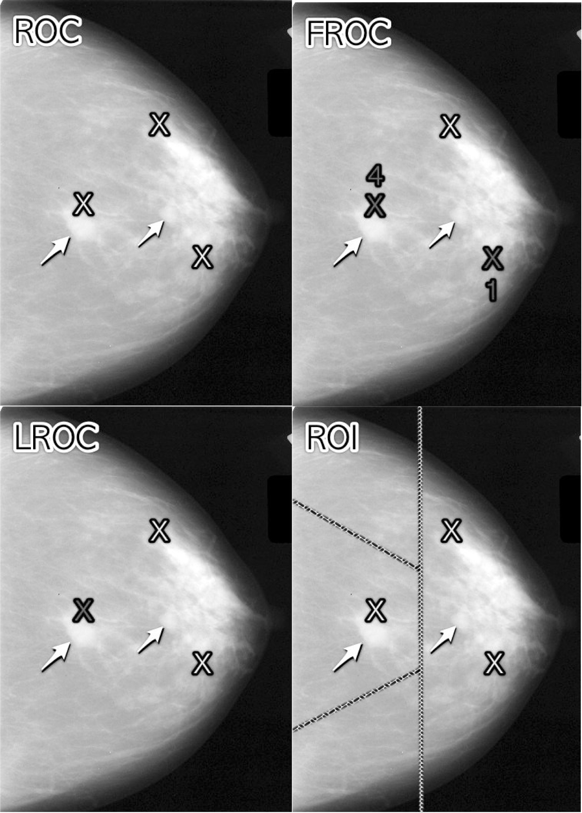
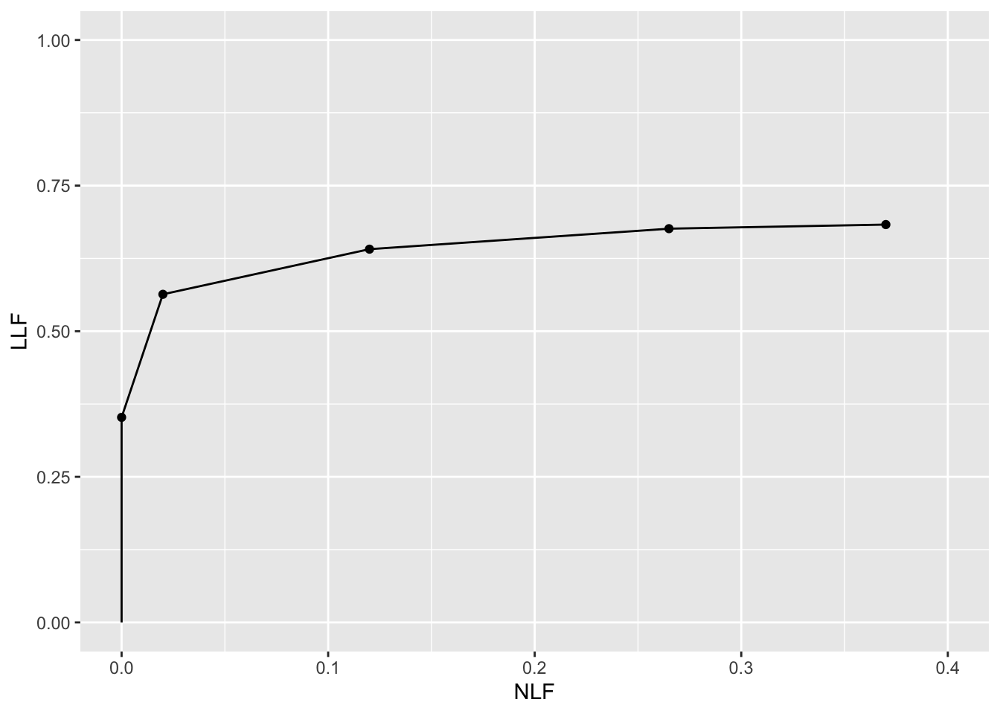

# (PART\*) FROC paradigm {-}

# The FROC paradigm and search {#froc-paradigm}


## TBA How much finished {#froc-paradigm-how-much-finished}
85%


## Introduction {#froc-paradigm-intro}

For diagnostic tasks such as detecting diffuse interstitial lung disease[^1], or diseases similar to it, *where disease location is either irrelevant or implicit*, this is an appropriate paradigm in the sense that essential information is not being lost by limiting the radiologist's response to a single rating per case.

[^1]: Diffuse interstitial lung disease refers to disease within both lungs that affects the interstitium or connective tissue that forms the support structure of the lungs' air sacs or alveoli. When one inhales, the alveoli fill with air and pass oxygen to the blood stream. When one exhales, carbon dioxide passes from the blood into the alveoli and is expelled from the body. When interstitial disease is present, the interstitium becomes inflamed and stiff, preventing the alveoli from fully expanding. This limits both the delivery of oxygen to the blood stream and the removal of carbon dioxide from the body. As the disease progresses, the interstitium scars with thickening of the walls of the alveoli, which further hampers lung function. *Diffuse interstitial lung disease is spread through and confined to the lung*. 

In clinical practice it is not only important to identify if the patient is diseased but also to offer further guidance to subsequent care-givers regarding other characteristics (such as location, type, size, extent) of the disease. In most clinical tasks if the radiologist believes the patient is diseased there is a location (or locations) associated with the suspected disease. Physicians term this *focal disease*, i.e., disease located at specific region(s) of the image.

For focal disease the ROC paradigm constrains the collected information to a single rating that there is disease *somewhere* in the patient's imaged anatomy. The emphasis on "somewhere" is because it begs the question: if the radiologist believes the disease is "somewhere", why not have them to point to it? In fact they do "point to it" in the sense that they record the location(s) of suspect regions in their clinical report, but the ROC paradigm cannot use this information. Clinicians have long recognized problems with ignoring location information [@BlackDwyer1990; @RN1921]. 

From our point of view the most important problem is that neglect of location information leads to loss of statistical power. The reason for this is the additional noise introduced into the AUC measurement due to crediting a radiologist for correctly detecting the diseased condition (a ROC paradigm True Positive or TP event) when the radiologist may have pointed to the wrong location, in which case *the radiologist is credited for a TP when in fact two mistakes were made: the true localized disease was missed and a false location was incorrectly identified as diseased*. Not discriminating between 2 types of TP events, one with correct localizations (associated with an expert radiologist) and the other with incorrect localizations (a radiologist with lesser expertise) leads to reduced ability to distinguish between them (the ROC performance difference will be smaller) as compared to the FROC paradigm described in this book (the FROC performance difference will be larger). This and other problems with using the ROC paradigm in localization tasks are described in [@bunch1977free], a publication that spurred my initial interest in this field [@Chakraborty1986DigitalVsConv].


### Chapter outline {#froc-paradigm-outline}

Four observer performance paradigms are compared as to the kinds of information collected and ignored. An essential characteristic of the FROC paradigm, namely *visual search*, is introduced. The FROC paradigm and its historical context is described. Key differences between FROC ratings and ROC ratings are noted. The FROC plot is introduced. A "solar" analogy is introduced which yields a good intuitive feel for the FROC paradigm. 


## Location specific paradigms {#froc-paradigm-location-specific-paradigms}

Location-specific paradigms^[Location-specific paradigms are sometimes referred to as lesion-specific (or lesion-level) paradigms: usage of these terms is discouraged. For example, all observer performance methods involve detecting the presence of true lesions; so ROC methodology is, in this sense, also lesion-specific. On the other hand *location* is a characteristic of true and perceived focal lesions, and methods that account for location are better termed *location-specific* than lesion-specific.] take into account, to varying degrees, information regarding the locations of perceived lesions. 

There are three location-specific paradigms:

-   the free-response ROC (FROC) [@bunch1977free; @chakraborty1989maximum];
-   the location ROC (LROC) [@starr1977comments; @swensson1996unified];
-   the region of interest (ROI) [@obuchowski2010data].

<div class="figure">

<p class="caption">(\#fig:froc-paradigm-4)Upper Left: ROC, Upper Right: FROC, Lower Left: LROC, Lower Right: ROI</p>
</div>

>In this book *lesion* always refers to a true or real lesion. The term *suspicious region* or *perceived lesion* is reserved for any region that, as far as the observer is concerned, has "lesion-like" characteristics. *A lesion is a real entity while a suspicious region is a perceived entity.*

The 4 panels in Fig. \@ref(fig:froc-paradigm-4) show a schematic mammogram interpreted according to the 4 current observer performance paradigms. The arrows point to two lesions and the three light crosses indicate suspicious regions. A marked suspicious region is indicated by a dark cross. Evidently the radiologist found one of the lesions (the light-shaded cross near the left most arrow in the top-left panel), missed the other lesion and mistook two normal structures for lesions (the two light-shaded crosses that are relatively far from any of the lesions). In this example there are three suspicious regions one of which is close to a real lesion.

-   In the ROC paradigm, Fig. \@ref(fig:froc-paradigm-4) (top-left panel), the radiologist assigns a single rating indicating the confidence level that there is at least one lesion somewhere in the image. Assuming a 1 -- 5 positive directed integer rating scale, if the left-most light-shaded cross is a highly suspicious region then the ROC rating might be 5 (highest confidence for presence of disease). There are no dark-shaded crosses on this panel as no marking occurs in the ROC paradigm.

-   In the free-response (FROC) paradigm, Fig. \@ref(fig:froc-paradigm-4) (top-right panel), the dark-shaded crosses indicate suspicious regions that were *marked*, and the adjacent numbers are the corresponding ratings. In this example the two ratings shown apply to specific suspicious regions, unlike the ROC paradigm where the single rating applies to the whole image. Assuming the allowed FROC ratings are integers 1 through 4, two marks are shown, one rated FROC-4, which is close to a true lesion, and the other rated FROC-1, which is not close to any true lesion. The third suspicious region, indicated by the light-shaded cross, was not marked, implying its confidence level did not exceed the lowest reporting threshold for a FROC-1 rating. The marked region rated FROC-4 (the highest FROC confidence level) is likely what caused the radiologist to assign the ROC-5 rating to this image in the ROC paradigm panel.

-   In the LROC paradigm, Fig. \@ref(fig:froc-paradigm-4) (bottom-left panel), the radiologist rates the confidence that there is at least one lesion somewhere in the image (as in the ROC paradigm) and marks the most suspicious region in the image. In this example the rating might be LROC-5, the five rating being the same as in the ROC paradigm, and the mark may be the suspicious region rated FROC-4 in the FROC paradigm panel, and, since it is close to a true lesion, in LROC terminology it would be recorded as a *correct localization*. If the mark were not near a lesion it would be recorded as an *incorrect localization*. Only one mark is allowed in this paradigm, and in fact one mark is *required* on every image, even if the observer does not find any suspicious regions to report.

-   In the region of interest (ROI) paradigm, the researcher segments the image into a number of regions-of-interest (ROIs) and the radiologist rates each ROI for presence of at least one suspicious region within the ROI. The rating is similar to the ROC rating, except it applies to the ROI, not the whole image. Assuming a 1 -- 5 positive directed integer rating scale in Fig. \@ref(fig:froc-paradigm-4) (bottom-right panel) there are four ROIs. The ROI at \~9 o'clock might be rated ROI-5 as it contains the most suspicious light-shaded cross (the region that was rated FROC-4), the one at \~11 o'clock might be rated ROI-1 as it does not contain any light-shaded crosses, the one at \~3 o'clock might be rated LROC-2 or LROC-3 (the unmarked light-shaded cross would tend to increase the confidence level) and the one at \~7 o'clock might be rated ROI-1[^2].

[^2]: The ROIs could be clinically driven descriptors of location, such as "apex of lung" or "mediastinum", and the image does not have to have lines showing the ROIs (which would be distracting to the radiologist). The number of ROIs per image can be at the researcher's discretion and there is no requirement that every case have the same number of ROIs.


## Visual search {#froc-paradigm-vis-search}

The FROC paradigm in medical imaging is equivalent to a visual search task. Any search task has two components: finding something^[while not finding irrelevant stuff, a subtle but important point] and acting on it. Examples of a search tasks are looking for lost car-keys or a milk carton in the refrigerator. Success in a search task is finding the searched for object^[without finding too many extraneous objects]. Acting on it could be driving to work or drinking milk from the carton^[There is expertise associated with any search task. Husbands are notoriously bad at finding the milk carton in the refrigerator (analogy due to Dr. Elizabeth Krupinski at an SPIE course taught jointly with the author).]. 

Likewise, a medical imaging search task has two components: finding lesions, without finding too many extraneous suspicious regions, and acting on each finding^["Finding" is the actual term used by radiologists in their clinical reports]. Acting on a finding involves determining if it is sufficiently suspicious for cancer to warrant reporting and further patient follow-up. If a suspicious region is found and provided it is sufficiently suspicious for malignancy the region is marked and rated for confidence that it is a malignant lesion. 

The radiologist does not know a-priori if the patient is diseased and, if diseased, how many lesions may be present. In the breast-screening context, it is known that about 5 out of 1000 patients have cancers, so 99.5% of the time odds are that the patient has no malignant lesions[^3]. Considerably search expertise is needed for the radiologist to mark malignant lesions with high probability while not generating too many false marks.

At my former institution (University of Pittsburgh) the radiologists digitally outline and annotate (describe) suspicious region(s) that are found. As one would expect from the low prevalence of breast cancer in the screening context and assuming expert-level radiologist interpretations, about 90% of breast cases do not generate any marks. About 10% of cases generate one or more marks and are recalled for further comprehensive imaging (termed diagnostic workup). Of marked cases about 90% generate one mark, about 10% generate 2 marks, and a rare case generates 3 or more marks (Dr. David Gur, private communication, ca. 2015). 

Conceptually, a mammography report consists of the locations of regions that exceed the threshold and the corresponding levels of suspicion, reported as a Breast Imaging Reporting and Data System (BIRADS) rating. The BIRADS rating is actually assigned after the diagnostic workup following a screening BIRADS-0 rating. The screening rating itself is binary: BIRADS-0 for recall (the patient is recalled for a diagnostic workup to determine the final BIRADS rating) or BIRADS-1 for normal or no abnormality detected (the patient comes back about a year later for the next screening appointment).


[^3]: The probability of benign suspicious regions is much higher [@Ernster1981Epidemiology], about 13% for women aged 40-45.

### Proximity criterion and scoring the data {#froc-paradigm-scoring-the-data}

In the first two quasi-clinical applications of the FROC paradigm [@Chakraborty1986DigitalVsConv; @Niklason1986SimulatedPulmonary] the marks and ratings were indicated by a grease pencil on an acrylic overlay aligned, in a reproducible way, to the CRT displayed chest image of an anthropomorphic chest phantom with superposed simulated lesions. Credit for a correct detection and localization, termed a lesion-localization or LL-event[^4], was given only if a mark was sufficiently close (as per proximity criterion, see below) to an actual diseased region; otherwise, the observer's mark was scored as a non-lesion localization or NL-event.

[^4]: The proper terminology for this paradigm has evolved. Older publications and some newer ones refer to this as a true positive (TP) event, thereby confusing a ROC related term that does not involve search with one that does.

The use of ROC terminology, such as true positives or false positives to describe FROC data is not conducive to clarity, and is strongly discouraged.

Definitions:

>
* NL = non-lesion localization, i.e., a mark that is not close to any lesion
* LL = lesion localization, i.e., a mark that is close to a lesion

What is meant by sufficiently close? One adopts an acceptance radius (for spherical lesions) or *proximity criterion* (the more general case). What constitutes "close enough" is a clinical decision the answer to which depends on the application. It is not necessary for two radiologists to point to the same pixel in order for them to agree that they are seeing the same suspicious region. Likewise, two physicians -- e.g., the radiologist finding the lesion on an x-ray and the surgeon responsible for resecting it -- do not have to agree on the exact center of a lesion in order to appropriately assess and treat it. More often than not, "clinical common sense" can be used to determine if a mark actually localized the lesion. When in doubt, the researcher should ask an independent radiologist (i.e., not one used in the observer study) how to score ambiguous marks. A rigid definition of the proximity criterion should not be used.

For roughly spherical nodules a simple rule can be used. If a circular lesion is 10 mm in diameter, one can use the "touching-coins" analogy to determine the criterion for a mark to be classified as lesion localization. Each coin is 10 mm in diameter, so if they touch, their centers are separated by 10 mm, and the rule is to classify any mark within 10 mm of an actual lesion center as a LL mark, and if the separation is greater, the mark is classified as a NL mark. A recent paper [@Dobbins2016MultiInstitutional] using FROC analysis gives more details on appropriate proximity criteria in the clinical context. [^5]

[^5]: Generally the proximity criterion is more stringent for smaller lesions than for larger one. However, for very small lesions allowance is made so that the criterion does not penalize the radiologist for normal marking "jitter". For 3D images the proximity criteria is different in the x-y plane vs. the slice thickness axis.

### Multiple marks in the same vicinity

Multiple marks near the same vicinity are rarely encountered with radiologists, especially if the perceived lesion is mass-like. [^6] However, algorithmic readers, such as computer aided detection (CAD) algorithms, tend to find multiple regions in the same area. Algorithm designers generally incorporate a clustering step to reduce overlapping regions to a single region and assign the highest rating to it (i.e., the rating of the highest rated mark, not the rating of the closest mark. [^7]

[^6]: The exception would be if the perceived lesions were speck-like objects in a mammogram, and even here radiologists tend to broadly outline the region containing perceived specks -- they do not mark individual specks with great precision.

[^7]: The reason for using the highest rating is that this gives full and deserved credit for the localization. Other marks in the same vicinity with lower ratings need to be discarded from the analysis; specifically, they should not be classified as NLs, because each mark has successfully located the true lesion to within the clinically acceptable criterion, i.e., any one of them is a good decision because it would result in a patient recall and point further diagnostics to the true location.

### Historical context

The term "free-response" was coined by [@RN897] to describe a task involving the detection of brief audio tone(s) against a background of white-noise (white-noise is what one hears if an FM tuner is set to an unused frequency). The tone(s) could occur at any instant within an active listening interval, defined by an indicator light bulb that is turned on. The listener's task was to respond by pressing a button at the specific instant(s) when a tone(s) was perceived (heard). The listener was uncertain how many true tones could occur in an active listening interval and when they might occur. Therefore, the number of responses (button presses) per active interval was a priori unpredictable: it could be zero, one or more. The Egan et al study did not require the listener to rate each button press, but apart from this difference and with two-dimensional images replacing the listening intervals, the acoustic signal detection study is similar to medical imaging search tasks. 


## The free-response receiver operating characteristic (FROC) plot {#froc-paradigm-froc-plot}

The free-response receiver operating characteristic (FROC) plot was introduced [@RN2104] as a way of visualizing performance in the free-response auditory tone detection task. 

In the medical imaging context, assuming the mark rating pairs have been classified as NLs (non-lesion localizations) or LLs (lesion localizations):

-   Non-lesion localization fraction (NLF) is defined as the total number of NLs rated at or above a threshold rating divided by the total number of cases.

-   Lesion localization fraction (LLF) is defined as the total number of LLs rated at or above the same threshold rating divided by the total number of lesions.

-   The FROC plot is defined as that of LLF (ordinate) vs. NLF as the threshold is varied.

-   The upper-right-most operating point is termed the *observed end-point* and its coordinated are denoted $(\text{NLF}_{\text{max}}, \text{LLF}_{\text{max}})$.

-   Unlike the ROC plot which is completely contained in the unit square, the FROC plot is not.


The rating can be any real number, as long as higher values are associated with higher confidence levels.

If *integer ratings* are used for each recorded mark then in a four-rating FROC study at most 4 FROC operating points will result: one corresponding to marks rated 4s; another corresponding to marks rated 4s or 3s; another to the 4s, 3s, or 2s; and finally the 4s, 3s, 2s, or 1s. An R-rating study yields at most R operating points ^[I have seen publications that describe a data collection process where the "1" rating is used to mean, in effect, that the observer sees nothing to report in the image, i.e., to mean "let's move on to the next image". This amounts to wasting a confidence level. The user interface should present an explicit "next-image" option and reserve the "1" rating to mean the lowest reportable confidence level.]. 

If *continuous ratings* are used, the procedure is to start with a very high threshold so that none of the ratings exceed the threshold and then to gradually lower the threshold. Every time the threshold crosses the rating of a mark, or possibly multiple marks, the total count of LLs and NLs exceeding the threshold is divided by the appropriate denominators yielding the ''raw'' FROC plot. For example, when an LL rating just exceeds the threshold, the operating point jumps up by 1/(total number of lesions), and if two LLs simultaneously just exceed the threshold the operating point jumps up by 2/(total number of lesions). If an NL rating just exceeds the threshold, the operating point jumps to the right by 1/(total number of cases). If an LL rating and a NL rating simultaneously just exceed the threshold, the operating point moves diagonally, up by 1/(total number of lesions) and to the right by 1/(total number of cases). The reader should get the general idea by now and recognize that the cumulating procedure is very similar to the manner in which ROC operating points were calculated, the only differences being in the quantities being cumulated and the relevant denominators.


Chapter \@ref(empirical) describes the FROC, and other possible operating characteristics, in more detail. 


### Illustration with a dataset {#froc-paradigm-plot-illustration}

The following code uses `dataset04` [@zanca2009evaluation] in `RJafroc` to illustrate an empirical FROC plot. The dataset has 5-treatments and 4 readers, so in principle one can generate 20 plots. In this example I have selected treatment 1 and reader 1 to produce the plot. The reader should experiment by running, for example `PlotEmpiricalOperatingCharacteristics(dataset04, trts = 2, rdrs = 1, opChType = "FROC")$Plot`, i.e., with different treatments and readers specified.


```r
ret <- PlotEmpiricalOperatingCharacteristics(
  dataset04, 
  trts = 1, rdrs = 1, opChType = "FROC")
print(ret$Plot)
```




The study in question was a 5 rating FROC study. The lowest non-trivial point corresponds to the marks rated 5, the next higher one corresponds to marks rated 4 or 5, etc. FROC plots may vary widely in shape but they share the common characteristic that the operating point cannot move downward or to the left as one cumulates lower confidence level marks (i.e., it can only move upward and to the right; the plot can flatten out or it can end at a finite value of NLF). 

The plot shown above is termed an *empirical plot* as it consists of the empirical (observed) operating points connected by straight line segments.


## The "solar" analogy {#froc-paradigm-solar-analogy}

Consider the sun, regarded as a "lesion" to be detected, with two daily observations spaced 12 hours apart, so that at least one observation period is bound to have the sun in the sky. Furthermore assume the observer knows his GPS coordinates and has a watch that gives accurate local time, from which an accurate location of the sun can be deduced. Assuming clear skies and no obstructions to the view, the sun will always be correctly located and no rational observer will ever generate a non-lesion localization or NL, i.e., no region of the sky will be erroneously "marked".

FROC curve implications of this analogy are:

-   Each 24-hour day corresponds to two "trials" in the [@RN897] sense, or two cases -- one diseased and one non-diseased -- in the medical imaging context.
-   The denominator for calculating LLF is the total number of AM days, and the denominator for calculating NLF is twice the total number of 24-hour days.
-   Most important, $\text{LLF}_{\text{max}} = 1$ and $\text{NLF}_{\text{max}} = 0$.

In fact, even when the sun is not directly visible due to heavy cloud cover, since the actual location of the sun can be deduced from the local time and GPS coordinates, the rational observer will still "mark" the correct location of the sun and not make any false sun localizations. Consequently, even in this example $\text{LLF}_{\text{max}} = 1$ and $\text{NLF}_{\text{max}} = 0$.

The conclusion is that in a task where a target is known to be present in the field of view and its location is known, the observer will always reach $\text{LLF}_{\text{max}} = 1$ and $\text{NLF}_{\text{max}} = 0$. Why are LLF and NLF subscripted "max"? By randomly choosing to not mark the position of the sun even though it is visible, for example, using a coin toss to decide whether or not to mark the sun, the observer can "walk down" the y-axis of the FROC plot, eventually reaching $LLF = 0$ and $NLF = 0$. The reason for allowing the observer to "walk down" the vertical is simply to demonstrate that a continuous FROC curve from the origin to (0,1) can, in fact, be realized.

Now consider a fictitious otherwise earth-like planet where the sun can be at random positions, rendering GPS coordinates and the local time useless. All one knows is that the sun is somewhere in the upper or lower hemispheres subtended by the sky. If there are no clouds and consequently one can see the sun clearly during daytime, a rational observer would still correctly located the sun while not marking the sky with any incorrect sightings, so $\text{LLF}_{\text{max}} = 1$ and $\text{NLF}_{\text{max}} = 0$. This is because, in spite of the fact that the expected location is unknown, the high contrast sun is enough the trigger the peripheral vision system, so that even if the observer did not start out looking in the correct direction, peripheral vision will drag the observer's gaze to the correct location for foveal viewing.

The implication of this is that a fundamentally different mechanism from that considered in conventional observer performance methodology, namely *search*, is at work. 

> Search describes the process of *finding* lesions while *not finding* non-lesions and search performance is the ability to find more lesions while minimizing finding non-lesions. 

Think of the eye as two cameras: a low-resolution camera (peripheral vision) with a wide field-of-view plus a high-resolution camera (foveal vision) with a narrow field-of-view If one were limited to viewing with the high-resolution camera one would spend so much time steering the high-resolution narrow field-of-view camera from spot-to-spot that one would have a hard time finding the desired stellar object. Having a single high-resolution narrow field of view vision would also have negative evolutionary consequences as one would spend so much time scanning and processing the surroundings with the narrow field of view vision that one would miss dangers or opportunities. Nature has equipped us with essentially two cameras; the first low-resolution camera is able to "digest" large areas of the surround and process it rapidly so that if danger (or opportunity) is sensed, then the eye-brain system rapidly steers the second high-resolution camera to the location of the danger (or opportunity). This is Nature's way of optimally using the eye-brain system. For a similar reason astronomical telescopes come with a wide field of view lower magnification "spotter scope".

When cloud cover completely blocks the fictitious random-position sun there is no stimulus to trigger the peripheral vision system to guide the fovea to the correct location. Lacking any stimulus, the observer is reduced to guessing and is led to different conclusions depending upon the benefits and costs involved. If, for example, the guessing observer earns a dollar for each LL and is fined a dollar for each NL, then the observer will likely not make any marks as the chance of winning a dollar is much smaller than losing many dollars. For this observer $\text{LLF}_{\text{max}} = 0$ and $\text{NLF}_{\text{max}} = 0$, and the operating point is "stuck" at the origin. If, on the other hand, the observer is told every LL is worth a dollar and there is no penalty to NLs, then with no risk of losing the observer will "fill up" the sky with false marks. 

The analogy is not restricted to the sun, which one might argue is an almost infinite SNR object and therefore atypical. Consider finding stars or planets. In clear skies, if one knows the constellations, one can still locate bright stars and planets like Venus or Jupiter. With less bright stars and / or obscuring clouds, there will be false-sightings and the FROC plot could approach a flat horizontal line at ordinate equal to zero, but the observer will not fill up the sky with false sightings of a desired star.

False sightings of objects in astronomy do occur. Finding a new astronomical object is a search task, where, as always, one can have two outcomes, correct localization (LL) or incorrect localizations (NLs). At the time of writing there is a hunt for a new planet, possibly a gas giant , that is much further than even the newly demoted Pluto. 


## Discussion {#froc-paradigm-discussion}

The FROC paradigm is often misunderstood. Some of this has to do with loose terminology and some to misconceptions regarding the meaning of search, the paradigm and the FROC curve. These are summarized below: 

-   Loose terminology:
    - Using the term "lesion-specific" to describe location-specific paradigms.
    - Using the term "lesion" when one means a "suspicious region" that may or may not be a true lesion.
    - Using ROC paradigm terms, such as true positive and false positive, that apply to the whole case, to describe location-specific terms such as lesion and non-lesion localizations, that apply to regions of the image. 
    - Using the FROC-1 rating to mean in effect "I see no signs of disease in this image " when in fact it should be used as the lowest level of a reportable suspicious region. The former usage amounts to wasting a confidence level.
-   Misconception
    - A fundamental misunderstanding of search performance embodied in the commonly heard statement "CAD is perfect at search because it looks at everything".
    - Showing FROC curves as reaching the unit ordinate as this is the exception rather than the rule.
    - Believing that FROC curves extend to very large values (potentially infinite) along the abscissa and all the observer has to do to access this region is to lower their reporting threshold.

The FROC plot is historically the first proposed way of visually summarizing FROC data. The next chapter deals with all empirical operating characteristics that can be defined from an FROC dataset that have evolved over the years.

## References {#froc-paradigm-references}
