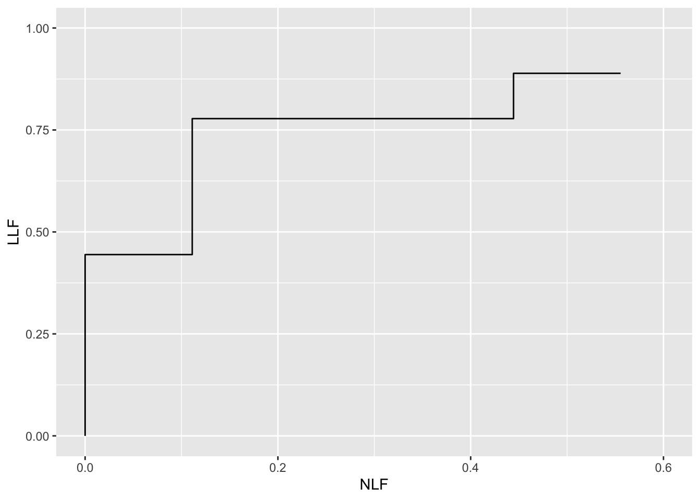

# Empirical plots from FROC data {#empirical}

---
output:
  rmarkdown::pdf_document:
    fig_caption: yes        
    includes:  
      in_header: R/learn/my_header.tex
---


## TBA How much finished {#empirical-how-much-finished}
90%


## TBA Introduction {#empirical-intro}

In this chapter a distinction is made between *latent* and *actual* marks. This is followed by a table summarizing FROC notation, a key table used in later chapters. Section `\@ref(froc-paradigm-froc-plot)` introduced the empirical FROC plot. This chapter presents mathematical expressions for this and other empirical plots possible with FROC data: the inferred-ROC, the alternative FROC, the weighted alternative FROC, and others. Operating characteristics are *visual* depicters of performance. Scalar quantities, typically area measures derived from operating characteristics, are *quantitative* measures of performance, termed *figures of merit* (FOMs). This chapter defines an area measure for each empirical operating characteristic. An FROC dataset is used to illustrate the plots and area measures. With the exception of the FROC plot, all empirical plots include a straight line extension from the observed end-point to (1,1). The correlation between the area measures is qualitatively examined via plots. It is shown that for this dataset the FROC area measure correlates poorly with that under the ROC curve, whereas the other measures correlate better. This is explained by the fact that, unlike the other measures, the FROC plot is not contained within the unit square.   


## Mark rating pairs {#empirical-mark-rating-pairs}

*FROC data consists of mark-rating pairs*. Each mark indicates the location of a region suspicious enough to warrant reporting and the rating is the associated confidence level. A mark is recorded as *lesion localization* (LL) if it is sufficiently close to a true lesion and otherwise it is recorded as *non-lesion localization* (NL).

*In an FROC study the number of marks on an image is an a-priori unknown non-negative random integer.* It is incorrect and naive to estimate it by dividing the image area by the lesion area because not all regions of the image are equally likely to have lesions, lesions do not have the same size, and perhaps most important, clinicians don't assign equal attention units to all areas of the image. 

Currently the best insight into the numbers and locations of marks per case is obtained from eye-tracking studies [@duchowski2017eye], but the information is incomplete as eye-tracking studies can only measure *foveal* gaze and not lesions found by *peripheral* vision. Moreover, such studies are near impossible to conduct in a clinical setting (at least with the eye-tracking apparatus that I am familiar with).


### Latent vs. actual marks

To distinguish between suspicious regions that were considered for marking and regions that were actually marked, it is necessary to introduce the distinction between *latent* marks and *actual* marks.

-   A *latent* mark is defined as a suspicious region, regardless of whether or not it was marked. A latent mark becomes an *actual* mark if it is marked.
-   A latent mark is a latent LL if it is close to a true lesion and otherwise it is a latent NL.
-   A non-diseased case can only have latent NLs. A diseased case can have latent NLs and latent LLs.
-   If marked a latent NL is recorded as an actual NL.
-   If not marked a latent NL is an *unobservable event*.
-   In contrast unmarked lesions are observable events -- one knows (trivially) which lesions were not marked.


### Binning rule

Recall that ROC data modeling requires the existence of a *case-dependent* decision variable, or z-sample $z$, and case-independent decision thresholds $\zeta_r$, where $r = 0, 1, ..., R_{ROC}-1$, where $R_{ROC}$ is the number of ROC study bins ^[The subscript is used to make explicit the paradigm used as otherwise it leads to confusion.] and a binning rule that if $\zeta_r \leq z < \zeta_{r+1}$ the case is rated $r + 1$. Dummy cutoffs are defined as $\zeta_0 = -\infty$ and $\zeta_{R_{ROC}} = \infty$. The z-sample applies to the whole case. To summarize:


\begin{equation}
\left.
\begin{aligned}  
\text{if} \left (\zeta_r \le z < \zeta_{r+1}  \right )\Rightarrow \text {rating} = r+1\\
r = 0, 1, ..., R_{ROC}-1\\
\zeta_0 = -\infty\\
\zeta_{R_{ROC}} = \infty\\
\end{aligned}
\right \}
(\#eq:binning-rule-roc)
\end{equation}


Analogously, FROC data modeling requires the existence of a *case and location dependent* z-sample for each latent mark and *case and location independent* reporting thresholds $\zeta_r$, where $r = 1, ..., R_{FROC}$ and $R_{FROC}$ is the number of FROC study bins, and the binning rule that a latent mark is marked and rated $r$ if $\zeta_r \leq z < \zeta_{r+1}$. Dummy cutoffs are defined as $\zeta_0 = -\infty$ and $\zeta_{R_{FROC}+1} = \infty$. For the same numbers of non-dummy cutoffs, the number of FROC bins is one less than the number of ROC bins. For example, 4 non-dummy cutoffs $\zeta_1, \zeta_2, \zeta_3, \zeta_4$ can correspond to a 5-rating ROC study or to a 4-rating FROC study. To summarize:


\begin{equation}
\left.
\begin{aligned}  
\text{if} \left (\zeta_r \le z < \zeta_{r+1}  \right )\Rightarrow \text {rating} = r\\
r = 1, 2, ..., R_{FROC}\\
\zeta_0 = -\infty\\
\zeta_{R_{FROC}+1} = \infty\\
\end{aligned}
\right \}
(\#eq:binning-rule-froc)
\end{equation}


## Notation {#empirical-notation}

*Clear notation is vital to understanding this paradigm.* The notation needs to account for case and location dependencies of ratings and the distinction between case-level and location-level ground truth. The notation also has to account for cases with no marks.

FROC notation is summarized in Table \@ref(tab:empirical-notation), in which *marks refer to latent marks*. The table is organized into three columns, the first column is the row number, the second column has the symbol(s), and the third column has the meaning(s) of the symbol(s).

<table>
<caption>(\#tab:empirical-notation)FROC notation; all marks refer to latent marks.</caption>
 <thead>
  <tr>
   <th style="text-align:left;"> Row </th>
   <th style="text-align:left;"> Symbol </th>
   <th style="text-align:left;"> Meaning </th>
  </tr>
 </thead>
<tbody>
  <tr>
   <td style="text-align:left;"> 1 </td>
   <td style="text-align:left;"> $t$ </td>
   <td style="text-align:left;"> Case-level truth: 1 for non-diseased and 2 for diseased case </td>
  </tr>
  <tr>
   <td style="text-align:left;"> 2 </td>
   <td style="text-align:left;"> $K_t$ </td>
   <td style="text-align:left;"> Number of cases with case-level truth $t$ </td>
  </tr>
  <tr>
   <td style="text-align:left;"> 3 </td>
   <td style="text-align:left;"> $k_t t$ </td>
   <td style="text-align:left;"> Case $k_t$ in case-level truth $t$ </td>
  </tr>
  <tr>
   <td style="text-align:left;"> 4 </td>
   <td style="text-align:left;"> $s$ </td>
   <td style="text-align:left;"> Location-level truth: 1 for NL and 2 for LL </td>
  </tr>
  <tr>
   <td style="text-align:left;"> 5 </td>
   <td style="text-align:left;"> $l_s s$ </td>
   <td style="text-align:left;"> Mark $l_s$ in location-level truth $s$ </td>
  </tr>
  <tr>
   <td style="text-align:left;"> 6 </td>
   <td style="text-align:left;"> $N_{k_t t}$ </td>
   <td style="text-align:left;"> Number of NLs in case $k_t t$ </td>
  </tr>
  <tr>
   <td style="text-align:left;"> 7 </td>
   <td style="text-align:left;"> $L_{k_2 2}$ </td>
   <td style="text-align:left;"> Number of lesions in case $k_2 2$ </td>
  </tr>
  <tr>
   <td style="text-align:left;"> 8 </td>
   <td style="text-align:left;"> $z_{k_t t l_1 1}$ </td>
   <td style="text-align:left;"> $z$-sample for case $k_t t$ and NL mark $l_1 1$ </td>
  </tr>
  <tr>
   <td style="text-align:left;"> 9 </td>
   <td style="text-align:left;"> $z_{k_2 2 l_2 2}$ </td>
   <td style="text-align:left;"> $z$-sample for case $k_2 2$ and LL mark $l_2 2$ </td>
  </tr>
  <tr>
   <td style="text-align:left;"> 10 </td>
   <td style="text-align:left;"> $R_{FROC}$ </td>
   <td style="text-align:left;"> Number of FROC bins </td>
  </tr>
  <tr>
   <td style="text-align:left;"> 11 </td>
   <td style="text-align:left;"> $\zeta_1$ </td>
   <td style="text-align:left;"> Lowest non-dummy reporting threshold </td>
  </tr>
  <tr>
   <td style="text-align:left;"> 12 </td>
   <td style="text-align:left;"> $\zeta_r$ </td>
   <td style="text-align:left;"> $r$ = 2, 3, ..., the other non-dummy reporting thresholds </td>
  </tr>
  <tr>
   <td style="text-align:left;"> 13 </td>
   <td style="text-align:left;"> $\zeta_0, \zeta_{R_{FROC}+1}$ </td>
   <td style="text-align:left;"> Dummy thresholds, negative infinity and positive infinity, respectively </td>
  </tr>
  <tr>
   <td style="text-align:left;"> 14 </td>
   <td style="text-align:left;"> $W_{k_2 l_2}$ </td>
   <td style="text-align:left;"> Weight of lesion $l_2 2$ in case $k_2 2$, explained later </td>
  </tr>
  <tr>
   <td style="text-align:left;"> 15 </td>
   <td style="text-align:left;"> $L_{max}$ </td>
   <td style="text-align:left;"> Maximum number of lesions per case in dataset </td>
  </tr>
  <tr>
   <td style="text-align:left;"> 16 </td>
   <td style="text-align:left;"> $L_T$ </td>
   <td style="text-align:left;"> Total number of lesions in dataset </td>
  </tr>
</tbody>
</table>

### Comments on Table \@ref(tab:empirical-notation)

-   Row 1: The case-truth index $t$ refers to the case (or patient), with $t = 1$ for non-diseased and $t = 2$ for diseased cases. As a useful mnemonic, $t$ is for *truth*.

-   Row 2: $K_t$ is the number of cases with truth state $t$; specifically, $K_1$ is the number of non-diseased cases and $K_2$ the number of diseased cases. 

-   Row 3: Two indices $k_t t$ are needed to select case $k_t$ in truth state $t$. As a useful mnemonic, $k$ is for *case*.

-   Row 4: $s$ location-level truth state: 1 for non-diseased and 2 for diseased.

-   Row 5: Similar to row 3, two indices $l_s s$ are needed to select latent mark $l_s$ in location-level truth state $s$. As a useful mnemonic, $l$ is for *location*.

-   Row 6: $N_{k_t t}$ is the total number of latent NL marks in case $k_t t$. Latent NL marks are possible on non-diseased and diseased cases (i.e., both values of $t$ are allowed). 

-   Row 7: $L_{k_2 2}$ is the number of lesions in diseased case $k_2 2$.

-   Row 8: The z-sample for case $k_t t$ and NL mark $l_1 1$ is denoted $z_{k_t t l_1 1}$. The range of a z-sample is $-\infty < z_{k_t t l_1 1} < \infty$, provided $l_1 \neq \varnothing$; otherwise, it is an unobservable event.

-   Row 9: The z-sample of a latent LL is $z_{k_2 2 l_2 2}$. Unmarked lesions are observable events and are therefore assigned negative infinity ratings (the null-set notation is unnecessary for them).

-   Row 10: $R_{FROC}$ is the number of bins in the FROC study.

-   Rows 11, 12 and 13: The cutoffs in the FROC study. The lowest threshold is $\zeta_1$. The other non-dummy thresholds are $\zeta_r$ where $r=2,3,...,R_{FROC}$. The dummy thresholds are $\zeta_0 = -\infty$ and $\zeta_{R_{FROC}+1} = \infty$.

-   Row 14: $W_{k_2 l_2}$ is the weight (i.e., clinical importance) of lesion $l_2 2$ in diseased case $k_2 2$. The weights of lesions in a case sum to unity: $\sum_{l_2 = 1}^{L_{k_2 2}}W_{k_2 l_2} = 1$.

-   Row 15: $L_{max}$ is the maximum number of lesions per case in the dataset.

-   Row 16: $L_T$ is the total number of lesions in the dataset.


### A conceptual and notatonal issue {#empirical-indexing-marks}

An aspect of FROC data, *that there could be cases with no NL marks, no matter how low the reporting threshold*, has created problems both from conceptual and notational viewpoints. Taking the conceptual issue first, my thinking (prior to 2004) was that as the reporting threshold $\zeta_1$ is lowered, the number of NL marks per case increases almost indefinitely. I visualized this process as each case "filling up" with NL marks [^empirical1-1]. In fact the first model of FROC data [@chakraborty1989maximum] predicts that as the reporting threshold is lowered to $\zeta_1 = -\infty$, the number of NL marks per case approaches $\infty$ as does $\text{NLF}_{max}$. However, observed FROC curves end at a finite value of $\text{NLF}_{max}$. This is one reason I introduced the radiological search model (RSM) [@chakraborty2006search]. I will have much more to say about this in Chapter `\@ref(rsm)`, but for now I state one assumption of the RSM: the number of latent NL marks is a Poisson distributed random integer with a finite value for the mean parameter of the distribution. This means that the actual number of latent NL marks per case can be 0, 1, 2, .., whose average (over all cases) is a finite number. 

With this background, let us return to the conceptual issue: why does the observer not keep "filling-up" the image with NL marks? The answer is that *the observer can only mark regions that have a non-zero chance of being a lesion*. For example, if the actual number of latent NLs on a particular case is 2, then, as the reporting threshold is lowered, the observer will make at most two NL marks. Having exhausted these two regions the observer will not mark any more regions because there are no more regions to be marked - *all other regions in the image have, in the perception of the observer, zero chance of being a lesion*.

[^empirical1-1]: I expected the number of NL marks per image to be limited only by the ratio of image size to lesion size, i.e., larger values for smaller lesions.

The notational issue is how to handle images with no latent NL marks. Basically it involves restricting summations over cases $k_ t t$ to those cases which have at least one latent NL mark, i.e., $N_{k_t t} \neq 0$, as in the following: 

* $l_1 = \{1, 2, ..., N_{k_t t}\}$ indexes latent NL marks, provided the case has at least one latent NL mark, and otherwise $N_{k_t t} = 0$ and $l_1 = \varnothing$, the null set. The possible values of $l_1$ are $l_1 = \left \{ \varnothing \right \}\oplus \left \{ 1,2,...N_{k_t t} \right \}$. The null set applies when the case has no latent NL marks and $\oplus$ is the "exclusive-or" symbol ("exclusive-or" is used in the English sense: "one or the other, but not neither nor both"). In other words, $l_1$ can *either* be the null set or take on values $1,2,...N_{k_t t}$.

* Likewise, $l_2 = \left \{ 1,2,...,L_{k_2 2} \right \}$ indexes latent LL marks. Unmarked LLs are assigned negative infinity ratings. The null set notation is not needed for latent LLs.


## The empirical FROC plot {#empirical-froc-plot}

The FROC, Chapter `\@ref(froc-paradigm-froc-plot)`, is the plot of LLF (along the ordinate) vs. NLF (along the abscissa).

Using the notation of Table \@ref(tab:empirical-notation) and assuming binned data[^empirical1-2], then, corresponding to the operating point determined by threshold $\zeta_r$, the FROC abscissa is $\text{NLF}_r \equiv \text{NLF}\left ( \zeta_r \right )$, the total number of NLs rated $\geq$ threshold $\zeta_r$ divided by the total number of cases, and the corresponding ordinate is $\text{LLF}_r \equiv \text{LLF}\left ( \zeta_r \right )$, the total number of LLs rated $\geq$ threshold $\zeta_r$ divided by the total number of lesions:

[^empirical1-2]: This is not a limiting assumption: if the data is continuous, for finite numbers of cases, no ordering information is lost if the number of ratings is chosen large enough. This is analogous to Bamber's theorem in Chapter 05, where a proof, although given for binned data, is applicable to continuous data.


\begin{equation}
\text{NLF}_r  = \frac{n\left ( \text{NLs rated} \geq \zeta_r\right )}{n\left ( \text{cases} \right )}
(\#eq:empirical-NLF1)
\end{equation}


and

\begin{equation}
\text{LLF}_r  = \frac{n\left ( \text{LLs rated} \geq \zeta_r\right )}{n\left ( \text{lesions} \right )}
(\#eq:empirical-LLF1)
\end{equation}


The observed operating points correspond to the following values of $r$:


\begin{equation}
r = 1, 2, ...,R_{FROC} 
(\#eq:empirical-range-r)
\end{equation}


Due to the ordering of the thresholds, i.e., $\zeta_1 < \zeta_2 ... < \zeta_{R_{FROC}}$, higher values of $r$ correspond to lower operating points. The uppermost operating point, i.e., that defined by $r = 1$, is referred to the as the *observed end-point*.

Equations \@ref(eq:empirical-NLF1) and \@ref(eq:empirical-LLF1) is are equivalent to:


\begin{equation}
\text{NLF}_r  = \frac{1}{K_1+K_2} \sum_{t=1}^{2} \sum_{k_t=1}^{K_t} \mathbb{I} \left ( N_{k_t t} \neq 0 \right )\sum_{l_1=1}^{N_{k_t t}} \mathbb{I} \left ( z_{k_t t l_1 1} \geq \zeta_r \right ) 
(\#eq:empirical-NLFr)
\end{equation}


and


\begin{equation}
\text{LLF}_r  = \frac{1}{L_T} \sum_{k_2=1}^{K_2} \sum_{l_2=1}^{L_{k_2 2}} \mathbb{I} \left ( z_{k_2 2 l_2 2} \geq \zeta_r  \right ) 
(\#eq:empirical-LLFr)
\end{equation}


Each indicator function, $\mathbb{I}()$, yields unity if the argument is true and zero otherwise.

In Eqn. \@ref(eq:empirical-NLFr) $\mathbb{I} \left ( N_{k_t t} \neq 0 \right )$ ensures that *only cases with at least one latent NL* are counted. Recall that $N_{k_t t}$ is the total number of latent NLs in case $k_t t$.  The term $\mathbb{I} \left ( z_{k_t t l_1 1} \geq \zeta_r \right )$ counts over all NL marks with ratings $\geq \zeta_r$. The three summations yield the total number of NLs in the dataset with z-samples $\geq \zeta_r$ and dividing by the total number of cases yields $\text{NLF}_r$. This equation also shows explicitly that NLs on both non-diseased ($t=1$) and diseased ($t=2$) cases contribute to NLF.

In Eqn. \@ref(eq:empirical-LLFr) a summation over $t$ is not needed as only diseased cases contribute to LLF. Analogous to the first indicator function term in Eqn. \@ref(eq:empirical-NLFr), a term like $\mathbb{I} \left ( L_{k_2 2} \neq 0 \right )$ would be superfluous since $L_{k_2 2} > 0$ as each diseased case must have at least one lesion. The term $\mathbb{I} \left ( z_{k_2 2 l_2 2} \geq \zeta_r \right )$ counts over all LL marks with ratings $\geq \zeta_r$. Dividing by $L_T$, the total number of lesions in the dataset, yields $\text{LLF}_r$.

### Definition: empirical FROC plot and AUC {#empirical-definition-empirical-auc-froc}

The empirical FROC plot connects adjacent operating points $\left (\text{NLF}_r, \text{LLF}_r \right )$, including the origin (0,0) and the observed end-point, with straight lines. The area under this plot is the empirical FROC AUC, denoted $A_{\text{FROC}}$.

### The origin, a trivial point {#empirical-origin-trivial-point}

Since $\zeta_{R_{FROC}+1} = \infty$ according to Eqn. \@ref(eq:empirical-NLFr) and Eqn. \@ref(eq:empirical-LLFr), $r = R_{FROC}+1$ yields the trivial operating point (0,0).

### The observed end-point and its semi-constrained property {#empirical-end-point}

The abscissa of the observed end-point $NLF_1$, is defined by:


\begin{equation}
\text{NLF}_1 = \frac{1}{K_1+K_2} \sum_{t=1}^{2} \sum_{k_t=1}^{K_t} \mathbb{I} \left ( N_{k_t t} \neq 0 \right ) \sum_{l_1=1}^{N_{k_t t}} \mathbb{I} \left ( z_{k_t t l_1 1} \geq \zeta_1 \right ) 
(\#eq:empirical-NLF11)
\end{equation}


Since each case could have an arbitrary number of NLs, $NLF_1$ need not equal unity, except fortuitously.

The ordinate of the observed end-point $LLF_1$, is defined by:


\begin{equation}
\left.
\begin{aligned}
\text{LLF}_1 =& \frac{ \sum_{k_2=1}^{K_2} \sum_{l_2=1}^{L_{k_2 2}} \mathbb{I} \left ( z_{k_2 2 l_2 2} \geq  \zeta_1  \right ) }{L_T}\\
\leq& 1
\end{aligned}
\right \}
(\#eq:empirical-LLF1a)
\end{equation}


The numerator is the total number of lesions that were actually marked. The ratio is the fraction of lesions that are marked, which is $\leq 1$.

This is the **semi-constrained property of the observed end-point**, namely, while the observed end-point *ordinate* is constrained to the range (0,1) the corresponding *abscissa* is not so constrained.

### Futility of extrapolation outside the observed end-point {#empirical-froc-plot-futility-extrapolation}

To understand this consider the expression for $NLF_0$, i.e., using Eqn. \@ref(eq:empirical-NLFr) with $r = 0$:


\begin{equation}
\text{NLF}_0 = \frac{1}{K_1+K_2} \sum_{t=1}^{2} \sum_{k_t=1}^{K_t} \mathbb{I} \left ( N_{k_t t} \neq 0 \right ) \sum_{l_1=1}^{N_{k_t t}} \mathbb{I} \left ( z_{k_t t l_1 1} \geq -\infty \right ) 
\end{equation}


The right hand side of this equation can be separated into two terms, the contribution of latent NLs with z-samples in the range $z \geq \zeta_1$ and those in the range $-\infty \leq z < \zeta_1$. The first term yields the abscissa of the observed end-point, Eqn. \@ref(eq:empirical-NLF11). The 2nd term is:


\begin{equation}
\left. 
\begin{aligned} 
\text{2nd term}=&\left (\frac{1}{K_1+K_2} \right )\sum_{t=1}^{2} \sum_{k_t=1}^{K_t} \mathbb{I} \left ( N_{k_t t} \neq 0 \right ) \sum_{l_1=1}^{N_{k_t t}} \mathbb{I} \left ( -\infty \leq z_{k_t t l_1 1} < \zeta_1 \right )\\
=&\frac{\text{unknown number}}{K_1+K_2}
\end{aligned}
\right \} 
(\#eq:empirical-NLF0a)
\end{equation}


It represents the contribution of unmarked NLs, i.e., latent NLs whose z-samples were below $\zeta_1$. It determines how much further to the right the observer's NLF would have moved, relative to $NLF_1$, if one could get the observer to lower the reporting criterion to $-\infty$. *Since the observer may not oblige, this term cannot, in general, be evaluated.* Therefore $NLF_0$ cannot be evaluated. The basic problem is that *unmarked latent NLs represent unobservable events*.

Turning our attention to $LLF_0$:


\begin{equation}
\left.
\begin{aligned}
\text{LLF}_0 =& \frac{ \sum_{k_2=1}^{K_2} \sum_{l_2=1}^{L_{k_2 2}} \mathbb{I} \left ( z_{k_2 2 l_2 2} \geq  -\infty  \right ) }{L_T}\\
=& 1
\end{aligned}
\right \}
(\#eq:empirical-LLF0)
\end{equation}


Unlike unmarked latent NLs, **unmarked lesions can safely be assigned the $-\infty$ rating, because an unmarked lesion is an observable event*. The right hand side of Eqn. \@ref(eq:empirical-LLF0) evaluates to unity. However, since the corresponding abscissa $NLF_0$ is undefined, one cannot plot this point. It follows that one cannot extrapolate outside the observed end-point.

The formalism should not obscure the fact that the futility of extrapolation outside the observed end-point of the FROC is a fairly obvious property: one does not know how far to the right the abscissa of the observed end-point might extend if one could get the observer to report every latent NL.

### Illustration with a dataset {#empirical-froc-plot-illustration}

The following plot uses `dataset04` [@zanca2009evaluation] in `RJafroc` to illustrate an empirical FROC plot (we used this example in the previous chapter).


```r
ret <- PlotEmpiricalOperatingCharacteristics(
  dataset04, 
  trts = 1, rdrs = 1, opChType = "FROC")
print(ret$Plot)
```


Shown next is calculation of the figure of merit for this dataset. All 20 values are shown. The value for `trt1` and `rdr1` is the area under the FROC plot shown above.


```r
UtilFigureOfMerit(dataset04, FOM = "FROC")
#>           rdr1      rdr3      rdr4       rdr5
#> trt1 0.2361972 0.1085035 0.2268486 0.09922535
#> trt2 0.2192077 0.2231338 0.4793310 0.18450704
#> trt3 0.1947359 0.1063028 0.2543662 0.15137324
#> trt4 0.2198768 0.1307394 0.3293662 0.13882042
#> trt5 0.1800528 0.1097535 0.3015141 0.16563380
```


## The inferred-ROC plot {#empirical-ROC}

By adopting a rational rule for converting the mark-rating data per case to a single rating per case, and commonly the highest rating rule is used [^empirical1-3], it is possible to infer ROC data from FROC mark-rating data.

[^empirical1-3]: The highest rating method was used in early FROC modeling in [@bunch1977free] and in [@swensson1996unified], the latter in the context of LROC paradigm modeling.

### The inferred-ROC rating

The rating of the highest rated mark in a case, or $-\infty$ if the case has no marks, is defined as the inferred-ROC rating for the case. Inferred-ROC ratings on non-diseased cases are referred to as inferred-FP ratings and those on diseased cases as inferred-TP ratings.

When there is little possibility for confusion, the prefix "inferred" is suppressed. Using the by now familiar cumulation procedure, FP counts are cumulated to calculate FPF and likewise TP counts are cumulated to calculate TPF.

Definitions:

-   $FPF(\zeta)$ = cumulated inferred FP counts with z-sample $\geq$ threshold $\zeta$ divided by total number of non-diseased cases.
-   $TPF(\zeta)$ = cumulated inferred TP counts with z-sample $\geq$ threshold $\zeta$ divided by total number of diseased cases

Definition of ROC plot:

-   The ROC is the plot of inferred $TPF(\zeta)$ vs. inferred $FPF(\zeta)$.
-   *The plot includes a straight line extension from the observed end-point to (1,1)*.


### Inferred FPF

The highest z-sample ROC false positive (FP) rating for non-diseased case $k_1 1$ is defined by:


\begin{equation}
\left.
\begin{aligned}
FP_{k_1 1}=&\max_{l1} \left ( z_{k_1 1 l_1 1 } \mid l_1 \neq \varnothing \right ) \\
=& -\infty \mid l_1 = \varnothing  
 \end{aligned}
\right \}
(\#eq:empirical-FP)
\end{equation}


If the case has at least one latent NL mark, then $l_1 \neq \varnothing$, where $\varnothing$ is the null set, and the first definition applies. If the case has no latent NL marks, then $l_1 = \varnothing$, and the second definition applies. $FP_{k_1 1}$ is the maximum z-sample over all latent marks occurring on non-diseased case $k_1 1$, or $-\infty$ if the case has no latent marks (this is allowed because a non-diseased case with no marks is an observable event). The corresponding false positive fraction is defined by:


\begin{equation}
\text{FPF}_r \equiv \text{FPF} \left ( \zeta_r \right ) = \frac{1}{K_1} \sum_{k_1=1}^{K_1} \mathbb{I} \left ( FP_{k_1 1} \geq \zeta_r\right )
(\#eq:empirical-fpf)
\end{equation}


### Inferred TPF

The inferred true positive (TP) z-sample for diseased case $k_2 2$ is defined by:


\begin{equation}
TP_{k_2 2} = \text{max}_{l_1 l_2}\left ( z_{k_2 2 l_1 1} ,z_{k_2 2 l_2 2} \mid l_1 \neq \varnothing \right )
(\#eq:empirical-TP1)
\end{equation}


or


\begin{equation}
TP_{k_2 2} = \max_{l_2}  \left ( z_{k_2 2 l_2 2} \mid\left ( l_1 = \varnothing \land \left (\max_{l_2}{\left (z_{k_2 2 l_2 2}  \right )} \neq -\infty  \right )  \right ) \right ) 
(\#eq:empirical-TP2)
\end{equation}


or


\begin{equation}
TP_{k_2 2} = = -\infty \mid \left ( l_1 = \varnothing \land\left ( \max_{l_2}{\left (z_{k_2 2 l_2 2}  \right )} = -\infty  \right )  \right )
(\#eq:empirical-TP3)
\end{equation}


Here $\land$ is the logical AND operator. An explanation is in order. Consider Eqn. \@ref(eq:empirical-TP1). There are two z-samples inside the $\text{max}$ operator: $z_{k_2 2 l_1 1} ,z_{k_2 2 l_2 2}$. The first z-sample is from a NL on a diseased case, as per the $l_1 1$ subscripts, while the second is from a LL on the same diseased case, as per the $l_2 2$ subscripts.  

-   If $l_1 \neq \varnothing$ then Eqn. \@ref(eq:empirical-TP1) applies, i.e., one takes the maximum over all z-samples, NLs and LLs, whichever is higher, on the diseased case.

-   If $l_1 = \varnothing$ and at least one lesion is marked, then Eqn. \@ref(eq:empirical-TP2) applies, i.e., one takes the maximum z-sample over all marked LLs.

-   If $l_1 = \varnothing$ and no lesions are marked, then Eqn. \@ref(eq:empirical-TP3) applies; this represents an unmarked diseased case; the $-\infty$ rating assignment is justified because an unmarked diseased case is an observable event.

The inferred true positive fraction $\text{TPF}_r$ is defined by:


\begin{equation}
\text{TPF}_r \equiv \text{TPF}(\zeta_r) = \frac{1}{K_2}\sum_{k_2=1}^{K_2} \mathbb{I}\left ( TP_{k_2 2} \geq \zeta_r \right )
(\#eq:empirical-TPF)
\end{equation}


### Definition: empirical ROC plot and  {#empirical-definition-empirical-auc-roc}

The inferred empirical ROC plot connects adjacent points $\left( \text{FPF}_r, \text{TPF}_r \right )$, including the origin (0,0), with straight lines plus a straight-line segment connecting the observed end-point to (1,1). Like a real ROC, this plot is constrained to lie within the unit square. The area under this plot is the empirical inferred ROC AUC, denoted $A_{\text{ROC}}$.

### Illustration with a dataset {#empirical-roc-plot-illustration}

The following code uses `dataset04` to illustrate an empirical ROC plot. The reader should experiment by running `PlotEmpiricalOperatingCharacteristics(dataset04, trts = 1, rdrs = 1, opChType = "ROC")$Plot` with different treatments and readers specified.


```r
ret <- PlotEmpiricalOperatingCharacteristics(
  dataset04, 
  trts = 1, rdrs = 1, opChType = "ROC")
print(ret$Plot)
```


Shown next is calculation of the figure of merit for this dataset ^[In function `UtilFigureOfMerit` the `FOM` argument has to be set to `HrAuc`, which denotes the highest rating inferred-ROC AUC.].


```r
UtilFigureOfMerit(dataset04, FOM = "HrAuc")
#>         rdr1    rdr3    rdr4    rdr5
#> trt1 0.90425 0.79820 0.81175 0.86645
#> trt2 0.86425 0.84470 0.82050 0.87160
#> trt3 0.81295 0.81635 0.75275 0.85730
#> trt4 0.90235 0.83150 0.78865 0.87980
#> trt5 0.84140 0.77300 0.77115 0.84800
```


## The alternative FROC (AFROC) plot {#empirical-AFROC}

-   Fig. 4 in [@bunch1977free] anticipated another way of visualizing FROC data. I subsequently termed[^empirical1-4] this the *alternative FROC (AFROC)* plot [@chakraborty1989maximum].
-   The empirical AFROC is defined as the plot of $\text{LLF}(\zeta_r)$ along the ordinate vs. $\text{FPF}(\zeta_r)$ along the abscissa.
-   $\text{LLF}_r \equiv \text{LLF}(\zeta_r)$ was defined in Eqn. \@ref(eq:empirical-LLFr).
-   $\text{FPF}_r \equiv \text{FPF}(\zeta_r)$ was defined in Eqn. \@ref(eq:empirical-fpf).

[^empirical1-4]: The late Prof. Richard Swensson did not like my choice of the word "alternative" in naming this operating characteristic. I had no idea in 1989 how important this operating characteristic would later turn out to be, otherwise a more meaningful name might have been proposed.

### Definition: empirical AFROC plot and AUC {#empirical-definition-empirical-auc-afroc}

The empirical AFROC plot connects adjacent operating points $\left( \text{FPF}_r, \text{LLF}_r \right )$, including the origin (0,0) and (1,1), with straight lines. The area under this plot is the empirical AFROC AUC, denoted $A_{\text{AFROC}}$.

Key points:

-   The ordinates (LLF) of the FROC and AFROC are identical.
-   The abscissa (FPF) of the ROC and AFROC are identical.
-   The AFROC is, in this sense, a hybrid plot, incorporating aspects of both ROC and FROC plots.
-   Unlike the empirical FROC, whose observed end-point has the semi-constrained property, *the AFROC end-point is constrained to within the unit square*, as detailed next.

### The constrained observed end-point of the AFROC {#empirical-AFROC-constrained}

Since $\zeta_{R_{FROC}+1} = \infty$, according to Eqn. \@ref(eq:empirical-LLFr) and Eqn. \@ref(eq:empirical-fpf), $r = R_{FROC}+1$ yields the trivial operating point (0,0). Likewise, since $\zeta_0 = -\infty$, $r = 0$ yields the trivial point (1,1):


\begin{equation}
\left.
\begin{aligned} 
\text{FPF}_{R_{FROC}+1} =& \frac{1}{K_1} \sum_{k_1=1}^{K_1} \mathbb{I} \left ( FP_{k_1 1} \geq \infty \right )\\
=& 0\\
\text{LLF}_{R_{FROC}+1} =& \frac{1}{L_T} \sum_{k_2=1}^{K_2} \sum_{l_2=1}^{L_{k_2 2}}\mathbb{I} \left ( LL_{k_2 2 l_2 2} \geq \infty \right )\\
=& 0
\end{aligned}
\right \}
(\#eq:empirical-fpf-LLF-last)
\end{equation}


and


\begin{equation}
\left.
\begin{aligned} 
\text{FPF}_0 =& \frac{1}{K_1} \sum_{k_1=1}^{K_1} \mathbb{I} \left ( FP_{k_1 1} \geq -\infty \right )\\
=& 1\\
\text{LLF}_0 =& \frac{1}{L_T} \sum_{k_2=1}^{K_2} \sum_{l_2=1}^{L_{k_2 2}}\mathbb{I} \left ( LL_{k_2 2 l_2 2} \geq -\infty \right )\\
=& 1
\end{aligned}
\right \}
(\#eq:empirical-fpf0-LLF0)
\end{equation}


Because every non-diseased case is assigned a rating, and is therefore counted, the right hand side of the first equation in \@ref(eq:empirical-fpf0-LLF0) evaluates to unity. This is obvious for marked cases. Since each unmarked case also gets a rating, albeit a $-\infty$ rating, it is also counted (the argument of the indicator function in Eqn. \@ref(eq:empirical-fpf0-LLF0) is true even when the inferred-FP rating is $-\infty$).

### Illustration with a dataset {#empirical-afroc-plot-illustration}

The following code uses `dataset04` to illustrate an empirical AFROC plot. The reader should experiment by running `PlotEmpiricalOperatingCharacteristics(dataset04, trts = 1, rdrs = 1, opChType = "AFROC")$Plot` with different treatments and readers specified.


```r
ret <- PlotEmpiricalOperatingCharacteristics(
  dataset04, 
  trts = 1, rdrs = 1, opChType = "AFROC")
print(ret$Plot)
```


Shown next is calculation of the figure of merit for this dataset.


```r
UtilFigureOfMerit(dataset04, FOM = "AFROC")
#>           rdr1      rdr3      rdr4      rdr5
#> trt1 0.7427113 0.7104930 0.7003169 0.7909859
#> trt2 0.7586972 0.7161620 0.7225352 0.7927465
#> trt3 0.6983451 0.6955282 0.6777817 0.7547535
#> trt4 0.7817606 0.7234507 0.7132746 0.8136268
#> trt5 0.7169718 0.6690845 0.6587324 0.7682042
```


## The weighted-AFROC plot (wAFROC) plot {#empirical-wAFROC}

The AFROC ordinate defined in Eqn. \@ref(eq:empirical-LLFr) gives equal importance to every lesion in a case. Therefore, a case with more lesions will have more influence on the AFROC (see next section for an explicit demonstration of this fact). This is undesirable since each case (i.e., patient) should get equal importance in the analysis -- as with ROC analysis, one wishes to draw conclusions about the population of cases and each case is an equally valid sample from the population. In particular, one does not want the analysis to be skewed towards cases with greater numbers of lesions. [^empirical1-5]

[^empirical1-5]: Historical note: I became aware of how serious this issue could be when a researcher contacted me about using FROC methodology for nuclear medicine bone scan images, where the number of lesions on diseased cases can vary from a few to a hundred!

Another issue is that the AFROC assigns equal *clinical* importance to each lesion in a case. Lesion weights were introduced [@RN1385] to allow for the possibility that the clinical importance of finding a lesion might be lesion-dependent [@RN1966]. For example, it is possible that a diseased cases has lesions of two types with differing clinical importance; the figure-of-merit should give more credit to finding the more clinically important one. Clinical importance could be defined as the mortality associated with the specific lesion type; these can be obtained from epidemiological studies [@desantis2011breast].

Let $W_{k_2 l_2} \geq 0$ denote the *weight* (i.e., short for clinical importance) of lesion $l_2$ in diseased case $k_2$ (since weights are only applicable to diseased cases one can, without ambiguity, drop the case-level and location-level truth subscripts, i.e., the notation $W_{k_2 2 l_2 2}$ would be superfluous). For each diseased case $k_2 2$ the weights are subject to the constraint:


\begin{equation}
\sum_{l_2 =1 }^{L_{k_2 2}} W_{k_2 l_2} = 1
(\#eq:empirical-weights-constraint)
\end{equation}


The constraint assures that the each diseased case exerts equal importance in determining the weighted-AFROC (wAFROC) operating characteristic, regardless of the number of lesions in it (see TBA Chapter 14 for a demonstration of this fact).

The weighted lesion localization fraction $\text{wLLF}_r$ is defined by [@RN2484]:


\begin{equation}
\text{wLLF}_r \equiv \text{wLLF}\left ( \zeta_r \right ) = \frac{1}{K_2}\sum_{k_2=1}^{K_2}\sum_{l_2=1}^{L_{k_2 2}}W_{k_2 l_2} \mathbb{I}\left ( z_{k_2 l_2 2} \geq \zeta_r \right )
(\#eq:empirical-wLLFr)
\end{equation}


### Definition: empirical wAFROC plot and AUC {#empirical-definition-empirical-auc-wafroc}

The empirical wAFROC plot connects adjacent operating points $\left ( \text{FPF}_r, \text{wLLF}_r \right )$, including the origin (0,0), with straight lines plus a straight-line segment connecting the observed end-point to (1,1). The area under this plot is the empirical weighted-AFROC AUC, denoted $A_{\text{wAFROC}}$.


### Illustration with a dataset {#empirical-wafroc-plot-illustration}

The following code uses `dataset04` to illustrate an empirical ROC plot. The reader should experiment by running `PlotEmpiricalOperatingCharacteristics(dataset04, trts = 1, rdrs = 1, opChType = "wAFROC")$Plot` with different treatments and readers specified.


```r
ret <- PlotEmpiricalOperatingCharacteristics(
  dataset04, trts = 1, rdrs = 1, opChType = "wAFROC")
print(ret$Plot)
```


Shown next is calculation of the figure of merit for this dataset.


```r
UtilFigureOfMerit(dataset04, FOM = "wAFROC")
#>           rdr1      rdr3      rdr4      rdr5
#> trt1 0.7792667 0.7248917 0.7036250 0.8050917
#> trt2 0.7870000 0.7269000 0.7226167 0.8037833
#> trt3 0.7296917 0.7157583 0.6723083 0.7726583
#> trt4 0.8101333 0.7431167 0.6943583 0.8294083
#> trt5 0.7488000 0.6822750 0.6551750 0.7712500
```


## The AFROC1 plot {#empirical-AFROC1}

Historically the AFROC originally used a different definition of FPF, which is retrospectively termed the AFROC1 plot. Since NLs can occur on diseased cases, it is possible to define an inferred-"FP" rating on a *diseased case* as the maximum of all NL ratings on the case, or $-\infty$ if the case has no NLs. The quotes emphasize that this is non-standard usage of ROC terminology: in an ROC study, a FP can only occur on a *non-diseased case*. Since both case-level truth states are allowed, the highest false positive (FP) z-sample for case $k_t t$ is [the "1" superscript below is necessary to distinguish it from Eqn. \@ref(eq:empirical-FP)]:


\begin{equation}
\left.
\begin{aligned}
FP_{k_t t}^1 =& \max_{l_1} \left ( z_{k_t t l_1 1 } \mid  l_1 \neq \varnothing \right )\\
=& -\infty \mid l_1 = \varnothing
\end{aligned}
\right \}
(\#eq:empirical-FP1)
\end{equation}


$FP_{k_t t}^1$ is the maximum over all latent NL marks, labeled by the location index $l_1$, occurring in case $k_t t$, or $-\infty$ if $l_1 = \varnothing$. The corresponding false positive fraction $FPF_r^1$ is defined by [the "1" superscript is necessary to distinguish it from Eqn. \@ref(eq:empirical-fpf)]:


\begin{equation}
FPF_r^1 \equiv FPF_r^1\left ( \zeta_r \right ) = \frac{1}{K_1+K_2}\sum_{t=1}^{2}\sum_{k_t=1}^{K_t} \mathbb{I}\left ( FP_{k_t t}^1 \geq \zeta_r \right )
(\#eq:empirical-fpf1)
\end{equation}


Note the subtle differences between Eqn. \@ref(eq:empirical-fpf) and Eqn. \@ref(eq:empirical-fpf1). The latter counts "FPs" on non-diseased and diseased cases while Eqn. \@ref(eq:empirical-fpf) counts FPs on non-diseased cases only, and for that reason the denominators in the two equations are different. The advisability of allowing a diseased case to be both a TP and a FP is questionable from both clinical and statistical considerations. However, this operating characteristic can be useful in applications where all or almost all cases are diseased.

### Definition: empirical AFROC1 plot and  AUC {#empirical-definition-empirical-auc-afroc1}

The empirical AFROC1 plot connects adjacent operating points $\left ( FPF_r^1, \text{LLF}_r \right )$, including the origin (0,0) and (1,1), with straight lines. The only difference between AFROC1 and the AFROC plot is in the x-axis. The area under this plot is the empirical AFROC1 AUC, denoted $A_{\text{AFROC1}}$.

### Illustration with a dataset {#empirical-afroc1-plot-illustration}

The following code uses `dataset04` to illustrate an empirical ROC plot. The reader should experiment by running `PlotEmpiricalOperatingCharacteristics(dataset04, trts = 1, rdrs = 1, opChType = "AFROC1")$Plot` with different treatments and readers specified.


```r
ret <- PlotEmpiricalOperatingCharacteristics(
  dataset04, 
  trts = 1, rdrs = 1, opChType = "AFROC1")
print(ret$Plot)
```


Shown next is calculation of the figure of merit for this dataset.


```r
UtilFigureOfMerit(dataset04, FOM = "AFROC1")
#>           rdr1      rdr3      rdr4      rdr5
#> trt1 0.7744718 0.7157218 0.7229225 0.7913908
#> trt2 0.7826585 0.7278169 0.7364437 0.7897887
#> trt3 0.7412852 0.6868310 0.6946303 0.7573415
#> trt4 0.8087852 0.7346831 0.7343486 0.8155634
#> trt5 0.7580810 0.6825704 0.6643662 0.7742782
```


## The weighted-AFROC1 (wAFROC1) plot {#empirical-wAFROC1}

### Definition: empirical wAFROC1 plot and  AUC {#empirical-definition-empirical-auc-wafroc1}

The empirical weighted-AFROC1 (wAFROC1) plot connects adjacent operating points $\left ( FPF_r^1, \text{wLLF}_r \right )$, including the origin (0,0) and (1,1), with straight lines. The only difference between it and the wAFROC plot is in the x-axis. The area under this plot is the empirical weighted-AFROC AUC, denoted $A_{\text{wAFROC1}}$.


### Illustration with a dataset {#empirical-wafroc1-plot-illustration}

The following code uses `dataset04` to illustrate an empirical wAFROC plot1. The reader should experiment by running `PlotEmpiricalOperatingCharacteristics(dataset04, trts = 1, rdrs = 1, opChType = wAFROC1")$Plot` with different treatments and readers specified.


```r
ret <- PlotEmpiricalOperatingCharacteristics(
  dataset04, 
  trts = 1, rdrs = 1, opChType = "wAFROC1")
print(ret$Plot)
```


Shown next is calculation of the figure of merit for this dataset.


```r
UtilFigureOfMerit(dataset04, FOM = "wAFROC1")
#>           rdr1      rdr3      rdr4      rdr5
#> trt1 0.8068333 0.7298917 0.7262042 0.8058542
#> trt2 0.8084625 0.7379917 0.7363083 0.8010167
#> trt3 0.7680875 0.7075583 0.6890208 0.7743875
#> trt4 0.8348750 0.7533917 0.7160250 0.8308333
#> trt5 0.7857708 0.6953292 0.6605167 0.7774000
```


## Plots of FROC, AFROC and wAFROC AUCs vs. ROC AUC {#empirical-plots}


Plots of $A_{\text{FROC}}$, $A_{\text{AFROC}}$ and $A_{\text{wAFROC}}$ vs. $A_{\text{ROC}}$ were generated for the dataset used in the previous illustrations. 

The following is the plot of $A_{\text{FROC}}$ vs. $A_{\text{ROC}}$. There are 20 points on the plot corresponding to 5 treatments and 4 readers. The straight line is a least squares fit. $A_{\text{ROC}}$ is assumed to be the gold standard. Note the poor correlation between $A_{\text{FROC}}$ and $A_{\text{ROC}}$. The slope is negative and there is much scatter. 


Evidently $A_{\text{FROC}}$ does not correlate well with $A_{\text{ROC}}$. The reason should be fairly obvious. The FROC is unconstrained in the NLF direction and the area under the plot rewards an observer who generates more and more NLs while not generating more LLs, i.e., as the operating point moves further to the right along the flat part of the plot. In fact the perfect observer, Section `\@ref(froc-paradigm-solar-analogy)`, whose FROC plot is the vertical line connecting (0,0) and (0,1) has zero $A_{\text{FROC}}$! One can try ot avoid this problem by limiting the area under the FROC to that between $\text{NLF} = 0$ and $\text{NLF} = x$ where $x$ is some arbitrarily chosen fixed value -- indeed this procedure has been used by many CAD algorithm designers. Since the choice of $x$ is arbitrary the procedure would be subjective and totally dependent on the algorithm designer. Moreover it would not solve the problem that the perfect observer would still yield $A_{\text{FROC}} = 0$. The perfect observer problem is not academic as the method would fail for any observer with $\text{NLF}_{max} < x$. For such an observer the partial area would be undefined. This would force the algorithm designer to chose $x$ as the minimum of all $\text{NLF}_{max}$ values over all observers and treatments, which would exclude a lot of data from the analysis leading to a severe statistical power penalty.

The basic problem is that the FROC plot is unconstrained in the NLF direction. 


The following is the plot of $A_{\text{AFROC}}$ vs. $A_{\text{ROC}}$. This time there is a strong positive correlation between the two. The reason is that the AFROC is fully contained in the unit square. An observer who generates more NL marks would in fact yield smaller $A_{\text{AFROC}}$ - this is explained in a later section TBA . 


The following is the plot of $A_{\text{wAFROC}}$ vs. $A_{\text{ROC}}$. Again, there is a strong positive correlation between the two. The wAFROC is also fully contained in the unit square.


## AFROC vs. wAFROC {#empirical-numerical-illustration}

The wAFROC and AFROC, particularly the concept that the wAFROC gives equal importance to each diseased case while the AFROC gives more important to diseased cases with more lesions, are perhaps best illustrated with a numerical example. The dataset consists of $K_1 = 4$ non-diseased and $K_2 = 4$ diseased cases. The first two diseased cases have one lesion each, and the remaining two have two lesions each. 


Shown next is the `NL` ratings array which has 8 rows, corresponding to the total number of cases, and 2 columns, corresponding to the maximum number of NLs and LLs per case (notice there are two entries for case #3). The negative infinities represent unmarked locations. 


```
#> 
#> NL ratings:
#>      [,1] [,2]
#> [1,] -Inf -Inf
#> [2,]  0.5 -Inf
#> [3,]  0.7  0.6
#> [4,] -0.3 -Inf
#> [5,]  1.5 -Inf
#> [6,] -Inf -Inf
#> [7,] -Inf -Inf
#> [8,] -Inf -Inf
```


Shown next is the `FP` ratings array. Since FPs are only possible on non-diseased cases, this is a length 4 row-vector. Each value is the maximum of the two `NL` ratings for the corresponding non-diseased case. As an example, for case #3 the maximum of the two `NL` values is 0.7.   


```
#> 
#> FP ratings:
#> [1] -Inf  0.5  0.7 -0.3
```


Show next is the sorted `FP` ratings. 


```
#> [1] -Inf -0.3  0.5  0.7
```


The sorting makes it easy to construct the `FPF` values, shown next.


```
#> 
#> FPF values:
#>  0.000 0.000 0.000 0.000 0.000 0.250 0.500 0.500 0.750 1.000
```


The first non-zero `FPF` value is 0.25, which occurs when the sliding threshold is lowered past the highest `FP` value, namely 0.7. The 0.25 comes from 1 `FP` case divided by 4 non-diseased cases. The next `FPF` value is 0.5, which occurs when the sliding threshold is lowered past the next-highest `FP` value, namely 0.5. The 0.5 comes from 2 divided by 4. The next `FPF` value is 0.75 and the last `FPF` value is unity.


Shown next is the `LL` ratings array:


```
#> 
#> LL ratings:
#>      [,1] [,2]
#> [1,]  0.9 -Inf
#> [2,] -0.2 -Inf
#> [3,]  1.6 -Inf
#> [4,]  3.0    2
```


Show next is the sorted `LL` ratings. 


```
#> [1] -Inf -Inf -Inf -0.2  0.9  1.6  2.0  3.0
```


The sorting makes it easy to construct the `LLF` values, shown next.


```
#> 
#> LLF values:
#>  0.000 0.167 0.333 0.500 0.667 0.667 0.667 0.833 0.833 1.000
```


The first non-zero `LLF` value is 0.167, which occurs when the sliding threshold is lowered past the highest `LL` value, namely 3. The 0.167 comes from 1 LL divided by 6 lesions. The next `LLF` value is 0.333, which occurs when the sliding threshold is lowered past the next-highest `LL` value, namely 2 (2/6 = 0.333). The next `LLF` value is 0.5, which occurs when the sliding threshold is lowered past 1.6 (3/6 = 0.5), and so on.

Show next is the lesion weights array:


```
#> 
#> lesion weights:
#>      [,1] [,2]
#> [1,]  1.0 -Inf
#> [2,]  1.0 -Inf
#> [3,]  0.1  0.9
#> [4,]  0.9  0.1
```


Since the first two diseased cases have one lesion each, the [1,1] and [2,1] elements of the the weight array are each equal to unity and the [1,2] and [2,2] elements are each equal to negative infinity, which is being used as a missing value. For diseased case #3 the first lesion has weight 0.1 while the second lesion has weight 0.9 (the weights must sum to unity). For diseased case #4 the weights are reversed. 

The sorted `LL` ratings array and the weights are used to construct the `wLLF` values shown next.


```
#> 
#> wLLF values:
#>  0.000 0.225 0.250 0.275 0.525 0.525 0.525 0.775 0.775 1.000
```


The first non-zero `wLLF` value is 0.225, which occurs when the sliding threshold is lowered past the highest `LL` value, namely 3. Since this comes from the first lesion on diseased case #4, whose weight is 0.9, the corresponding incremental vertical jump is 1 divided by 4 (*sic*) times 0.9. Notice that we are dividing by 4, the total number of diseased cases, not 6 as in the `LLF` example.   

The next `wLLF` value is 0.25, which occurs when the sliding threshold is lowered past the next-highest `LL` value, namely 2, which comes from the 2nd lesion on the fourth diseased case with weight 0.1. The incremental jump in `wLLF` is 1 divided by 4 times 0.1, which is 0.025. The net `wLLF` value corresponding to these two lesions is $1/4*0.9 + 1/4*0.1 = 1/4 = 0.25$. The two lesions on diseased case #4 contribute 0.25 in `wLLF` increment. In contrast, they contribute $2/6 = 0.333$ in `LLF` increment, showing explicitly that the AFROC gives greater importance to diseased cases with more lesions while the wAFROC does not.

The next `wLLF` value is 0.275, which occurs when the sliding threshold is lowered past 1.6, which ratings comes from the first lesion on diseased case #3, with weight 0.1, $1/4*0.9 + 1/4*0.1 + 1/4*0.1 = 0.275$, and so on. 

The reader should complete these hand-calculations to reproduce all of the `wLLF` values shown above.

Shown in Fig. \@ref(fig:plots-afrocPlot-wafrocPlot) are the empirical AFROC and wAFROC plots.

<div class="figure">

<p class="caption">(\#fig:plots-afrocPlot-wafrocPlot)Left: AFROC plot; Right: corresponding wAFROC plot.</p>
</div>


The operating points can be used to numerically calculate the AUCs under the empirical AFROC and wAFROC plots, as done in the following code:


```r
afroc_auc <- 0.5 * 4 / 6 + 0.25 * 5 /6 + 
 5 /6 * 0.25 +  (1 - 5 /6) * 0.25 /2

wafroc_auc <- 0.5 * 0.525 + 0.25 * 0.775 + 
  0.775 * 0.25 +  (1 - 0.775) * 0.25 /2

afroc_auc
#> [1] 0.7708333
wafroc_auc
#> [1] 0.678125
```


The same AUC results are obtained using the function `UtilFigureOfMerit`


```r
cat("\nAFROC AUC = ", as.numeric(UtilFigureOfMerit(frocData, FOM = "AFROC")),"\n")
#> 
#> AFROC AUC =  0.7708333
cat("wAFROC AUC = ", as.numeric(UtilFigureOfMerit(frocData, FOM = "wAFROC")),"\n")
#> wAFROC AUC =  0.678125
```


From the preceding  it is seen that the AFROC-based trapezoidal plots consist of upward and rightward jumps, starting from the origin (0,0) and ending at (1,1). This is true regardless of whether the z-samples are binned or not: i.e., at the "microscopic" level the jumps always exist. Each upward jump is associated with a `LL` rating exceeding a virtual threshold. Each rightward jump is associated with a `FP` rating exceeding the threshold. Upward jumps tend to increase the area under the AFROC-based plots and rightward jumps tend to decrease it. This makes sense in terms of correct decisions being rewarded and incorrect ones being penalized, and can be seen from two examples. If there are only upward jumps, then the trapezoidal plot rises from the origin to (0,1), where all lesions are correctly localized without any generating FPs and performance is perfect -- the straight-line extension to (1,1) ensures that the net area is unity. If there are only horizontal jumps, that takes the operating point from the origin to (1,0), where none of the lesions are localized and every non-diseased image has at least one NL mark, representing worst possible performance. Here, despite the straight line extension to (1,1), the net area is zero.


*The area under the AFROC is the probability that a lesion is rated higher than any mark on a non-diseased case.*


*The area under the weighted-AFROC is lesion-weight adjusted probability that a lesion is rated higher than any mark on a non-diseased case.*


## TBA Discussion {#empirical-Discussion}

TBA This chapter started with the difference between latent and actual marks and the notation to describe FROC data. The notation is used in deriving formulae for FROC, inferred-ROC, AFROC, wAFROC, AFROC1, wAFROC1 and EFROC operating characteristics. In each case an area measure was defined. With the exception of the FROC plot, all operating characteristics defined in this chapter are contained in the unit square. Discussion of the preferred operating characteristic is deferred to a subsequent chapter TBA.

FROC data consists of mark-rating pairs. In this chapter a distinction is made between latent and actual marks. This is followed by a table summarizing FROC notation. This is a key table which will be used in later chapters. Section `\@ref(froc-paradigm-froc-plot)` introduced the empirical FROC plot. This chapter presents mathematical expressions for this and other empirical plots possible with FROC data: the inferred-ROC, the alternative FROC, the weighted alternative FROC, and others. Operating characteristics are *visual* depicters of performance. Scalar quantities, typically area measures derived from operating characteristics, are *quantitative* measures of performance, termed *figures of merit* (FOMs). This chapter defines an area measure for each empirical operating characteristic. An FROC dataset is used to illustrate the plots and area measures. With the exception of the FROC, all empirical plots include a straight line extension from the observed end-point to (1,1). The correlation between the area measures is qualitatively examined via plots. It is shown that for this dataset the FROC area measure correlates poorly with that under the ROC curve, whereas the other measures correlate better. This is explained by the fact that, unlike the other measures, the FROC plot is not contained within the unit square. 

## Appendix 1: Two Theorems {#empirical-two-theorems}


The area $\text{A}_{wAFROC}$ under the empirical wAFROC plot is obtained by summing the areas of individual trapezoids defined by drawing vertical lines from each pair of adjacent operating points to the x-axis. A sample plot is shown Fig. \@ref(fig:empirical-theorems).


<div class="figure">

<p class="caption">(\#fig:empirical-theorems)An example wAFROC plot; from left to right, the two shaded areas correspond to $A_i$ and  $A_0$, respectively, defined below.</p>
</div>

The operating point labeled $i$ has coordinates $\left ( \text{FPF}_i, \text{wLLF}_i \right )$ given by Eqn. \@ref(eq:empirical-fpf) and Eqn. \@ref(eq:empirical-wLLFr).


### Theorem 1  {#empirical-two-theorems-1}

TBA The area $A_{\text{wAFROC}}$ under the empirical wAFROC plot equals the weighted-AFROC FOM-statistic $\theta_{\text{wAFROC}}$ defined by Eqn.` \@ref(eq:empirical-theta-wafroc)`:


\begin{equation}
\theta_{\text{wAFROC}} = A_{\text{wAFROC}}
(\#eq:empirical-theorem1)
\end{equation}


The area $A_i$ of the leftmost shaded trapezoid in Fig. \@ref(fig:empirical-theorems) is:


\begin{equation}
A_i = \frac{\left (\text{FPF}_i - \text{FPF}_{i+1}\right )\left (\text{wLLF}_i + \text{wLLF}_{i+1}\right )}{2}
(\#eq:empirical-auc-1)
\end{equation}


Then,


\begin{equation}
\begin{aligned}
A_i =&  \frac{\left (\text{FPF}_i - \text{FPF}_{i+1}\right )}{2K_2} \times \\ 
& \left[ \sum_{k_2=1}^{K_2}\sum_{l_2=1}^{L_{k_2 2}}W_{k_2 l_2} \mathbb{I}\left ( z_{k_2 l_2 2} \geq \zeta_i \right ) \right. \\
&+ \left. \sum_{k_2=1}^{K_2}\sum_{l_2=1}^{L_{k_2 2}}W_{k_2 l_2} \mathbb{I}\left ( z_{k_2 l_2 2} \geq \zeta_{i+1} \right ) \right]  
\end{aligned}
(\#eq:empirical-theorem2)
\end{equation}


Using the probabilistic relation:


\begin{equation}
\mathbb{I}\left ( z_{k_2 l_2 2} \geq \zeta_i \right ) = \mathbb{I}\left ( z_{k_2 l_2 2} \geq \zeta_{i+1} \right ) + \mathbb{I}\left ( \zeta_{i} \leq z_{k_2 l_2 2} < \zeta_{i+1} \right )
(\#eq:empirical-appendix-1)
\end{equation}


we can expand the 1st term inside the square bracket:


\begin{equation}
\begin{aligned}
A_i =&  \frac{\left (\text{FPF}_i - \text{FPF}_{i+1}\right )}{2K_2} \times \\ 
& \left[ \sum_{k_2=1}^{K_2}\sum_{l_2=1}^{L_{k_2 2}}W_{k_2 l_2} \mathbb{I}\left ( \zeta_{i} \leq z_{k_2 l_2 2} < \zeta_{i+1} \right ) \right. \\
&+ \sum_{k_2=1}^{K_2}\sum_{l_2=1}^{L_{k_2 2}}W_{k_2 l_2} \mathbb{I}\left ( z_{k_2 l_2 2} \geq \zeta_{i+1} \right ) \\ 
&+ \left. \sum_{k_2=1}^{K_2}\sum_{l_2=1}^{L_{k_2 2}}W_{k_2 l_2} \mathbb{I}\left ( z_{k_2 l_2 2} \geq \zeta_{i+1} \right ) \right]  
\end{aligned}
\end{equation}


The last two terms are equal, therefore:


\begin{equation}
\begin{aligned}
A_i =& \frac{\left (\text{FPF}_i - \text{FPF}_{i+1}\right )}{K_2} \times \\ 
& \left[ \frac{1}{2} \sum_{k_2=1}^{K_2}\sum_{l_2=1}^{L_{k_2 2}}W_{k_2 l_2} \mathbb{I}\left ( \zeta_{i} \leq z_{k_2 l_2 2} < \zeta_{i+1} \right ) \right. \\
& +\left. \sum_{k_2=1}^{K_2}\sum_{l_2=1}^{L_{k_2 2}}W_{k_2 l_2} \mathbb{I}\left ( z_{k_2 l_2 2} \geq \zeta_{i+1} \right ) \right]  
\end{aligned}
(\#eq:empirical-theorem3)
\end{equation}


The final steps of the proof require that the z-samples be converted to integer ratings, which can be done without loss of ordering information if the number of bins is sufficiently large. Let $r_{k_t t l_s s}$  denote the integer rating of mark $k_t tl_s s$, which implies that marks with z-samples satisfying  $\zeta_i \leq z_{k_t l_s s} < \zeta_{i+1}$,  where $i=0,1,...R$ are rated $i$. The dummy thresholds $\zeta_0$ and $\zeta_{R+1}$ are defined as $-\infty$ and $+\infty$, respectively. From Eqn. \@ref(eq:empirical-fpf) it follows that:


\begin{equation}
\begin{aligned}
\text{FPF}_i - \text{FPF}_{i+1}=& \frac{1}{K_1} \left[ \sum_{k_1=1}^{K_1} \mathbb{I}\left ( \max_{l_1} \left (z_{k_1 1 l_1 1}  \right ) \geq \zeta_i \right ) - \sum_{k_1=1}^{K_1} \mathbb{I}\left ( z_{k_1 1 l_1 1} \geq \zeta_{i+1} \right ) \right] \\
=& \frac{1}{K_1} \sum_{k_1=1}^{K_1} \mathbb{I}\left ( \zeta_i \leq \max_{l_1} \left (z_{k_1 1 l_1 1}  \right ) < \zeta_{i+1} \right ) 
\end{aligned}
(\#eq:empirical-theorem4)
\end{equation}


Because of the binning rule, $\mathbb{I}\left ( \zeta_i \leq \max_{l_1} \left (z_{k_1 1 l_1 1}  \right ) < \zeta_{i+1} \right )$  can be replaced by $\mathbb{I}\left ( \max_{l_1} \left (r_{k_1 1 l_1 1}  \right ) = i \right )$, $\mathbb{I}\left ( \zeta_i \leq z_{k_2 2l_22} < \zeta_{i+1} \right )$  can be replaced by $\mathbb{I}\left ( r_{k_2 2l_22} = i \right )$ and $\mathbb{I}\left (z_{k_2 2l_22} \geq \zeta_{i+1} \right )$ can be replaced by $\mathbb{I}\left (r_{k_2 2l_22} > i \right )$. Then Eqn. \@ref(eq:empirical-theorem2) can be re-written as:


\begin{equation}
\begin{aligned}
\text{A}_i =& \frac{1}{K_1K_2}  \sum_{k_2=1}^{K_2} \sum_{l_2=1}^{l_{k_2}}\sum_{k_1=1}^{K_1} \\
&\left [ \frac{1}{2} W_{k_2l_2} \mathbb{I}\left ( \max_{l_1} \left (r_{k_1 1 l_1 1}  \right ) = i  \right )\mathbb{I}\left ( r_{k_2 2 l_2 2} = i\right ) \right. \\
+& \left. \mathbb{I}\left ( \max_{l_1} \left (r_{k_1 l_1 1}  \right ) = i  \right )\mathbb{I}\left ( r_{k_2 2 l_2 2} > i \right )  \right ]
\end{aligned}
(\#eq:empirical-theorem5)
\end{equation}


Summing over all values of $i$, one gets for the total area under the empirical wAFROC plot: 


\begin{equation}
\begin{aligned}
\text{A}_{wAFROC} =& \frac{1}{K_1K_2}  \sum_{k_2=1}^{K_2} \sum_{l_2=1}^{l_{k_2}}\sum_{k_1=1}^{K_1} W_{k_2l_2} \\
&\left [ \frac{1}{2} \mathbb{I}\left ( r_{k_2 2l_2 2} = \max_{l_1} \left (r_{k_1 1l_1 1}  \right )  \right ) + \mathbb{I}\left ( r_{k_22 l_2 2} > \max_{l_1} \left (r_{k_11 l_1 1}  \right )  \right )  \right ]
\end{aligned}
(\#eq:empirical-theorem6)
\end{equation}

Eqn. \@ref(eq:empirical-theorem5) follows from the property of the indicator function, which constrains $i$ in the indicator functions inside the square bracket in Eqn. (17) to  $\text{max}_{l_1} \left ( r_{k_1 1 l_1 1} \right )$, where the functions are unity and otherwise they are zero. Using the definition of the Wilcoxon kernel function, TBA Eqn. (3), it follows that:


\begin{equation}
\begin{aligned}
\text{A}_{wAFROC} =& \frac{1}{K_1K_2}  \sum_{k_2=1}^{K_2} \sum_{l_2=1}^{l_{k_2}}\sum_{k_1=1}^{K_1} W_{k_2l_2} \psi\left ( \text{max}_{l_1} \left ( r_{k_1 1 l_1 1} \right ) , r_{k_2 2 l_2 2} \right )
\end{aligned}
(\#eq:empirical-theorem7)
\end{equation}


### Theorem 2  {#empirical-two-theorems-2}

We prove a theorem that the contribution of the $i = 0$ term in Eqn. TBA is identical to the area under the extension of the wAFROC from the uppermost non-trivial point to (1,1). According to Eqn. TBA,


\begin{equation}
\begin{aligned}
\text{A}_0 =& \frac{1}{K_1K_2}  \sum_{k_2=1}^{K_2} \sum_{l_2=1}^{l_{k_2}}\sum_{k_1=1}^{K_1} \\
&\left [ \frac{1}{2} W_{k_2l_2} \mathbb{I}\left ( \max_{l_1} \left (r_{k_1 1 l_1 1}  \right ) = 0  \right )\mathbb{I}\left ( r_{k_2 2 l_2 2} = 0 \right ) \right. \\
+& \left. \mathbb{I}\left ( \max_{l_1} \left (r_{k_1 l_1 1}  \right ) = 0  \right )\mathbb{I}\left ( r_{k_2 2 l_2 2} > 0 \right )  \right ]
\end{aligned}
(\#eq:empirical-theorem8)
\end{equation}


Rearranging the summations:


\begin{equation}
\begin{aligned}
\text{A}_0 =& 
\left [ \frac{1}{2K_1} \sum_{k_1=1}^{K_1}\mathbb{I}\left ( \max_{l_1} \left (r_{k_1 1 l_1 1}  \right ) = 0  \right ) \frac{1}{K_2} \sum_{k_2=1}^{K_2} \sum_{l_2=1}^{l_{k_2}} W_{k_2l_2} \mathbb{I}\left ( r_{k_2 2 l_2 2} = 0 \right ) \right. \\
&+ \left. \frac{1}{K_1} \sum_{k_1=1}^{K_1}\mathbb{I}\left ( \max_{l_1} \left (r_{k_1 l_1 1}  \right ) = 0  \right ) \frac{1}{K_2} \sum_{k_2=1}^{K_2} \sum_{l_2=1}^{l_{k_2}} W_{k_2l_2} \mathbb{I}\left ( r_{k_2 2 l_2 2} > 0 \right )  \right ]
\end{aligned}
(\#eq:empirical-theorem9)
\end{equation}


Because the indicator function and the summation symbol counts the numbers of unmarked (zero rated) non-diseased cases and the division by $K_1$ yields the corresponding contribution to $\text{FPF}$, which is the complement of the largest $\text{FPF}$ value,  $\text{FPF}_1$, obtained by cumulating all ratings 1 and above it follows that:


\begin{equation}
\begin{aligned}
\frac{1}{K_1}\sum_{k_1=1}^{K_1}\mathbb{I}\left ( \max_{l_1} \left (r_{k_1 1 l_1 1}  \right ) = 0  \right ) = 1 - \text{FPF}_1
\end{aligned}
(\#eq:empirical-theorem10)
\end{equation}


Similarly, 


\begin{equation}
\begin{aligned}
\frac{1}{K_2}\sum_{k_2=1}^{K_2} \sum_{l_2=1}^{l_{k_2}} W_{k_2l_2} \mathbb{I}\left ( r_{k_2 2 l_2 2}  = 0  \right ) = 1 - \text{wLLF}_1
\end{aligned}
(\#eq:empirical-theorem11)
\end{equation}


Using these expressions, Eqn. TBA reduces to:


\begin{equation}
\begin{aligned}
\text{A}_0 = \frac{\left ( 1-\text{FPF}_1 \right ) \left ( 1+\text{wLLF}_1 \right )}{2}
\end{aligned}
(\#eq:empirical-theorem12)
\end{equation}


This is seen to be the area of a rectangle of base $\left ( 1-\text{FPF}_1 \right )$ and height $\text{wLLF}_1$ plus the area of a triangle of base $\left ( 1-\text{FPF}_1 \right )$ and height $1-\text{wLLF}_1$. In other words it is the area under the extension of the wAFROC from the uppermost non-trivial point  to (1,1). 


The area $A_0$ under the straight-line extension of the wAFROC from the observed end-point $\left ( \text{FPF}_1, \text{wLLF}_1 \right )$ to (1,1) is given by:

```{=tex}
\begin{equation}
A_0 = \frac{\left ( 1 - \text{FPF}_1 \right )\left ( 1 + \text{wLLF}_1 \right )}{2}
(\#eq:empirical-A0)
\end{equation}
```
According to Eqn. \@ref(eq:empirical-A0), $A_0$ increases as $\text{FPF}_1$ decreases, i.e., as more non-diseased cases are *not marked* and as $\text{wLLF}_1$ increases, i.e., as more lesions, especially those with greater weights, *are marked*. Both observations are in keeping with the behavior of a valid FOM.

* Failure to include the area under the straight-line extension results in not counting the full positive contribution to the FOM of unmarked non-diseased cases and marked lesions. 
* Each unmarked non-diseased case represents a perfect decision.
* For a perfect observer whose operating characteristic is the vertical line from (0,0) to (0,1) followed by the horizontal line from (0,1) to (1,1), *the area under the straight-line extension comprises the entire AUC*. Excluding it would yield zero AUC for a perfect observer, which is obviously incorrect. 
* Stated equivalently, for the perfect observer $\text{FPF}_1 = 0$ and $\text{wLLF}_1 = 1$ and then, according to Eqn. \@ref(eq:empirical-A0), the area under the straight line extension is $A_0 = 1$.


## Appendix 2: Summary of computational formulae {#empirical-summary-computational}

### FROC

\begin{equation}
\begin{aligned}
\text{A}_{FROC} =& \frac{1}{\left ( K_1+K_2 \right )\sum_{k_2=1}^{K_2}L_{k_2 2}}\sum_{k_2=1}^{K_2}\sum_{l_2=1}^{L_{k_2 2}} \\
&\left[ \sum_{k_1=1}^{K_1}\sum_{l_1=1}^{N_{k_1 1}} \psi\left ( z_{k_11l_11}',z_{k_22l_22} \right )+\sum_{k_2'=1}^{K_2}\sum_{l_1=1}^{N_{k_2' 2}} \psi\left ( z_{k_2'2l_11}',z_{k_22l_22} \right )
\right]
\end{aligned}
(\#eq:empirical-computational-froc)
\end{equation}


$z_{k_11l_11}'$ denotes a *finite* NL z-sample. This notation is used to eliminate the negative infinities due to unmarked NLs which are not observable events. This notation is not needed for LLs since unmarked LLs are observable events. The first double summation inside the square bracket compares, using the $\psi$ function, all finite NL ratings on *non-diseased* cases with all lesion ratings on diseased case $k_22$. The second double summation compares all finite NL ratings on *diseased cases* with all lesion ratings on diseased case $k_22$. The double summation outside the square bracket sums over all diseased cases $k_22$ and all lesions in each diseased case. The final value is divided by the total number of cases and the total number of lesions.

The formula can be simplified by making two arrays, the first containing all finite NL ratings and the second, with length equal to the total number of lesions, containing all lesion ratings, including unmarked lesions. One compares, using the $\psi$ function, the NL and LL ratings in the two arrays and divides by the total number of cases and by the total number of lesions. 

The following example uses the same 8-case FROC dataset used earlier. This time the FROC plot is shown and the AUC is calculated two ways: using geometry and using the formula (implemented in `RJafroc` function `UtilFigureOfMerit`).





```
#> 
#> Geometry yields FROC AUC =  0.4166667
#> Formula yields  FROC AUC =  0.4166667
```


### ROC

\begin{equation}
\begin{aligned}
\text{A}_{ROC} = \frac{1}{K_1K_2}\sum_{k_1=1}^{K_1}\sum_{k_2=1}^{K_2} \psi\left ( \max_{l_1}\left (z_{k_11l_11} \right ), \max_{l_1l_2}\left (z_{k_22l_11}, z_{k_22l_22}  \right ) \right )
\end{aligned}
(\#eq:empirical-computational-roc)
\end{equation}


### AFROC

\begin{equation}
\begin{aligned}
\text{A}_{AFROC} = \frac{1}{K_1\sum_{k_2=1}^{K_2}L_{k_2 2}}\sum_{k_1=1}^{K_1}\sum_{k_2=1}^{K_2}\sum_{l_2=1}^{L_{k_2 2}} \psi\left ( \max_{l_1}\left (z_{k_11l_11}  \right ),z_{k_22l_22} \right )
\end{aligned}
(\#eq:empirical-computational-afroc)
\end{equation}


### wAFROC

\begin{equation}
\begin{aligned}
\text{A}_{wAFROC} = \frac{1}{K_1K_2}\sum_{k_1=1}^{K_1}\sum_{k_2=1}^{K_2}\sum_{l_2=1}^{L_{k_2 2}} W_{k_2l_2}\psi\left ( \max_{l_1}\left (z_{k_11l_11}  \right ),z_{k_22l_22} \right )
\end{aligned}
(\#eq:empirical-computational-wafroc)
\end{equation}


The FOM-statistic $\text{A}_{AFROC}$ achieves its highest value, unity, if and only if every lesion is rated higher than any mark on non-diseased cases, for then the $\psi$ function always yields unity, and the summations yield unity. If, on the other hand, every lesion is rated lower than every mark on every non-diseased case, the $\psi$ function always yields zero, and the FOM-statistic is zero. Therefore, $0 \leq \text{A}_{AFROC} \leq 1$.
This shows that $\text{A}_{AFROC}$ behaves like a probability but its range is *twice* that of $\text{A}_{ROC}$; recall that $0.5 \leq \text{A}_{ROC} \leq 1$ (assuming the observer has equal or better than random performance and the observer does not have the direction of the rating scale accidentally reversed). This has the consequence that treatment related differences between $\text{A}_{AFROC}$ (i.e., effect sizes) are larger relative to the corresponding ROC effect sizes (just as temperature differences in the Fahrenheit scale are larger than the same differences expressed in the Celsius scale). This has important implications for FROC sample size estimation, see `RJafrocQuickStart` Chapter TBA.


The range $0 \leq \text{A}_{AFROC} \leq 1$ is one reason why the "chance diagonal" of the AFROC, corresponding to $\text{A}_{AFROC} = 0.5$, does *not* reflect chance-level performance. $\text{A}_{AFROC} = 0.5$ is actually reasonable performance, being exactly in the middle of the allowed range. An example of this was given in TBA §13.4.2.2 for the case of an expert radiologist who does not mark any cases.


### AFROC1


\begin{equation}
\begin{aligned}
\text{A}_{AFROC1} =& \frac{1}{\left (K_1 +K_2 \right )\sum_{k_2=1}^{K_2}L_{k_2 2}}\sum_{k_2=1}^{K_2}\sum_{l_2=1}^{L_{k_2 2}} \\
& \left[ \sum_{k_1=1}^{K_1}\psi\left ( \max_{l_1}\left (z_{k_11l_11}  \right ),z_{k_22l_22} \right ) + \sum_{k_2'=1}^{K_2}\psi\left ( \max_{l_1}\left (z_{k_22l_11}'  \right ),z_{k_22l_22} \right )  \right ]
\end{aligned}
(\#eq:empirical-computational-afroc1)
\end{equation}


In the second term inside the square brackets, notice the need to distinguish between the two indices for diseased cases $z_{k_22l_11}'$ and $z_{k_22l_22}$. 

A check of normalization is obtained by assuming all NL ratings are less than any LL rating, in which case the terms inside the square brackets reduce to $K_1+K_2$ and $\text{A}_{AFROC1}$ is seen to be unity:


\begin{equation}
\begin{aligned}
\text{A}_{AFROC1} =& \frac{1}{\sum_{k_2=1}^{K_2}L_{k_2 2}}\sum_{k_2=1}^{K_2}\sum_{l_2=1}^{L_{k_2 2}} 1 \\
=& \frac{1}{\sum_{k_2=1}^{K_2}L_{k_2 2}}\sum_{k_2=1}^{K_2}L_{k_2 2} \\
=& 1
\end{aligned}
(\#eq:empirical-computational-afroc1a)
\end{equation}


### wAFROC1


\begin{equation}
\begin{aligned}
\text{A}_{wAFROC1} =& \frac{1}{\left (K_1 + K_2 \right )K_2}\sum_{k_2=1}^{K_2}\sum_{l_2=1}^{L_{k_2 2}} W_{k_2l_2}\\
& \left[ \sum_{k_1=1}^{K_1}\psi\left ( \max_{l_1}\left (z_{k_11l_11}  \right ),z_{k_22l_22} \right ) + \sum_{k_2'=1}^{K_2}\psi\left ( \max_{l_1}\left (z_{k_2'2l_11}  \right ),z_{k_22l_22} \right )  \right ]
\end{aligned}
(\#eq:empirical-computational-wafroc1)
\end{equation}


## References {#empirical-references}
