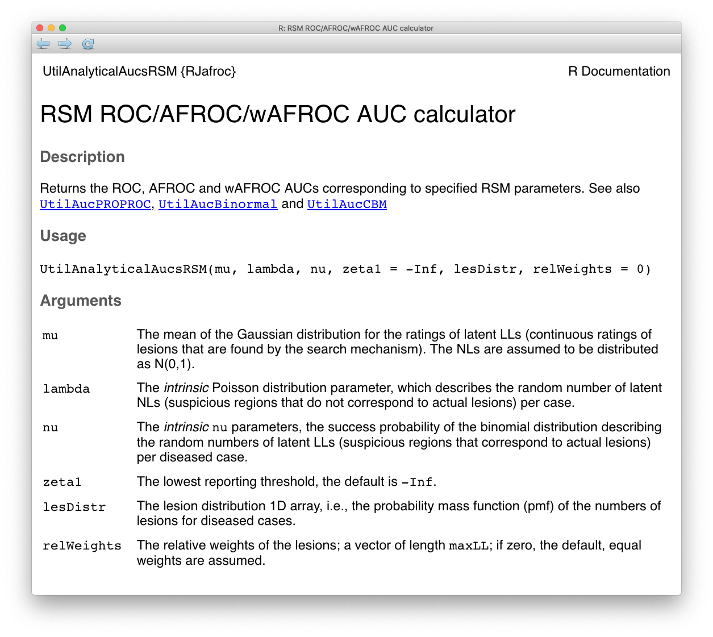
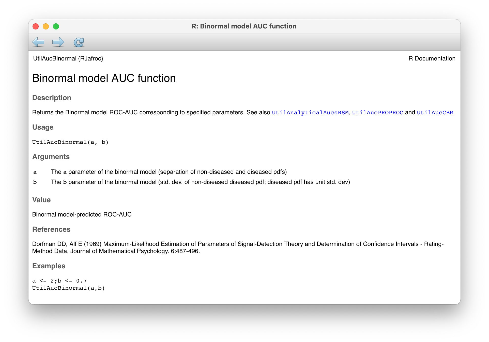
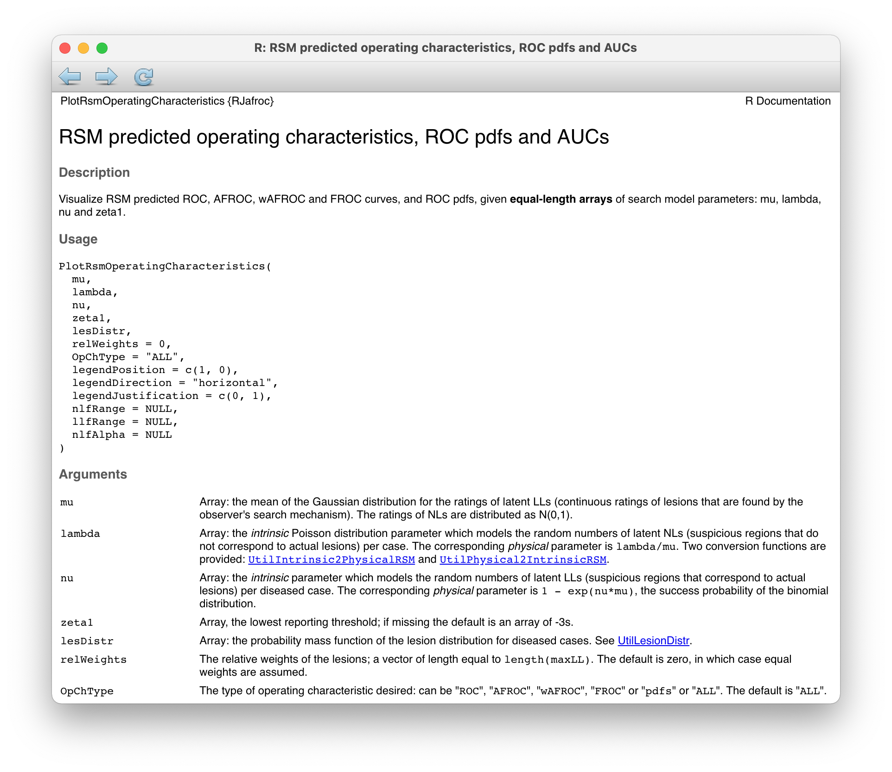

# ROC curve predictions of the RSM {#rsm-pred}


```{r setup, include=FALSE}
knitr::opts_chunk$set(echo = TRUE)
library(kableExtra)
library(seqinr)
library(RJafroc)
library(ggplot2)
library(gridExtra)
library(Rmpfr)
```


## TBA How much finished {#rsm-pred-how-much-finished}
90%
took out Wagner review


## TBA Introduction {#rsm-pred-intro}

The preceding chapter described the radiological search model (RSM) for FROC data. This chapter describes the ROC curve predictions of the RSM. The starting point is a general characteristic of all RSM predicted operating characteristics, namely they have the constrained end-point property. Derived next is the predicted *inferred ROC* curve followed by the predicted FROC and AFROC curves. 

Shown next is how *search performance* and *lesion-classification* performance can be measured from the inferred ROC curve. Search performance is the ability to find lesions while avoiding finding non-lesions, and lesion-classification performance is the ability, having found a suspicious region, to correctly classify it. Lesion-classification is different from (case) classification performance, i.e., distinguishing between diseased and non-diseased cases, which is measured by the area AUC under the ROC curve. 

TBA Based on the ROC/FROC/AFROC curve predictions of the RSM, a comparison is presented between area measures that can be calculated from FROC data, leading to an important and perhaps surprising conclusion, *the FROC curve is a poor descriptor of search performance and that the AFROC/wAFROC curves are preferred*. Most applications of FROC methods, particularly in CAD, have relied on the FROC curve to measure performance.

In this chapter formulae for RSM quantities are given in terms of the RSM search parameters $\lambda$ and $\nu$.  


## Inferred ROC z-sample {#rsm-pred-inferred-roc}

*The inferred ROC z-sample of a case, denoted $h_t$, where $t = 1$ for non-diseased cases and $t = 2$ for diseased cases, is the z-sample of the highest rated latent mark on the case or $-\infty$ if the case has no latent marks.* The difference from the previous chapter is that in this chapter we are concerned with statistical/probabilistic modeling of the continuous z-samples instead of describing observed ratings for a finite dataset.  


Definitions:

>
 -   $\text{FPF}(\zeta)$ = probability that $h_1 \ge \zeta$.
 -   $\text{TPF}(\zeta)$ = probability that $h_2 \ge \zeta$.


Accordingly, FPF and TPF are defined by:

\begin{equation}
\text{FPF}\left( \zeta \right) = \text{P} \left ( h_1 \geq \zeta\right )
(\#eq:rsm-pred-fpf-def)
\end{equation}


\begin{equation}
\text{TPF}\left( \zeta \right) = \text{P} \left ( h_2 \geq \zeta\right )
(\#eq:rsm-pred-tpf-def)
\end{equation}


Definition of ROC plot:

>
 -   The ROC is the plot of $\text{TPF}(\zeta)$ vs. $\text{FPF}(\zeta)$.
 -   *The plot includes a straight line extension from the theoretical end-point to (1,1)*.
 -   The theoretical end-point corresponds to $\zeta = -\infty$.


## End-point of the ROC {#rsm-pred-end-point}

A consequence of the possibility that some cases have no marks is that the ROC curve has the *constrained end-point property*, namely the full range of ROC space, i.e., $0 \leq \text{FPF} \leq 1$ and $0 \leq \text{TPF} \leq 1$, is not continuously accessible to the observer. In fact, $0 \leq \text{FPF} \leq \text{FPF}_{\text{max}}$ and $0 \leq \text{TPF} \leq \text{TPF}_{\text{max}}$ where $\text{FPF}_{\text{max}}$ and $\text{TPF}_{\text{max}}$ are generally less than unity.   

Starting from $\infty$ as $\zeta$ is lowered to $-\infty$ some of the cases that had at least one latent site but whose z-sample did not exceed $\zeta$ will now generate marks and contribute to $\text{FPF}$ and $\text{TPF}$ resulting in upward and rightward movement of the theoretical operating point until eventually *only cases with no latent sites* remain. These cases cannot generate marks. The finite number of cases with no marks has the consequence that the uppermost continuously accessible operating point is below-left of (1,1). The (1,1) point is "trivially" reached when one cumulates cases with no marks, i.e., those rated $-\infty$. 

This behavior is distinct from conventional ROC models where the entire curve, extending from (0, 0) to (1, 1), is continuously accessible. This is because every case yields a finite decision variable, no matter how small. The number of cases with $-\infty$ rating is zero. When $\zeta = -\infty$ the operating point reaches (1,1). 


### The abscissa of the ROC end-point {#rsm-pred-constrained-end-point-abscissa}

Consider the probability that a non-diseased case has at least one latent NL. Such a case will generate a finite value of $h_1$ and with an appropriately low $\zeta$ it will be marked. The probability of *zero* latent NLs, see Eqn. \@ref(eq:rsm-poisson-pmf), is:  

$$\text{pmf}_{Poi} \left (0,\lambda \right ) = \text{exp} \left ( -\lambda \right )$$.

The probability that the case has *at least one* latent NL is the complement of the above probability. At sufficiently low $\zeta$ each of these cases yields a marked non-disease case. Therefore, the maximum continuously accessible abscissa of the ROC, i.e., $\text{FPF}_{\text{max}}$, is: 

\begin{equation} 
\text{FPF}_{\text{max}} = 1 - \text{exp} \left ( -\lambda \right )
(\#eq:rsm-pred-fpf-max)
\end{equation}


### The ordinate of the ROC end-point {#rsm-pred-constrained-end-point-ordinate}

A diseased case has no marks, even for very low $\zeta$, if it has zero latent NLs, the probability of which is $\text{exp}(-\lambda)$, and it has zero latent LLs, the probability of which is, see Eqn. \@ref(eq:rsm-binomial-pmf), $\text{pmf}_{Bin} \left ( 0, L, \nu \right )= (1 - \nu)^L$. 

Here $L$ is the number of lesions in each diseased case. 

* Assumption 1: occurrences of latent LLs are independent of each other, i.e., the probability that a lesion is found is independent of whether other lesions are found on the same case. 

* Assumption 2: occurrences of latent NLs are independent of each other; i.e., the probability of a NL is independent of whether other NLs are found on the same case.

* Assumption 3: occurrence of a latent NL is independent of the occurrence of a latent LL on the same case.

By these assumptions the probability of zero latent NLs *and* zero latent LLs on a diseased case is the product of the two probabilities, namely 

$$\text{exp}(-\lambda) (1 - \nu)^L$$. 

The probability that there exists *at least one* latent site is the complement of the above expression, which equals $\text{TPF}_{\text{max}}$, i.e., 

\begin{equation}
\text{TPF}_{\text{max}} = 1 - \text{exp} \left ( - \lambda \right ) \left ( 1 - \nu \right )^L
(\#eq:rsm-pred-tpf-max)
\end{equation}


### Variable number of lesions per case {#rsm-pred-end-point-variable-number-lesions}

Defining $f_L$  the fraction of diseased cases with $L$ lesions and $L_{max}$ the maximum number of lesions per diseased case in the dataset, then:

\begin{equation}
\sum_{L=1}^{{L_{max}}}  f_L = 1
(\#eq:rsm-pred-fl-sum)
\end{equation}


By restricting attention to the set of diseased cases with $L$ lesions each, Eqn. \@ref(eq:rsm-pred-tpf-max) for $\text{TPF}_{\text{max}}$ applies. Since TPF is a probability and probabilities of independent processes add it follows that:

\begin{equation}
\text{TPF}_{\text{max}} = 1 - \sum_{L=1}^{L_{max}}f_L\text{exp} \left ( - \lambda \right ) \left ( 1 - \nu \right )^L
(\#eq:rsm-pred-tpf-max-vary-l)
\end{equation}


The ordinate of the end-point is a $f_L$ weighted summation of $\text{TPF}_{\text{max}}$. The expression for $\text{FPF}_{\text{max}}$ is unaffected.


## ROC curve {#rsm-pred-roc-curve}

On the continuous ROC curve each case has at least one mark and the ROC decision variable is the rating of the highest rated mark $h_t$ on the case. Therefore Eqn. \@ref(eq:rsm-pred-fpf-def) and Eqn. \@ref(eq:rsm-pred-tpf-def) apply. Varying the threshold parameter $\zeta$ from $\infty$ to $-\infty$ sweeps out the continuous section of the predicted ROC curve from (0,0) to $\left (\text{FPF}_{\text{max}}, \text{TPF}_{\text{max}} \right )$. 


### Derivation of FPF {#rsm-pred-roc-curve-fpf}

* Assumption 4: the z-samples of latent NLs on the same case are independent of each other.

Consider the set of non-diseased cases with $n$ latent NLs each, where $n > 0$. According to \@ref(rsm-assumptions) each latent NL yields a z sample from $N(0,1)$. The probability that a z-sample from a latent NL is smaller than $\zeta$ is $\Phi(\zeta)$. The probability that all $n$ z-samples are smaller than $\zeta$ is $(\Phi(\zeta))^n$. If all z-samples are smaller than $\zeta$, then the highest z-sample $h_t$  must be smaller than $\zeta$. Therefore, the probability that $h_t$ exceeds $\zeta$ is: 

\begin{equation}
\left. 
\begin{aligned}
\text{FPF}\left (\zeta \mid n \right ) =& P\left ( h_1 \geq  \zeta \mid n\right ) \\
=& 1 - \left [ \Phi\left ( \zeta \right )  \right ]^n
\end{aligned}
\right \}
(\#eq:rsm-pred-fpf-zeta-n)
\end{equation}


The conditioning notation in Eqn. \@ref(eq:rsm-pred-fpf-zeta-n) reflects the fact that this expression applies specifically to non-diseased cases each with $n$ latent NLs. To obtain $\text{FPF}_{\text{max}}$ one performs a Poisson pmf-weighted summation of $\text{FPF}\left (\zeta \mid n \right )$ over $n$ from 0 to $\infty$ (the inclusion of the $n = 0$ term is explained below):    

\begin{equation}
\text{FPF}\left (\zeta, \lambda \right ) = \sum_{n=0}^{\infty} \text{pmf}_{\text{Poi}} \left ( n, \lambda \right )\text{FPF}\left (\zeta \mid n \right )
(\#eq:rsm-pred-fpf-zeta-before-maple)
\end{equation}


The infinite summations, see below, are easier performed using symbolic algebra software such as $\text{Maple}^{TM}$. Inclusion in the summation of $n = 0$, which evaluates to zero, is done to make it easier for Maple to evaluate the summation in closed form. Otherwise one may need to simplify the Maple-generated result. The `Maple` code is shown below (Maple 17, Waterloo Maple Inc.). 

```
# Maple Code
restart;
phi := proc (t, mu) exp(-(1/2)*(t-mu)^2)/sqrt(2*Pi) end: 
PHI := proc (c, mu) local t; int(phi(t, mu), t = -infinity .. c) end: 
Poisson := proc (n, lambda) lambda^n*exp(-lambda)/factorial(n) end: 
Bin := proc (l, L, nu) binomial(L, l)*nu^l*(1-nu)^(L-l) end:
FPF := proc(zeta,lambda) sum(Poisson(n,lambda)*(1 - PHI(zeta,0)^n), n=0..infinity);end:
FPF(zeta, lambda);   
```

The above code yields:

\begin{equation}
\text{FPF}\left (\zeta , \lambda\right ) = 1 - \text{exp}\left ( -\frac{\lambda}{2} \left [ 1-\text{erf}\left ( \frac{\zeta}{\sqrt{2}} \right ) \right ]  \right ) 
(\#eq:rsm-pred-fpf-erf)
\end{equation}


The error function in Eqn. \@ref(eq:rsm-pred-fpf-erf) is related to the unit normal CDF function $\Phi(x)$ by:


\begin{equation}
\text{erf} \left (x \right ) =  2\Phi \left ( \sqrt{2} x\right ) - 1
(\#eq:rsm-pred-erf-phi-relation)
\end{equation}


Using this transformation yields the following simpler expression for FPF:


\begin{equation}
\text{FPF}\left (\zeta , \lambda\right ) = 1 - \text{exp}\left ( -\lambda \Phi\left ( -\zeta \right )  \right )
(\#eq:rsm-pred-fpf)
\end{equation}


The `R` implementation follows:

```{r}
# lambda is the physical lambda' parameter
FPF <- function (zeta, lambda) {
  x = 1 - exp(-lambda * pnorm(-zeta))
  return(x)
}
```


Because $\Phi$ ranges from 0 to 1, $\text{FPF}\left (\zeta , \lambda\right )$ ranges from 0 to $\text{exp} \left ( -\lambda \right )$.


### Derivation of TPF {#rsm-pred-roc-curve-tpf}

The derivation of the true positive fraction $\text{TPF}(\zeta)$ follows a similar line of reasoning except this time one needs to consider the highest of the latent NLs and latent LL z-samples. Consider a diseased case with L lesions, $n$ latent NLs and $l$ latent LLs. Each latent NL yields a decision variable sample from $N(0,1)$ and each latent LL yields a sample from $N(\mu,1)$. The probability that all $n$  latent NLs have z-samples less than $\zeta$ is $[\Phi(\zeta)]^n$. The probability that all $l$ latent LLs have z-samples less than  $\zeta$ is $[\Phi(\zeta - \mu)]^l$. The probability that all latent marks have z-samples less than $\zeta$ is the product of these two probabilities. The probability that $h_2$  (the highest z-sample on a diseased case) is larger than $\zeta$  is the complement of the product probabilities, i.e.,


\begin{equation}
\left. 
\begin{aligned}
\text{TPF}\left ( \zeta, \mu, n, l, L \right ) =& 
P\left ( h_2 \geq \zeta \mid \mu, n, l, L \right ) \\
=& 1 - \left [ \Phi\left ( \zeta \right ) \right ]^n \left [ \Phi\left ( \zeta - \mu\right ) \right ]^l
\end{aligned}
\right \}
(\#eq:rsm-pred-tpf-vary_nl)
\end{equation}


One averages over the distributions of $n$ and $l$ to obtain the desired ROC-ordinate:

\begin{equation}
\left.
\begin{aligned}
\text{TPF}\left ( \zeta, \mu, \lambda, \nu \right ) =& \sum_{n=0}^{\infty} \text{pmf}_{Poi}(n,\lambda) \\
&\times \sum_{l=0}^{L} \text{pmf}_{Bin}(l,\nu,L) \text{TPF}_{n,l}\left ( \zeta, \mu, n, l \right )
\end{aligned}
\right \}
(\#eq:rsm-pred-tpf-double-summation)
\end{equation}

This can be evaluated using Maple yielding: 


\begin{equation}
\left.
\begin{aligned}
& \text{TPF}\left (\zeta , \mu, \lambda, \nu, L \right ) \\
&= 1 - \text{exp}\left ( - \lambda \Phi \left ( - \zeta \right )\right )
\left ( 1 - \nu \Phi \left ( \mu - \zeta \right ) \right )^L
\end{aligned}
\right \}
(\#eq:rsm-pred-tpf1)
\end{equation}


### Variable number of lesions per case {#rsm-pred-tpf-varying-lesions}

To extend the results to varying numbers of lesions per diseased case, one averages the right hand side of \@ref(eq:rsm-pred-tpf1) over the fraction of diseased cases with $L$ lesions:


\begin{equation}
\left.
\begin{aligned}
& \text{TPF}\left (\zeta , \mu, \lambda, \nu, \overrightarrow{f_L} \right ) =  \\
& 1 - \text{exp}\left ( -\lambda \Phi \left ( -\zeta \right )\right ) 
\sum_{L=1}^{L_{max}} f_L  \left ( 1 - \nu \Phi \left ( \mu -\zeta \right ) \right )^L 
\end{aligned}
\right \}
(\#eq:rsm-pred-tpf2)
\end{equation}

Since $\Phi \left ( -\zeta \right )$ tends to unity as $\zeta \rightarrow -\infty$, this expression reduces to Eqn. \@ref(eq:rsm-pred-tpf-max-vary-l) for the ROC end-point. The expression for FPF, Eqn. \@ref(eq:rsm-pred-fpf), is unaffected. 

The `R` implementation follows:


```{r}
# lesDistr is the lesion distribution vector f_L
TPF <- function (zeta, mu, lambda, nu, lesDistr){
  Lmax <- length(lesDistr)
  x <- 1
  for (L in 1:Lmax ) {
    x <- x - exp(-lambda * pnorm(-zeta)) * lesDistr[L] * (1 - nu * pnorm(mu - zeta))^L
  }
  return(x)
}
```


### Comparing TPF formula to `RJafroc` functions


A hand calculation is shown and compared to the value yielded by the function `RSM_yROC`. The RSM parameters and the value of $\zeta$ are:


```{r}
zeta <- 1
mu <- 2
lambda <- 1
nu <- 0.9
lesDistr <- c(0.5,0.5)
```


The `lesDistr` vector corresponds to $f_L$ and specifies $L_{max} = 2$ and 50 percent of diseased cases have one lesion per case and the rest have two lesions per case.


Direct implementation of Eqn. \@ref(eq:rsm-pred-tpf2) followed by usage of the function `RSM_yROC` follows:


```{r}
cat(1-
exp(-lambda*pnorm(-zeta))*
(lesDistr[1]*(1-nu*pnorm(mu-zeta))+
lesDistr[2]*(1-nu*pnorm(mu-zeta))^2))

cat(RSM_yROC(zeta,mu,lambda,nu, lesDistr = lesDistr))
```


The two values are identical.


### Effect on operating point of varying RSM parameters


It is instructive to understand the effects of varying the RSM parameters on the operating point on the ROC curve.

#### Vary $\mu$

```{r, echo = F}
myLocalPrint <- function(index, mu, lambda, nu, zeta, lesDistr)
{
  if (index == 1) {
    cat("mu =", mu, 
        ", RSM-x =", sprintf("%6.4f", RSM_xROC(zeta,lambda)),
        ", RSM-y =", sprintf("%6.4f", RSM_yROC(zeta,mu,lambda,nu, lesDistr = lesDistr)), 
        "\n")
  }

  if (index == 2) {
    cat("lambda =", lambda, 
        ", RSM-x =", sprintf("%6.4f", RSM_xROC(zeta,lambda)),
        ", RSM-y =", sprintf("%6.4f", RSM_yROC(zeta,mu,lambda,nu, lesDistr = lesDistr)), 
        "\n")
  }
  
  if (index == 3) {
    cat("nu =", nu, 
        ", RSM-x =", sprintf("%6.4f", RSM_xROC(zeta,lambda)),
        ", RSM-y =", sprintf("%6.4f", RSM_yROC(zeta,mu,lambda,nu, lesDistr = lesDistr)), 
        "\n")
  }
  
  if (index == 4) {
    cat("zeta =", zeta, 
        ", RSM-x =", sprintf("%6.4f", RSM_xROC(zeta,lambda)),
        ", RSM-y =", sprintf("%6.4f", RSM_yROC(zeta,mu,lambda,nu, lesDistr = lesDistr)), 
        "\n")
  }
}

```


```{r, echo = F}
zeta <- 0
mu <- 1
lambda <- 2
nu <- 0.5
lesDistr <- c(0.1,0.9)

cat("Varying mu only; other parameters are lambda = ", lambda, ", nu = ", nu, ", zeta = ", zeta, "\n\n")
for (mu in seq(0,5,0.5)) {
myLocalPrint(1, mu, lambda, nu, zeta, lesDistr)
}
```


The abscissa is independent of $\mu$ (because this parameter has no effect on non-diseased cases) and the ordinate is an increasing function of $\mu$ (as expected for increasing separation of the LL and NL distributions; the LLs on diseased cases are rated higher causing the distribution of $h_2$ to shift to higher values). 


#### Vary $\lambda$

```{r, echo = F}
zeta <- 0
mu <- 1
lambda <- 2
nu <- 0.5

cat("Varying lambda only; other parameters are mu = ", mu, ", nu = ", nu, ", zeta = ", zeta, "\n\n")
for (lambda in seq(0.5,5,0.5)) {
  myLocalPrint(2, mu, lambda, nu, zeta, lesDistr)
}
```


The abscissa increases with $\lambda$ (more NLs on non-diseased cases are generated causing the distribution of $h_1$ to shift to higher values) and the ordinate also increases with $\lambda$ (more NLs on diseased cases are generated causing the distribution of $h_2$ to shift to higher values - recall that on diseased cases the highest z-sample is the maximum of NL and LL z-samples, whichever is highest). 


#### Vary $\nu$

```{r, echo = F}
zeta <- 0
mu <- 1
lambda <- 2
nu <- 0.5

cat("Varying nu only; other parameters are mu = ", mu, ", lambda = ", lambda, ", zeta = ", zeta, "\n\n")
for (nu in seq(0,0.9,0.1)) {
  myLocalPrint(3, mu, lambda, nu, zeta, lesDistr)
}
```


No effect on the abscissa as $\nu$ increases (this parameter has no effect on non-diseased case sampling) and the ordinate increases with $\nu$ (more LLs on diseased cases, as more lesions are localized, causing the distribution of $h_2$ to shift to higher values). 

#### Vary $\zeta$

```{r, echo = F}
zeta <- 0
mu <- 1
lambda <- 2
nu <- 0.5

cat("Varying zeta only; other parameters are mu = ", mu, ", lambda = ", lambda, ", nu = ", nu, "\n\n")
for (zeta in seq(-3,3,0.5)) {
  myLocalPrint(4, mu, lambda, nu, zeta, lesDistr)
}
```


Increasing $\zeta$ causes the operating point to move down the ROC.


#### Vary $f_L$ 


The `lesDist` vector is defined as $(f, (1-f))$ where f is varied from 1 (only cases with one lesion per case) to 0 (only cases with two lesions per case):

```{r, echo = F}
zeta <- 0
mu <- 1
lambda <- 2
nu <- 0.5

cat("Varying f only; other parameters are mu = ", mu, ", lambda = ", lambda, ", nu = ", nu, ", zeta = ", zeta, "\n\n")
for (f in seq(1,0,-0.1)) {
cat("f = ", f, 
    ", RSM-x = ", sprintf("%6.4f", RSM_xROC(zeta,lambda)),
    ", RSM-y = ", sprintf("%6.4f", RSM_yROC(zeta,mu,lambda,nu, lesDistr = c(f, 1-f))), 
    "\n")
}
```


No effect on FPF but TPF increases as more lesions per case means more LLs per case and the distribution of $h_2$ moves to higher values.


## Proper ROC curve {#rsm-pred-roc-curve-proper}

>A proper ROC curve has the property that it never crosses the chance diagonal and its slope never increases as the operating point moves up the ROC curve [@metz1999proper; @macmillan2004detection]. *It is shown below that the RSM predicted ROC curve, including the dashed straight line extension, is proper* ^[The statement in the print book that the "proper" property only applies to the continuous section is incorrect.]. 

Consider first the continuous section which is below-left of the end-point. For convenience one abbreviates FPF and TPF to $x$ and $y$, respectively, and suppresses the dependence on model parameters. From Eqn. \@ref(eq:rsm-pred-fpf) and Eqn. \@ref(eq:rsm-pred-tpf2) one can express the ROC coordinates as: 

\begin{equation}
\left. 
\begin{aligned}
x\left ( \zeta \right ) =& 1 - G\left ( \zeta \right )\\
y\left ( \zeta \right ) =& 1 - F\left ( \zeta \right ) G\left ( \zeta \right ) 
\end{aligned}
\right \}
(\#eq:rsm-pred-f-g)
\end{equation}

where:

\begin{equation}
\left. 
\begin{aligned}
G\left ( \zeta \right ) =& \text{exp}\left ( -\lambda \Phi \left ( -\zeta \right )\right )\\
F\left ( \zeta \right ) =& \sum_{L=1}^{L_{max}} f_L  \left ( 1 - \nu \Phi \left ( \mu -\zeta \right ) \right )^L 
\end{aligned}
\right \}
(\#eq:rsm-pred-fg-defs)
\end{equation}


>These equations have the same structure as [@swensson1996unified] Eqns. 1 and 2 and the logic used there to demonstrate that ROC curves predicted by Swensson's LROC model is proper also applies to the present situation. 

Specifically, since the $\Phi$ function ranges between 0 and 1 and $0 \leq \nu \leq 1$, it follows that $F\left ( \zeta \right ) \leq 1$. Therefore $y\left ( \zeta \right ) \geq x\left ( \zeta \right )$ and the ROC curve is constrained to the upper half of the ROC space, namely the portion above the chance diagonal. Additionally, the more general constraint shown by Swensson applies, namely the slope of the ROC curve at any operating point (x, y) cannot be less than the slope of the dashed straight line connecting (x, y) and $\left (\text{FPF}_{\text{max}}, \text{TPF}_{\text{max}} \right )$, the coordinates of the RSM end-point. This implies that the slope decreases monotonically and also rules out curves with "hooks".


>In Appendix 1 \@ref(rsm-pred-appendix1) it is shown analytically that the slope is continuous at the end-point transition from the continuous curve to the dashed straight line. In Appendix 2 \@ref(rsm-pred-appendix2) the slope near the end-point is examined numerically to resolve an apparent paradox, namely the ROC plot can appear discontinuous at the end-point when in fact no discontinuity exists. 


## ROC decision variable pdfs {#rsm-pred-roc-curve-pdfs}

In TBA (binormal-model-pdf-curves-appendix-1) the pdf functions were derived for non-diseased and diseased cases for the unequal variance binormal ROC model. The procedure was to take the derivative of the appropriate cumulative distribution function (CDF) with respect to $\zeta$. An identical procedure is used for the RSM. 

The CDF for non-diseased cases is the complement of FPF. The pdf for non-diseased cases is given by:	

\begin{equation}
\text{pdf}_N\left ( \zeta \right ) = \frac{\partial }{\partial \zeta} \left ( 1-\text{FPF}\left (\zeta , \lambda\right ) \right ) 
(\#eq:rsm-pred-pdf-n)
\end{equation}


Similarly, for diseased cases,

\begin{equation}
\text{pdf}_D\left ( \zeta \right ) = \frac{\partial }{\partial \zeta} \left ( 1-\text{TPF}\left (\zeta , \mu, \lambda, \nu, \overrightarrow{f_L} \right ) \right ) 
(\#eq:rsm-pred-pdf-d)
\end{equation}


Both expressions can be evaluated using Maple. The pdfs are implemented in the `RJafroc` function `PlotRsmOperatingCharacteristics()`. 

The integrals of the pdfs (non-diseased followed by diseased) over the entire allowed range are given by (note the vertical bar notation, meaning the difference of two limiting values):

\begin{equation}
\left. 
\begin{aligned}
\int_{-\infty}^{\infty}\text{pdf}_N \left ( \zeta \right )d \zeta =& \left ( 1-\text{FPF}\left (\zeta , \lambda\right ) \right ) \bigg \rvert_{-\infty}^{\infty}\\
=& \text{FPF}_{\text{max}}
\end{aligned}
\right \}
(\#eq:rsm-pred-int-pdf-n)
\end{equation}


\begin{equation}
\left. 
\begin{aligned}
\int_{-\infty}^{\infty}\text{pdf}_D \left ( \zeta \right )d \zeta =& \left ( 1-\text{TPF}\left (\zeta , \mu, \lambda, \nu, \overrightarrow{f_L} \right ) \right ) \bigg \rvert_{-\infty}^{\infty}\\
=& \text{TPF}_{\text{max}}
\end{aligned}
\right \}
(\#eq:rsm-pred-int-pdf-d)
\end{equation}


In other words, they evaluate to the coordinates of the predicted end-point, *each of which is less than unity*. The reason is that the integration is along the *continuous* section of the ROC curve and does not include the contribution along the dashed straight line extension from $\left ( \text{FPF}_{\text{max}}, \text{TPF}_{\text{max}} \right )$ to (1,1). The latter contributions correspond to cases with no marks, i.e., $1 - \text{FPF}_{\text{max}}$ for non-diseased cases and $1 - \text{TPF}_{\text{max}}$ for diseased cases. Adding these contributions to the integrals along the continuous section yields unity for both types of cases. ^[The original RSM publications [@chakraborty2006search; @chakraborty2006roc] unnecessarily introduced Dirac delta functions to force the integrals to be unity. The explanation given here should clarify the issue.]


## ROC AUC {#rsm-pred-roc-curve-auc}
It is possible to numerically perform the integration under the RSM-ROC curve to get AUC:


\begin{equation}
AUC_{RSM}^{ROC}\left ( \mu, \lambda, \nu,  \zeta, \overrightarrow{f_L} \right ) = \sum_{L=0}^{L_{max}} f_L \int_{0}^{1} \text{TPF}\left (\zeta,  \mu, \lambda, \nu, L \right ) d\left ( \text{FPF}\left (\zeta, \lambda \right ) \right )
(\#eq:rsm-pred-auc)
\end{equation}


The superscript $ROC$ is needed to keep track of the operating characteristic that is being predicted (for RSM other possibilities are AFROC, wAFROC, FROC) and the subscript $RSM$ keeps track of the predictive model that is being used (for ROC models - binormal, CBM or PROPROC - the superscript is always ROC). 

The right hand side of Eqn. \@ref(eq:rsm-pred-auc) can be evaluated using a numerical integration function implemented in `R`, which is used in the `RJafroc` function `UtilAnalyticalAucsRSM()` whose help page follows: 


```{r rsm-pred-help, out.width="300pt", fig.align = "center", echo=FALSE, fig.cap="Help page for `RJafroc` function `UtilAnalyticalAucsRSM`."}

``` 


The arguments to `UtilAnalyticalAucsRSM()` are the intrinsic RSM parameters $\mu$, $\lambda$, $\nu$ and $\zeta$. The default value of $\zeta$ is $\zeta = -\infty$. The remaining arguments `lesDistr` and `relWeights` are not RSM parameters per se, rather they specify the lesion-richness of the diseased cases and the relative lesion weights (not needed for computing ROC AUC). The dimensions of `lesDistr` and `relWeights` are each equal to the maximum number of lesions per case $L_{max}$. In the following code $L_{max} = 3$ and `lesDistr <- c(0.5, 0.3, 0.2)`, meaning 50 percent of diseased cases have one lesion per case, 30 percent have two lesions and 20 percent have three lesions.  

The function returns a list containing the AUCs under the ROC and other operating characteristics.  

```{r UtilAnalyticalAucsRSM, echo=TRUE}
mu <- 1; lambda <- 1; nu <- 1
lesDistr <- c(0.5, 0.3, 0.2) # implies L_max = 3
aucs <- UtilAnalyticalAucsRSM(mu = mu, 
                              lambda = lambda, 
                              nu = nu, 
                              lesDistr = lesDistr)
cat("mu = ", mu, 
", lambda = ", lambda, 
", nu = ", nu,  
", AUC ROC = ", aucs$aucROC, "\n")
```


Experimenting with different parameter combinations reveals the following behavior for ROC AUC.

* AUC is an increasing functions of $\mu$. Increasing perceptual signal-to-noise-ratio leads to improved performance: for background on this important dependence see \@ref(froc-paradigm-solar-analogy). Increasing $\mu$ increases the separation between the two pdfs defining the ROC curve, which increases AUC. Furthermore, the number of NLs decreases because $\lambda = \lambda / \mu$ decreases, which increases performance. Finally, $\nu$ increases approaching unity, which leads to more LLs and increased performance. *Because all three effects reinforce each other, a change in $\mu$ results in a large effect on performance.* 

* AUC increases as $\lambda$ decreases. Decreasing $\lambda$ results in fewer NLs which results in increased performance. This is a relatively weak effect.
	
* AUC increases as $\nu$ increases. Increasing $\nu$ results in more LLs being marked, which increases performance. This is a relatively strong effect. 

* AUC decreases as $\zeta$ increases. This important effect is discussed in the next section. 

* ROC AUC increases with $L_{max}$. With more lesions per case, there is increased probability that that at least one of them will result in a LL, and the diseased case pdf moves to the right, both of which result in increased performance.

* ROC AUC increases as `lesDistr` is weighted towards more lesions per case. For example, `lesDistr <- c(0, 0, 1)` (all cases have 3 lesions per case) will yield higher performance than `lesDistr <- c(1, 0, 0)` (all cases have one lesion per case). 


## $\zeta$ dependence of ROC AUC {#rsm-pred-roc-curve-aucs-zeta1}

When it comes to predicted ROC AUC there is an important difference between conventional ROC models and the RSM. The former has no dependence on $\zeta$. This is because in the ROC model every case yields a rating, no matter how low the z-sample, implying that effectively $\zeta = -\infty$. The lack of $\zeta$ dependence is demonstrated by the help page for function `UtilAucBinormal`, shown below, which depends on only two parameters, $a$ and $b$ (the two-parameter dependence is also true for other ROC models implemented in `RJafroc`, e.g., `UtilAucCBM` and `UtilAucPROPROC`). 


```{r rsm-pred-binorml-help, out.width="300pt", fig.align = "center", echo=FALSE, fig.cap="Help page for `RJafroc` function `UtilAucBinormal`."}

``` 


In contrast, in addition to the basic RSM parameters, i.e., $\mu$, $\lambda$ and $\nu$, the rsm-pred have an additional dependence on $\zeta$. This is because the value of $\zeta$ determines the location of the end-point. The $\zeta$ dependence is demonstrated next for the ROC plots, but it is true for all RSM predictions.


```{r rsm-pred-operating-characteristics-help, out.width="300pt", fig.align = "center", echo=FALSE, fig.cap="Help page for `RJafroc` function `PlotRsmOperatingCharacteristics`."}

``` 


The dependence is demonstrated next for two values: $zeta = -10$ and $zeta = 1$. The common parameter values are $\mu = 2$, $\lambda = 1$,  $\nu = 1$, as shown in the following code-chunk. 


```{r, echo=TRUE}
roc <- PlotRsmOperatingCharacteristics(
     mu = c(2,2),
     lambda = c(1,1),
     nu = c(1,1),
     zeta1 = c(-10, 1),
     lesDistr = c(0.5, 0.5),
     relWeights = c(0.5, 0.5),
     OpChType = "ROC",
     legendPosition = "null"
)
```


Clearly the red curve has higher AUC. The specific values are `r roc$aucROC[1]` for the red curve and `r roc$aucROC[2]` for the green curve.


```{r rsm-pred-roc-zeta1, fig.cap="ROC curves for two values of $\\zeta$: both curves correspond to $\\mu = 2$, $\\nu = 1$ and $\\lambda = 1$. The red curve corresponds to $\\zeta = -10$ and the blue curve to $\\zeta = 1$.", fig.show='hold', echo=FALSE}
grid.arrange(roc$ROCPlot)
```


A consequence of the $\zeta$ dependence is that if one uses ROC AUC as the measure of performance, the optimal threshold is $\zeta = -\infty$. In particular, a CAD algorithm that generates FROC data should show all generated marks to the radiologist, which is clearly incorrect and is not adopted by any CAD designer. Selecting the optimal value of the reporting threshold is addressed in Chapter \@ref(optim-op-point).


## Example ROC curves {#rsm-pred-roc-curves}

```{r rsm-pred-fig-auc-mu-code, echo=FALSE}
muArr <- c(0.05,1,2,4)
lambda <- 1
nu <- 0.9
L <- 1 
lesDistr <- c(rep(0, L-1), 1)
plotArr <- array(list(), dim = c(length(muArr)))
for (i in 1:length(muArr)) {
  mu <- muArr[i]
  ret1 <- PlotRsmOperatingCharacteristics(
    mu, lambda, nu, 
    lesDistr = L, legendPosition  = "none"
  )
  plotArr[[i]] <- ret1$ROCPlot + ggtitle(paste0("mu = ", as.character(muArr[i]), ", AUC = ", format(ret1$aucROC, digits = 3)))
}
```


```{r rsm-pred-fig-auc-mu-plots, fig.cap="ROC curves for indicated values of the $\\mu$ parameter. Notice the transition, as $\\mu$ increases, from near chance level performance to almost perfect performancea as the end-point moves from near (1,1) to near (0,1).", fig.show='hold', echo=FALSE}
grid.arrange(plotArr[[1]],plotArr[[2]],plotArr[[3]],plotArr[[4]], ncol = 2)
```


Fig. \@ref(fig:rsm-pred-fig-auc-mu-plots) displays ROC curves for indicated values of $\mu$. The remaining RSM model parameters are $\lambda = 1$, $\nu = 1$ and $\zeta = -\infty$ and there is one lesion per diseased case. 


The following are evident from these figures:

1. As $\mu$ increases the ROC curve more closely approaches the upper-left corner of the ROC plot. This signifies increasing performance and the area under the ROC and AFROC curves approach unity. The end-point abscissa decreases, meaning increasing numbers of unmarked non-diseased cases, i.e., more perfect decisions on non-diseased cases. The end-point ordinate increases, meaning decreasing numbers of unmarked lesions, i.e., more good decisions on diseased cases. 
2. For $\mu$ close to zero the operating characteristic approaches the chance diagonal and the area under the ROC curve approaches 0.5.
3. The area under the ROC increases monotonically from 0.5 to 1 as $\mu$ increases from zero to infinity.
4. For large $\mu$ the accessible portion of the operating characteristic approaches the vertical line connecting (0,0) to (0,1), the area under which is zero. The complete ROC curve is obtained by connecting this point to (1,1) by the dashed line and in this limit the area under the complete ROC curve approaches unity. Omitting the area under the dashed portion of the curve will result in a severe underestimate of true performance. 
5. As $L_{max}$ increases (allowed values are 1, 2, 3, etc.) the area under the ROC curve increases, approaching unity and  $\text{TPF}_{\text{max}}$ approaches unity. With more lesions per diseased case, the chances are higher that at least one of them will be found and marked. However, $\text{FPF}_{\text{max}}$ remains constant as determined by the constant value of $\lambda = \frac{\lambda}{\mu}$, Eqn. \@ref(eq:rsm-pred-fpf-max)
6. As $\lambda$ decreases $\text{FPF}_{\text{max}}$ decreases to zero and $\text{TPF}_{\text{max}}$ decreases. The decrease in $\text{TPF}_{\text{max}}$  is consistent with the fact that, with fewer NLs, there is less chance of a NL being rated higher than a LL, and one is completely dependent on at least one lesion being found.
7. As $\nu$ increases $\text{FPF}_{\text{max}}$ stays constant at the value determined by $\lambda$  and  $\mu$, while $\text{TPF}_{\text{max}}$ approaches unity. The corresponding physical parameter $\nu$ increases approaching unity, guaranteeing every lesion will be found. 


## Example RSM pdf curves {#rsm-pred-pdf-curves}


```{r rsm-pred-fig-pdf-mu-code, echo=FALSE}
muArr <- c(0.05,1,2,4)
lambda <- 1
nu <- 1
L <- 1 
lesDistr <- c(rep(0, L-1), 1)
plotArr <- array(list(), dim = c(length(muArr)))
for (i in 1:length(muArr)) {
  mu <- muArr[i]
  ret1 <- PlotRsmOperatingCharacteristics(
    mu, lambda, nu, 
    lesDistr = L, legendPosition  = "none"
  )
  plotArr[[i]] <- ret1$PDFPlot + ggtitle(paste0("mu = ", as.character(muArr[i])))
}
```


```{r rsm-pred-fig-pdf-mu-plots, fig.cap="RSM pdf curves for indicated values of the $\\mu$ parameter. The solid curve corresponds to diseased cases and the dotted curve corresponds to non-diseased cases.", fig.show='hold', echo=FALSE}
grid.arrange(plotArr[[1]],plotArr[[2]],plotArr[[3]],plotArr[[4]], ncol = 2)
```


Fig. \@ref(fig:rsm-pred-fig-pdf-mu-plots) shows pdf plots for the same values of parameters as in Fig. \@ref(fig:rsm-pred-fig-auc-mu-plots). 

Consider the plot of the pdfs for $\mu = 1$. Since the integral of a pdf function over an interval amounts to counting the fraction of events occurring in the interval, it should be evident that the area under the non-diseased pdf equals $\text{FPF}_{\text{max}}$ and that under the diseased pdf equals $\text{TPF}_{\text{max}}$. For the chosen value $\lambda = 1$ one has $\text{FPF}_{\text{max}} = 1 - e^{-\lambda} = 0.632$. The area under the non-diseased pdf is less than unity because it is missing the contribution of non-diseased cases with no marks, the probability of which is $e^{-\lambda} = e^{-1} = 0.368$. Equivalently, it is missing the area under the dashed straight line segment of the ROC curve. Likewise, the area under the diseased pdf equals $\text{TPF}_{\text{max}}$, Eqn. \@ref(eq:rsm-pred-tpf-max), which is also less than unity. For the chosen values of $\mu = \lambda = \nu = L = 1$ it equals $\text{TPF}_{\text{max}} = 1 - e^{-\lambda} e^{-\nu} = 0.865$. This area is somewhat larger than that under the non-diseased pdf, as is evident from visual examination of the plot. A greater fraction of diseased cases generate marks than do non-diseased cases, consistent with the presence of lesions in diseased cases. The complement of 0.865 is due to diseased cases with no marks, which account for a fraction 0.135 of diseased cases. To summarize, the pdf's do not integrate to unity for the reason that the integrals account only for the continuous section of the ROC curve and do not include cases with zero latent marks that do not generate z-samples. The effect becomes more exaggerated for higher values of $\mu$ as this causes $\text{FPF}_{\text{max}}$ to further decrease. 

The plot in Fig. \@ref(fig:rsm-pred-fig-pdf-mu-plots) labeled $\mu = 0.05$ may be surprising. Since it corresponds to a small value of $\mu$, one may expect both pdfs to overlap and be centered at zero. Instead, while they do overlap, the shape is distinctly non-Gaussian and centered at approximately 1.8. This is because the small value of $\mu$ results in a large value of the $\lambda$ parameter, since $\lambda = \lambda / \mu = 20$. The highest of a large number of samples from the unit normal distribution is not normal and is peaked at a value above zero [@fisher1928limiting].


## TBA Discussion / Summary {#rsm-pred-discussion-summary}
This chapter has detailed ROC, FROC and AFROC curves predicted by the radiological search model (RSM). All RSM curves share the constrained end-point property that is qualitatively different from previous ROC models. In my experience, it is a property that most researchers in this field have difficulty accepting. There is too much history going back to the early 1940s, of the ROC curve extending from (0,0) to (1,1) that one has to let go of, and this can be difficult. 

I am not aware of any direct evidence that radiologists can move the operating point continuously in the range (0,0) to (1,1) in search tasks, so the existence of such an ROC is tantamount to an assumption. Algorithmic observers that do not involve the element of search can extend continuously to (1,1). An example of an algorithmic observer not involving search is a diagnostic test that rates the results of a laboratory measurement, e.g., the A1C measure of blood glucose  for presence of a disease. If A1C ≥ 6.5% the patient is diagnosed as diabetic. By moving the threshold from infinity to –infinity, and assuming a large population of patients, one can trace out the entire ROC curve from the origin to (1,1). This is because every patient yields an A1C value. Now imagine that some finite fraction of the test results are "lost in the mail"; then the ROC curve, calculated over all patients, would have the constrained end-point property, albeit due to an unreasonable cause.

The situation in medical imaging involving search tasks is qualitatively different. Not every case yields a decision variable. There is a reasonable cause for this – to render a decision variable sample the radiologist must find something suspicious to report, and if none is found, there is no decision variable to report. The ROC curve calculated over all patients would exhibit the constrained end-point property, even in the limit of an infinite number of patients. If calculated over only those patients that yielded at least one mark, the ROC curve would extend from (0,0) to (1,1) but then one would be ignoring the cases with no marks, which represent valuable information: unmarked non-diseased cases represent perfect decisions and unmarked diseased cases represent worst-case decisions.

ROC, FROC and AFROC curves were derived (wAFROC is implemented in the Rjafroc). These were used to demonstrate that the FROC is a poor descriptor of performance. Since almost all work to date, including some by me TBA 47,48, has used FROC curves to measure performance, this is going to be difficulty for some to accept. The examples in Fig. 17.6 (A- F) and Fig. 17.7 (A-B) should convince one that the FROC curve is indeed a poor measure of performance. The only situation where one can safely use the FROC curve is if the two modalities produce curves extending over the same NLF range. This can happen with two variants of a CAD algorithm, but rarely with radiologist observers.

A unique feature is that the RSM provides measures of search and lesion-classification performance. It bears repeating that search performance is the ability to find lesions while avoiding finding non-lesions. Search performance can be determined from the position of the ROC end-point (which in turn is determined by RSM-based fitting of ROC data, Chapter 19). The perpendicular distance between the end-point and the chance diagonal is, apart from a factor of 1.414, a measure of search performance. All ROC models that predict continuous curves extending to (1,1), imply zero search performance. 

Lesion-classification performance is measured by the AUC value corresponding to the   parameter. Lesion-classification performance is the ability to discriminate between LLs and NLs, not between diseased and non-diseased cases: the latter is measured by RSM-AUC. There is a close analogy between the two ways of measuring lesion-classification performance and CAD used to find lesions in screening mammography vs. CAD used in the diagnostic context to determine if a lesion found at screening is actually malignant. The former is termed CADe, for CAD detection, which in my opinion, is slightly misleading as at screening lesions are found not detected ("detection" is "discover or identify the presence or existence of something ", correct localization is not necessarily implied; the more precise term is "localize"). In the diagnostic context one has CADx, for CAD diagnostic, i.e., given a specific region of the image, is the region malignant? 

Search and lesion-classification performance can be used as "diagnostic aids" to optimize performance of a reader. For example, is search performance is low, then training using mainly non-diseased cases is called for, so the resident learns the different variants of non-diseased tissues that can appear to be true lesions. If lesion-classification performance is low then training with diseased cases only is called for, so the resident learns the distinguishing features characterizing true lesions from non-diseased tissues that fake true lesions.

Finally, evidence for the RSM is summarized. Its correspondence to the empirical Kundel-Nodine model of visual search that is grounded in eye-tracking measurements. It reduces in the limit of large  , which guarantees that every case will yield a decision variable sample, to the binormal model; the predicted pdfs in this limit are not strictly normal, but deviations from normality would require very large sample size to demonstrate. Examples were given where even with 1200 cases the binormal model provides statistically good fits, as judged by the chi-square goodness of fit statistic, Table 17.2. Since the binormal model has proven quite successful in describing a large body of data, it satisfying that the RSM can mimic it in the limit of large  . The RSM explains most empirical results regarding binormal model fits: the common finding that b < 1; that b decreases with increasing lesion pSNR (large   and / or  ); and the finding that the difference in means divided by the difference in standard deviations is fairly constant for a fixed experimental situation, Table 17.3. The RSM explains data degeneracy, especially for radiologists with high expertise.

The contaminated binormal model2-4 (CBM), Chapter 20, which models the diseased distribution as having two peaks, one at zero and the other at a constrained value, also explains the empirical observation that b-parameter < 1 and data degeneracy. Because it allows the ROC curve to go continuously to (1,1), CBM does not completely account for search performance – it accounts for search when it comes to finding lesions, but not for avoiding finding non-lesions.

I do not want to leave the impression that RSM is the ultimate model. The current model does not predict satisfaction of search (SOS) effects27-29. Attempts to incorporate SOS effects in the RSM are in the early research stage. As stated earlier, the RSM is a first-order model: a lot of interesting science remains to be uncovered.

## Appendix 1: Proof of continuity of slope at the end-point{#rsm-pred-appendix1}

The following proof is adapted from a document supplied by Dr. Xuetong Zhai, then ( ca. 2017) a graduate student working under the supervision of the author.

The end point coordinates of the continuous part of ROC curve was derived above, Eqn. \@ref(eq:rsm-pred-fpf-max) for $\text{FPF}_{\text{max}}$ and Eqn. \@ref(eq:rsm-pred-tpf-max-vary-l) for $\text{TPF}_{\text{max}}$. Therefore, the slope $m_{st}$ of the dashed straight line is:

\begin{equation}
\left. 
\begin{aligned}
m_{st} =& \frac{1-\text{TPF}_{\text{max}}}{1-\text{FPF}_{\text{max}}}\\
=&\frac{\sum_{L=1}^{L_{max}} f_L \left ( 1 - \nu \right )^L
 \text{exp} \left ( - \lambda \right )} {\text{exp} \left ( - \lambda \right )} \\
=& \sum_{L=1}^{L_{max}} f_L \left ( 1 - \nu \right )^L  \\
\end{aligned}
\right \}
(\#eq:rsm-slope-st-line)
\end{equation}


On the continuous section, $g\equiv\text{FPF}$ and $h\equiv\text{TPF}$ are defined by \@ref(eq:rsm-pred-fpf) and \@ref(eq:rsm-pred-tpf2), respectively. Therefore,


\begin{equation}
\left. 
\begin{aligned}
g =& 1-\text{exp} \left ( -\lambda \Phi\left ( -\zeta \right ) \right ) \\
h =& 1-\text{exp} \left ( -\lambda \Phi\left ( -\zeta \right ) \right ) \sum_{L=1}^{L_{max}}f_L \left ( 1-\nu\Phi\left ( \mu - \zeta \right ) \right )^{L}
\end{aligned}
\right \}
(\#eq:rsm-pred-slope-eq3)
\end{equation}


Taking the differentials of these functions with respect to $\zeta$ it follows that the slope of the ROC is given by:


\begin{equation}
\left. 
\begin{aligned}
\frac{dh}{dg} =& \sum_{L=1}^{L_{max}}  f_L \left ( 1-\nu\Phi\left ( \mu-\zeta \right ) \right )^{L-1}  \times \\
& \left [ \frac{L\nu\phi\left ( \mu-\zeta \right )}{\lambda\phi\left ( -\zeta \right )} + \left ( 1-\nu\Phi \left ( \mu-\zeta \right )\right ) \right ]\\ 
\end{aligned}
\right \} 
(\#eq:rsm-pred-slope-eq4)
\end{equation}


Using the following result:


\begin{equation}
\left. 
\begin{aligned}
& \lim_{\zeta \rightarrow -\infty} \frac{\phi\left ( \mu-\zeta \right )}{\phi\left ( -\zeta \right )} \\ 
=&\lim_{\zeta \rightarrow -\infty} \frac{\frac{1}{\sqrt{2\pi}}\text{exp}\left ( \frac{\left (\mu-\zeta  \right )^2}{2} \right )}{\frac{1}{\sqrt{2\pi}}\text{exp}\left ( \frac{-\zeta^2}{2} \right )} \\
=& \lim_{\zeta \rightarrow -\infty} \text{exp}\left ( \frac{\mu\zeta-\mu^2}{2}  \right ) \\
=& 0
\end{aligned}
\right \} 
(\#eq:rsm-pred-slope-eq5)
\end{equation}

it follows that:


\begin{equation}
\left. 
\begin{aligned}
& \lim_{\zeta \rightarrow -\infty} \frac{dh}{dg} \\ 
=& \sum_{L=1}^{L_{max}} f_L \left ( 1-\nu \right )^{L-1} \left ( 1-\nu \right )\\
=& \sum_{L=1}^{L_{max}} f_L \left ( 1-\nu \right )^{L} \\
=& m_{st}
\end{aligned}
\right \} 
(\#eq:rsm-pred-slope-eq6)
\end{equation}

This proves that the limiting slope of the continuous section of the ROC curve equals that of the dashed straight line connecting the end-point to (1,1).


## Appendix 2: Numerical illustration of continuity{#rsm-pred-appendix2}

The code in this section examines the slope of the ROC curve as one approaches the end-point $\zeta = -\infty$. The RSM parameter values are $\mu = 0.5$, $\lambda = 0.1$ and $\nu = 0.8$, and twenty percent of the diseased cases have one lesion and 80 percent have 2 lesions, i.e. `lesDistr` -> c(0.2, 0.8). 


```{r}
mu <- 0.5
lambda <- 0.2
nu <- 0.8
lesDistr <- c(0.2, 0.8)
```


One calculates the coordinates of the end-point and the slope of the line connecting it to (1,1). 


```{r}
maxFPF <- FPF (-Inf, lambda)
maxTPF <- TPF (-Inf, mu, lambda, nu, lesDistr)
mStLine <- (1 - maxTPF) / (1 - maxFPF)
```


The end-point coordinates are (`r maxFPF`, `r maxTPF`) and the slope is `r mStLine`. Next one calculates and displays the ROC curve. 


```{r}
ret <- PlotRsmOperatingCharacteristics(
  mu,
  lambda,
  nu,
  zeta1 = -Inf, 
  OpChType = "ROC",
  lesDistr = lesDistr,
  legendPosition = "none"
)
```


```{r rsm-pred-roc-plot, fig.cap="ROC curve for selected RSM parameters. The slope of the dashed line is 0.4935272. ", fig.show='hold', echo=FALSE, fig.pos='H'}
grid.arrange(ret$ROCPlot, nrow = 1, ncol = 1)
```             


At first sight the slope appeared to me to be discontinuous at the end-point ^[Others have stated a different visual impression.] but this is not true. In fact the slope decreases as one approaches the end-point, and in the limit equals that of the dashed line. This is demonstrated by the next code section which creates a finely-spaced $\zeta$ array ranging from -3 to -20. These are the points at which the slope is evaluated numerically. Two types of calculations were performed - one using standard `R` double precision arithmetic and one using multiple precision arithmetic. The R-package `Rmpfr` was used for the latter. For example, the line `zeta_mpr -> mpfr(zeta, 2000)` generates a 2000-bit representation of $\zeta$. All subsequent computations using `zeta_mpr` uses multiple precision arithmetic. The computed slopes are saved in two arrays, `y1`, the standard precision arithmetic slope and `y2`, the multiple precision arithmetic slope.   


```{r}
zeta_arr <- c(seq(-3, -5, -0.2), seq(-5, -20, -0.5))
y1 <- array(0, length(zeta_arr))
y2 <- array(0, length(zeta_arr))
i <- 0
for (zeta in zeta_arr) {
  i <- i + 1
  # normal precision arithmetic
  zeta2 <- zeta + 1e-6
  delta_FPF <- FPF (zeta, lambda) - FPF (zeta2, lambda)
  delta_TPF <- TPF (zeta, mu, lambda, nu, lesDistr) - 
    TPF (zeta2, mu, lambda, nu, lesDistr)
  mAnal <- delta_TPF / delta_FPF
  y1[i] <- mAnal
  # end normal precision arithmetic
  
  # multiple precision arithmetic
  zeta_mpr <- mpfr(zeta, 2000) # 2000 digit precision
  zeta2_mpr <- zeta_mpr + 1e-12 # small increment
  delta_FPF <- FPF (zeta_mpr, lambda) - FPF (zeta2_mpr, lambda)
  delta_TPF <- TPF (zeta_mpr, mu, lambda, nu, lesDistr) - 
    TPF (zeta2_mpr, mu, lambda, nu, lesDistr)
  mAnalRmpfr <- delta_TPF / delta_FPF
  temp <- as.numeric(mAnalRmpfr)
  if (is.nan(temp)){
    y2[i] <- NA
  } else y2[i] <- temp 
  # end multiple precision arithmetic
}
```


The next code section displays 3 plots. 


```{r rsm-pred-plots1, fig.cap= "Horizontal dashed red line: the value of `mStLine`, the slope of the straight line connecting the ROC end-point to (1,1). Dashed blue line: slope using double precision arithmetic. Solid black line: slope using multiple precision arithmetic - this curve approaches the limiting value `mStLine`.", fig.show='hold'}
m1 <- data.frame(z = zeta_arr, m = y1)
m2 <- data.frame(z = zeta_arr, m = y2)
plots <- ggplot(
  mapping = aes(x = z, y = m)) + 
  geom_line(data = m1, linetype = "dashed", color = "blue") + 
  geom_line(data = m2) +
  ylim(0, 1) + xlim(-15, -3) + 
  geom_hline(yintercept = mStLine, color = "red",linetype = "dashed") + 
  xlab(label = "zeta") + ylab(label = "slopes")
suppressWarnings(print(plots))
```


The solid black line is the plot, using multiple precision arithmetic, of slope of the ROC curve vs. $\zeta$. The dashed blue line is the slope using standard precision arithmetic. The horizontal dashed red line is the slope of the straight line connecting the end-point to (1,1), i.e., 0.4935272. Standard precision arithmetic breaks down below $\zeta \approx -6$ rapidly falling to illegal values `Nan` (above $\zeta \approx -5$ there is little difference between standard and multiple precision). The multiple precision curve approaches the slope of the straight line as $\zeta$ approaches -20. This confirms numerically the continuity of the slope of the ROC at the end-point.  

## Appendix 3: wAFROC curve{#rsm-pred-wafroc-curve}

The wAFROC abscissa is identical to the ROC abscissa, i.e., Eqn. \@ref(eq:rsm-pred-fpf) applies.


The wAFROC ordinate is calculated using:


\begin{equation} 
\text{wLLF} \left ( \mu, \lambda, \nu, \overrightarrow{f_L}, \mathbf{W} \right ) = \Phi\left ( \mu - \zeta \right )\sum_{L=1}^{L_{max}} f_L \sum_{l=1}^{L} \text{W}_{Ll} \, l \, \text{pmf}_{Bin}\left ( l, L, \nu \right )
(\#eq:rsm-pred-wllf)
\end{equation}


* $\overrightarrow{f_L}$ is the normalized histogram of the lesion distribution for the diseased cases. In the software it is denoted `lesDistr`. For example, the array `lesDistr = c(0.1, 0.4, 0.4, 0.1)`  defines a dataset in which 10 percent of the cases contain one lesion, 40 percent contain 2 lesions, 40 percent contain 3 lesions and 10 percent contain 4 lesions. 

* $L_{max}$ is the maximum number of lesions per case in the dataset. In the preceding example $L_{max} = 4$.

* $\mathbf{W}$ is the (lower triangular) square matrix with $L_{max}$ rows and columns containing the weights, where each row sums to unity. The relative lesion weights are denoted in the code `relWeights`. For example, `relWeights =  c(0.2, 0.3, 0.1, 0.5)` whose meaning is as follows:

    + On cases with one lesion the lesion weight is unity.
    + On cases with two lesions the relative weights are 0.2 and 0.3. Since these do not add up to unity, the actual weights are 0.4 and 0.6. 
    + On cases with three lesions the relative weights are 0.2, 0.3 and 0.1. The actual weights are 1/3, 1/2 and 1/6.
    + On cases with four lesions the relative weights are 0.2, 0.3, 0.1 and 0.5. The actual weights are 0.2, 0.3, 0.1 and 0.4.
    

* The function `UtilLesionWeightsMatrixLesDistr` calculates the matrix given `lesDistr` and `relWeights`. For example:

```{r, echo=TRUE}
lesDistr <- c(0.6, 0.2, 0.1, 0.1)
relWeights =  c(0.2, 0.3, 0.1, 0.4)
UtilLesionWeightsMatrixLesDistr(lesDistr, relWeights)[,-1]
```


* It is necessary to label the lesions properly so that the correct weights are used. This is done using the `lesionID` field in the Excel input file. For example, `lesionID = 3` for the one with relative weight 0.1. Since $\mathbf{W}$ is independent of cases, the lesion characteristics (which determine clinical outcome) of `lesionID = 1` on cases with one lesion or on cases with 4 lesions are assumed to be identical. In other words this example assumes that the lesions fall into one of 4 groups, with clinical outcomes as in the weights matrix $\mathbf{W}$. 


* $\text{pmf}_{Bin}\left ( l, L, \nu \right )$ is the probability mass function (pmf) of the binomial distribution with success probability $\nu$ and trial size $L$, defined in Eqn. \@ref(eq:rsm-binomial-pmf). $\text{W}_{Ll}$ is the weight of lesion $l$ in cases with $L$ lesions; for example $\text{W}_{42} = 0.3$. 


* The wAFROC-AUC is obtained by numerically integrating the wAFROC curve defined by Eqn. \@ref(eq:rsm-pred-fpf) and Eqn. \@ref(eq:rsm-pred-wllf) which is implemented in `UtilAnalyticalAucsRSM`.


* To generate equal weights set `relWeights = 0`, as in following code:


```{r}
lesDistr <- c(0.6, 0.2, 0.1, 0.1)
UtilLesionWeightsMatrixLesDistr(lesDistr, relWeights = 0)[,-1]
```


