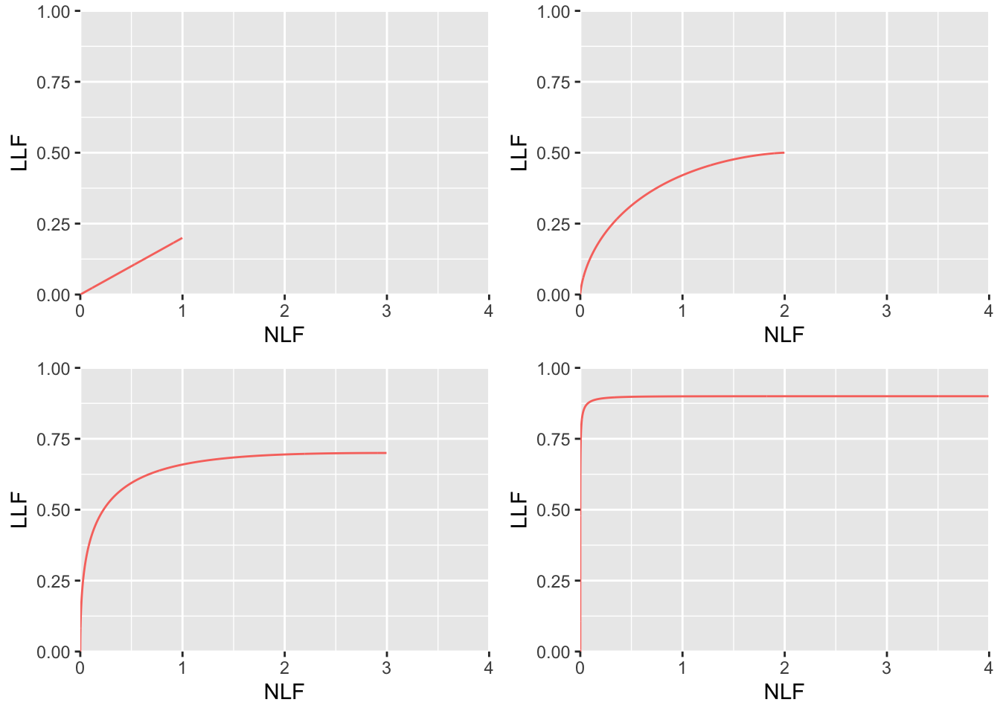

# FROC/wAFROC predictions of the RSM {#rsm-pred2}


## TBA How much finished {#rsm-pred2-how-much-finished}
97%
<!-- # lesDistr is needed because one of its elements could be zero -->
<!-- # e.g. c(0.6, 0.3, 0, 0.1) means there are no diseased cases -->
<!-- # in the dataset with 3 lesions; I am not quite sure about this  -->


## Introduction {#rsm-pred2-intro}

The preceding chapter described the radiological search model (RSM) for FROC data and the ROC curve and other implications of the RSM. This chapter describes the FROC, AFROC and wAFROC curve predictions of the RSM. Also discussed here are the slopes of these plots near the origin and the end-point, which brings out interesting properties not discussed in the 2017 print book. 


## The RSM-predicted FROC curve {#rsm-pred2-froc-curve}

From the property of the Poisson distribution, namely, its mean is the $\lambda$ parameter of the distribution, it follows that the expected average number of latent NLs per case is $\lambda$. One multiplies by $P \left ( Z > \zeta \mid Z \sim N(0,1) \right )$, i.e., $\Phi(-\zeta)$, to obtain the expected number of marked NLs per case, i.e., NLF:

\begin{equation}
\text{NLF} \left ( \zeta, \lambda \right ) = \lambda \Phi \left (-\zeta \right )
(\#eq:rsm-pred2-nlf)
\end{equation}


To calculate $\text{LLF}$ one separates diseased cases into groups, each with a fixed number of $L$ lesions per case, where $L$ varies from one to $L_{max}$. For each group the expected number of latent LLs per case divided by L must equal $\nu$, as $\nu$ is the probability that a lesion is found. One multiplies by $P \left ( Z > \zeta \mid Z \sim N(\mu,1) \right )$ i.e., $\Phi(\mu - \zeta)$, to obtain the fraction of lesions that are actually marked. Finally, one performs a weighted summation over the different groups with $f_L$  as the weighting factor. Therefore,

\begin{equation}
\left. 
\begin{aligned}
\text{LLF}\left ( \zeta, \mu, \nu \right ) =& \sum_{L=1}^{L_{max}} f_L \nu  \Phi \left ( \mu - \zeta \right )\\
=& \nu  \Phi \left ( \mu - \zeta \right )\\
\end{aligned}
\right \}
(\#eq:rsm-pred2-llf)
\end{equation}


Summarizing, the coordinates of the RSM-predicted operating point on the FROC curve for threshold $\zeta$ are given by Eqn. \@ref(eq:rsm-pred2-nlf) and Eqn. \@ref(eq:rsm-pred2-llf). The FROC curve starts at (0,0) and ends at $\left ( \lambda, \nu \right )$. The x-coordinate does not extend to arbitrarily large values and the y-coordinate does not approach unity (unless $\nu = 1$).  The constrained end-point property, demonstrated previously for the ROC curve, also applies to the FROC curve:

\begin{equation}
\left. 
\begin{aligned}
\text{NLF}_{\text{max}} =& \lambda \\
\text{LLF}_{\text{max}} =& \nu\\
\end{aligned}
\right \}
(\#eq:rsm-pred2-froc-end-point)
\end{equation}


### Slopes near origin and end-point

We abbreviate:


\begin{equation}
\left. 
\begin{aligned}
g =& \lambda \Phi\left ( -\zeta \right ) \\
h =& \nu \Phi\left (\mu -\zeta \right )
\end{aligned}
\right \}
(\#eq:rsm-pred2-froc-gh)
\end{equation}


Taking the derivatives of these functions with respect to $\zeta$ the slope of the FROC is given by:


\begin{equation}
\left. 
\begin{aligned}
\frac{dh}{dg} =& \frac{\nu}{\lambda}\frac{\phi \left ( \mu-\zeta \right )}{\phi\left ( -\zeta \right )} 
\end{aligned}
\right \} 
(\#eq:rsm-pred2-froc-dhdg)
\end{equation}


This expression can be simplified as follows:

\begin{equation}
\left. 
\begin{aligned}
\frac{dh}{dg} =& \frac{\nu}{\lambda}  \frac{\phi \left ( \mu-\zeta \right )}{\phi\left ( -\zeta \right )} \\ 
=& \frac{\nu}{\lambda}  \frac{\text{exp}\left ( \frac{-\left (\mu-\zeta  \right )^2}{2} \right )}{\text{exp}\left ( \frac{-\zeta^2}{2} \right )} \\
=& \frac{\nu}{\lambda} \text{exp}\left (-\frac{1}{2} \left( \mu^2 - 2\mu\zeta \right)  \right ) \\
\end{aligned}
\right \} 
(\#eq:rsm-pred2-froc-slope)
\end{equation}


This expression leads to the following conclusions:


>
* The slope of the AFROC near the end-point, corresponding to $\zeta = -\infty$, is zero provided $\mu \ne 0$, in which case the slope is $\frac{\nu}{\lambda}$. 
* The slope near the origin, corresponding to $\zeta = +\infty$, is $\infty$ except when $\mu = 0$ in which case the slope is $\frac{\nu}{\lambda}$. 
* For $\mu = 0$ the entire FROC curve is a straight line extending from the origin to $\frac{\nu}{\lambda}$. 


### Example plots

A few FROC plots are shown below which illustrate the statements just made in the previous section.


<div class="figure">

<p class="caption">(\#fig:rsm-pred2-froc-plots)RSM-predicted FROC curves. Top left: $\mu = 0.0001$, $\lambda = 1$ and $\nu = 0.2$. Top right: $\mu = 1$, $\lambda = 2$ and $\nu = 0.5$. Bottom left: $\mu = 2$, $\lambda = 3$ and $\nu = 0.7$. Bottom right: $\mu = 4$, $\lambda = 4$ and $\nu = 0.9$.</p>
</div>

## The RSM-predicted AFROC curve {#rsm-pred2-froc-afroc-curve}

The AFROC x-coordinate is the same as the ROC x-coordinate and Eqn. \@ref(eq:rsm-pred-fpf) applies. The AFROC y-coordinate is identical to the FROC y-coordinate and Eqn. \@ref(eq:rsm-pred2-llf) applies. Note that the expression is independent of the number of lesions in the dataset or their distribution (unlike the AFROC the weighted AFROC does depend on the lesion distribution). 


\begin{equation}
\left. 
\begin{aligned}
\text{FPF}\left (\zeta , \lambda\right ) =& 1 - \text{exp}\left ( -\lambda \Phi\left ( -\zeta \right )  \right )\\
\text{LLF}\left( \zeta, \mu, \nu \right) =& \nu  \Phi \left ( \mu - \zeta \right )
\end{aligned}
\right \}
(\#eq:rsm-pred2-afroc)
\end{equation}


The end-point of the AFROC are: 


\begin{equation}
\left. 
\begin{aligned}
\text{FPF}_{\text{max}} =& 1 - \text{exp} \left ( -\lambda \right )\\
\text{LLF}_{\text{max}} =& \nu 
\end{aligned}
\right \}
(\#eq:rsm-pred2-afroc-end-point)
\end{equation}


It too has the constrained end-point property. 


### Slopes near origin and end-point

We abbreviate:


\begin{equation}
\left. 
\begin{aligned}
g =& 1 - \text{exp}\left ( -\lambda \Phi\left ( -\zeta \right )  \right ) \\
h =& \nu  \Phi \left ( \mu - \zeta \right )
\end{aligned}
\right \}
(\#eq:rsm-pred2-afroc-gh)
\end{equation}


Taking the derivatives of these functions with respect to $\zeta$ the slope of the AFROC is given by:


\begin{equation}
\left. 
\begin{aligned}
\frac{dh}{dg} =& \frac{\nu \phi \left ( \mu-\zeta \right )}{\text{exp}\left( -\lambda \Phi\left(- \zeta \right)\left( \lambda\phi\left( -\zeta \right)  \right) \right)} 
\end{aligned}
\right \} 
(\#eq:rsm-pred2-afroc-slope)
\end{equation}


This expression can be simplified as follows:


\begin{equation}
\left. 
\begin{aligned}
\frac{dh}{dg} =& \frac{\left( \frac{\nu}{\lambda}  \frac{\phi \left ( \mu-\zeta \right )}{\phi\left ( -\zeta \right )} \right)}{\text{exp}\left ( -\lambda \Phi\left ( -\zeta \right )  \right )}\\ 
\frac{dh}{dg} =& \frac{\text{slope}_{\text{FROC}}}{1-\text{FPF}\left (\zeta , \lambda\right )}\\ 
\end{aligned}
\right \} 
(\#eq:rsm-pred2-afroc-slope3)
\end{equation}


Where $\text{slope}_{\text{FROC}}$ is the slope of the FROC, Eqn. \@ref(eq:rsm-pred2-froc-slope). Since $0 \le \text{FPF} \le \text{FPF}_{\text{max}}$ and $\text{FPF}$ increases as $\zeta$ decreases, the slope of the AFROC equals that of the FROC at the origin and subsequently increases over that of the FROC as the end-point is approached. 

This expression leads to the following conclusions:


>
* The slope of the AFROC near the end-point, corresponding to $\zeta = -\infty$, is zero except when $\mu \ne 0$ in which case the slope is $\frac{\nu}{\lambda \left( 1-\text{FPF}_{\text{max}} \right)}$. 
* The slope near the origin, corresponding to $\zeta = +\infty$, is $\infty$ except when $\mu = 0$ in which case the slope is $\frac{\nu}{\lambda}$. 
* For $\mu = 0$ the slope of the AFROC curve increases as the end-point is approached, i.e., the FROC curve is concave up.


### Examples


>
* Shown below are AFROC curves for the same parameter values used to demonstrate the FROC curves shown in Fig. \@ref(fig:rsm-pred2-froc-plots). 
* Note that each AFROC curve needs to be completed by a straight line extending from the end-point to (1,1). This line is inaccessible to the observer (except for the (1,1) point trivially obtained by cumulating all cases, including those with no marks) but is necessary to fully account for all decisions (an analogous situation was encountered in connection with the RSM predicted ROC curve). 
* Notice that the AFROC curve is concave-up for very small value of $\mu$, see top-left plot in Fig. \@ref(fig:rsm-pred2-afroc-plots). For technical reasons I have used a small non-zero value $\mu = 0.0001$ as $\mu = 0$ will generate an error message in the software.  
* Each plot is contained within the unit square which makes it easy to define the AUC as a figure of merit.
* As $\mu$ increases, the area under the AFROC (including that under the straight line extension) increases monotonically from 0 to 1. The reader should check that this is true regardless of the choices of the other parameters in the model. This is expected of a well-behaved area measure that can be used as a figure of merit. 


<div class="figure">

<p class="caption">(\#fig:rsm-pred2-afroc-plots)RSM-predicted AFROC curves for the same parameter values used in the earlier FROC plot. Top left: $\mu = 0.0001$, $\lambda = 1$ and $\nu = 0.2$. Top right: $\mu = 1$, $\lambda = 2$ and $\nu = 0.5$. Bottom left: $\mu = 2$, $\lambda = 3$ and $\nu = 0.7$. Bottom right: $\mu = 4$, $\lambda = 4$ and $\nu = 0.9$. As $\mu$ increases the curve approaches the top-left corner. Each curve includes an inaccessible dashed linear extension to (1,1) and each plot is contained within the unit square which makes it easy to define the AUC as a figure of merit.</p>
</div>


The reader should experiment with different values for the parameters to confirm that the following statements are true:

1.	The AFROC plot is independent of the number of lesions per case. This is not true for the wAFROC, as will shortly become clear, and for the ROC: the ROC ordinate increases with increasing numbers of lesions per case.

2.	From Eqn. \@ref(eq:rsm-pred2-froc-end-point) and \@ref(eq:rsm-pred-tpf) it follows that $\text{TPF}_{\text{max}} \geq \text{LLF}_{max}$  with the equality holding in the limit $\mu \rightarrow \infty$. 

The reason $\text{TPF}_{\text{max}} \geq \text{LLF}_{max}$ is because the ROC gives credit for incorrect localizations on diseased cases, while the AFROC does not. This is the well-known "right for wrong reason" argument [@bunch1977free], originally advanced in 1977, against usage of the ROC for localization tasks.

3.	As $\mu$ increases the AFROC curve more closely approaches the upper-left corner of the plot and the area under the AFROC curve approaches 1, which is the best possible performance: (a) $\text{FPF}_{\text{max}}$ decreases and (b) $\text{LLF}_{\text{max}}$ increases, meaning decreasing numbers of incorrect decisions on non-diseased and diseased cases, respectively. 
4.	For $\mu \to 0, \nu \to 0$ and $\lambda \to \infty$ the operating characteristic approaches the horizontal line extending from the origin to (1,0), which is the continuous section of the curve, followed by the vertical dashed line connecting (1,0) to (1,1) and AFROC-AUC approaches zero. In this limit, no lesion is localized and every case has at least one NL mark, which implies worst possible performance.
5.	For $\mu \to \infty$ the accessible portion of the operating characteristic approaches the vertical line connecting (0,0) to (0,1), the area under which is zero. The complete AFROC curve is obtained by connecting this point to (1,1) by the dashed line and in this limit the area under the complete ROC curve approaches 1. As with the ROC, omitting the area under the dashed portion of the curve will result in a severe underestimate of true performance. 
6.	As $\lambda \to 0$ decreases $\text{FPF}_{\text{max}} \to 0$ while $\text{LLF}_{\text{max}}$ stays constant, as the latter is independent of $\lambda$. 
7.	As $\nu$ increases $\text{FPF}_{\text{max}}$ stays constant while $\text{LLF}_{\text{max}} \to 1$. In this limit every lesion is found. AFROC-AUC approaches unity.


### Chance level performance on AFROC {#rsm-pred2-froc-afroc-chance}

There appears to be a misconception (I will not cite the offenders) that chance level performance on an AFROC corresponds to the positive diagonal of the plot, yielding AFROC-AUC of 0.5. In fact chance level performance corresponds to the horizontal line connecting the origin to (1,0) and a vertical dashed line connecting (1,0) to (1,1) corresponding to AFROC-AUC of zero.


### The reader who does not yield any marks {#rsm-pred2-no-marks}

Suppose the radiologist does not mark any case resulting in an empty data file. One possibility is that the radiologist did not interpret the cases and simply "whizzed" through them. Even though the radiologist is not performing the diagnostic task and the AFROC operating point is stuck at the origin one would be justified in connecting the straight-line extension which would yield AFROC-AUC = 0.5, which implies finite performance (any value greater than zero for AFROC-AUC implies some degree of expertise). This is because the observer is correct on every non-diseased case (any mark on such a case would be incorrect) and deserves credit for these decisions. 


## The RSM-predicted wAFROC curve{#rsm-pred2-wafroc-curve}

The wAFROC abscissa is identical to the ROC abscissa, i.e., Eqn. \@ref(eq:rsm-pred-fpf) applies.


The wAFROC ordinate is calculated using:


\begin{equation} 
\text{wLLF} \left ( \mu, \lambda, \nu, \overrightarrow{f_L}, \mathbf{W} \right ) = \Phi\left ( \mu - \zeta \right )\sum_{L=1}^{L_{max}} f_L \sum_{l_2=1}^{L} \text{W}_{Ll_2} \, \text{pmf}_{Bin}\left ( l_2, L, \nu \right )
(\#eq:rsm-pred2-wllf)
\end{equation}


* The Binomial probability mass function $\text{pmf}_{Bin}$ was defined in Eqn. \@ref(eq:rsm-binomial-pmf).

* $\overrightarrow{f_L}$ is the normalized histogram of the lesion distribution for the diseased cases. In the software it is denoted `lesDistr`. For example, the array `lesDistr = c(0.1, 0.4, 0.4, 0.1)`  defines a dataset in which 10 percent of the cases contain one lesion, 40 percent contain 2 lesions, 40 percent contain 3 lesions and 10 percent contain 4 lesions. 

* $L_{max}$ is the maximum number of lesions per case in the dataset. In the preceding example $L_{max} = 4$.

* $\mathbf{W}$ is the (lower triangular) square matrix with $L_{max}$ rows and columns containing the weights, where each row sums to unity, see example below (the unused matrix elements are set to $-\infty$). The relative lesion weights are denoted in the code `relWeights`. For example, `relWeights =  c(0.2, 0.3, 0.1, 0.5)` whose meaning is as follows:

    + On cases with one lesion the lesion weight is unity.
    + On cases with two lesions the relative weights are 0.2 and 0.3. Since these do not add up to unity, the actual weights are 0.4 and 0.6. 
    + On cases with three lesions the relative weights are 0.2, 0.3 and 0.1. The actual weights are 1/3, 1/2 and 1/6.
    + On cases with four lesions the relative weights are 0.2, 0.3, 0.1 and 0.5. The actual weights are 0.2, 0.3, 0.1 and 0.4.
    

* The function `UtilLesionWeightsMatrixLesDistr` calculates the matrix given `lesDistr` and `relWeights`. For example:


```r
lesDistr <- c(0.6, 0.2, 0.1, 0.1)
relWeights =  c(0.2, 0.3, 0.1, 0.4)
UtilLesionWeightsMatrixLesDistr(lesDistr, relWeights)[,-1]
```

```
##           [,1] [,2]      [,3] [,4]
## [1,] 1.0000000 -Inf      -Inf -Inf
## [2,] 0.4000000  0.6      -Inf -Inf
## [3,] 0.3333333  0.5 0.1666667 -Inf
## [4,] 0.2000000  0.3 0.1000000  0.4
```


* It is necessary to label the lesions properly so that the correct weights are used. This is done using the `lesionID` field in the Excel input file. For example, `lesionID = 3` for the one with relative weight 0.1. Since $\mathbf{W}$ is independent of cases, the lesion characteristics (which determine clinical outcome) of `lesionID = 1` on cases with one lesion or on cases with 4 lesions are assumed to be identical. In other words this example assumes that the lesions fall into one of 4 groups, with clinical outcomes as in the weights matrix $\mathbf{W}$. 


* $\text{pmf}_{Bin}\left ( l_2, L, \nu \right )$ is the probability mass function (pmf) of the binomial distribution with success probability $\nu$ and trial size $L$. $\text{W}_{Ll_2}$ is the weight of lesion $l_2$ in cases with $L$ lesions; for example $\text{W}_{42} = 0.3$. 


* Eqn. \@ref(eq:rsm-pred2-wllf) is implemented in `UtilAnalyticalAucsRSM`.


* To generate equal weights set `relWeights = 0` as in following code:


```r
lesDistr <- c(0.6, 0.2, 0.1, 0.1)
UtilLesionWeightsMatrixLesDistr(lesDistr, relWeights = 0)[,-1]
```

```
##           [,1]      [,2]      [,3] [,4]
## [1,] 1.0000000      -Inf      -Inf -Inf
## [2,] 0.5000000 0.5000000      -Inf -Inf
## [3,] 0.3333333 0.3333333 0.3333333 -Inf
## [4,] 0.2500000 0.2500000 0.2500000 0.25
```


### Examples


>
* Shown below are wAFROC curves for the same parameter values used to demonstrate the FROC curves shown in Fig. \@ref(fig:rsm-pred2-froc-plots). 
* Note that it is necessary to specify `lesDistr` when requesting a wAFROC plot. A dataset with a maximum of 4 lesions per diseased case is assumed, with `lesDistr <- c(0.6, 0.2, 0.1, 0.1)`.


<div class="figure">

<p class="caption">(\#fig:rsm-pred2-wafroc-plots)RSM-predicted wAFROC curves for the same parameter values used in the earlier AFROC plot. Top left: $\mu = 0.0001$, $\lambda = 1$ and $\nu = 0.2$. Top right: $\mu = 1$, $\lambda = 2$ and $\nu = 0.5$. Bottom left: $\mu = 2$, $\lambda = 3$ and $\nu = 0.7$. Bottom right: $\mu = 4$, $\lambda = 4$ and $\nu = 0.9$. As $\mu$ increases the curve approaches the top-left corner. Each curve includes an inaccessible dashed linear extension to (1,1) and each plot is contained within the unit square which makes it easy to define the AUC as a figure of merit. Each wAFROC curve is slightly above the corresponding AFROC curve.</p>
</div>

>
Comparison of the wAFROC plots in Fig. \@ref(fig:rsm-pred2-wafroc-plots) to those in Fig. \@ref(fig:rsm-pred2-afroc-plots), particularly the bottom-right panels, should convince the reader that the wAFROC curves are slightly above the corresponding AFROC plots. This is tested by the following code: 


```r
for (i in 1:4) {
  cat(i, all(plotArrwAfroc[[i]]$data$wLLF >= plotArrAfroc[[i]]$data$LLF), "\n")
}
```

```
## 1 FALSE 
## 2 TRUE 
## 3 TRUE 
## 4 TRUE
```


The `FALSE` value corresponds to $\mu = 0.001$ and the last one corresponds to $\mu = 4$. 


>
If one sets `relWeights = 0` thereby ensuring equal weights of all lesions, as in the following code, the wAFROC and AFROC wLLF values become identical.


```r
plotArrwAfrocZero <- array(list(), dim = c(length(lambdaArr)))
for (i in 1:length(lambdaArr)) {
  mu <- muArr[i]
  lambda <- lambdaArr[i]
  nu <- nuArr[i]
  ret1 <- PlotRsmOperatingCharacteristics(
    mu, lambda, nu,
    lesDistr = lesDistr,
    relWeights = 0,
    OpChType = "wAFROC",
    legendPosition  = "none"
  )
  plotArrwAfrocZero[[i]] <- ret1$wAFROCPlot
}
```


```r
for (i in 1:4) {
  cat(i, all(plotArrwAfrocZero[[i]]$data$wLLF <= plotArrAfroc[[i]]$data$LLF), "\n")
}
```

```
## 1 FALSE 
## 2 FALSE 
## 3 FALSE 
## 4 FALSE
```


```r
for (i in 1:4) {
  cat(i, all(plotArrwAfrocZero[[i]]$data$wLLF >= plotArrAfroc[[i]]$data$LLF), "\n")
}
```

```
## 1 FALSE 
## 2 FALSE 
## 3 FALSE 
## 4 FALSE
```


Both tests $\ge$ and $\le$ yield `FALSE` implying they are equal (testing for equality does not yield `TRUE` due to numerical issues).


## Discussion / Summary {#rsm-pred2-discussion-summary}
This chapter has described FROC, AFROC and wAFROC curves predicted by the radiological search model (RSM). All RSM curves share the constrained end-point property that makes them qualitatively different from predictions of all other ROC models. In my experience it is a property that most researchers in this field have difficulty understanding. There is too much history going back to the early 1940s of the ROC curve extending continuously from (0,0) to (1,1). 

I am not aware of any evidence that radiologists can move the operating point *continuously* in the range (0,0) to (1,1) in search tasks, so the existence of such an ROC is an assumption. Algorithmic observers that do not involve search can extend continuously to (1,1). An example is a diagnostic test that rates the results of a laboratory measurement, e.g., the A1C measure of blood glucose  for presence of a disease. If $A1C \ge 0.065$ the patient is diagnosed as diabetic. By moving the threshold from infinity to –infinity, and assuming a large population of patients, one can trace out the entire ROC curve from the origin to (1,1). *This is because every patient yields an A1C value.* Now imagine that some finite fraction of the test results are "lost in the mail"; then the ROC curve, calculated over all patients, would have the constrained end-point property, albeit due to an unreasonable cause.

The situation in medical imaging involving search tasks is more realistic. *Not every case yields a decision variable.* There is a reasonable cause for this – to render a decision variable sample the radiologist must find something suspicious to report, and if none is found, there is no decision variable to report. The ROC curve calculated over all patients would exhibit the constrained end-point property, even in the limit of an infinite number of patients. If calculated over only those patients that yielded at least one mark, the ROC curve would extend from (0,0) to (1,1) but then one would be ignoring all cases with no marks. For non-diseased cases these represent correct decisions and for diseased cases they represent incorrect decisions and ignoring them should raise concern regarding validity of the analysis.

Attention reverts in the next chapter to the ROC where we show that important aspects of the search mechanism are contained in the position of the end-point. 
