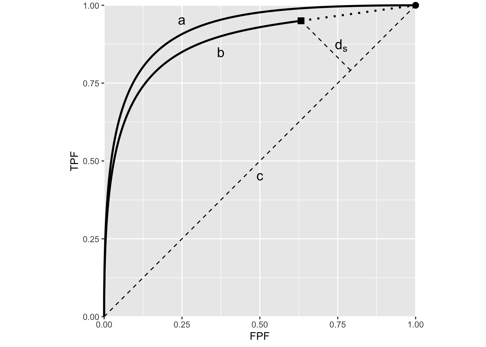

# Lesion localization and classification performances {#rsm-search-classification}


## How much finished {#rsm-search-classification-how-much-finished}

99%


## Introduction {#rsm-search-classification-intro}

The preceding two chapters described predictions of the radiological search model (RSM). This chapter describes two performance measures, namely *lesion-localization and lesion-classification performances*, that can be derived from the predicted ROC. These performances were introduced conceptually in Section \@ref(visual-search-search-classification) and this chapter deals with relating them to the RSM parameters.

Recall the the search process involves two stages: (1) finding suspicious regions and (2) correctly classifying each suspicious region as either a lesion (in which case the region is marked and rated) or a non-lesion (in which case the region is not marked). The first stage is the lesion-localization task while the second stage is the lesion-classification task. Performance in the lesion-localization task is measured by the ability to mark lesions while minimizing marking non-lesions. Performance in the classification task is the ability, having found a suspicious region, to correctly recognize it as a lesion (to be marked and rated) or a non-lesion (to be ignored). The aim of this chapter is to quantify these two abilities. 


## Quantifying lesion-localization performance {#rsm-search-classification-quantifying}

From Chapter \@ref(rsm-predictions) the coordinates of the RSM-predicted ROC end-point are given by:

\begin{equation}
\left. 
\begin{aligned}
&\text{FPF}_{\text{max}} = 1 - \text{exp}\left (\lambda \right ) \\
&\text{TPF}_{\text{max}} = 1 - \text{exp} \left ( - \lambda \right )\sum_{L=1}^{L_{max}}f_L \left ( 1 - \nu \right )^L
\end{aligned}
\right \}
(\#eq:rsm-search-classification-FPF-TPF-max)
\end{equation}


Qualitatively, lesion-localization performance is the ability to mark lesions while not marking non-lesions. To arrive at a quantitative definition consider the location of the ROC end-point. 

In Fig. \@ref(fig:rsm-search-classification-performance-from-roc-curve) curve (a) is a typical ROC curve predicted by models that do not account for lesion-localization, specifically the binormal model is considered here. The corresponding end-point is at (1,1), the filled circle, i.e., by adopting a sufficiently low reporting threshold the observer can continuously move the operating point to (1,1). The curve labeled (b) is a typical RSM-predicted ROC curve. The corresponding end-point, the filled square, is downwards and left shifted relative to (1,1). The chance diagonal is the straight line labeled (c). 

The specific parameter values used in the illustration are shown next:


```r
a <- 2; b <- 1 # binormal model
mu <- 2; lambda_i <- 2; nu_i <- 1 # rsm
lesDistr <- c(1) # one lesion per dis. case
```


```
## Warning: Using `size` aesthetic for lines was deprecated in ggplot2 3.4.0.
## ℹ Please use `linewidth` instead.
## This warning is displayed once every 8 hours.
## Call `lifecycle::last_lifecycle_warnings()` to see where this warning was
## generated.
```

<div class="figure">

<p class="caption">(\#fig:rsm-search-classification-performance-from-roc-curve)Relation of lesion-localization performance to the end-point of the ROC curve. Plot (a) is using the binormal model while plot (b) is using a RSM predicted curve. The chance diagonal is labeled c. The filled square is the end-point of the RSM predicted curve while the filled dot is the end-point of the binormal predicted curve. The distance of the filled square from the chance diagonal, labeled $d_S$, is a measure of lesion-localization performance.</p>
</div>


*The location of the end-point, in particular how far it is from (1,1), is a measure of lesion-localization performance.* Higher lesion-localization performance is characterized by the end-point moving upwards and to the left, in the limit to (0,1), corresponding to perfect lesion-localization performance. It is more convenient to use a distance measure as defined next:


**Definition** 

>
The perpendicular distance, $d_S$, from the end-point to the chance diagonal, plot (c), multiplied by $\sqrt{2}$, is the quantitative measure of lesion-localization performance denoted by $L_L$.  


Using [geometry](https://en.wikipedia.org/wiki/Distance_from_a_point_to_a_line#Line_defined_by_an_equation) and Eqn. \@ref(eq:rsm-search-classification-FPF-TPF-max), it follows that: 


\begin{equation} 
L_L=\sqrt{2}d_S=\text{TPF}_{\text{max}}-\text{FPF}_{\text{max}}
(\#eq:rsm-search-classification-perp-distance)
\end{equation}


Therefore, lesion-localization performance $L_L$ is given by:


\begin{equation} 
L_L=\exp\left ( -\lambda \right )\left (1-\sum_{L=1}^{L_{max}}f_L\left ( 1-\nu  \right )^L  \right )
(\#eq:rsm-search-classification-search-performance)
\end{equation}

Eqn. \@ref(eq:rsm-search-classification-search-performance) shows lesion-localization performance is the product of two terms: the probability $\left (1-\sum_{L=1}^{L_{max}}f_L\left ( 1-\nu  \right )^L  \right )$ of finding at least one lesion times the probability $\exp\left ( -\lambda \right )$ of not finding non-lesions. This puts into mathematical form the qualitative definition of lesion-localization performance as the ability to find lesions while avoiding finding non-lesions. 


Example: consider $\lambda = 0$ and $\nu = 1$. (In terms of intrinsic parameters this occurs when $\mu = \infty$.) The end-point is (0,1). The perpendicular distance from (0,1) to the chance diagonal is $\frac{1}{\sqrt{2}}$, which multiplied by $\sqrt{2}$ yields $L_L = 1$. The same value is obtained using Eqn. \@ref(eq:rsm-search-classification-search-performance). Since no NLs are found and all lesions are found, the observer never makes a mistake. One cannot improve over perfect performance and the observer does not need to use the z-sample information: he simply marks all suspicious regions found by the search mechanism regardless of their z-samples. 

Search performance ranges from zero to one: $0 \le L_L \le 1$. The lower limit is reached if $\lambda = \infty$ or $\nu = 0$. (In terms of intrinsic parameters this occurs when $\mu = 0$.)


## Quantifying lesion-classification performance {#rsm-search-classification-performance}

Lesion-classification performance $L_C$ measures the ability, having found a suspicious region, to correctly classify it as a lesion, i.e., mark the location of the lesion resulting in a LL event. It is distinct from *case-classification* performance, ROC AUC, which measures the ability to distinguish between diseased and non-diseased cases. In contrast *lesion-classification* performance is a measure of the ability to distinguish between diseased and non-diseased regions, i.e., between latent NLs and latent LLs. $L_C$ is determined by the $\mu$ parameter of the RSM.

**Definition**

>
$L_C$ is defined by the implied ROC-area of two unit variance normal distributions separated by $\mu$ (see [formula](https://dpc10ster.github.io/RJafrocRocBook/binormal-model.html#binormal-model-d-prime) for d' measure in RJafrocRocBook). 


\begin{equation}
L_C=\Phi\left ( \frac{\mu}{\sqrt{2}} \right )
(\#eq:rsm-search-classification-classification-performance)
\end{equation}


Since $\mu \ge 0$ it follows that $L_C$ ranges from 0.5 to 1: $0.5 \le L_C \le 1$. The lower limit occurs when $\mu = 0$ and the upper limit occurs when $\mu = \infty$.

## Discussion {#rsm-search-classification-discussion}

We have shown that the RSM parameters determine lesion-localization and lesion-classification performances. In the next chapter it will be shown that these parameters can be estimated from ROC/FROC data. Therefore the results of this chapter should be of interest to researchers in the area of computer aided detection -- CAD -- algorithm design, because they yield information about which stage -- lesion-localization or lesion-classification -- is limiting performance. If lesion-localization performance is low then the observer is having difficulty finding lesions while minimizing finding non-lesions ^[We repeat that a non-expert can trivally "find" all lesions by marking all regions in the image.]. In the CAD context, the *initial detection* stage needs to be further optimized. If lesion-classification performance is low the observer is finding lesions efficiently but is having difficulty correctly classifying the found lesions.  In the CAD context, the *candidate analysis* stage needs to be further optimized. Of course, for this to be realized one needs a method for estimating the RSM parameters. This is the subject of the next chapter.

