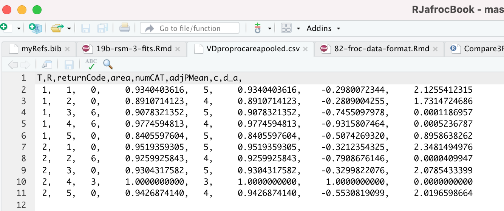

# Three proper ROC fits {#rsm-3-fits}


```{r setup, include=FALSE}
knitr::opts_chunk$set(echo = TRUE)
library(kableExtra)
library(seqinr)
library(RJafroc)
library(ggplot2)
library(gridExtra)
library(grid)
library(binom)
library(here)
library(foreach)
library(doRNG)
library(doParallel)
```


## TBA How much finished {#rsm-3-fits-how-much-finished}

99%


## TBA Introduction {#rsm-3-fits-intro}

A proper ROC curve is one whose slope decreases monotonically as the operating point moves up the curve, a consequence of which is that a proper ROC does not display an inappropriate chance line crossing followed by a sharp upward turn, i.e., a "hook", usually near the (1,1) upper right corner. 

There are three methods for fitting proper curves to ROC datasets: 

* The radiological search model (RSM) described in Chapter \@ref(rsm-fitting), 
* The PROPROC (proper ROC) model described in TBA Chapter 20. 
* The CBM (contaminated binormal model) described in TBA Chapter 20. 

This chapter compares these methods by fitting them to 14 multiple-treatment multiple-reader datasets described in Chapter \@ref(datasets). ^[Comparing the RSM to the binormal model would be inappropriate, as the latter does not predict proper ROCs.] 

The motivation for this work was a serendipitous finding [@chakraborty2011estimating] that PROPROC fitted ROC AUCs and RSM fitted ROC AUCs were identical for some datasets. This led to extending that work to include CBM and more datasets. 


## Application to datasets {#rsm-3-fits-applications}

Both RSM and CBM are implemented in `RJafroc`. `PROPROC` is implemented in Windows software OR DBM-MRMC 2.5 ^[Sept. 04, 2014; the version used in this chapter is no longer distributed.] that was available [here](https://perception.lab.uiowa.edu/software), last accessed 1/4/21.


The RSM, PROPROC and CBM algorithms were applied to datasets described in Chapter \@ref(datasets). 


```{r, echo = TRUE}
datasetNames <-  
  c("TONY", "VD", "FR", 
  "FED", "JT", "MAG", 
  "OPT", "PEN", "NICO",
  "RUS", "DOB1", "DOB2", 
  "DOB3", "FZR")
```


These are abbreviations for "TONY", "Van Dyke", "Franken", "Federica", "Thompson", "Magnus", "Lucy Warren", "Penedo", "Nico-CAD-ROC", "Ruschin", "Dobbins-1", "Dobbins-2", "Dobbins-3", "Federica Real Roc". These datasets are included with `RJafroc` and the corresponding objects are named `datasetXX`, where XX is an integer ranging from 1 to 14.


In the following we focus, for now, on just two ROC datasets (these have been widely used in the literature to illustrate ROC analysis methodology advances) namely the Van Dyke (VD) and the Franken (FR) datasets. Illustrative examples are shown for treatment 1 and reader 2 for the Van Dyke dataset and for treatment 2 and reader 3 for the Franken dataset. Plots for all treatment-reader combinations for these two datasets are in Appendix \@ref(rsm-3-fits-representative-plots-van-dyke) and Appendix \@ref(rsm-3-fits-representative-plots-franken).


```{r rsm-3-fits-code, echo=FALSE}
source(here("R/compare-3-fits/Compare3ProperRocFits.R"))
```


```{r rsm-3-fits-code-f2, echo=TRUE}
# VD dataset
ret <- Compare3ProperRocFits(datasetNames, which(datasetNames == "VD"))
resultsVD <- ret$allResults
plotsVD <- ret$allPlots

# FR dataset
ret <- Compare3ProperRocFits(datasetNames, which(datasetNames == "FR"))
resultsFR <- ret$allResults
plotsFR <- ret$allPlots
```


* The supporting code is in the function `Compare3ProperRocFits()` located at `R/compare-3-fits/Compare3ProperRocFits.R`. 
* The analyzed results file locations are shown in Section \@ref(rsm-3-fits-pre-analyzed-results).
* The fitted parameters are contained in `resultsVD` and `resultsFR; the composite plots (i.e., 3 overlaid plots corresponding to the three proper ROC fitting algorithms) for each treatment and reader, are contained in `plotsVD` and `plotsFR`. 


## Composite plots {#rsm-3-fits-composite-plots}

* The `plotArr` list contains plots for the two datasets. The Van Dyke plots are in `plotsVD` and the Franken in `plotsFR`. 
* The Van Dyke dataset contains $I \times J = 2 \times 5 = 10$ composite plots. 
* The Franken dataset contains $I \times J = 2 \times 4 = 8$ composite plots. 


The following code shows how to display the composite plot for the Van Dyke dataset for treatment 1 and reader 2, i.e., i = 1 and j = 2. 


```{r rsm-3-fits-plots-vd-12, fig.cap="Composite plots for Van Dyke dataset for treatment = 1, reader 2.", fig.show='hold', echo=TRUE}
plotsVD[[1,2]]
```


It contains 3 fitted curves:

* The RSM fitted curve is in black. 
* The PROPROC fitted curve is in red. 
* The CBM fitted curve is in blue. 


Three operating points from the binned data are shown as well as exact 95% confidence intervals for the lowest and uppermost operating points. 


All 10 composite plots for the Van Dyke dataset are shown in Appendix \@ref(rsm-3-fits-representative-plots-van-dyke).


The next example shows composite plots for the Franken dataset for treatment = 2 and reader = 3.


```{r rsm-3-fits-plots-fr-23, fig.cap="Composite plots for Franken dataset for treatment = 2, reader 3.", fig.show='hold', echo=FALSE}
plotsFR[[2,3]]
```


Note that the RSM end-point is almost at the upper right corner, implying lower lesion-localization performance.


All 10 composite plots for the Franken dataset are shown in Appendix \@ref(rsm-3-fits-representative-plots-franken).


## RSM parameters {#rsm-3-fits-rsm-parameters}

The parameters corresponding to the RSM plots for the Van Dyke dataset are accessed as shown next. 

* `resultsVD[[i,j]]$retRsm$mu` is the RSM $\mu$ parameter for the Van Dyke dataset for treatment i and reader j; 
* `resultsVD[[i,j]]$retRsm$lambda` is the RSM $\lambda$ parameter;  
* `resultsVD[[i,j]]$retRsm$nu` is the RSM $\nu$ parameter; 
* `resultsVD[[i,j]]$retRsm$zeta1` is the RSM $\zeta_1$ parameter; 


### RSM parameters Van Dyke dataset i = 1, j= 2

The following displays RSM parameters for the Van Dyke dataset, treatment 1 and reader 2:


```{r, echo=FALSE}
cat("RSM parameters, Van Dyke Dataset, i=1, j=2:",
"\nmu = ",        resultsVD[[1,2]]$retRsm$mu,
"\nlambda = ",   resultsVD[[1,2]]$retRsm$lambda,
"\nnu = ",       resultsVD[[1,2]]$retRsm$nu,
"\nzeta_1 = ",    as.numeric(resultsVD[[1,2]]$retRsm$zetas[1]),
"\nAUC = ",       resultsVD[[1,2]]$retRsm$AUC,
"\nsigma_AUC = ", as.numeric(resultsVD[[1,2]]$retRsm$StdAUC),
"\nNLLini = ",    resultsVD[[1,2]]$retRsm$NLLIni,
"\nNLLfin = ",    resultsVD[[1,2]]$retRsm$NLLFin)
```


The first four values are the fitted values for the RSM parameters $\mu$, $\lambda$, $\nu$ and $\zeta_1$. The next value is the AUC under the fitted RSM curve followed by its standard error. The last two values are the initial and final values of negative log-likelihood ^[The initial value is calculated using initial estimates of parameters and the final value is that resulting from the log-likelihood maximization procedure. Since in fact negative log-likelihood is being *minimized*, the final value is smaller than the initial value.].  

From the previous chapter the RSM parameters can be used to calculate lesion-localization and lesion-classification performances, namely $L_L$ and $L_C$ respectively. The following function calculates these values: 


```{r echo=TRUE}
LesionLocLesionCls <- function(mu, lambda, nu, lesDistr) {
  temp <- 0
  for (L in 1:length(lesDistr)) {
    temp <- temp + lesDistr[L] * (1 - nu)^L
  }
  L_L <- exp(-lambda) * (1 - temp)
  L_C <- pnorm(mu/sqrt(2))
  return(list(
    L_L = L_L,
    L_C = L_C
  ))
}
```


The function is used as follows:


```{r echo=TRUE}
mu <- resultsVD[[1,2]]$retRsm$mu
lambda <- resultsVD[[1,2]]$retRsm$lambda
nu <- resultsVD[[1,2]]$retRsm$nu
f <- which(datasetNames == "VD")
fileName <- datasetNames[f]
theData <- get(sprintf("dataset%02d", f)) # the datasets already exist as R objects
lesDistr <- UtilLesionDistrVector(theData) # RSM ROC fitting needs to know lesDistr

ret <- LesionLocLesionCls(mu, lambda, nu, lesDistr)
L_L <- ret$L_L
L_C <- ret$L_C
  
cat(sprintf("VD data i=1 j=2:  L_L = %7.3f, L_C = %7.3f", L_L, L_C), "\n")
```


### RSM parameters Franken dataset i = 2, j= 3


For the Franken dataset the values are accessed as `resultsFR[[i,j]]`.


Displayed next are RSM parameters for the Franken dataset, treatment 2 and reader 3:


```{r, echo=FALSE}
cat("RSM parameters, Franken dataset, i=2, j=3:",
"\nmu = ", resultsFR[[2,3]]$retRsm$mu,
"\nlambda = ", resultsFR[[2,3]]$retRsm$lambda,
"\nnu = ", resultsFR[[2,3]]$retRsm$nu,
"\nzeta_1 = ", as.numeric(resultsFR[[2,3]]$retRsm$zetas[1]),
"\nAUC = ", resultsFR[[2,3]]$retRsm$AUC,
"\nsigma_AUC = ", as.numeric(resultsFR[[2,3]]$retRsm$StdAUC),
"\nNLLini = ", resultsFR[[2,3]]$retRsm$NLLIni,
"\nNLLfin = ", resultsFR[[2,3]]$retRsm$NLLFin)
```


Shown next are the lesion-localization and lesion-classification performances for this dataset.


```{r echo=FALSE}
mu <- resultsFR[[2,3]]$retRsm$mu
lambda <- resultsFR[[2,3]]$retRsm$lambda
nu <- resultsFR[[2,3]]$retRsm$nu
f <- which(datasetNames == "FR")
fileName <- datasetNames[f]
theData <- get(sprintf("dataset%02d", f)) # the datasets already exist as R objects
lesDistr <- UtilLesionDistrVector(theData) # RSM ROC fitting needs to know lesDistr

ret <- LesionLocLesionCls(mu, lambda, nu, lesDistr)
L_L <- ret$L_L
L_C <- ret$L_C
  
cat(sprintf("FR data i=2, j=3:  L_L = %7.3f, L_C = %7.3f", L_L, L_C), "\n")
```


While the lesion-classification performances are similar for the two examples, the lesion-localization performances are different, with the Van Dyke dataset showing a greater value. This is evident from the location of the end-points in the two plots shown in Fig. \@ref(fig:rsm-3-fits-plots-vd-12) and Fig.  \@ref(fig:rsm-3-fits-plots-fr-23) (an end-point closer to the top-left corner implies greater lesion-localization performance).


## CBM parameters {#rsm-3-fits-cbm-parameters}

The parameters of the CBM plots are accessed as shown next. 

* `results[[i,j]]$retCbm$mu` is the CBM $\mu$ parameter for treatment i and reader j; 
* `results[[i,j]]$retCbm$alpha` is the CBM $\alpha$ parameter;   
* `as.numeric(results[[i,j]]$retCbm$zetas[1])` is the CBM $\zeta_1$ parameter, the threshold corresponding to the highest non-trivial operating point; 
* `results[[i,j]]$retCbm$AUC` is the CBM AUC; 
* `as.numeric(results[[i,j]]$retCbm$StdAUC)` is the standard deviation of the CBM AUC;
* `results[[i,j]]$retCbm$NLLIni` is the initial negative log-likelihood value;
* `results[[i,j]]$retCbm$NLLFin)` is the final negative log-likelihood value.

The next example displays CBM parameters and AUC etc. for the Van Dyke dataset, treatment 1 and reader 2:


```{r, echo=FALSE}
i <- 1; j <- 2
cat("CBM parameters, Van Dyke Dataset, i=1, j=2:",
"\nmu = ",         resultsVD[[i,j]]$retCbm$mu,
"\nalpha = ",      resultsVD[[i,j]]$retCbm$alpha,
"\nzeta_1 = ",     as.numeric(resultsVD[[i,j]]$retCbm$zetas[1]),
"\nAUC = ",        resultsVD[[i,j]]$retCbm$AUC,
"\nsigma_AUC = ",  as.numeric(resultsVD[[i,j]]$retCbm$StdAUC),
"\nNLLini = ",     resultsVD[[i,j]]$retCbm$NLLIni,
"\nNLLfin = ",     resultsVD[[i,j]]$retCbm$NLLFin)
```


The next example displays CBM parameters for the Franken dataset, treatment 2 and reader 3:


```{r, echo=FALSE}
cat("CBM parameters, Franken dataset, i=2, j=3:",
"\nmu = ",         resultsFR[[i,j]]$retCbm$mu,
"\nalpha = ",      resultsFR[[i,j]]$retCbm$alpha,
"\nzeta_1 = ",     as.numeric(resultsFR[[i,j]]$retCbm$zetas[1]),
"\nAUC = ",        resultsFR[[i,j]]$retCbm$AUC,
"\nsigma_AUC = ",  as.numeric(resultsFR[[i,j]]$retCbm$StdAUC),
"\nNLLini = ",     resultsFR[[i,j]]$retCbm$NLLIni,
"\nNLLfin = ",     resultsFR[[i,j]]$retCbm$NLLFin)
```


The first three values are the fitted values for the CBM parameters $\mu$, $\alpha$ and $\zeta_1$. The next value is the AUC under the fitted CBM curve followed by its standard error. The last two values are the initial and final values of negative log-likelihood.  


## PROPROC parameters {#rsm-3-fits-proproc-parameters}


For the VD dataet the `PROPROC` displayed parameters are accessed as follows: 


* `resultsVD[[i,j]]$c1` is the PROPROC $c$ parameter for treatment i and reader j; 
* `resultsVD[[i,j]]$da` is the PROPROC $d_a$ parameter;   
* `resultsVD[[i,j]]$aucProp` is the PROPROC AUC; 

Other statistics, such as standard error of AUC, are not provided by PROPROC software.

The next example displays PROPROC parameters for the Van Dyke dataset, treatment 1 and reader 2:


```{r, echo=FALSE}
cat("PROPROC parameters, Van Dyke Dataset, i=1, j=2:",
"\nc = ",     resultsVD[[1,2]]$c1,
"\nd_a = ",   resultsVD[[1,2]]$da,
"\nAUC = ",   resultsVD[[1,2]]$aucProp)
```


The values are identical to those listed for treatment 1 and reader 2 in Fig. \@ref(fig:rsm-3-fits-proproc-output-van-dyke). 

The next example displays PROPROC parameters for the Franken dataset, treatment 2 and reader 3:


```{r, echo=FALSE}
cat("PROPROC parameters, Franken dataset, i=2, j=3:",
"\nc = ", resultsVD[[2,3]]$c1,
"\nd_a = ", resultsVD[[2,3]]$da,
"\nAUC = ", resultsVD[[2,3]]$aucProp)
```


The next section provides an overview of the most salient findings from analyzing the datasets.


## Overview of findings {#rsm-3-fits-overview}

With 14 datasets the total number of individual modality-reader combinations is 236: in other words, there are 236 datasets to *each* of which the three fitting algorithms were applied. 

It is easy to be overwhelmed by the numbers so this section summarizes an important conclusion: **The three fitting algorithms are consistent with a single algorithm-independent AUC**.


If the AUCs of the three methods are identical the following relations hold with each slope $\text{m}_{PR}$ and $\text{m}_{CR}$ equal to unity: 


\begin{equation}
\left. 
\begin{aligned}
\text{AUC}_{\text{PRO}} =& \text{m}_{PR} \text{AUC}_{\text{PRO}}  \\
\text{AUC}_{\text{CBM}} =& \text{m}_{CR} \text{AUC}_{\text{PRO}}
\end{aligned}
\right \}
(\#eq:rsm-3-fits-slopes-equation1)
\end{equation}

The abbreviations are as follows: 

* PRO = PROPROC 
* PR = PROPROC vs. RSM 
* CR = CBM vs. RSM. 

For each dataset the plot of PROPROC AUC vs. RSM AUC should be linear with zero intercept and slope $\text{m}_{PR}$, and likewise for the plots of CBM AUC vs. RSM AUC. The reason for the *zero intercept* is that if the AUCs are identical one cannot have an offset (i.e., intercept) term.  


### Slopes {#rsm-3-fits-slopes}

* Denote PROPROC AUC for dataset $f$, where $f=1,2,...,14$, treatment $i$ and reader $j$ by $\text{AUC}^{\text{PRO}}_{fij}$. Likewise, the corresponding RSM and CBM values are denoted by $\text{AUC}^{\text{RSM}}_{fij}$ and $\text{AUC}^{\text{CBM}}_{fij}$, respectively. 

* For a given dataset the slope of the PROPROC values vs. the RSM values is denoted $\text{m}_{\text{PR},f}$. 
* The (grand) average over all datasets is denoted $\text{m}^{\text{PR}}_\bullet$. Likewise, the (grand) average of the CBM AUC vs. the RSM slopes is denoted $\text{m}^{\text{CR}}_\bullet$. 

An analysis was conducted to determine the average slopes and bootstrap confidence intervals. 

The code for calculating the average slopes is in `R/compare-3-fits/slopesConvVsRsm.R` and that for the bootstrap confidence intervals is in  `R/compare-3-fits/slopesAucsConvVsRsmCI.R`.   


```{r rsm-3-fits-confidence-intervals, echo=FALSE}
source(here("R/compare-3-fits/loadDataFile.R"))
source(here("R/compare-3-fits/slopesConvVsRsm.R"))
source(here("R/compare-3-fits/slopesAucsConvVsRsmCI.R"))
```


```{r rsm-3-fits-confidence-intervals2, cache=FALSE, echo=TRUE}
slopes <- slopesConvVsRsm(datasetNames)
slopeCI <- slopesAucsConvVsRsmCI(datasetNames)
```


The call to function `slopesConvVsRsm()` returns `slopes`, which contains, for each of 14 datasets, four `lists`: two plots and two slopes. For example:

* PRO vs. RSM: `slopes$p1[[2]]` is the plot of $\text{AUC}^{\text{PRO}}_{2 \bullet \bullet}$ vs. $\text{AUC}^{RSM}_{2 \bullet \bullet}$ for all treatments and readers in the Van Dyke dataset. The plot for dataset $f, f = 1, 2, ...14$ is accessed as `slopes$p1[[f]]` which yields the plot of $\text{AUC}^{\text{PRO}}_{f \bullet \bullet}$ vs. $\text{AUC}^{RSM}_{f \bullet \bullet}$.
* CBM vs. RSM: `slopes$p2[[2]]` is the plot of $\text{AUC}^{\text{CBM}}_{2 \bullet \bullet}$ vs. $\text{AUC}^{RSM}_{2 \bullet \bullet}$ for for all treatments and readers in the Van Dyke dataset. The plot for dataset $f$ is accessed as `slopes$p2[[f]]`.
* PRO vs. RSM: `slopes$m_pro_rsm` has two columns, each of length 14, the slopes $\text{m}_{PR,f}$ for the datasets (indexed by $f$) and the corresponding $R^2$ values, where $R^2$ is the fraction of variance explained by the zero-intercept straight line fit. The first column is `slopes$m_pro_rsm[[1]]` and the second column is `slopes$m_pro_rsm[[2]]`.
* CBM vs. RSM: `slopes$m_cbm_rsm` has two columns, each of length 14, the slopes $\text{m}_{CR,f}$ for the datasets and the corresponding $R^2$ values. The first column is `slopes$m_cbm_rsm[[1]]` and the second column is `slopes$m_cbm_rsm[[2]]`.


As an example, for the Van Dyke dataset, `slopes$p1[[2]]` which is shown in the left in Fig. \@ref(fig:rsm-3-fits-plots-2), is the plot of $\text{AUC}^{\text{PRO}}_{2 \bullet \bullet}$ vs. $\text{AUC}^{RSM}_{2 \bullet \bullet}$. Shown in the right is `slopes$p2[[2]]`, the plot of $\text{AUC}^{\text{CBM}}_{2 \bullet \bullet}$ vs. $\text{AUC}^{RSM}_{2 \bullet \bullet}$. Each plot has the zero-intercept linear fit superposed on the $2\times5 = 10$ data points; each data point represents a distinct modality-reader combination. 


```{r rsm-3-fits-plots-2, fig.cap="Van Dyke dataset: Left plot is PROPROC-AUC vs. RSM-AUC with the superposed zero-intercept linear fit. The number of data points is `nPts` = 10. Right plot is CBM-AUC vs. RSM-AUC.", fig.show='hold', echo=FALSE}
grid.arrange(slopes$p1[[2]], slopes$p2[[2]], ncol = 2)
```


The next plot shows corresponding plots for the Franken dataset in which there are  $2\times 4 = 8$ points in each plot.


```{r rsm-3-fits-plots-3, fig.cap="Similar to previous plot, for Franken dataset.", fig.show='hold', echo=FALSE}
grid.arrange(slopes$p1[[3]], slopes$p2[[3]], ncol = 2)
```


### Confidence intervals {#rsm-3-fits-confidence-intervals}


The call to `slopesAucsConvVsRsmCI` returns `slopeCI`, containing the results of the bootstrap analysis (the bullet symbols $\bullet$ denote grand averages over 14 datasets):

* `slopeCI$cislopeProRsm` 95-percent confidence interval for $\text{m}_{\text{PR} \bullet}$
* `slopeCI$cislopeCbmRsm` 95-percent confidence interval for $\text{m}_{\text{CR} \bullet}$
* `slopeCI$histSlopeProRsm` histogram of 200 bootstrap values of $\text{m}_{\text{PR} \bullet}$
* `slopeCI$histSlopeCbmRsm` histogram of 200 bootstrap values of $\text{m}_{\text{CR} \bullet}$
* `slopeCI$ciAvgAucRsm` confidence interval from 200 bootstrap values of $\text{AUC}^{\text{RSM}}_\bullet$
* `slopeCI$ciAvgAucPro` confidence interval for 200 bootstrap values of $\text{AUC}^{\text{PRO}}_\bullet$
* `slopeCI$ciAvgAucCbm` confidence interval for 200 bootstrap values of $\text{AUC}^{\text{CBM}}_\bullet$

As examples,


```{r, echo=FALSE}
df <- as.data.frame(slopeCI$cislopeProRsm)
df <- cbind(df, slopeCI$cislopeCbmRsm)
colnames(df) <- c("m-PR", "m-CR")
print(df)
```


The CI for $\text{m}_{\text{PR} \bullet}$ is slightly above unity, while that for $\text{m}_{\text{CR} \bullet}$ is slightly below. Shown next is the histogram plot for $\text{m}_{\text{PR} \bullet}$ (left plot) and $\text{m}_{\text{CR} \bullet}$ (right plot). Quantiles of these histograms were used to compute the previously cited confidence intervals. 


```{r rsm-3-fits-histo-slopes, fig.cap="Histograms of slope PROPROC AUC vs. RSM AUC (left) and slope CBM AUC vs. RSM AUC (right).", fig.show='hold', echo=FALSE}
p1 <- slopeCI$histSlopeProRsm
p2 <- slopeCI$histSlopeCbmRsm
gA <- ggplot2::ggplotGrob(p1)
gB <- ggplot2::ggplotGrob(p2)
grid.arrange(p1,p2, ncol=2, widths = c(1,1), 
             heights=unit(c(4), c("in")))
```


### Summary of slopes and confidence intervals {#rsm-3-fits-slopes-confidence-intervals-summary}

```{r rsm-3-fits-confidence-intervals3, cache=FALSE, echo=FALSE}
x <- cbind(slopes$m_pro_rsm, slopes$m_cbm_rsm)
x <- rbind(x, apply(x,2, mean))
x  <- round(x, digits = 4)
x <- rbind(x[1:14, ], rep("\n", 4), x[15:nrow(x), ])
z1 <- format(slopeCI$cislopeProRsm, digits = 4)
z2 <- format(slopeCI$cislopeCbmRsm, digits = 3)
x <- rbind(x, 
           c(paste0("(", z1[1], ", ", z1[2], ")"), # for seed = 1
             NA,
             paste0("(", z2[1], ", ", z2[2], ")"), # for seed = 1
             NA))
row.names(x) <- c(datasetNames, "\n", "AVG", "CI")
colnames(x) <- c("$\\text{m}_{PR}$", "$R^2_{PR}$", "$\\text{m}_{CR}$", "$R^2_{CR}$")
```


```{r rsm-3-fits-slopes-table1, echo=FALSE}
kbl(x, caption = "Summary of slopes and correlations for the two zero-intercept fits: PROPROC AUC vs. RSM AUC and CBM AUC vs. RSM AUC. The average of each slope equals unity to within 0.6 percent.", booktabs = TRUE, escape = FALSE) %>% kable_styling(latex_options = c("basic", "scale_down", "HOLD_position"), row_label_position = "c") 
```


In Table \@ref(tab:rsm-3-fits-slopes-table1) the second column, labeled $\text{m}_{PR}$, shows slopes of straight lines, zero-intercept to go through the origin, to PROPROC AUC vs. RSM AUC values, for each of the 14 datasets, as labeled in the fits column. The third column, labeled $R^2_{PR}$, lists the square of the correlation coefficient for each fit. The fourth and fifth columns list the corresponding values for the CBM AUC vs. RSM AUC fits. The second last row lists the grand averages (AVG) and the last row lists the 95 percent confidence intervals.


## Reason for equal AUCs / Summary {#rsm-3-fits-discussion-summary}

We find that all three proper ROC methods yield almost the same AUC. The reason is that the proper ROC is a consequence of using a decision variable that is equivalent (in the arbitrary monotonic increasing transformations sense, see below) to a likelihood ratio. Proper ROC fitting is discussed in [RJafrocRocBook](https://dpc10ster.github.io/RJafrocRocBook/proper-roc-models.html#proper-roc-models-likelihood-ratio-theorem1). The likelihood ratio $l(z)$ is defined as the ratio of the diseased pdf to the non-diseased pdf:

\begin{equation}	
l(z) \equiv \frac{\text{pdf}_D(z)}{\text{pdf}_N(z)}
(\#eq:rsm-3-fits-l-z)
\end{equation}


There is a theorem [@barrett2013foundations] that an observer who uses the likelihood ratio $l(z)$ or any monotone increasing transformation of it as the decision variable, has optimal performance, i.e., maximum ROC-AUC. To use the terminology of [@barrett2013foundations] any observer using the likelihood ratio as the decision variable is an ideal observer (Section 13.2.6 ibid). However, **different ideal observers must yield the same AUC as otherwise one observer would be "more ideal" than another**. Different models of fitting proper ROCs represent different approaches to modeling the decision variable and the likelihood ratio, but while the curves can have different shapes (the slope of the ROC curve at a given point equals the likelihood ratio calculated at that point) their AUCs must agree. This explains the empirical observation of this chapter that RSM, PROPROC and CBM all yield the same AUCs as summarized in Table \@ref(tab:rsm-3-fits-slopes-table1).


## Appendices {#rsm-3-fits-appendices}

### Location of PROPROC files {#rsm-3-fits-one-dataset-proproc}

For each dataset PROPROC parameters were obtained by running the Windows software with PROPROC selected as the curve-fitting method. The results are saved to files that end with `proprocnormareapooled.csv` ^[In accordance with R-package policies white-spaces in the original `PROPROC` output file names have been removed.] contained in "R/compare-3-fits/MRMCRuns/C/", where `C` denotes the name of the dataset (for example, for the Van Dyke dataset, `C` = "VD"). Examples are shown in the next two screen-shots.


```{r rsm-3-fits-mrmc-runs, out.width="300pt", fig.align = "center", echo=FALSE, fig.cap="Screen shot (1 of 2) of `R/compare-3-fits/MRMCRuns` showing the folders containing the results of PROPROC analysis on 14 datasets."}

``` 


```{r rsm-3-fits-mrmc-runs-vd, out.width="300pt", fig.align = "center", echo=FALSE, fig.cap="Screen shot (2 of 2) of `R/compare-3-fits/MRMCRuns/VD` showing files containing the results of PROPROC analysis for the Van Dyke dataset."}

``` 


The contents of `R/compare-3-fits/MRMCRuns/VD/VDproprocnormareapooled.csv` are shown next, see Fig. \@ref(fig:rsm-3-fits-proproc-output-van-dyke). ^[The `VD.lrc` file in this directory is the Van Dyke data formatted for input to OR DBM-MRMC 2.5.] The PROPROC parameters $c$ and $d_a$  are in the last two columns. The column names are `T` = treatment; `R` = reader; `return-code` = undocumented value, `area` = PROPROC AUC; `numCAT` = number of ROC bins; `adjPMean` = undocumented value; `c` =  $c$ and `d_a` =  $d_a$, are the PROPROC parameters defined in [@metz1999proper].


```{r rsm-3-fits-proproc-output-van-dyke, echo=FALSE,out.width="50%",out.height="20%",fig.cap="PROPROC output for the Van Dyke ROC data set. The first column is the treatment, the second is the reader, the fourth is the AUC and the last two columns are the c and $d_a$ parameters.",fig.show='hold',fig.align='center'}

``` 


### Location of pre-analyzed results {#rsm-3-fits-pre-analyzed-results}

The following screen shot shows the pre-analyzed files created by the function `Compare3ProperRocFits()` described below. Each file is named `allResultsC`, where `C` is the abbreviated name of the dataset (uppercase C denotes one or more uppercase characters; for example, `C` = `VD` denotes the Van Dyke dataset.).


```{r rsm-3-fits-all-results-rsm6, out.width="300pt", fig.align = "center", echo=FALSE, fig.cap="Screen shot of `R/compare-3-fits/RSM6` showing the results files created by  `Compare3ProperRocFits()`."}
knitr::include_graphics("images/compare-3-fits/RSM6.png")
``` 


### Plots for the Van Dyke dataset {#rsm-3-fits-representative-plots-van-dyke}

The following plots are arranged in pairs, with the left plot corresponding to treatment 1 and the right to treatment 2. 


```{r rsm-3-fits-plots-vd-1-1, fig.cap="Composite plots in both treatments for the Van Dyke dataset, reader 1.", fig.show='hold', echo=FALSE}
p1 <- plotsVD[[1,1]]
p2 <- plotsVD[[2,1]]
gA <- ggplotGrob(p1)
gB <- ggplotGrob(p2)
#grid::grid.newpage()
#grid::grid.draw(cbind(gA, gB))
# see R/learn/_grid.arrange.Rmd
grid.arrange(gA,gB, ncol=2, widths = c(1,1), 
             heights=unit(c(4), c("in")))
```


```{r rsm-3-fits-plots-vd-1-2, fig.cap="Composite plots in both treatments for the Van Dyke dataset, reader 2. For treatment 2 the RSM and PROPROC fits are indistinguishable.", fig.show='hold', echo=FALSE}
p1 <- plotsVD[[1,2]]
p2 <- plotsVD[[2,2]]
gA <- ggplotGrob(p1)
gB <- ggplotGrob(p2)
#grid::grid.newpage()
#grid::grid.draw(cbind(gA, gB))
# see R/learn/_grid.arrange.Rmd
grid.arrange(gA,gB, ncol=2, widths = c(1,1), 
             heights=unit(c(4), c("in")))
```


The RSM parameter values for the treatment 2 plot are: $\mu$ = `r resultsVD[[2,2]]$retRsm$mu`, $\lambda$ = `r resultsVD[[2,2]]$retRsm$lambda`, $\nu$ = `r resultsVD[[2,2]]$retRsm$nu`, $\zeta_1$ = `r resultsVD[[2,2]]$retRsm$zetas[1]`. The corresponding CBM values are $\mu$ = `r resultsVD[[2,2]]$retCbm$mu`, $\alpha$ = `r resultsVD[[2,2]]$retCbm$alpha`, $\zeta_1$ = `r resultsVD[[2,2]]$retCbm$zetas[1]`. The RSM and CBM $\mu$ parameters are close and likewise the RSM $\nu$ and CBM $\alpha$ parameters are close - this is because they have similar physical meanings, which is investigated later in this chapter TBA. [The CBM does not have a parameter analogous to the RSM $\lambda$ parameter.] 


```{r rsm-3-fits-plots-vd-1-3, fig.cap="Composite plots in both treatments for the Van Dyke dataset, reader 3.", fig.show='hold', echo=FALSE}
p1 <- plotsVD[[1,3]]
p2 <- plotsVD[[2,3]]
gA <- ggplotGrob(p1)
gB <- ggplotGrob(p2)
#grid::grid.newpage()
#grid::grid.draw(cbind(gA, gB))
# see R/learn/_grid.arrange.Rmd
grid.arrange(gA,gB, ncol=2, widths = c(1,1), 
             heights=unit(c(4), c("in")))
```


The RSM parameters for the treatment 1 plot are: $\mu$ = `r resultsVD[[1,3]]$retRsm$mu`, $\lambda$ = `r resultsVD[[1,3]]$retRsm$lambda`, $\nu$ = `r resultsVD[[1,3]]$retRsm$nu`, $\zeta_1$ = `r resultsVD[[1,3]]$retRsm$zetas[1]`. The corresponding CBM values are $\mu$ = `r resultsVD[[1,3]]$retCbm$mu`, $\alpha$ = `r resultsVD[[1,3]]$retCbm$alpha`, $\zeta_1$ = `r resultsVD[[1,3]]$retCbm$zetas[1]`. 


```{r rsm-3-fits-plots-vd-1-4, fig.cap="Composite plots in both treatments for the Van Dyke dataset, reader 4. For treatment 2 the 3 plots are indistinguishable and each one has AUC = 1. The degeneracy is due to all operating points being on the axes of the unit square.", fig.show='hold', echo=FALSE}
p1 <- plotsVD[[1,4]]
p2 <- plotsVD[[2,4]]
gA <- ggplotGrob(p1)
gB <- ggplotGrob(p2)
#grid::grid.newpage()
#grid::grid.draw(cbind(gA, gB))
# see R/learn/_grid.arrange.Rmd
grid.arrange(gA,gB, ncol=2, widths = c(1,1), 
             heights=unit(c(4), c("in")))
```


```{r rsm-3-fits-plots-vd-1-5, fig.cap="Composite plots in both treatments for the Van Dyke dataset, reader 5.", fig.show='hold', echo=FALSE}
p1 <- plotsVD[[1,5]]
p2 <- plotsVD[[2,5]]
gA <- ggplotGrob(p1)
gB <- ggplotGrob(p2)
#grid::grid.newpage()
#grid::grid.draw(cbind(gA, gB))
# see R/learn/_grid.arrange.Rmd
grid.arrange(gA,gB, ncol=2, widths = c(1,1), 
             heights=unit(c(4), c("in")))
```


### Plots for the Franken dataset {#rsm-3-fits-representative-plots-franken}

The following plots are arranged in pairs, with the left plot corresponding to treatment 1 and the right to treatment 2. These plots apply to the Franken dataset. 


```{r rsm-3-fits-plots-fr-1-1, fig.cap="Composite plots in both treatments for the Franken dataset, reader 1.", fig.show='hold', echo=FALSE}
p1 <- plotsFR[[1,1]]
p2 <- plotsFR[[2,1]]
gA <- ggplotGrob(p1)
gB <- ggplotGrob(p2)
#grid::grid.newpage()
#grid::grid.draw(cbind(gA, gB))
# see R/learn/_grid.arrange.Rmd
grid.arrange(gA,gB, ncol=2, widths = c(1,1), 
             heights=unit(c(4), c("in")))
```


```{r rsm-3-fits-plots-fr-1-2, fig.cap="Composite plots in both treatments for the Franken dataset, reader 2.", fig.show='hold', echo=FALSE}
p1 <- plotsFR[[1,2]]
p2 <- plotsFR[[2,2]]
gA <- ggplotGrob(p1)
gB <- ggplotGrob(p2)
#grid::grid.newpage()
#grid::grid.draw(cbind(gA, gB))
# see R/learn/_grid.arrange.Rmd
grid.arrange(gA,gB, ncol=2, widths = c(1,1), 
             heights=unit(c(4), c("in")))
```


```{r rsm-3-fits-plots-fr-1-3, fig.cap="Composite plots in both treatments for the Franken dataset, reader 3.", fig.show='hold', echo=FALSE}
p1 <- plotsFR[[1,3]]
p2 <- plotsFR[[2,3]]
gA <- ggplotGrob(p1)
gB <- ggplotGrob(p2)
#grid::grid.newpage()
#grid::grid.draw(cbind(gA, gB))
# see R/learn/_grid.arrange.Rmd
grid.arrange(gA,gB, ncol=2, widths = c(1,1), 
             heights=unit(c(4), c("in")))
```


```{r rsm-3-fits-plots-fr-1-4, fig.cap="Composite plots in both treatments for the Franken dataset, reader 4.", fig.show='hold', echo=FALSE}
p1 <- plotsFR[[1,4]]
p2 <- plotsFR[[2,4]]
gA <- ggplotGrob(p1)
gB <- ggplotGrob(p2)
#grid::grid.newpage()
#grid::grid.draw(cbind(gA, gB))
# see R/learn/_grid.arrange.Rmd
grid.arrange(gA,gB, ncol=2, widths = c(1,1), 
             heights=unit(c(4), c("in")))
```


