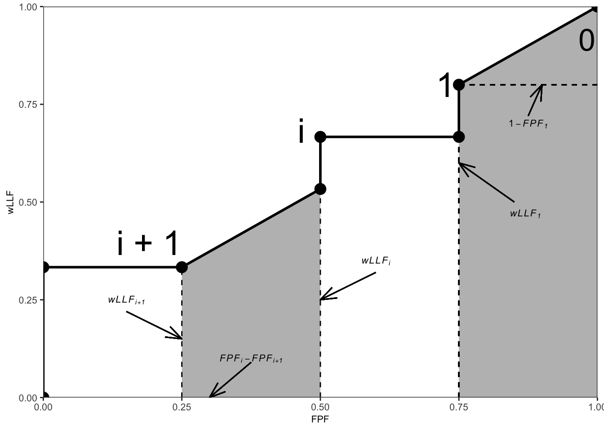
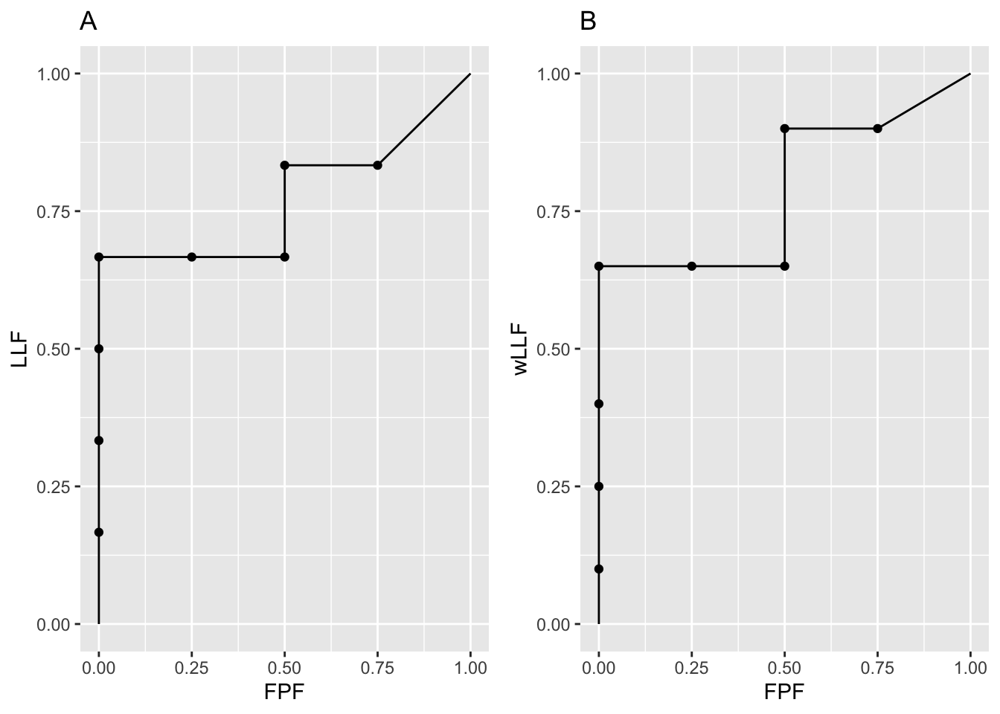

# Meanings of FROC figures of merit {#froc-meanings}

---
output:
  rmarkdown::pdf_document:
    fig_caption: yes        
    includes:  
      in_header: R/learn/my_header.tex
---


## TBA How much finished {#froc-meanings-how-much-finished}
50%


## Introduction {#froc-meanings-intro}

Chapter \@ref(froc-empirical) focused on empirical plots possible with FROC data, for example, the FROC, AFROC, wAFROC and inferred ROC plots. Expressions were given for computing *operating points* for each plot from z-samples. Because of the ambiguity in ordering the two values associated with each operating points (e.g., sensitivity-specificity pairs in ROC plots), operating points should not be used as figures of merit. Rather one should use *area measures* derived from operating characteristics. This chapter is devoted to a number of such measures for FROC data.

A generic empirical area under a plot is denoted $A_{\text{oc}}$, where the "oc" subscript denotes the applicable operating characteristic. For example, the area under the empirical wAFROC is denoted $A_{\text{wAFROC}}$. Calculating areas from operating points using planimetry or geometry is tedious at best. *Needed are formulas for calculating them directly from ratings.* In this sense this chapter is analogous to Chapter \@ref(empirical-auc) where it was shown that the area under the empirical ROC plot $A_{\text{ROC}}$ equaled the Wilcoxon statistic calculated directly from the ratings, i.e., the Bamber theorem [@RN2174].

I make a distinction between *empirical AUC under a plot*, i.e., an area measure, and a *FOM-statistic*, generically denoted $\theta$, that can be computed directly from the ratings. While any function of the ratings is a possible FOM-statistic, whether it is useful depends upon whether it can be related to the area under an operating characteristic. This chapter derives formulas for FOM-statistics $\theta_{\text{oc}}$, which yield the same values as the areas $A_{\text{oc}}$ under the corresponding empirical operating characteristics. The meanings of these FOM-statistics are discussed [@RN2484].

Here is the organization of the chapter.

-   Expressions for the empirical AFROC FOM-statistic $\theta_{\text{AFROC}}$ and the empirical weighted-AFROC FOM-statistic $\theta_{\text{wAFROC}}$ are presented and their limiting values for chance-level and perfect performances are explored.

-   Two important theorems are stated, whose proofs are in [TBA Online Appendix 14.A].

-   The first theorem proves the equality between the empirical wAFROC FOM-statistic $\theta_{\text{wAFROC}}$ and the area $A_{\text{wAFROC}}$ under the empirical wAFROC plot. [A similar equality applies to the empirical AFROC FOM-statistic $\theta_{\text{AFROC}}$ and the area $A_{\text{AFROC}}$ under the empirical AFROC plot.]

-   The second theorem derives an expression for the area under the straight-line extension of the wAFROC from the observed end-point to (1,1), and explains why it is essential to include this area.

-   A small simulated-dataset is used to illustrate how NL and LL ratings and lesion weights determine the wAFROC empirical plot.

-   It demonstrates that the wAFROC gives equal importance to all diseased cases, a desirable statistical characteristic.

-   Corresponding results, but ignoring the weights, show that the AFROC gives excessive importance to cases with more lesions.

-   A physical interpretation of the AUC or FOM-statistics is given. It shows explicitly how the ratings comparisons implied in FOM-statistic properly credit and penalize the observer for correct and incorrect decisions, respectively. The probabilistic meanings of the AFROC and wAFROC AUCs are given.

-   Detailed derivations of FOM-statistics, applicable to the areas under the empirical FROC plot, the AFROC1 and wAFROC1 plots are not given. Instead, the results for all plots are summarized in [TBA Online Appendix 14.C], which shows that the definitions "work", i.e., the FOM-statistics yield the correct areas as determined by numerical integration of the relevant curves.

## Empirical AFROC FOM-statistic {#froc-meanings-afroc}

$A_{\text{AFROC}}$ was defined in \@ref(froc-empirical-wAFROC) as the area under the empirical AFROC. The corresponding FOM-statistic $\theta_{\text{AFROC}}$ is defined as follows: one calculates the rating of the highest rated NL mark $\text{FP}_{k_1 1}$ on each non-diseased case $k_1 1$ (or $-\infty$ if the case has no NL marks) and compares it to each LL rating using the kernel function $\psi(x,y)$ defined in Eqn. \@ref(eq:empirical-auc-PsiFunction) ^[The kernel function comparison yields 1 if the LL rating is higher, 0.5 if the ratings are identical and zero otherwise.]. A summation is performed over all cases and all lesions.

The highest rating $\text{FP}_{k_1 1}$ on non-diseased case $k_1 1$ is defined as:

```{=tex}
\begin{equation}
\left.
\begin{aligned}
\text{FP}_{k_1 1}  =&  \max_{l_1} \left ( z_{k_1 1 l_1 1} \mid  l_1 \neq \varnothing \right )\\
\text{FP}_{k_1 1}  =&  -\infty\mid l_1 = \varnothing
\end{aligned}
\right \}
(\#eq:froc-meanings-R-k1)
\end{equation}
```

If the case has at least one latent NL mark, then $l_1 \neq \varnothing$, where $\varnothing$ is the null set, and the first definition applies. If the case has no marks, then $l_1 = \varnothing$, and the second definition applies. 

The following equation sums over all cases and lesions:

```{=tex}
\begin{equation}
\begin{aligned} 
\theta_{\text{AFROC}} =& \frac{1}{K_1 L_T}\sum_{k_1=1}^{K_1}\sum_{k_2=1}^{K_2}\sum_{l_2=1}^{L_{k_2}}\psi\left ( \text{FP}_{k_1 1}, z_{k_2 2 l_2 2} \right )\\
\end {aligned}
(\#eq:froc-meanings-theta-afroc)
\end{equation}
```

Since every lesion is assigned a rating, albeit negative infinity for an unmarked lesion, the null set conditioning is not needed. 

### Upper limit for AFROC FOM-statistic

The FOM-statistic $\theta_{\text{AFROC}}$ achieves its highest value, unity, if and only if every lesion is rated higher than any mark on non-diseased cases, for then the $\psi$ function always yields unity, and the summations yield :

```{=tex}
\begin{equation}
\left. 
\begin{aligned}
\theta_{\text{AFROC}}=& \frac{1}{K_1 \sum_{k_2=1}^{K_2}L_{k_2}}\sum_{k_1=1}^{K_1}\sum_{k_2=1}^{K_2}\sum_{l_2=1}^{L_{k_2}}  1 \\
= & \frac{1}{K_1 \sum_{k_2=1}^{K_2}L_{k_2}}\sum_{k_1=1}^{K_1}\sum_{k_2=1}^{K_2}L_{k_2} \\
= & \frac{1}{K_1}\sum_{k_1=1}^{K_1}1\\
= & 1
\end{aligned}
\right \}
(\#eq:froc-meanings-theta-afroc-unity)
\end{equation}
```

### Range of AFROC FOM-statistic

If, on the other hand, every lesion is rated lower than every mark on every non-diseased case, the $\psi$ function always yields zero, and the FOM-statistic is zero. Therefore,

```{=tex}
\begin{equation}
0 \leq \theta_{\text{AFROC}} \leq 1
(\#eq:froc-meanings-theta-afroc-limits)
\end{equation}
```
Eqn. \@ref(eq:froc-meanings-theta-afroc-limits) shows that $\theta_{\text{AFROC}}$ behaves like a probability but its range is *twice* that of $\theta_{\text{ROC}}$; recall that $0.5 \leq \theta_{\text{ROC}} \leq 1$ (assuming the observer has equal or better than random performance and the observer does not have the direction of the rating scale accidentally reversed). This has the consequence that treatment related differences between $\theta_{\text{AFROC}}$ (i.e., effect sizes) are larger relative to the corresponding ROC effect sizes (just as temperature differences in the Fahrenheit scale are larger than the same differences expressed in the Celsius scale). This has important implications for FROC sample size estimation, Chapter TBA.

Eqn. \@ref(eq:froc-meanings-theta-afroc-limits) is one reason why the "chance diagonal" of the AFROC, corresponding to AUC = 0.5, does not, in fact, reflect chance-level performance. An area under the AFROC equal to 0.5 is actually reasonable performance, being smack in the middle of the allowed range. An example of this was given in TBA §13.4.2.2 for the case of an expert radiologist who does not mark any cases.

## Empirical weighted-AFROC FOM-statistic {#froc-meanings-wafroc}

The empirical weighted-AFROC plot and lesion weights were defined in Section \@ref(froc-empirical-wAFROC). The empirical weighted-AFROC FOM-statistic [@RN1385] is defined by including the lesion weights $W_{k_2 l_2}$ inside the summations (but outside the kernel function):

```{=tex}
\begin{equation}
\begin{aligned} 
\theta_{\text{wAFROC}} =& \frac{1}{K_1 K_2}\sum_{k_1=1}^{K_1}\sum_{k_2=1}^{K_2}\sum_{l_2=1}^{L_{k_2}}W_{k_2 l_2}\psi\left ( \text{FP}_{k_1 1}, z_{k_2 2 l_2 2} \right )\\
\end {aligned}
(\#eq:froc-meanings-theta-wafroc)
\end{equation}
```
The weights obey the constraint:

```{=tex}
\begin{equation} 
\sum_{l_2=1}^{L_{k_2}}W_{k_2 l_2} = 1
(\#eq:froc-meanings-theta-constraint-weights)
\end{equation}
```
This ensures, as will be shown shortly, that each diseased case contributes equally to the FOM, regardless of how many lesions are in it. In the special case of one lesion per diseased case, $\theta_{\text{AFROC}}$ and $\theta_{\text{wAFROC}}$ are identical. For equally weighted lesions,

```{=tex}
\begin{equation} 
W_{k_2 l_2} = \frac{1}{L_{k_2}}
(\#eq:froc-meanings-theta-equal-weights)
\end{equation}
```
For example, for equally weighted lesions and a case with three lesions, each weight equals one-third (1/3) [^froc-meanings-foms-ocs-1].

[^froc-meanings-foms-ocs-1]: The `RJafroc` function `DfReadDataFile()` checks that the weights sum to unity to a precision of about 5 decimal places. The easy way to assign equal weights to all lesions on a diseased case is to set the corresponding `lesionWeights` field in the Excel file `Truth` worksheet to zeroes.

## Two Theorems {#froc-meanings-two-theorems}

The area $A_{\text{wAFROC}}$ under the wAFROC plot is obtained by summing the areas of individual trapezoids defined by drawing vertical lines from each pair of adjacent operating points to the x-axis. A sample plot is shown Fig. \@ref(fig:froc-meanings-theorems).


<div class="figure">

<p class="caption">(\#fig:froc-meanings-theorems)An example wAFROC plot; from left to right, the two shaded areas correspond to $A_i$ and  $A_0$, respectively, defined below.</p>
</div>

The operating point labeled $i$ has coordinates $\left ( \text{FPF}_i, \text{wLLF}_i \right )$ given by Eqn. \@ref(eq:froc-empirical-FPF) and Eqn. \@ref(eq:froc-empirical-wLLFr), respectively, reproduced here for convenience:

```{=tex}
\begin{equation}
FPF_i \equiv FPF \left ( \zeta_i \right ) = \frac{1}{K_1} \sum_{k_1=1}^{K_1} \mathbb{I} \left ( FP_{k_1 1} \geq \zeta_i\right )
(\#eq:froc-meanings-FPF)
\end{equation}
```


```{=tex}
\begin{equation}
\text{wLLF}_i \equiv \text{wLLF}_{\zeta_i} = \frac{1}{K_2}\sum_{k_2=1}^{K_2}\sum_{l_2=1}^{L_{k_2}}W_{k_2 l_2} \mathbb{I}\left ( z_{k_2 l_2 2} \geq \zeta_i \right )
(\#eq:froc-meanings-wLLFi)
\end{equation}
```


TBA Online Appendix 14.A proves the following theorems:

### Theorem 1  {#froc-meanings-two-theorems-1}

The area $A_{\text{wAFROC}}$ under the empirical wAFROC plot equals the weighted-AFROC FOM-statistic $\theta_{\text{wAFROC}}$ defined by Eqn. \@ref(eq:froc-meanings-theta-wafroc):

```{=tex}
\begin{equation}
\theta_{\text{wAFROC}} = A_{\text{wAFROC}}
(\#eq:froc-meanings-theorem1)
\end{equation}
```


This is the FROC counterpart of Bamber's Wilcoxon vs. empirical ROC area equivalence theorem [@RN2174], derived in Section \@ref(empirical-auc-wilcoxon-bamber-theorem).


### Theorem 2  {#froc-meanings-two-theorems-2}

The area $A_0$ under the straight-line extension of the wAFROC from the observed end-point $\left ( \text{FPF}_1, \text{wLLF}_1 \right )$ to (1,1) is given by:

```{=tex}
\begin{equation}
A_0 = \frac{\left ( 1 - \text{FPF}_1 \right )\left ( 1 + \text{wLLF}_1 \right )}{2}
(\#eq:froc-meanings-A0)
\end{equation}
```
According to Eqn. \@ref(eq:froc-meanings-A0), $A_0$ increases as $\text{FPF}_1$ decreases, i.e., as more non-diseased cases are *not marked* and as $\text{wLLF}_1$ increases, i.e., as more lesions, especially those with greater weights, *are marked*. Both observations are in keeping with the behavior of a valid FOM.

* Failure to include the area under the straight-line extension results in not counting the full positive contribution to the FOM of unmarked non-diseased cases and marked lesions. 
* Each unmarked non-diseased case represents a perfect decision.
* For a perfect observer whose operating characteristic is the vertical line from (0,0) to (0,1) followed by the horizontal line from (0,1) to (1,1), *the area under the straight-line extension comprises the entire AUC*. Excluding it would yield zero AUC for a perfect observer, which is obviously incorrect. 
* Stated equivalently, for the perfect observer $\text{FPF}_1 = 0$ and $\text{wLLF}_1 = 1$ and then, according to Eqn. \@ref(eq:froc-meanings-A0), the area under the straight line extension is $A_0 = 1$.


## Numerical illustrations {#froc-meanings-numerical-illustrations}

The wAFROC and AFROC concepts are perhaps best illustrated with a numerical simulation-based illustration with very few cases. 

Parameters of the simulation are $\mu = 2$, $\lambda = 1$, $\nu = 1$, $\zeta_1 = -1$ and $L_{max} = 2$. One simulates a dataset consisting of $K_1 = 4$ non-diseased cases and $K_2 = 4$ diseased cases. The first two diseased cases have one lesion each, and the remaining two have two lesions each.


```
#> AFROC AUC =  0.7708333
#> wAFROC AUC =  0.7875
```

Shown in Fig. \@ref(fig:plots-p1-p2) are the AFROC and wAFROC plots with operating points.

<div class="figure">

<p class="caption">(\#fig:plots-p1-p2)Left: AFROC plot; Right: corresponding wAFROC plot.</p>
</div>

The number of lesions for diseased cases is shown next. Notice that the first two cases have one lesion each and the next two have two lesions each.


```r
Lk2
#> [1] 1 1 2 2
```

The ratings are shown next.


```r
x1 <- as.data.frame(frocData$ratings$NL[1,1,,])
colnames(x1) <- c("location1", "location2")
x2 <- as.data.frame(frocData$ratings$LL[1,1,,])
colnames(x2) <- c("location1", "location2")
x1
#>    location1 location2
#> 1       -Inf      -Inf
#> 2  0.4874291      -Inf
#> 3  0.7383247 0.5757814
#> 4 -0.3053884      -Inf
#> 5  1.5117812      -Inf
#> 6       -Inf      -Inf
#> 7       -Inf      -Inf
#> 8       -Inf      -Inf
x2
#>    location1 location2
#> 1  0.8523430      -Inf
#> 2 -0.2146999      -Inf
#> 3  1.5884892      -Inf
#> 4  2.9438362   1.98381
```

* The length of the third dimension of the NL array is eight (4 non-diseased + 4 diseased cases). 
* The fifth sequential case corresponds to NLs on the first diseased case, etc.
* The first non-diseased case has no latent marks.
* The second non-diseased case has one latent mark rated 0.4874291.
* The third non-diseased case has two latent marks rated 0.7383247 and 0.5757814.
* The fourth non-diseased case has one latent mark rated -0.3053884.
* The first diseased case has one latent NL mark rated 1.5117812.
* The remaining diseased case have no latent NL marks.

## Summary tables of ratings
Table \@ref(tab:froc-meanings-table-non-diseased) shows the layout of mark-rating pairs on *non-diseased* cases, illustrating FP ratings, corresponding to the green circles in Fig. \@ref(fig:froc-meanings-linear-plot-afroc-wafroc). [UM denotes an unmarked location and blank cells denote unrealized z-samples.]

* Because non-diseased cases have no lesions, all z-samples listed in this table are for NLs. 
* The first column lists the case numbers. 
* The column labeled $k_t t l_s s$ lists the case-location indexing subscripts. 
* The column labeled $z_{k_t t l_s s}$ lists the corresponding z-samples, when realized, and otherwise the cells are blank. 
* The column labeled $FP_{k_t t}$ lists the FP rating for each non-diseased case, which is the highest of all realized z-samples on the case or $-\infty$ if none are realized.
* Column 5: the labels **A** - **H** correspond to the operating points shown in Fig. \@ref(fig:froc-meanings-linear-plot-afroc-wafroc) and Fig. \@ref(fig:froc-meanings-afroc-wafroc). 


<table>
<caption>(\#tab:froc-meanings-table-non-diseased)Layout of mark-rating  pairs on non-diseased cases; UM denotes an unmarked non-diseased case.</caption>
 <thead>
  <tr>
   <th style="text-align:left;">  </th>
   <th style="text-align:left;"> $k_t t l_s s$ </th>
   <th style="text-align:left;"> $z_{k_t t l_s s}$ </th>
   <th style="text-align:left;"> $FP_{k_t t}$ </th>
   <th style="text-align:left;"> $\text{Label}$ </th>
  </tr>
 </thead>
<tbody>
  <tr>
   <td style="text-align:left;">  </td>
   <td style="text-align:left;"> 1111 </td>
   <td style="text-align:left;">  </td>
   <td style="text-align:left;">  </td>
   <td style="text-align:left;">  </td>
  </tr>
  <tr>
   <td style="text-align:left;"> 1 </td>
   <td style="text-align:left;"> 1121 </td>
   <td style="text-align:left;">  </td>
   <td style="text-align:left;"> $-\infty$ </td>
   <td style="text-align:left;"> UM </td>
  </tr>
  <tr>
   <td style="text-align:left;">  </td>
   <td style="text-align:left;"> 2111 </td>
   <td style="text-align:left;"> 0.487 </td>
   <td style="text-align:left;">  </td>
   <td style="text-align:left;">  </td>
  </tr>
  <tr>
   <td style="text-align:left;"> 2 </td>
   <td style="text-align:left;"> 2121 </td>
   <td style="text-align:left;">  </td>
   <td style="text-align:left;"> 0.487 </td>
   <td style="text-align:left;"> F </td>
  </tr>
  <tr>
   <td style="text-align:left;">  </td>
   <td style="text-align:left;"> 3111 </td>
   <td style="text-align:left;"> 0.738 </td>
   <td style="text-align:left;">  </td>
   <td style="text-align:left;">  </td>
  </tr>
  <tr>
   <td style="text-align:left;"> 3 </td>
   <td style="text-align:left;"> 3121 </td>
   <td style="text-align:left;"> 0.576 </td>
   <td style="text-align:left;"> 0.738 </td>
   <td style="text-align:left;"> E </td>
  </tr>
  <tr>
   <td style="text-align:left;">  </td>
   <td style="text-align:left;"> 4111 </td>
   <td style="text-align:left;"> -0.305 </td>
   <td style="text-align:left;">  </td>
   <td style="text-align:left;">  </td>
  </tr>
  <tr>
   <td style="text-align:left;"> 4 </td>
   <td style="text-align:left;"> 4121 </td>
   <td style="text-align:left;">  </td>
   <td style="text-align:left;"> -0.305 </td>
   <td style="text-align:left;"> H </td>
  </tr>
</tbody>
</table>


Table \@ref(tab:froc-meanings-table-diseased) shows the layout of mark-rating pairs on *diseased* cases, illustrating LL ratings, corresponding to the red circles in Fig. \@ref(fig:froc-meanings-linear-plot-afroc-wafroc). [UM denotes an unmarked location and blank cells denote unrealized z-samples.]

* Because diseased cases can have NLs and LLs, both are shown in this table. 
* The first column lists the case numbers. 
* The second column lists the number of lesions present. 
* Columns 3 and 4 illustrate NL indexing and z-samples. 
* Columns 5 and 6 illustrate LL indexing and z-samples. 
* Column 7 lists the lesion weights. 
* Column 8: the labels **A** - **H** correspond to the operating points shown in Fig. \@ref(fig:froc-meanings-linear-plot-afroc-wafroc) and Fig. \@ref(fig:froc-meanings-afroc-wafroc). 


<table>
<caption>(\#tab:froc-meanings-table-diseased)Layout of mark-rating pairs on diseased cases; UM denotes an unmarked lesion.</caption>
 <thead>
  <tr>
   <th style="text-align:left;">  </th>
   <th style="text-align:left;"> $L_{k_2}$ </th>
   <th style="text-align:left;"> $k_t t l_s s$ </th>
   <th style="text-align:left;"> $z_{k_t t l_s s}$ </th>
   <th style="text-align:left;"> $k_t t l_s s$ </th>
   <th style="text-align:left;"> $z_{k_t t l_s s}$ </th>
   <th style="text-align:left;"> $\text{weights}$ </th>
   <th style="text-align:left;"> $\text{Label}$ </th>
  </tr>
 </thead>
<tbody>
  <tr>
   <td style="text-align:left;">  </td>
   <td style="text-align:left;">  </td>
   <td style="text-align:left;"> 1211 </td>
   <td style="text-align:left;"> 1.512 </td>
   <td style="text-align:left;"> 1212 </td>
   <td style="text-align:left;"> 0.852 </td>
   <td style="text-align:left;"> 1 </td>
   <td style="text-align:left;"> D </td>
  </tr>
  <tr>
   <td style="text-align:left;"> 1 </td>
   <td style="text-align:left;"> 1 </td>
   <td style="text-align:left;"> 1221 </td>
   <td style="text-align:left;">  </td>
   <td style="text-align:left;"> 1222 </td>
   <td style="text-align:left;">  </td>
   <td style="text-align:left;">  </td>
   <td style="text-align:left;">  </td>
  </tr>
  <tr>
   <td style="text-align:left;">  </td>
   <td style="text-align:left;">  </td>
   <td style="text-align:left;"> 2211 </td>
   <td style="text-align:left;">  </td>
   <td style="text-align:left;"> 2212 </td>
   <td style="text-align:left;"> -0.215 </td>
   <td style="text-align:left;"> 1 </td>
   <td style="text-align:left;"> G </td>
  </tr>
  <tr>
   <td style="text-align:left;"> 2 </td>
   <td style="text-align:left;"> 1 </td>
   <td style="text-align:left;"> 2221 </td>
   <td style="text-align:left;">  </td>
   <td style="text-align:left;"> 2222 </td>
   <td style="text-align:left;">  </td>
   <td style="text-align:left;">  </td>
   <td style="text-align:left;">  </td>
  </tr>
  <tr>
   <td style="text-align:left;">  </td>
   <td style="text-align:left;">  </td>
   <td style="text-align:left;"> 3211 </td>
   <td style="text-align:left;">  </td>
   <td style="text-align:left;"> 3212 </td>
   <td style="text-align:left;"> 1.588 </td>
   <td style="text-align:left;"> 0.6 </td>
   <td style="text-align:left;"> C </td>
  </tr>
  <tr>
   <td style="text-align:left;"> 3 </td>
   <td style="text-align:left;"> 2 </td>
   <td style="text-align:left;"> 3221 </td>
   <td style="text-align:left;">  </td>
   <td style="text-align:left;"> 3222 </td>
   <td style="text-align:left;">  </td>
   <td style="text-align:left;"> 0.4 </td>
   <td style="text-align:left;"> UM </td>
  </tr>
  <tr>
   <td style="text-align:left;">  </td>
   <td style="text-align:left;">  </td>
   <td style="text-align:left;"> 4211 </td>
   <td style="text-align:left;">  </td>
   <td style="text-align:left;"> 4212 </td>
   <td style="text-align:left;"> 2.944 </td>
   <td style="text-align:left;"> 0.4 </td>
   <td style="text-align:left;"> A </td>
  </tr>
  <tr>
   <td style="text-align:left;"> 4 </td>
   <td style="text-align:left;"> 2 </td>
   <td style="text-align:left;"> 4221 </td>
   <td style="text-align:left;">  </td>
   <td style="text-align:left;"> 4222 </td>
   <td style="text-align:left;"> 1.984 </td>
   <td style="text-align:left;"> 0.6 </td>
   <td style="text-align:left;"> B </td>
  </tr>
</tbody>
</table>

## AFROC plot from first principles {#froc-meanings-AFROC-plot-first-principles}

The following example is based on the same data involving 8 cases that were used to generate Table \@ref(tab:froc-meanings-table-non-diseased) and Table \@ref(tab:froc-meanings-table-diseased). It involves use of a linear or "one-dimensional" depiction of the ratings described next.

In Fig. \@ref(fig:froc-meanings-linear-plot-afroc-wafroc), plot A, FPs and LLs, represented by green and red circles, respectively, are shown ordered, from left to right, with higher z-samples to the right, henceforth referred to as a *linear plot*. Each circle is labeled using the $k_t t l_s s$ notation. For example, the right-most red circle corresponds to the LL z-sample originating from the first lesion in the fourth diseased case, i.e., $z_{4212}$. Consistent with the three unique values in the fourth column of Table \@ref(tab:froc-meanings-table-non-diseased), there are three green circles (FPs) [^froc-meanings-foms-ocs-2]. Likewise, consistent with the five unique values in the sixth column of Table \@ref(tab:froc-meanings-table-diseased), there are five red circles (LLs) [^froc-meanings-foms-ocs-3].

[^froc-meanings-foms-ocs-2]: Not counting $FP_{11}$, which occurs at $z = -\infty$, representing the first non-diseased case with no marks.

[^froc-meanings-foms-ocs-3]: Not counting $z_{3222} = -\infty$ representing the unmarked second lesion on the third diseased case.


<div class="figure">

<p class="caption">(\#fig:froc-meanings-linear-plot-afroc-wafroc)Plot A (illustrating generation of the AFROC): a one-dimensional depiction of the data in Table \@ref(tab:froc-meanings-table-non-diseased) and Table \@ref(tab:froc-meanings-table-diseased), showing z-samples used for plotting the AFROC; the red circles correspond to lesion localizations (LLs) and the green to false positives (FPs). Plot B (illustrating generation of the wAFROC): Data in same tables but this time including the weights, for plotting the weighted-AFROC plot; the sizes of the red circles code the lesions weights; the weights are shown below each z-sample.</p>
</div>

Starting from $\infty$, moving a virtual threshold continuously to the left generates the AFROC plot, see plot A in Fig. \@ref(fig:froc-meanings-linear-plot-afroc-wafroc). As each FP is crossed, the operating point moves to the right by:

$$\frac{1}{K_1} = 0.025$$

As each LL is crossed, the operating point moves up by:

$$\sum_{k_2=1}^{K_2}L_{k_2}=\frac{1}{6}$$

Since it has one lesion, crossing the z-sample for the first case would result in an upward movement of 1/6, and likewise for the second case. Since the third case contains two lesions, crossing the corresponding z-samples would result in a net upward movement of the operating point by 1/3. *This behavior shows explicitly that the non-weighted method gives greater importance to diseased cases with more lesions, i.e., such case make a greater contribution to AUC.* The jumps from lesions in the same case need not be contiguous -- they could be distributed, with intervening jumps from lesions on other cases, but eventually the jumps will occur and contribute to the net upward movement. As an example, the jumps due to the two lesions on the fourth diseased case are contiguous: see points A and B, in Fig. \@ref(fig:froc-meanings-linear-plot-afroc-wafroc). However, the jumps due to the two lesions on the third diseased case are not contiguous: the first lesion gives the point C, but the unmarked lesion on this case, indicated by "UM" in Table \@ref(tab:froc-meanings-table-diseased), eventually contributes when the operating point moves diagonally from point H to (1,1).


<div class="figure">

<p class="caption">(\#fig:froc-meanings-afroc-wafroc)Plot A: The empirical AFROC plot for the data shown in Table \@ref(tab:froc-meanings-table-non-diseased) and Table \@ref(tab:froc-meanings-table-diseased). The labels correspond to the last columns of the tables. The corresponding one-dimensional depiction is plot A in Fig. \@ref(fig:froc-meanings-linear-plot-afroc-wafroc). The area under the empirical plot is 0.7708. Plot B: The empirical weighted-AFROC (wAFROC) plot for the data shown in Table \@ref(tab:froc-meanings-table-non-diseased) and Table \@ref(tab:froc-meanings-table-diseased). The corresponding one-dimensional plot is plot B in Fig. \@ref(fig:froc-meanings-linear-plot-afroc-wafroc). The area under the wAFROC is 0.7875. </p>
</div>

## wAFROC plot from first principles {#froc-meanings-wAFROC-plot-first-principles}

Plot B in Fig. \@ref(fig:froc-meanings-linear-plot-afroc-wafroc), which is the wAFROC analog of plot A in the same figure, is a one-dimensional depiction of the data in Table \@ref(tab:froc-meanings-table-non-diseased) and Table \@ref(tab:froc-meanings-table-diseased), but this time the lesion weights, shown in Table \@ref(tab:froc-meanings-table-diseased), are incorporated, as indicated by varying the *size* of each red circle (in Fig. \@ref(fig:froc-meanings-linear-plot-afroc-wafroc) plot A, all red circles were of the same size). In addition, each lesion is labeled with its rating and weight. 

Moving a virtual threshold continuously to the left generates the wAFROC plot, Fig. \@ref(fig:froc-meanings-afroc-wafroc) plot B. The movement of the operating point in response to crossing FPs is the same as before. However, as each LL is crossed the operating point moves up by an amount that depends on the lesion weight:

$$\frac{W_{k_2 l_2}}{K_2} = \frac{W_{k_2 l_2}}{4}$$

Since the first two diseased cases have one lesion each (i.e., unit weights), crossing the corresponding z-samples results in upward jumps of 0.25, Fig. \@ref(fig:froc-meanings-afroc-wafroc) plot B -- compare the jumps C to D and from F to G. According to the weights in Fig. 14.4, crossing the z-sample of the first lesion in the third diseased case, results in an upward jump of 0.6/4. That from the second lesion in the same case results in an upward jump of 0.4/4, for a net upward jump of the third case of 0.25, the same as for each of the first two diseased cases. Likewise crossing the z-samples of the two lesions in the 4th disease case results in upward jump of 0.4/4 = 0.1 (compare the jump from O to A), for the 1st lesion and 0.6/4 = 0.15 (compare the jump from B to C), for the 2nd lesion, for a net upward jump of 1/4, which is the same as for each of the first three diseased cases. *This shows explicitly that the weighting method gives each diseased case the same importance, regardless of the number of lesions in it, a property not shared by the area under the AFROC.*


## Physical interpretations {#froc-meanings-physical-interpretions}

From the preceding sections, it is seen that the AFROC-based trapezoidal plots consist of upward and rightward jumps, starting from the origin (0,0) and ending at (1,1). This is true regardless of whether the z-samples are binned or not: i.e., at the "microscopic" level the jumps always exist. Each upward jump is associated with a LL rating exceeding a virtual threshold. Each rightward jump is associated with a FP rating exceeding the threshold. Upward jumps tend to increase the area under the AFROC-based plots and rightward jumps tend to decrease it. This makes physical sense in terms of correct decisions being rewarded and incorrect ones being penalized, and can be seen from two extreme-case examples. If there are only upward jumps, then the trapezoidal plot rises from the origin to (0,1), where all lesions are correctly localized without any generating FPs and performance is perfect -- the straight-line extension to (1,1) ensures that the net area is unity. If there are only horizontal jumps, that takes the operating point from the origin to (1,0), where none of the lesions are localized and every non-diseased image has at least one NL mark, representing worst possible performance. Here, despite the straight line extension to (1,1), the net area is zero.

### Physical interpretation of area under AFROC

The area under the AFROC has the following physical interpretation: it is the fraction of LL vs. FP z-sample comparisons where the LL sample is equal (counting as half a comparison) or greater (counting as a full comparison) than the FP z-sample. From Tables 1 and 2, there are four FPs and six LLs for 24 possible comparisons. Inspection of the tables reveals that there are 4 x 4 = 16 comparisons contributing ones, two comparisons (from the 2nd diseased case) contributing ones, and one comparison (from the 2nd lesion on the 3rd diseased case) contributing 0.5, which sum to 18.5. Dividing by 24 yields 18.5/24 = 0.7708, the empirical TBA AFROC-AUC, §14.5.1. In probabilistic terms:

*The area under the AFROC is the probability that a lesion is rated higher than any mark on a non-diseased case.*

### Physical interpretation of area under wAFROC

The area under the wAFROC has the following physical interpretation: it is the lesion-weight adjusted fraction of diseased cases vs. non-diseased case comparisons where LL z-samples are equal (counting as half a comparison times the weight of the lesion in question) or greater (counting as a full comparison times the weight of the lesion) than FP z-samples. Note that there are still 24 LL vs. FP comparisons but the counting proceeds differently. The fourth diseased case contributes 0.4 x 4 + 0.6 x 4, i.e., 4 (compared to 8 in the preceding example). The third diseased case contributes 0.6 x 4 + 0.4 x 0.5, i.e., 2.6 (compared to 4.5 in the preceding example). The second diseased case contributes 1 x 2 = 2 (compared to 2 in the preceding example), and the first diseased case contributes 1 x 4 = 4 (compared to 4 in the preceding example). Summing these values and dividing by 16 (the total number of diseased cases vs. non-diseased cases comparisons) one gets 12.6/16 = 0.7875, which is the area under the wAFROC, §14.5.1. In probabilistic terms:

*The area under the weighted-AFROC is the lesion-weight adjusted probability that a lesion is rated higher than any mark on a non-diseased case.*

## Discussion {#froc-meanings-Discussion}

TBA
TODOLAST

The primary aim of this chapter was to develop expressions for FOMs (i.e., functions of ratings) and show their equivalences to the empirical AUCs under corresponding operating characteristics. Unlike the ROC, the AFROC and wAFROC figures of merit are represented by quasi-Wilcoxon like constructs, not the well-known Wilcoxon statistic5.

I am aware from users of my software that their manuscript submissions have sometimes been held up with the critique that the meaning of the AFROC FOM-statistic is "not intuitively clear"6 TBA. Any critique based on intuitive clarity or lack thereof suffers from a fundamental flaw: it is un-falsifiable. What is "intuitively not clear" to one could be "intuitively very clear" to another, and there is no way of testing either viewpoint. Un-falsifiable claims have no place in science.

An example was given in a previous chapter. This is one reason I have tried to make the meaning clear, perhaps at the risk of making it painfully clear. Clinical interpretations do not always fit into convenient easy to analyze paradigms. Not understanding something is not a reason for preferring a simpler method. Use of the simpler ROC paradigm to analyze location specific tasks results in loss of statistical power and sacrifices better understanding of what is limiting performance. It is unethical to analyze a study with a method with lower statistical power when one with greater power is available7-9. The title of the paper by Halpern et al is "The continuing unethical conduct of under-powered clinical trials". The AFROC FOM-statistic was proposed in 1989 and it has been used, at the time of writing, in over 107 publications .

The subject material of this chapter is not that difficult. However, it does require the researcher to be receptive an unbiased. Dirac addressed an analogous then-existing concern about quantum mechanics, namely it did not provide a satisfying "picture" of what is going on, as did classical mechanics . To paraphrase him, the purpose of science (quantum physics in his case) is not to provide satisfying pictures but to explain data. FROC data is inherently more complex than the ROC paradigm and one should not expect a simple FOM-statistic. The detailed explanations given in this chapter should allow one to understand the wAFROC and AFROC FOMs.

A misconception regarding the wAFROC FOM-statistic is that the weighting may sacrifice statistical power and render the method equivalent to ROC analysis in terms of statistical power. Analysis of clinical datasets and simulation studies suggests that this is not the case; loss of power is minimal. As noted earlier, the highest rating carries more information than a randomly selected rating.

Bamber's equivalence theorem led to much progress in non-parametric analysis of ROC data. The proofs of the equivalences between the areas under the AFROC and wAFROC and the corresponding quasi-Wilcoxon statistics provide a starting point. To realize the full potential of these proofs, similar work like that conducted by DeLong et al10 is needed for the FROC paradigm. This work is not going to be easy; one reason being the relative dearth of researchers working in this area, but it is possible. Indeed work has been published by Popescu11 on non-parametric analysis of the exponentially transformed FROC (EFROC) plot which, like the AFROC and wAFROC, is completely contained within the unit square. This work should be extended to the wAFROC. For reasons stated in Chapter 13, non-parametric analysis of FROC curves12-14 is not expected to be fruitful.

Current terminology prefixes each of the AFROC-based FOMs with the letter "J" for Jackknife. The author recommends dropping this prefix, which has to do with significance testing procedure rather than the actual definition of the FOM-statistic. For example, the correct way is to refer to the AFROC figure of merit, not the JAFROC figure of merit. For continuity, the software packages implementing the methods are still referred to as JAFROC (Windows) or RJAfroc (cross-platform, open-source).

To gain deeper insight into the FROC paradigm, it is necessary to look at methods used to measure visual search, the subject of the next chapter.

## References {#froc-meanings-references}
