# CAD optimal operating point {#optim-op-point}

---
output:
  rmarkdown::pdf_document:
    fig_caption: yes        
---


## TBA How much finished {#optim-op-point-how-much-finished}
98%

Handling diseased-only datasets
Discussion needs more work


## Introduction {#optim-op-point-intro}

A familiar problem for the computer aided detection or artificial intelligence (CAD/AI) algorithm designer is how to set the reporting threshold of the algorithm. Assuming designer level mark-rating FROC data is available for the algorithm a decision needs to be made as to the optimal reporting threshold, i.e., the minimum rating of a mark before it is shown to the radiologist (or the next stage of the AI algorithm -- in what follows references to CAD apply equally to AI algorithms). 

The problem has been solved in the context of ROC analysis [@metz1978rocmethodology], namely, the optimal operating point on the ROC corresponds to where its slope equals a specific value determined by disease prevalence and the cost of decisions in the four basic binary paradigm categories: true and false positives and true and false negatives. In practice the costs are difficult to quantify. However, for equal numbers of diseased and non-diseased cases and equal costs it can be shown that the slope of the ROC curve at the optimal operating point is unity. For a proper ROC curve this corresponds to the point that maximizes the Youden-index [@youden1950index]. Typically this index is maximized at the point that is closest to the (0,1) corner of the ROC. 

Lacking a procedure for determining it analytically currently CAD designers (in consultation with radiologists) set imaging site-specific reporting thresholds. For example, if radiologists at an imaging site are comfortable with more false marks as the price of potentially greater lesion-level sensitivity, the reporting threshold for them is adjusted downward. 

This chapter describes an analytic method for finding the optimal reporting threshold based on maximizing AUC (area under curve) of the wAFROC curve. For comparison the Youden-index based method was also used.


## Methods {#optim-op-point-methods}

**Terminology**

>
* Non-lesion localizations = NLs, i.e., location level "false positives".
* Lesion localizations = LLs, i.e., location level "true positives".
* Latent marks = perceived suspicious regions that are not necessarily marked. There is a distinction, see below, between perceived and actual marks.

Background on the radiological search model (RSM) is provided in Chapter \@ref(rsm). The model predicts ROC, FROC and wAFROC curves and is characterized by the three parameters -- $\mu, \lambda, \nu$ -- with the following meanings:

* The $\mu$ parameter, $\mu \ge 0$, is the perceptual signal-to-noise-ratio of lesions. Higher values of $\mu$ lead to increasing separation of two unit variance normal distributions determining the ratings of perceived NLs and LL. As $\mu$ increases performance of the algorithm increases.

* The $\lambda$ parameter, $\lambda \ge 0$, determines the mean number of latent NLs per case. Higher values lead to more latent NL marks per case and decreased performance. 

* The $\nu$ parameter, $0 \le \nu \le 1$, determines the probability of latent LLs, i.e., the probability that any present lesion will be perceived. Higher values of $\nu$ lead to more latent LL marks and increased performance.  


Additionally, there is a threshold parameter $\zeta_1$ with the property that only if the rating of a latent mark exceeds $\zeta_1$ the latent mark is actually marked. Therefore higher values of $\zeta_1$ correspond to more stringent reporting criteria and fewer actual marks. As will be shown next **net performance as measured by $\text{wAFROC}_\text{AUC}$ or the Youden-index peaks at an optimal value of $\zeta_1$**. The purpose of this chapter is to investigate this effect, i.e., given the 3 RSM parameters and the figure of merit to be optimized (i.e., $\text{wAFROC}_\text{AUC}$ or the Youden-index), to determine the optimal value of $\zeta_1$.  


In the following sections the RSM $\lambda$ parameter is varied (for fixed $\mu$ and $\nu$) and the corresponding optimal $\zeta_1$ determined by maximizing either $\text{wAFROC}_\text{AUC}$ or the Youden-index.  


For organizational reasons only the summary results for varying $\mu$ or $\nu$ are shown in the body of this chapter. Detailed results are in Appendix \@ref(cad-optim-op-appendices) which also has results for limiting cases of high and low ROC performance.


The $\text{wAFROC}_\text{AUC}$ figure of merit is implemented in the `RJafroc` function `UtilAnalyticalAucsRSM`. The Youden-index is defined as sensitivity plus specificity minus 1. Sensitivity is implemented in function `RSM_TPF` and specificity is the complement of `RSM_FPF`. 


## Varying $\lambda$ optimizations{#optim-op-point-vary-lambda}


```r
muArr <- c(2)
lambdaArr <- c(1, 2, 5, 10)
nuArr <- c(0.9)
lesDistr <- c(0.5, 0.5)
relWeights <- c(0.5, 0.5)
```


For $\mu = 2$ and $\nu = 0.9$ $\text{wAFROC}_\text{AUC}$ and Youden-index optimizations were performed for $\lambda = 1, 2, 5, 10$. Half of the diseased cases contained one lesion and the rest contained two lesions. On cases with two lesions the lesions were assigned equal weights (i.e., equal clinical importance).


The following quantities were calculated:

* $\zeta_1$: the optimal threshold;

* $\text{wAFROC}_\text{AUC}$; the wAFROC figure of merit;

* $\text{ROC}_\text{AUC}$; the ROC figure of merit;

* $\text{NLF}$ and $\text{LLF}$: the coordinates of the operating point on the FROC curve corresponding to $\zeta_1$.   


### Summary table


Table \@ref(tab:optim-op-point-table-vary-lambda): The FOM column lists the quantity being maximized, the $\lambda$ column lists the values of $\lambda$, the $\zeta_1$ column lists the optimal values that maximize the chosen figure of merit. The $\text{wAFROC}_\text{AUC}$ column lists the AUCs under the wAFROC curves, the $\text{ROC}_\text{AUC}$ column lists the AUCs under the ROC curves, and the $\left( \text{NLF},  \text{LLF}\right)$ column lists the operating point on the FROC curves. 


<table class="table table-striped table-hover table-condensed table-responsive" style="font-size: 10px; margin-left: auto; margin-right: auto;">
<caption style="font-size: initial !important;">(\#tab:optim-op-point-table-vary-lambda)Results for $\mu = 2$, $\nu = 0.9$ and 4 values of $\lambda$. FOM = figure of merit used in optimization.</caption>
 <thead>
  <tr>
   <th style="text-align:left;"> FOM </th>
   <th style="text-align:left;"> $\lambda$ </th>
   <th style="text-align:left;"> $\zeta_1$ </th>
   <th style="text-align:left;"> $\text{wAFROC}_\text{AUC}$ </th>
   <th style="text-align:left;"> $\text{ROC}_\text{AUC}$ </th>
   <th style="text-align:left;"> $\left( \text{NLF}, \text{LLF}\right)$ </th>
  </tr>
 </thead>
<tbody>
  <tr>
   <td style="text-align:left;"> $\text{wAFROC}_\text{AUC}$ </td>
   <td style="text-align:left;"> 1 </td>
   <td style="text-align:left;"> -0.007 </td>
   <td style="text-align:left;"> 0.864 </td>
   <td style="text-align:left;"> 0.929 </td>
   <td style="text-align:left;"> (0.503, 0.880) </td>
  </tr>
  <tr>
   <td style="text-align:left;">  </td>
   <td style="text-align:left;"> 2 </td>
   <td style="text-align:left;"> 0.474 </td>
   <td style="text-align:left;"> 0.809 </td>
   <td style="text-align:left;"> 0.900 </td>
   <td style="text-align:left;"> (0.636, 0.843) </td>
  </tr>
  <tr>
   <td style="text-align:left;">  </td>
   <td style="text-align:left;"> 5 </td>
   <td style="text-align:left;"> 1.272 </td>
   <td style="text-align:left;"> 0.715 </td>
   <td style="text-align:left;"> 0.840 </td>
   <td style="text-align:left;"> (0.509, 0.690) </td>
  </tr>
  <tr>
   <td style="text-align:left;">  </td>
   <td style="text-align:left;"> 10 </td>
   <td style="text-align:left;"> 1.856 </td>
   <td style="text-align:left;"> 0.645 </td>
   <td style="text-align:left;"> 0.774 </td>
   <td style="text-align:left;"> (0.317, 0.502) </td>
  </tr>
  <tr>
   <td style="text-align:left;"> Youden-index </td>
   <td style="text-align:left;"> 1 </td>
   <td style="text-align:left;"> 1.095 </td>
   <td style="text-align:left;"> 0.831 </td>
   <td style="text-align:left;"> 0.899 </td>
   <td style="text-align:left;"> (0.137, 0.735) </td>
  </tr>
  <tr>
   <td style="text-align:left;">  </td>
   <td style="text-align:left;"> 2 </td>
   <td style="text-align:left;"> 1.362 </td>
   <td style="text-align:left;"> 0.781 </td>
   <td style="text-align:left;"> 0.865 </td>
   <td style="text-align:left;"> (0.173, 0.664) </td>
  </tr>
  <tr>
   <td style="text-align:left;">  </td>
   <td style="text-align:left;"> 5 </td>
   <td style="text-align:left;"> 1.695 </td>
   <td style="text-align:left;"> 0.705 </td>
   <td style="text-align:left;"> 0.811 </td>
   <td style="text-align:left;"> (0.225, 0.558) </td>
  </tr>
  <tr>
   <td style="text-align:left;">  </td>
   <td style="text-align:left;"> 10 </td>
   <td style="text-align:left;"> 1.934 </td>
   <td style="text-align:left;"> 0.644 </td>
   <td style="text-align:left;"> 0.766 </td>
   <td style="text-align:left;"> (0.265, 0.474) </td>
  </tr>
</tbody>
</table>


Inspection of this table reveals the following:

1. FROC plots, Fig. \@ref(fig:optim-op-point-vary-lambda-froc): The $\text{wAFROC}_\text{AUC}$ based optimal thresholds are smaller (i.e., corresponding to laxer reporting criteria) than the corresponding Youden-index based optimal thresholds. The Youden-index based operating point (black dot) is left of the $\text{wAFROC}_\text{AUC}$ based FROC operating point (red dot). The abscissa difference between the two points decreases with increasing $\lambda$.


1. wAFROC, Fig. \@ref(fig:optim-op-point-vary-lambda-wafroc), and ROC plots, Fig. \@ref(fig:optim-op-point-vary-lambda-roc): The Youden-index based optimizations yield lower performance than the corresponding $\text{wAFROC}_\text{AUC}$ based optimizations and the difference decreases with increasing $\lambda$.


1. For either FOM as $\lambda$ increases $\zeta_1$ increases (i.e., stricter reporting threshold). **When CAD performance decreases the algorithms adopt stricter reporting criteria.** This should make sense to the CAD algorithm designer: with decreasing performance one has to be more careful about showing CAD generated marks to the radiologist.  


### FROC


<div class="figure">
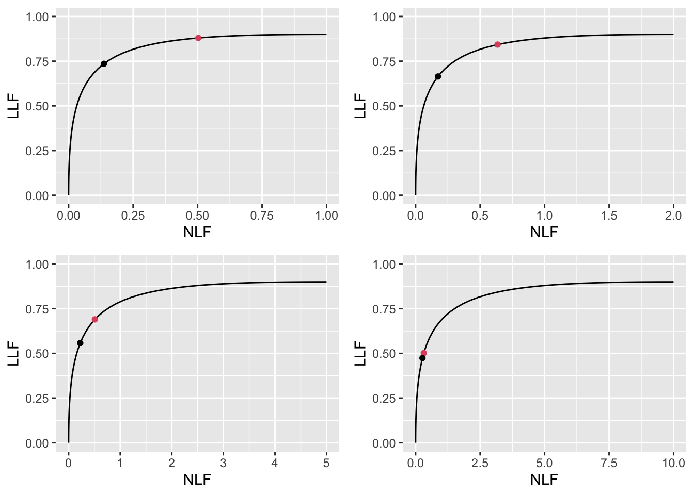
<p class="caption">(\#fig:optim-op-point-vary-lambda-froc)FROC plots with superimposed operating points for varying $\lambda$. The red dot corresponds to $\text{wAFROC}_\text{AUC}$ optimization and the black dot to Youden-index optimization.</p>
</div>


### wAFROC


Each wAFROC plot consists of a continuous curve followed by a dashed line. The "red" curve, corresponding to $\text{wAFROC}_\text{AUC}$ optimization, appears as a "solid-green solid-red dashed-red" curve (the curve is in fact a true red curve complicated by superposition of the green curve over part of its traverse). The "solid-green dashed-green" curve corresponds to Youden-index optimization. As before the black dot denotes the Youden-index based operating point and the red dot denotes the $\text{wAFROC}_\text{AUC}$ based operating point. 

The transition from continuous to dashed is determined by the value of $\zeta_1$. It occurs at a higher value of $\zeta_1$ (lower transition point) for the Youden-index optimization. In other words the stricter Youden-index based threshold sacrifices some of the area under the wAFROC resulting in lower performance, particularly for the lower values of $\lambda$. At the highest value of $\lambda$ the values of optimal $\zeta_1$ are similar and both methods make similar predictions.


<div class="figure">
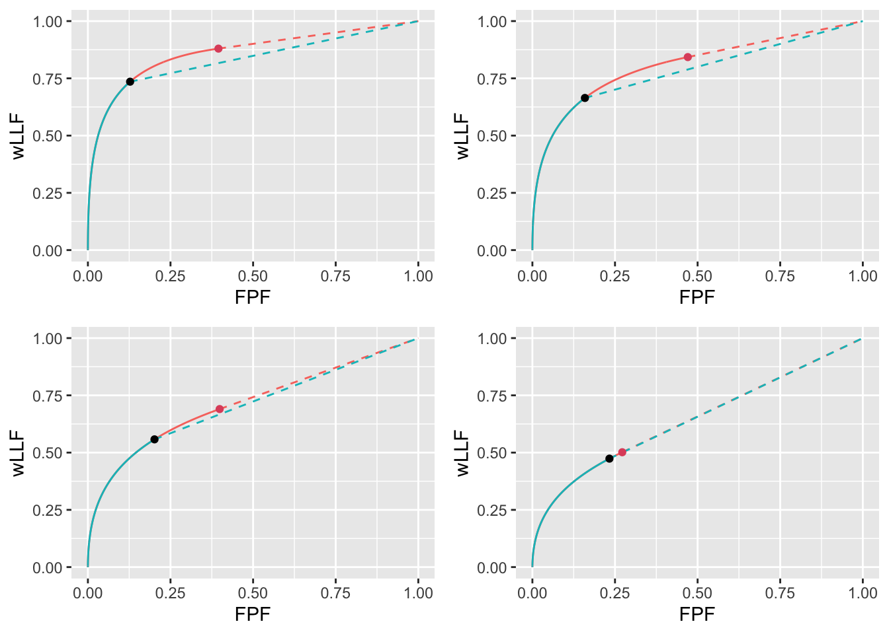
<p class="caption">(\#fig:optim-op-point-vary-lambda-wafroc)wAFROC plots for the two optimization methods: the "solid-green solid-red dashed-red" curve corresponds to $\text{wAFROC}_\text{AUC}$ optimization and the "solid-green dashed-green" curve corresponds to Youden-index optimization. The $\text{wAFROC}_\text{AUC}$ optimizations yield greater performance than do Youden-index optimizations and the difference decreases with increasing $\lambda$.</p>
</div>


### ROC


The decrease in $\text{ROC}_\text{AUC}$ with increasing $\lambda$ is illustrated in Fig. \@ref(fig:optim-op-point-vary-lambda-roc) which shows RSM-predicted ROC plots for the two optimization methods for the 4 values of $\lambda$. Again, each plot consists of a continuous curve followed by a dashed curve and a similar color-coding convention is used as in Fig. \@ref(fig:optim-op-point-vary-lambda-wafroc). The ROC plots show similar dependencies as the wAFROC plots: the stricter Youden-index based reporting thresholds sacrifice some of the area under the ROC resulting in lower performance, particularly for the lower values of $\lambda$. 


<div class="figure">
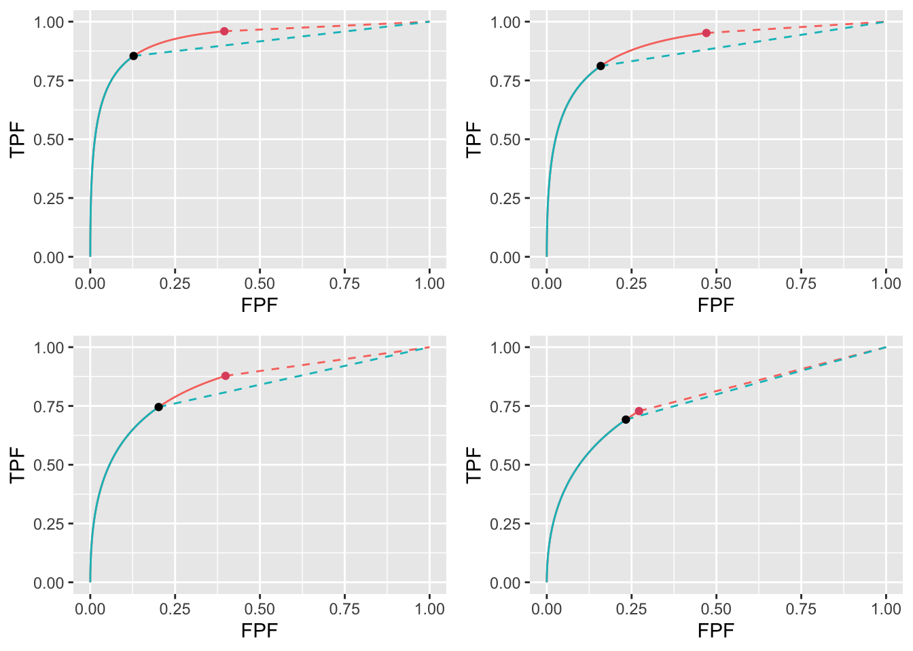
<p class="caption">(\#fig:optim-op-point-vary-lambda-roc)ROC plots for the two optimization methods: the "solid-green solid-red dashed-red" curve corresponds to $	ext{wAFROC}_	ext{AUC}$ optimization and the "solid-green dashed-green" curve corresponds to Youden-index optimization. The $\text{wAFROC}_\text{AUC}$ optimizations yield greater performance than Youden-index optimizations and the difference decreases with increasing $\lambda$.</p>
</div>


### Why not maximize ROC-AUC?

Since the ROC curves show similarities to the wAFROC curves, why not maximize $\text{ROC}_\text{AUC}$ instead of $\text{wAFROC}_\text{AUC}$? It can be shown that as long as one restricts to proper ROC models this always results in $\zeta_1 = -\infty$, i.e., all latent marks are to be shown to the radiologist, an obviously incorrect strategy. This result can be understood from the following geometrical argument. 

For a proper ROC curve the slope decreases monotonically as the operating point moves up the curve and at each point the slope is greater than that of the straight curve connecting the point to (1,1). This geometry ensures that AUC under any curve with a finite $\zeta_1$ is smaller than that under the full curve. Therefore maximum AUC can only be attained by choosing $\zeta_1 = -\infty$, see Fig. \@ref(fig:binormal-model-threshold-dependence-2).


<div class="figure" style="text-align: center">
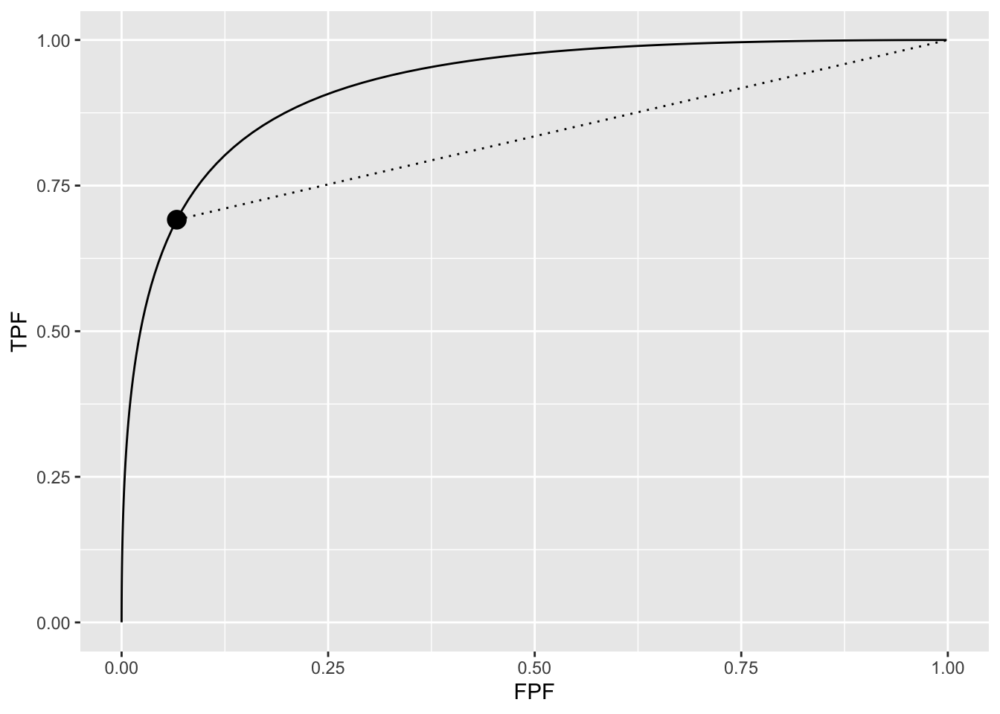
<p class="caption">(\#fig:binormal-model-threshold-dependence-2)In the region above the dot the proper curve is above the dotted line, meaning that performance of an observer who adopts a finite $\zeta_1$ is less than performance of an observer who adopts $\zeta_1 = -\infty$.</p>
</div>


## Varying $\nu$ and $\mu$ optimizations {#optim-op-point-vary-nu-mu}

Details of varying $\nu$ (with $\mu$ and $\lambda$ held constant) are in Appendix \@ref(optim-op-point-vary-nu). The results, summarized in Table \@ref(tab:optim-op-point-table-vary-nu), are similar to those just described for varying $\lambda$ but, since unlike as was the case with increasing $\lambda$, increasing $\nu$ results in increasing performance, the *directions of the effects are reversed*. For $\text{wAFROC}_\text{AUC}$ optimization the optimal reporting threshold $\zeta_1$ decreases with increasing $\nu$. In contrast the Youden-index based optimal threshold is almost independent of $\nu$. For $\text{wAFROC}_\text{AUC}$ optimization the FROC operating point moves to higher NLF values while the Youden-index based operating point stays at a near constant NLF value, see Fig. \@ref(fig:optim-op-point-vary-nu-froc)). As before, $\text{wAFROC}_\text{AUC}$ optimizations yield higher performances than Youden-index optimizations (particularly for larger $\nu$): see Fig. \@ref(fig:optim-op-point-vary-nu-wafroc) for the wAFROC and Fig. \@ref(fig:optim-op-point-vary-nu-roc) for the ROC. The difference between the two optimization methods *increases* with increasing $\nu$ (for comparison the difference between the methods decreases with increasing $\lambda$ -- this is what I meant by "reversed effects").

Details of varying $\mu$ (with $\lambda$ and $\nu$ held constant) are in Appendix \@ref(optim-op-point-vary-mu). The results are summarized in Table \@ref(tab:optim-op-point-table-vary-mu). Increasing $\mu$ is accompanied by increasing $\zeta_1$ (i.e., stricter reporting threshold) and increasing $\text{wAFROC}_\text{AUC}$ and $\text{ROC}_\text{AUC}$. Performance measured either way is higher for $\text{wAFROC}_\text{AUC}$ optimizations but the difference tends to shrink at the larger values of $\mu$. LLF is relatively constant for $\text{wAFROC}_\text{AUC}$ optimizations while it increases slowly with $\mu$ for Youden-index optimizations. NLF decreases with increasing $\mu$ for both optimization methods, i.e, the FROC operating point shifts leftward, see Fig. \@ref(fig:optim-op-point-vary-mu-froc)). Again, $\text{wAFROC}_\text{AUC}$ optimization yields a lower reporting threshold and higher performance than Youden-index optimization, see Fig. \@ref(fig:optim-op-point-vary-mu-wafroc) for the wAFROC and Fig. \@ref(fig:optim-op-point-vary-mu-roc) for the ROC. The difference between the two optimization methods decreases with increasing $\mu$.

## Limiting situations {#optim-op-point-vary-nu-limiting-situations}

Limiting situations covering high and low performances are described in \@ref(optim-op-point-limiting-situations). 

For high performance, defined as $\text{ROC}_\text{AUC} > 0.9$, both methods place the optimal operating point near the inflection point on the upper-left corner of the wAFROC or ROC. The $\text{wAFROC}_\text{AUC}$ based method chooses a lower threshold than the Youden-index method resulting in a higher operating point on the FROC and higher $\text{wAFROC}_\text{AUC}$ and $\text{ROC}_\text{AUC}$. The difference between the two methods decreases as $\text{ROC}_\text{AUC} \rightarrow 1$. 

For low performance, defined as $0.5 < \text{ROC}_\text{AUC} < 0.6$, the Youden-index method selected a lower threshold compared to $\text{wAFROC}_\text{AUC}$ optimization, resulting in a higher operating point on the FROC, greater $\text{ROC}_\text{AUC}$ but sharply lower $\text{wAFROC}_\text{AUC}$. The difference between the two methods increases as $\text{ROC}_\text{AUC} \rightarrow 0.5$. In this limit the $\text{wAFROC}_\text{AUC}$ method severely limits the numbers of marks shown to the radiologist as compared to the Youden-index based method.  

## Trends {#optim-op-point-trends}

No matter how the RSM parameters are varied the trend is that $\text{wAFROC}_\text{AUC}$ optimizations result in lower optimal thresholds $\zeta_1$ (i.e.,laxer reporting criteria that result in more displayed marks) than Youden-index optimizations. Accordingly the $\text{wAFROC}_\text{AUC}$ optimizations yield FROC operating points at higher NLF values (i.e., red dots to the right of the black dots in FROC plots), greater $\text{wAFROC}_\text{AUC}$s (red curves above the green curves in wAFROC plots) and greater $\text{ROC}_\text{AUC}$s (red curves above the green curves in ROC plots). These trends are true no matter how the RSM parameters are varied provided CAD performance is not too low.


If CAD performance is very low there are instructive exceptions where $\text{wAFROC}_\text{AUC}$ optimizations yield *greater* $\zeta_1$ (i.e., stricter reporting criteria that result in *fewer* displayed marks) than Youden-index optimizations. This finding is true no matter how the RSM parameters are varied. 

Consider for example the low performance varying $\nu$ optimizations described in Appendix \@ref(optim-op-point-low-performance-vary-nu). The FROC plots, Fig. \@ref(fig:optim-op-point-low-performance-vary-nu-froc), corresponding to $\mu = 1$, $\lambda = 10$, $\nu = 0.1, 0.2, 0.3, 0.4$, show that the $\text{wAFROC}_\text{AUC}$ optimal operating points are very close to the origin $\text{NLF} = 0$, i.e., very few marks are displayed. In contrast the Youden-index optimal operating points are shifted towards larger $\text{NLF}$ values allowing more marks to be displayed. The wAFROC plots, Fig. \@ref(fig:optim-op-point-low-performance-vary-nu-wafroc), show a large difference in AUCs between the two methods, especially for the smaller values of $\nu$: for example, for $\nu=0.1$, the $\text{wAFROC}_\text{AUC}$ corresponding to $\text{wAFROC}_\text{AUC}$ optimization is 0.5000002 while that corresponding to Youden-index optimization is 0.2923394. Clearly the $\text{wAFROC}_\text{AUC}$ optimization yields a larger $\text{wAFROC}_\text{AUC}$ relative to Youden-index optimization, which it must as $\text{wAFROC}_\text{AUC}$ is the quantity being optimized. 

While Youden-index optimizations yield smaller $\text{wAFROC}_\text{AUC}$ values they do yield larger $\text{ROC}_\text{AUC}$ values as is evident by comparing the ROC plots, Fig. \@ref(fig:optim-op-point-low-performance-vary-nu-roc). For $\nu=0.1$ the $\text{ROC}_\text{AUC}$ corresponding to $\text{wAFROC}_\text{AUC}$ optimization is 0.5000024 while that corresponding to Youden-index optimization is 0.5143474. Clearly $\text{wAFROC}_\text{AUC}$ optimization yields a very close to chance-level $\text{ROC}_\text{AUC}$ while Youden-index optimization yields a slightly larger $\text{ROC}_\text{AUC}$.

Keep in mind that $\text{ROC}_\text{AUC}$ measures classification accuracy performance between non-diseased and diseased cases: it does not care about lesion localization accuracy. In contrast $\text{wAFROC}_\text{AUC}$ measures both lesion localization accuracy and lesion classification accuracy. By choosing an optimal operating point close to the origin the low performance CAD does not get credit for missing almost all the lesions on diseased cases but it does get credit for not marking non-diseased cases. 


## Applying the method {#optim-op-point-how-to-use-method}

Assume that one has designed an algorithmic observer that has been optimized with respect to all other parameters except the reporting threshold. At this point the algorithm reports every suspicious region no matter how low the malignancy index. The mark-rating pairs are entered into a `RJafroc` format Excel input file, as describe [here](https://dpc10ster.github.io/RJafrocQuickStart/quick-start-froc-data-format.html). The next step is to read the data file -- `DfReadDataFile()` -- convert it to an ROC dataset -- `DfFroc2Roc()` -- and then perform a radiological search model (RSM) fit to the dataset using function `FitRsmRoc()`. This yields the necessary $\lambda, \mu, \nu$ parameters. These values are used to perform the computations described in this chapter to determine the optimal reporting threshold. The RSM parameter values and the reporting threshold determine the optimal reporting point on the FROC curve. The designer sets the algorithm to only report marks with confidence levels exceeding this threshold. These steps are illustrated in the following example.


### A CAD application {#optim-op-point-application}

Not having access to any CAD FROC datasets the standalone CAD LROC dataset described in [@hupse2013standalone] was used to create a simulated FROC (i.e., $\text{ROC}_\text{AUC}$ equivalent) dataset which is embedded in `RJafroc` as object `datasetCadSimuFroc`. In the following code the first reader for this dataset, corresponding to CAD, is extracted using `DfExtractDataset` (the other reader data, corresponding to radiologists, are ignored). The function `DfFroc2Roc` converts `dsCad` to an ROC dataset. The function `DfBinDataset` bins the data to about 7 bins. Each diseased case contains one lesion: `lesDistr = c(1)`. `FitRsmRoc` fits the binned ROC dataset to the radiological search model (RSM). Object `fit` contains the RSM parameters required to perform the optimizations described in previous sections.  


```r
ds <- RJafroc::datasetCadSimuFroc
dsCad <- RJafroc::DfExtractDataset(ds, rdrs = 1)
dsCadRoc <- RJafroc::DfFroc2Roc(dsCad)
dsCadRocBinned <- RJafroc::DfBinDataset(dsCadRoc, opChType = "ROC")
lesDistrCad <- c(1) # LROC dataset has one lesion per diseased case
relWeightsCad <- c(1)
fit <- RJafroc::FitRsmRoc(dsCadRocBinned, lesDistrCad)
cat(sprintf("fitted values: mu = %5.3f,", fit$mu), 
    sprintf("lambda = %5.3f,", fit$lambda), 
    sprintf("nu = %5.3f.", fit$nu)) 
#> fitted values: mu = 2.756, lambda = 6.778, nu = 0.803.
```


#### Summary table

Table \@ref(tab:optim-op-point-table4) summarizes the results. As compared to Youden-index optimization the $\text{wAFROC}_\text{AUC}$ based optimization results in a lower reporting threshold $\zeta_1$, larger figures of merit -- see Fig. \@ref(fig:optim-op-point-application-wafroc) for $\text{wAFROC}_\text{AUC}$ and Fig. \@ref(fig:optim-op-point-application-roc) for $\text{ROC}_\text{AUC}$ -- and a higher operating point on the FROC, see Fig. \@ref(fig:optim-op-point-application-froc). These results match the trends shown in Table \@ref(tab:optim-op-point-table-vary-lambda).  


<table class="table table-striped table-hover table-condensed table-responsive" style="font-size: 10px; margin-left: auto; margin-right: auto;">
<caption style="font-size: initial !important;">(\#tab:optim-op-point-table4)Results for example CAD FROC dataset. Table header row as in the previous table.</caption>
 <thead>
  <tr>
   <th style="text-align:left;"> FOM </th>
   <th style="text-align:left;"> $\lambda$ </th>
   <th style="text-align:left;"> $\zeta_1$ </th>
   <th style="text-align:left;"> $\text{wAFROC}$ </th>
   <th style="text-align:left;"> $\text{ROC}$ </th>
   <th style="text-align:left;"> $\left( \text{NLF}, \text{LLF}\right)$ </th>
  </tr>
 </thead>
<tbody>
  <tr>
   <td style="text-align:left;"> wAFROC </td>
   <td style="text-align:left;"> 6.778 </td>
   <td style="text-align:left;"> 1.739 </td>
   <td style="text-align:left;"> 0.774 </td>
   <td style="text-align:left;"> 0.815 </td>
   <td style="text-align:left;"> (0.278, 0.679) </td>
  </tr>
  <tr>
   <td style="text-align:left;"> Youden </td>
   <td style="text-align:left;">  </td>
   <td style="text-align:left;"> 1.982 </td>
   <td style="text-align:left;"> 0.770 </td>
   <td style="text-align:left;"> 0.798 </td>
   <td style="text-align:left;"> (0.161, 0.627) </td>
  </tr>
</tbody>
</table>


#### FROC


Fig. \@ref(fig:optim-op-point-application-froc) shows FROC curves with superimposed optimal operating points. With NLF = 0.278, a four-view mammogram would show about 1.2 false CAD marks per patient and lesion-level sensitivity would be about 68 percent.


<div class="figure">
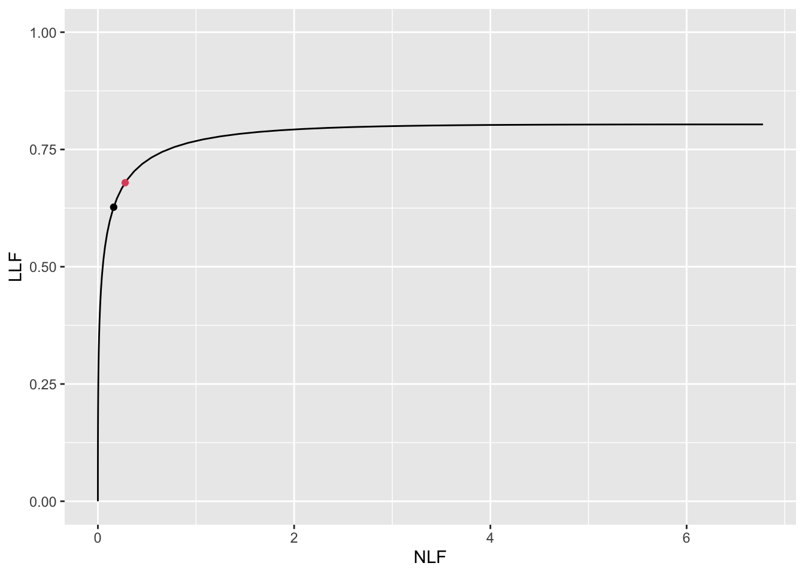
<p class="caption">(\#fig:optim-op-point-application-froc)FROC plots with superposed optimal operating points. The red dot is using $\text{wAFROC}_\text{AUC}$ optimization and black dot is using Youden-index optimization.</p>
</div>


#### wAFROC


Fig. \@ref(fig:optim-op-point-application-wafroc) shows wAFROC curves using the two methods. The red curve is using $\text{wAFROC}_\text{AUC}$ optimization and the green curve is using Youden-index optimization. The difference in AUCs is small - following the trend described in Appendix \@ref(optim-op-point-vary-nu-mu) for the larger values of $\lambda$.


<div class="figure">
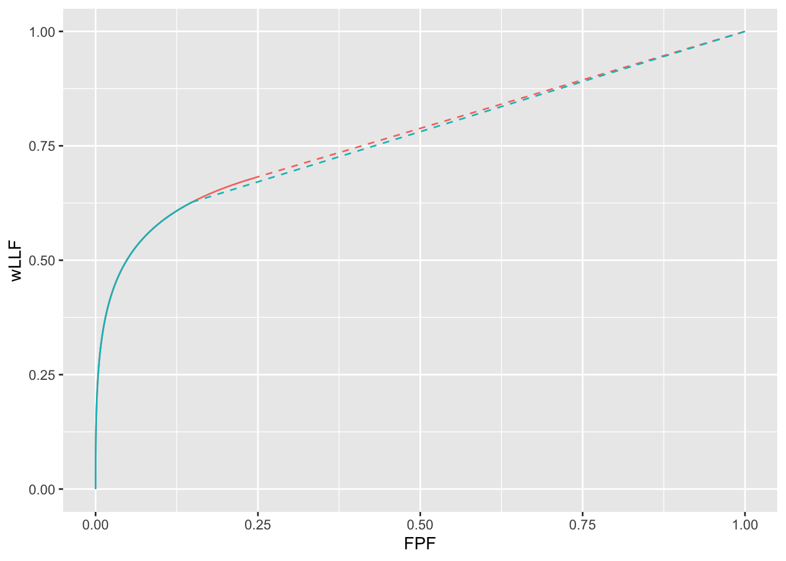
<p class="caption">(\#fig:optim-op-point-application-wafroc)The color coding is as in previous figures. The two $\text{wAFROC}_\text{AUC}$s are 0.774 (wAFROC optimization) and 0.770 (Youden-index optimization).</p>
</div>


#### ROC


Fig. \@ref(fig:optim-op-point-application-roc) shows ROC curves using the two methods. The red curve is using $\text{wAFROC}_\text{AUC}$ optimization and the green curve is using Youden-index optimization. 


<div class="figure">
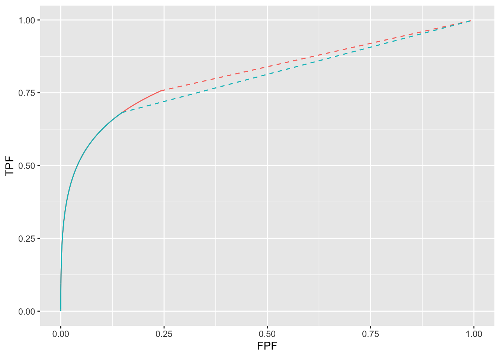
<p class="caption">(\#fig:optim-op-point-application-roc)The color coding is as in previous figures. The two $\text{ROC}_\text{AUC}$s are 0.815 (wAFROC optimization) and 0.798 (Youden-index optimization).</p>
</div>


### TBA Handling diseased-only datasets {#optim-op-point-application1}

ROC-like plot of TPF vs. FPF1 is possible. Can create a ROC-like dataset with equal number of "non-diseased" and diseased cases (the ratings of the non-diseased cases are the FP ratings on diseased cases). Fit RSM to this dataset. Proceed as before. Key assumption being violated: the FP ratings on diseased cases are independent of the TP ratings on same cases. However, without this assumption one cannot proceed. Need `RJafroc` function to handle this special case: `FitRsmRoc1`? 


## TBA Discussion {#optim-op-point-discussion}


```r
muArr <- c(2)
lambdaArr <- c(1, 2, 5, 10)
nuArr <- c(0.9)
lesDistr <- c(0.5, 0.5)
relWeights <- c(0.5, 0.5)
source("R/optim-op-point/doOneTable.R", local = knitr::knit_global())
```


In Table \@ref(tab:optim-op-point-table-vary-lambda) the $\lambda$ parameter controls the average number of perceived NLs per case. For $\lambda = 1$ there is, on average, one perceived NL for every case and the optimal $\text{wAFROC}_\text{AUC}$ based threshold is $\zeta_1$ = -0.007. For $\lambda = 10$ there are ten perceived NLs for every case and the optimal $\text{wAFROC}_\text{AUC}$ based threshold is $\zeta_1$ = 1.856. The reason for the increase in $\zeta_1$ should be obvious: with increasing numbers of latent NLs (perceived false marks) per case it is necessary to adopt a stricter criteria because otherwise the reader would be shown 10 times the number of false marks per case. 


The $\text{ROC}_\text{AUC}$s are reported as a check of the less familiar $\text{wAFROC}_\text{AUC}$ figure of merit. With some notable exceptions the behavior of the two optimization methods is independent of whether it is measured via the $\text{wAFROC}_\text{AUC}$ or the $\text{ROC}_\text{AUC}$: either way the $\text{wAFROC}_\text{AUC}$ optimizations yield higher AUC values and higher operating points on the FROC than the corresponding Youden-index optimizations. The exceptions occur when CAD performance is very low in which situation the .    

In this example the difference in $\text{wAFROC}_\text{AUC}$, $\text{ROC}_\text{AUC}$ and the operating points between the two methods decreases as performance *increases*, which is the opposite of that found when $\lambda$ or $\nu$ were varied. With constant $\lambda$ and $\nu$ the *numbers* of latent NLs and LLs are unchanging; all that happens is the *values* of the z-samples from LLs increase as $\mu$ increases, which allows the optimal threshold to increase (this can be understood as a "ROC-paradigm" effect: as the normal distributions are more widely separated, the optimal threshold will increase, approaching, in the limit, half the separation, since in that limit TPF = 1 and FPF = 0).

This is due to two reinforcing effects: performance goes down with increasing numbers of NLs per case and performance goes down with increasing optimal reporting threshold (see \@ref(rsm-predictions-roc-curve-aucs-zeta1) for explanation of the $\zeta_1$ dependence of AUC performance). It is difficult to unambiguously infer performance based on the FROC operating points: as $\lambda$ increases LLF decreases but for $\text{wAFROC}_\text{AUC}$ optimizations NLF peaks while for Youden-index optimizations it increases.

The FROC plots also illustrate the decrease in $\text{LLF}$ with increasing $\lambda$: the black dots move to smaller ordinates, as do the red dots, which would seem to imply decreasing performance. However, the accompanying change in $\text{NLF}$ rules out an unambiguous determination of the direction of the change in overall performance based on the FROC curve. 


For very low performance, defined as $0.5 < \text{ROC}_\text{AUC} < 0.6$, the Youden-index method chooses a lower threshold compared to $\text{wAFROC}_\text{AUC}$ optimization, resulting in a higher operating point on the FROC, greater $\text{ROC}_\text{AUC}$ but sharply lower $\text{wAFROC}_\text{AUC}$. The difference between the two methods increases as $\text{ROC}_\text{AUC} \rightarrow 0.5$. In this limit the $\text{wAFROC}_\text{AUC}$ method severely limits the numbers of marks shown to the radiologist as compared to the Youden-index based method.  


## Appendices {#cad-optim-op-appendices}
### Varying $\nu$ optimizations{#optim-op-point-vary-nu}

For $\mu = 2$ and $\lambda = 1$ optimizations were performed for $\nu = 0.6, 0.7, 0.8, 0.9$. 


```r
muArr <- c(2)
lambdaArr <- c(1)
nuArr <- c(0.6, 0.7, 0.8, 0.9)
lesDistr <- c(0.5, 0.5)
relWeights <- c(0.5, 0.5)
```


#### Summary table


<table class="table table-striped table-hover table-condensed table-responsive" style="font-size: 10px; margin-left: auto; margin-right: auto;">
<caption style="font-size: initial !important;">(\#tab:optim-op-point-table-vary-nu)Results for $\mu = 2$, $\lambda = 1$ and varying $\nu$.</caption>
 <thead>
  <tr>
   <th style="text-align:left;"> FOM </th>
   <th style="text-align:left;"> $\nu$ </th>
   <th style="text-align:left;"> $\zeta_1$ </th>
   <th style="text-align:left;"> $\text{wAFROC}_\text{AUC}$ </th>
   <th style="text-align:left;"> $\text{ROC}_\text{AUC}$ </th>
   <th style="text-align:left;"> $\left( \text{NLF}, \text{LLF}\right)$ </th>
  </tr>
 </thead>
<tbody>
  <tr>
   <td style="text-align:left;"> $\text{wAFROC}_\text{AUC}$ </td>
   <td style="text-align:left;"> 0.6 </td>
   <td style="text-align:left;"> 0.888 </td>
   <td style="text-align:left;"> 0.701 </td>
   <td style="text-align:left;"> 0.804 </td>
   <td style="text-align:left;"> (0.187, 0.520) </td>
  </tr>
  <tr>
   <td style="text-align:left;">  </td>
   <td style="text-align:left;"> 0.7 </td>
   <td style="text-align:left;"> 0.674 </td>
   <td style="text-align:left;"> 0.751 </td>
   <td style="text-align:left;"> 0.851 </td>
   <td style="text-align:left;"> (0.250, 0.635) </td>
  </tr>
  <tr>
   <td style="text-align:left;">  </td>
   <td style="text-align:left;"> 0.8 </td>
   <td style="text-align:left;"> 0.407 </td>
   <td style="text-align:left;"> 0.805 </td>
   <td style="text-align:left;"> 0.893 </td>
   <td style="text-align:left;"> (0.342, 0.756) </td>
  </tr>
  <tr>
   <td style="text-align:left;">  </td>
   <td style="text-align:left;"> 0.9 </td>
   <td style="text-align:left;"> -0.007 </td>
   <td style="text-align:left;"> 0.864 </td>
   <td style="text-align:left;"> 0.929 </td>
   <td style="text-align:left;"> (0.503, 0.880) </td>
  </tr>
  <tr>
   <td style="text-align:left;"> Youden-index </td>
   <td style="text-align:left;"> 0.6 </td>
   <td style="text-align:left;"> 1.022 </td>
   <td style="text-align:left;"> 0.700 </td>
   <td style="text-align:left;"> 0.797 </td>
   <td style="text-align:left;"> (0.153, 0.502) </td>
  </tr>
  <tr>
   <td style="text-align:left;">  </td>
   <td style="text-align:left;"> 0.7 </td>
   <td style="text-align:left;"> 1.044 </td>
   <td style="text-align:left;"> 0.745 </td>
   <td style="text-align:left;"> 0.835 </td>
   <td style="text-align:left;"> (0.148, 0.581) </td>
  </tr>
  <tr>
   <td style="text-align:left;">  </td>
   <td style="text-align:left;"> 0.8 </td>
   <td style="text-align:left;"> 1.069 </td>
   <td style="text-align:left;"> 0.788 </td>
   <td style="text-align:left;"> 0.868 </td>
   <td style="text-align:left;"> (0.143, 0.659) </td>
  </tr>
  <tr>
   <td style="text-align:left;">  </td>
   <td style="text-align:left;"> 0.9 </td>
   <td style="text-align:left;"> 1.095 </td>
   <td style="text-align:left;"> 0.831 </td>
   <td style="text-align:left;"> 0.899 </td>
   <td style="text-align:left;"> (0.137, 0.735) </td>
  </tr>
</tbody>
</table>


#### FROC


<div class="figure">
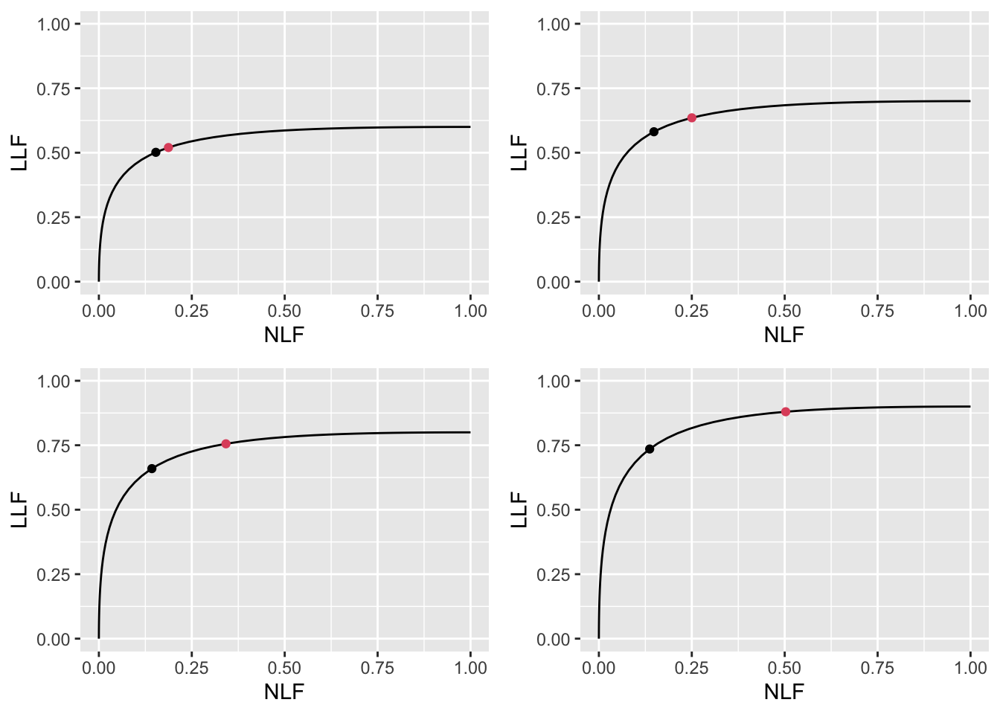
<p class="caption">(\#fig:optim-op-point-vary-nu-froc)Varying $\nu$ FROC plots with superimposed operating points. The red dot corresponds to $\text{wAFROC}_\text{AUC}$ optimization and the black dot to Youden-index optimization. The values of $\nu$ are: top-left $\nu = 0.6$, top-right $\nu = 0.7$, bottom-left $\nu = 0.8$ and bottom-right $\nu = 0.9$. Each red dot is above the corresponding black dot and their separation increases as $\nu$ increases, i.e., as CAD performance increases.</p>
</div>


#### wAFROC


 


<div class="figure">
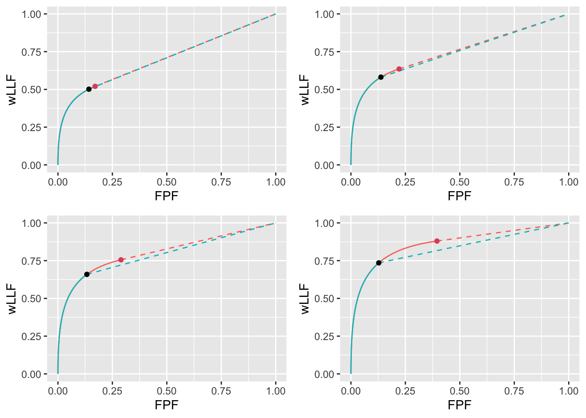
<p class="caption">(\#fig:optim-op-point-vary-nu-wafroc)Varying $\nu$ wAFROC plots for the two optimization methods with superimposed operating points with superimposed operating points. The color coding is as in previous figures. The values of $\nu$ are: top-left $\nu = 0.6$, top-right $\nu = 0.7$, bottom-left $\nu = 0.8$ and bottom-right $\nu = 0.9$.</p>
</div>


#### ROC


<div class="figure">
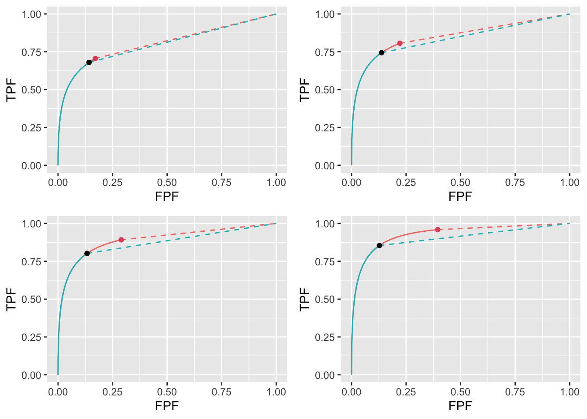
<p class="caption">(\#fig:optim-op-point-vary-nu-roc)Varying $\nu$ ROC plots for the two optimization methods with superimposed operating points with superimposed operating points. The color coding is as in previous figures. The values of $\nu$ are: top-left $\nu = 0.6$, top-right $\nu = 0.7$, bottom-left $\nu = 0.8$ and bottom-right $\nu = 0.9$.</p>
</div>


### Varying $\mu$ optimizations{#optim-op-point-vary-mu}

For $\lambda = 1$ and $\nu = 0.9$ optimizations were performed for $\mu = 1, 2, 3, 4$. 


```r
muArr <- c(1, 2, 3, 4)
lambdaArr <- 1
nuArr <- 0.9
```


#### Summary table


<table class="table table-striped table-hover table-condensed table-responsive" style="font-size: 10px; margin-left: auto; margin-right: auto;">
<caption style="font-size: initial !important;">(\#tab:optim-op-point-table-vary-mu)Results for $\lambda = 1$, $\nu = 0.9$ and varying $\mu$.</caption>
 <thead>
  <tr>
   <th style="text-align:left;"> FOM </th>
   <th style="text-align:left;"> $\mu$ </th>
   <th style="text-align:left;"> $\zeta_1$ </th>
   <th style="text-align:left;"> $\text{wAFROC}_\text{AUC}$ </th>
   <th style="text-align:left;"> $\text{ROC}_\text{AUC}$ </th>
   <th style="text-align:left;"> $\left( \text{NLF}, \text{LLF}\right)$ </th>
  </tr>
 </thead>
<tbody>
  <tr>
   <td style="text-align:left;"> $\text{wAFROC}_\text{AUC}$ </td>
   <td style="text-align:left;"> 1 </td>
   <td style="text-align:left;"> -1.663 </td>
   <td style="text-align:left;"> 0.745 </td>
   <td style="text-align:left;"> 0.850 </td>
   <td style="text-align:left;"> (0.952, 0.897) </td>
  </tr>
  <tr>
   <td style="text-align:left;">  </td>
   <td style="text-align:left;"> 2 </td>
   <td style="text-align:left;"> -0.007 </td>
   <td style="text-align:left;"> 0.864 </td>
   <td style="text-align:left;"> 0.929 </td>
   <td style="text-align:left;"> (0.503, 0.880) </td>
  </tr>
  <tr>
   <td style="text-align:left;">  </td>
   <td style="text-align:left;"> 3 </td>
   <td style="text-align:left;"> 0.808 </td>
   <td style="text-align:left;"> 0.922 </td>
   <td style="text-align:left;"> 0.961 </td>
   <td style="text-align:left;"> (0.210, 0.887) </td>
  </tr>
  <tr>
   <td style="text-align:left;">  </td>
   <td style="text-align:left;"> 4 </td>
   <td style="text-align:left;"> 1.463 </td>
   <td style="text-align:left;"> 0.942 </td>
   <td style="text-align:left;"> 0.970 </td>
   <td style="text-align:left;"> (0.072, 0.895) </td>
  </tr>
  <tr>
   <td style="text-align:left;"> Youden-index </td>
   <td style="text-align:left;"> 1 </td>
   <td style="text-align:left;"> 0.462 </td>
   <td style="text-align:left;"> 0.704 </td>
   <td style="text-align:left;"> 0.815 </td>
   <td style="text-align:left;"> (0.322, 0.634) </td>
  </tr>
  <tr>
   <td style="text-align:left;">  </td>
   <td style="text-align:left;"> 2 </td>
   <td style="text-align:left;"> 1.095 </td>
   <td style="text-align:left;"> 0.831 </td>
   <td style="text-align:left;"> 0.899 </td>
   <td style="text-align:left;"> (0.137, 0.735) </td>
  </tr>
  <tr>
   <td style="text-align:left;">  </td>
   <td style="text-align:left;"> 3 </td>
   <td style="text-align:left;"> 1.629 </td>
   <td style="text-align:left;"> 0.903 </td>
   <td style="text-align:left;"> 0.945 </td>
   <td style="text-align:left;"> (0.052, 0.823) </td>
  </tr>
  <tr>
   <td style="text-align:left;">  </td>
   <td style="text-align:left;"> 4 </td>
   <td style="text-align:left;"> 2.124 </td>
   <td style="text-align:left;"> 0.935 </td>
   <td style="text-align:left;"> 0.964 </td>
   <td style="text-align:left;"> (0.017, 0.873) </td>
  </tr>
</tbody>
</table>


#### FROC


<div class="figure">

<p class="caption">(\#fig:optim-op-point-vary-mu-froc)Varying $\mu$ FROC plots with superimposed operating points. The red dot corresponds to $\text{wAFROC}_\text{AUC}$ optimization and the black dot to Youden-index optimization. The values of $\mu$ are: top-left $\mu = 1$, top-right $\mu = 2$, bottom-left $\mu = 3$ and bottom-right $\mu = 4$.</p>
</div>


#### wAFROC


<div class="figure">
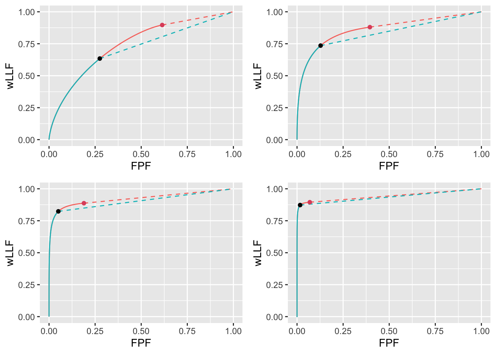
<p class="caption">(\#fig:optim-op-point-vary-mu-wafroc)Varying $\mu$ wAFROC plots for the two optimization methods with superimposed operating points with superimposed operating points. The color coding is as in previous figures. The values of $\mu$ are: top-left $\mu = 1$, top-right $\mu = 2$, bottom-left $\mu = 3$ and bottom-right $\mu = 4$.</p>
</div>


#### ROC


<div class="figure">
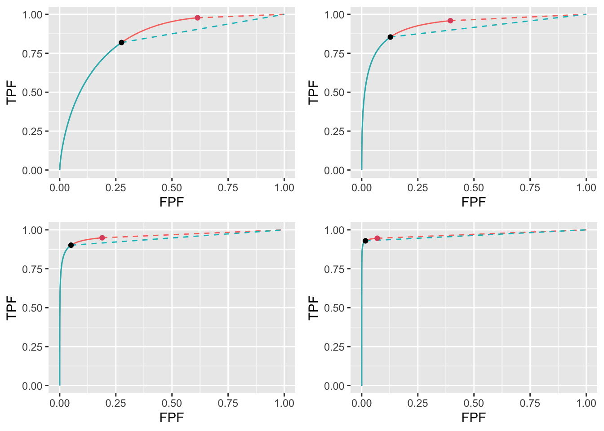
<p class="caption">(\#fig:optim-op-point-vary-mu-roc)Varying $\mu$ ROC plots for the two optimization methods with superimposed operating points with superimposed operating points. The color coding is as in previous figures. The values of $\mu$ are: top-left $\mu = 1$, top-right $\mu = 2$, bottom-left $\mu = 3$ and bottom-right $\mu = 4$.</p>
</div>


### Limiting cases {#optim-op-point-limiting-situations}

#### High performance varying $\mu$ {#optim-op-point-high-performance-vary-mu}


```r
muArr <- c(2, 3, 4, 5)
nuArr <- c(0.9)
lambdaArr <- c(1)
```


##### Summary table


<table class="table table-striped table-hover table-condensed table-responsive" style="font-size: 10px; margin-left: auto; margin-right: auto;">
<caption style="font-size: initial !important;">(\#tab:optim-op-point-high-performance-vary-mu-table)High performance summary of optimization results for $\lambda = 1$ and $\nu = 0.9$ and varying $\mu$.</caption>
 <thead>
  <tr>
   <th style="text-align:left;"> FOM </th>
   <th style="text-align:left;"> $\mu$ </th>
   <th style="text-align:left;"> $\zeta_1$ </th>
   <th style="text-align:left;"> $\text{wAFROC}_\text{AUC}$ </th>
   <th style="text-align:left;"> $\text{ROC}_\text{AUC}$ </th>
   <th style="text-align:left;"> $\left( \text{NLF}, \text{LLF}\right)$ </th>
  </tr>
 </thead>
<tbody>
  <tr>
   <td style="text-align:left;"> $\text{wAFROC}_\text{AUC}$ </td>
   <td style="text-align:left;"> 2 </td>
   <td style="text-align:left;"> -0.007 </td>
   <td style="text-align:left;"> 0.864 </td>
   <td style="text-align:left;"> 0.929 </td>
   <td style="text-align:left;"> (0.503, 0.880) </td>
  </tr>
  <tr>
   <td style="text-align:left;">  </td>
   <td style="text-align:left;"> 3 </td>
   <td style="text-align:left;"> 0.808 </td>
   <td style="text-align:left;"> 0.922 </td>
   <td style="text-align:left;"> 0.961 </td>
   <td style="text-align:left;"> (0.210, 0.887) </td>
  </tr>
  <tr>
   <td style="text-align:left;">  </td>
   <td style="text-align:left;"> 4 </td>
   <td style="text-align:left;"> 1.463 </td>
   <td style="text-align:left;"> 0.942 </td>
   <td style="text-align:left;"> 0.970 </td>
   <td style="text-align:left;"> (0.072, 0.895) </td>
  </tr>
  <tr>
   <td style="text-align:left;">  </td>
   <td style="text-align:left;"> 5 </td>
   <td style="text-align:left;"> 2.063 </td>
   <td style="text-align:left;"> 0.948 </td>
   <td style="text-align:left;"> 0.972 </td>
   <td style="text-align:left;"> (0.020, 0.899) </td>
  </tr>
  <tr>
   <td style="text-align:left;"> Youden-index </td>
   <td style="text-align:left;"> 2 </td>
   <td style="text-align:left;"> 1.095 </td>
   <td style="text-align:left;"> 0.831 </td>
   <td style="text-align:left;"> 0.899 </td>
   <td style="text-align:left;"> (0.137, 0.735) </td>
  </tr>
  <tr>
   <td style="text-align:left;">  </td>
   <td style="text-align:left;"> 3 </td>
   <td style="text-align:left;"> 1.629 </td>
   <td style="text-align:left;"> 0.903 </td>
   <td style="text-align:left;"> 0.945 </td>
   <td style="text-align:left;"> (0.052, 0.823) </td>
  </tr>
  <tr>
   <td style="text-align:left;">  </td>
   <td style="text-align:left;"> 4 </td>
   <td style="text-align:left;"> 2.124 </td>
   <td style="text-align:left;"> 0.935 </td>
   <td style="text-align:left;"> 0.964 </td>
   <td style="text-align:left;"> (0.017, 0.873) </td>
  </tr>
  <tr>
   <td style="text-align:left;">  </td>
   <td style="text-align:left;"> 5 </td>
   <td style="text-align:left;"> 2.608 </td>
   <td style="text-align:left;"> 0.946 </td>
   <td style="text-align:left;"> 0.970 </td>
   <td style="text-align:left;"> (0.005, 0.892) </td>
  </tr>
</tbody>
</table>


##### FROC


<div class="figure">
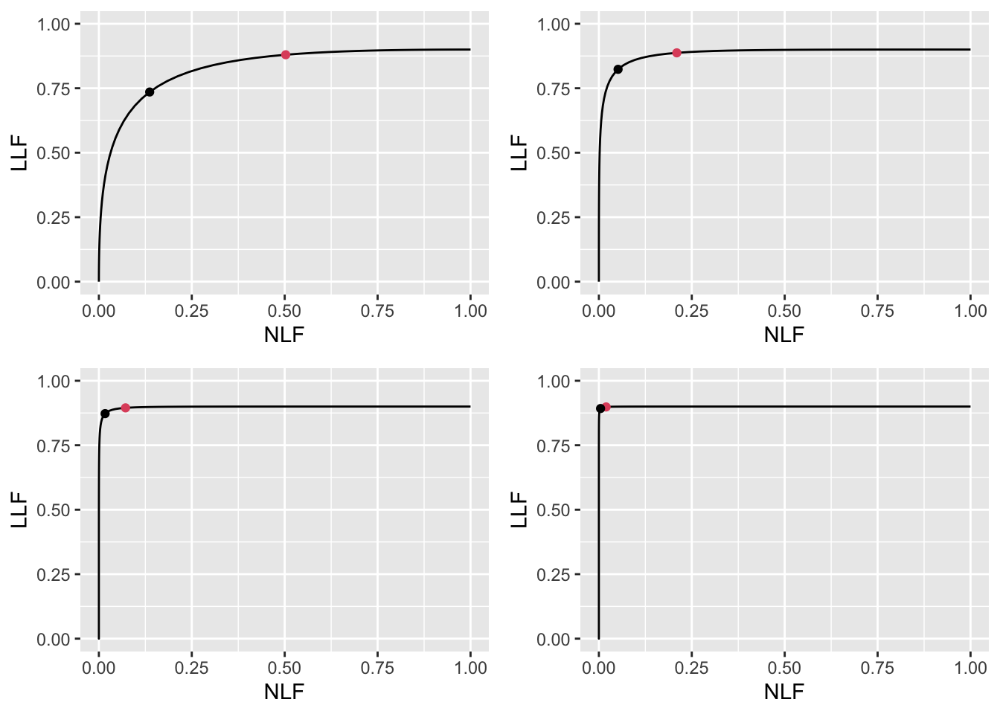
<p class="caption">(\#fig:optim-op-point-high-performance-vary-mu-froc)High performance varying $\mu$ FROC plots with superimposed operating points. The red dot corresponds to $\text{wAFROC}_\text{AUC}$ optimization and the black dot to Youden-index optimization. The values of $\mu$ are: top-left $\mu = 2$, top-right $\mu = 3$, bottom-left $\mu = 4$ and bottom-right $\mu = 5$.</p>
</div>


##### wAFROC


<div class="figure">

<p class="caption">(\#fig:optim-op-point-high-performance-vary-mu-wafroc)High performance varying $\mu$ wAFROC plots for the two optimization methods with superimposed operating points with superimposed operating points. The color coding is as in previous figures. The values of $\mu$ are: top-left $\mu = 2$, top-right $\mu = 3$, bottom-left $\mu = 4$ and bottom-right $\mu = 5$.</p>
</div>


##### ROC


<div class="figure">
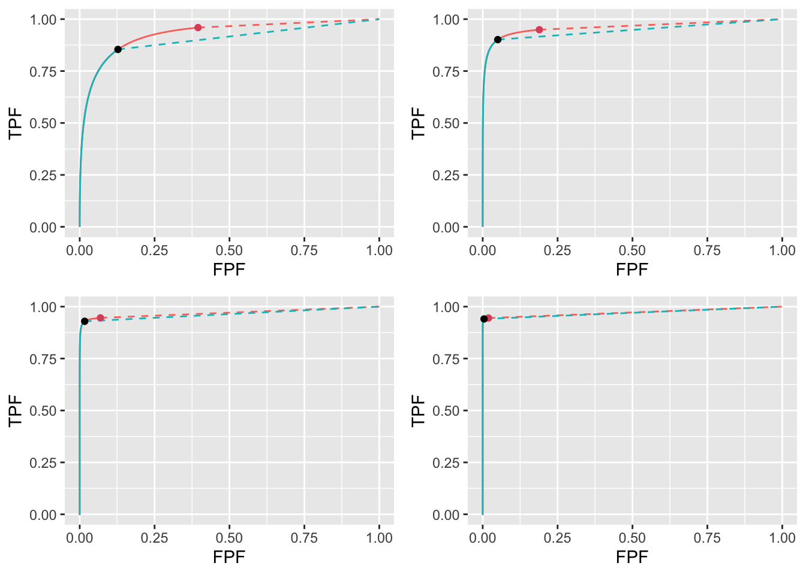
<p class="caption">(\#fig:optim-op-point-high-performance-vary-mu-roc)High performance varying $\mu$ ROC plots for the two optimization methods with superimposed operating points with superimposed operating points. The color coding is as in previous figures. The values of $\mu$ are: top-left $\mu = 2$, top-right $\mu = 3$, bottom-left $\mu = 4$ and bottom-right $\mu = 5$.</p>
</div>


#### Low performance varying $\mu$ {#optim-op-point-low-performance-vary-mu}


```r
muArr <- c(1, 2, 3, 4)
nuArr <- c(0.1)
lambdaArr <- c(10)
```


##### Summary table


<table class="table table-striped table-hover table-condensed table-responsive" style="font-size: 10px; margin-left: auto; margin-right: auto;">
<caption style="font-size: initial !important;">(\#tab:optim-op-point-low-performance-vary-mu-table)Low performance summary of optimization results for $\lambda = 10$ and $nu = 0.1$ and varying $\mu$. Column labeling as in previous tables.</caption>
 <thead>
  <tr>
   <th style="text-align:left;"> FOM </th>
   <th style="text-align:left;"> $\mu$ </th>
   <th style="text-align:left;"> $\zeta_1$ </th>
   <th style="text-align:left;"> $\text{wAFROC}_\text{AUC}$ </th>
   <th style="text-align:left;"> $\text{ROC}_\text{AUC}$ </th>
   <th style="text-align:left;"> $\left( \text{NLF}, \text{LLF}\right)$ </th>
  </tr>
 </thead>
<tbody>
  <tr>
   <td style="text-align:left;"> $\text{wAFROC}_\text{AUC}$ </td>
   <td style="text-align:left;"> 1 </td>
   <td style="text-align:left;"> 5.000 </td>
   <td style="text-align:left;"> 0.500 </td>
   <td style="text-align:left;"> 0.500 </td>
   <td style="text-align:left;"> (0.000, 0.000) </td>
  </tr>
  <tr>
   <td style="text-align:left;">  </td>
   <td style="text-align:left;"> 2 </td>
   <td style="text-align:left;"> 3.298 </td>
   <td style="text-align:left;"> 0.502 </td>
   <td style="text-align:left;"> 0.507 </td>
   <td style="text-align:left;"> (0.005, 0.010) </td>
  </tr>
  <tr>
   <td style="text-align:left;">  </td>
   <td style="text-align:left;"> 3 </td>
   <td style="text-align:left;"> 3.018 </td>
   <td style="text-align:left;"> 0.518 </td>
   <td style="text-align:left;"> 0.536 </td>
   <td style="text-align:left;"> (0.013, 0.049) </td>
  </tr>
  <tr>
   <td style="text-align:left;">  </td>
   <td style="text-align:left;"> 4 </td>
   <td style="text-align:left;"> 3.130 </td>
   <td style="text-align:left;"> 0.536 </td>
   <td style="text-align:left;"> 0.559 </td>
   <td style="text-align:left;"> (0.009, 0.081) </td>
  </tr>
  <tr>
   <td style="text-align:left;"> Youden-index </td>
   <td style="text-align:left;"> 1 </td>
   <td style="text-align:left;"> 1.563 </td>
   <td style="text-align:left;"> 0.292 </td>
   <td style="text-align:left;"> 0.514 </td>
   <td style="text-align:left;"> (0.590, 0.029) </td>
  </tr>
  <tr>
   <td style="text-align:left;">  </td>
   <td style="text-align:left;"> 2 </td>
   <td style="text-align:left;"> 1.865 </td>
   <td style="text-align:left;"> 0.397 </td>
   <td style="text-align:left;"> 0.535 </td>
   <td style="text-align:left;"> (0.311, 0.055) </td>
  </tr>
  <tr>
   <td style="text-align:left;">  </td>
   <td style="text-align:left;"> 3 </td>
   <td style="text-align:left;"> 2.198 </td>
   <td style="text-align:left;"> 0.478 </td>
   <td style="text-align:left;"> 0.555 </td>
   <td style="text-align:left;"> (0.140, 0.079) </td>
  </tr>
  <tr>
   <td style="text-align:left;">  </td>
   <td style="text-align:left;"> 4 </td>
   <td style="text-align:left;"> 2.564 </td>
   <td style="text-align:left;"> 0.523 </td>
   <td style="text-align:left;"> 0.567 </td>
   <td style="text-align:left;"> (0.052, 0.092) </td>
  </tr>
</tbody>
</table>


##### FROC


<div class="figure">

<p class="caption">(\#fig:optim-op-point-low-performance-vary-mu)Low performance varying $\mu$ FROC plots with superimposed operating points. The red dot corresponds to $\text{wAFROC}_\text{AUC}$ optimization and the black dot to Youden-index optimization. The values of $\mu$ are: top-left $\mu = 1$, top-right $\mu = 2$, bottom-left $\mu = 3$ and bottom-right $\mu = 4$.</p>
</div>


##### wAFROC


<div class="figure">
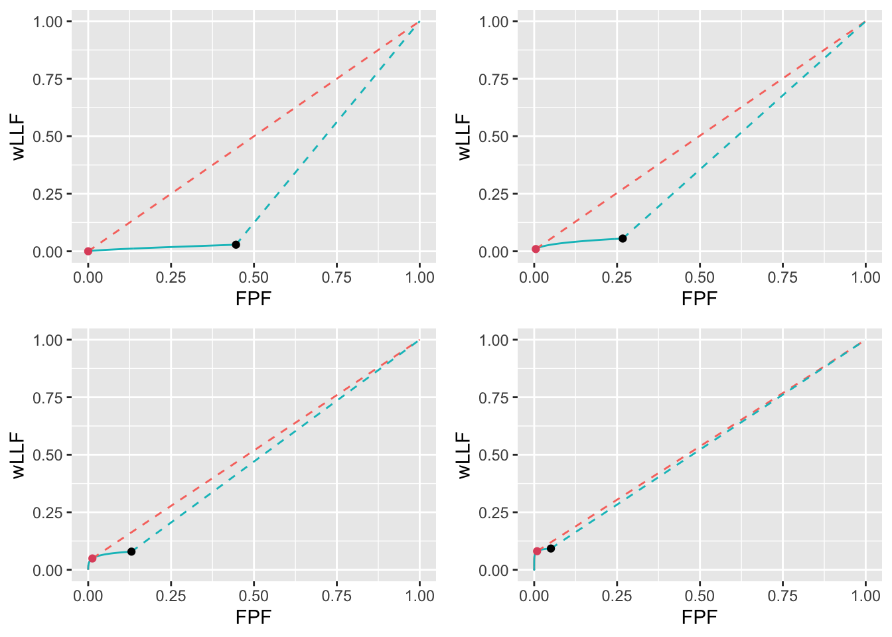
<p class="caption">(\#fig:optim-op-point-low-performance-vary-mu-wafroc)Low performance varying $\mu$ wAFROC plots for the two optimization methods with superimposed operating points with superimposed operating points. The color coding is as in previous figures. The values of $\mu$ are: top-left $\mu = 1$, top-right $\mu = 2$, bottom-left $\mu = 3$ and bottom-right $\mu = 4$.</p>
</div>


##### ROC


<div class="figure">
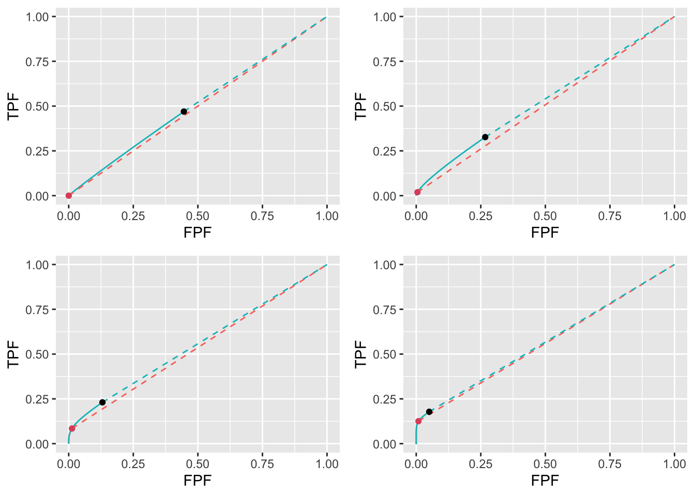
<p class="caption">(\#fig:optim-op-point-low-performance-vary-mu-roc)Low performance varying $\mu$ ROC plots for the two optimization methods with superimposed operating points with superimposed operating points. The color coding is as in previous figures. The values of $\mu$ are: top-left $\mu = 1$, top-right $\mu = 2$, bottom-left $\mu = 3$ and bottom-right $\mu = 4$.</p>
</div>


#### High performance varying $\lambda$ {#optim-op-point-high-performance-vary-lambda}


```r
muArr <- c(4)
nuArr <- c(0.9)
lambdaArr <- c(1,2,5,10)
```


##### Summary table


<table class="table table-striped table-hover table-condensed table-responsive" style="font-size: 10px; margin-left: auto; margin-right: auto;">
<caption style="font-size: initial !important;">(\#tab:optim-op-point-high-performance-vary-lambda-table)Results for $\mu = 4$, $nu = 0.9$ and varying $\lambda$. Column labeling as in previous tables.</caption>
 <thead>
  <tr>
   <th style="text-align:left;"> FOM </th>
   <th style="text-align:left;"> $\lambda$ </th>
   <th style="text-align:left;"> $\zeta_1$ </th>
   <th style="text-align:left;"> $\text{wAFROC}_\text{AUC}$ </th>
   <th style="text-align:left;"> $\text{ROC}_\text{AUC}$ </th>
   <th style="text-align:left;"> $\left( \text{NLF}, \text{LLF}\right)$ </th>
  </tr>
 </thead>
<tbody>
  <tr>
   <td style="text-align:left;"> $\text{wAFROC}_\text{AUC}$ </td>
   <td style="text-align:left;"> 1 </td>
   <td style="text-align:left;"> 1.463 </td>
   <td style="text-align:left;"> 0.942 </td>
   <td style="text-align:left;"> 0.970 </td>
   <td style="text-align:left;"> (0.072, 0.895) </td>
  </tr>
  <tr>
   <td style="text-align:left;">  </td>
   <td style="text-align:left;"> 2 </td>
   <td style="text-align:left;"> 1.644 </td>
   <td style="text-align:left;"> 0.938 </td>
   <td style="text-align:left;"> 0.968 </td>
   <td style="text-align:left;"> (0.100, 0.892) </td>
  </tr>
  <tr>
   <td style="text-align:left;">  </td>
   <td style="text-align:left;"> 5 </td>
   <td style="text-align:left;"> 1.889 </td>
   <td style="text-align:left;"> 0.930 </td>
   <td style="text-align:left;"> 0.965 </td>
   <td style="text-align:left;"> (0.147, 0.884) </td>
  </tr>
  <tr>
   <td style="text-align:left;">  </td>
   <td style="text-align:left;"> 10 </td>
   <td style="text-align:left;"> 2.082 </td>
   <td style="text-align:left;"> 0.920 </td>
   <td style="text-align:left;"> 0.960 </td>
   <td style="text-align:left;"> (0.187, 0.875) </td>
  </tr>
  <tr>
   <td style="text-align:left;"> Youden-index </td>
   <td style="text-align:left;"> 1 </td>
   <td style="text-align:left;"> 2.124 </td>
   <td style="text-align:left;"> 0.935 </td>
   <td style="text-align:left;"> 0.964 </td>
   <td style="text-align:left;"> (0.017, 0.873) </td>
  </tr>
  <tr>
   <td style="text-align:left;">  </td>
   <td style="text-align:left;"> 2 </td>
   <td style="text-align:left;"> 2.291 </td>
   <td style="text-align:left;"> 0.928 </td>
   <td style="text-align:left;"> 0.960 </td>
   <td style="text-align:left;"> (0.022, 0.861) </td>
  </tr>
  <tr>
   <td style="text-align:left;">  </td>
   <td style="text-align:left;"> 5 </td>
   <td style="text-align:left;"> 2.508 </td>
   <td style="text-align:left;"> 0.915 </td>
   <td style="text-align:left;"> 0.952 </td>
   <td style="text-align:left;"> (0.030, 0.839) </td>
  </tr>
  <tr>
   <td style="text-align:left;">  </td>
   <td style="text-align:left;"> 10 </td>
   <td style="text-align:left;"> 2.669 </td>
   <td style="text-align:left;"> 0.903 </td>
   <td style="text-align:left;"> 0.944 </td>
   <td style="text-align:left;"> (0.038, 0.818) </td>
  </tr>
</tbody>
</table>


##### FROC


<div class="figure">
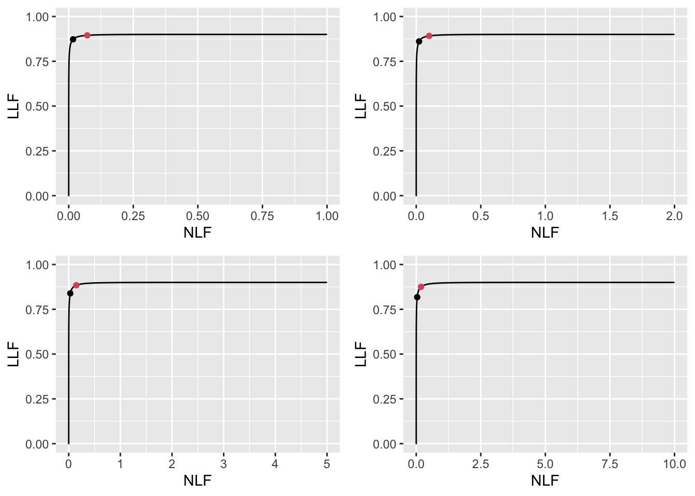
<p class="caption">(\#fig:optim-op-point-high-performance-vary-lambda-froc)High performance varying $\lambda$ FROC plots with superimposed operating points. The red dot corresponds to $\text{wAFROC}_\text{AUC}$ optimization and the black dot to Youden-index optimization. The values of $\lambda$ are: top-left $\lambda = 1$, top-right $\lambda = 2$, bottom-left $\lambda = 5$ and bottom-right $\lambda = 10$.</p>
</div>


##### wAFROC


<div class="figure">

<p class="caption">(\#fig:optim-op-point-high-performance-vary-lambda-wafroc)High performance varying $\lambda$ wAFROC plots for the two optimization methods with superimposed operating points. The color coding is as in previous figures. The values of $\lambda$ are: top-left $\lambda = 1$, top-right $\lambda = 2$, bottom-left $\lambda = 5$ and bottom-right $\lambda = 10$.</p>
</div>


##### ROC


<div class="figure">
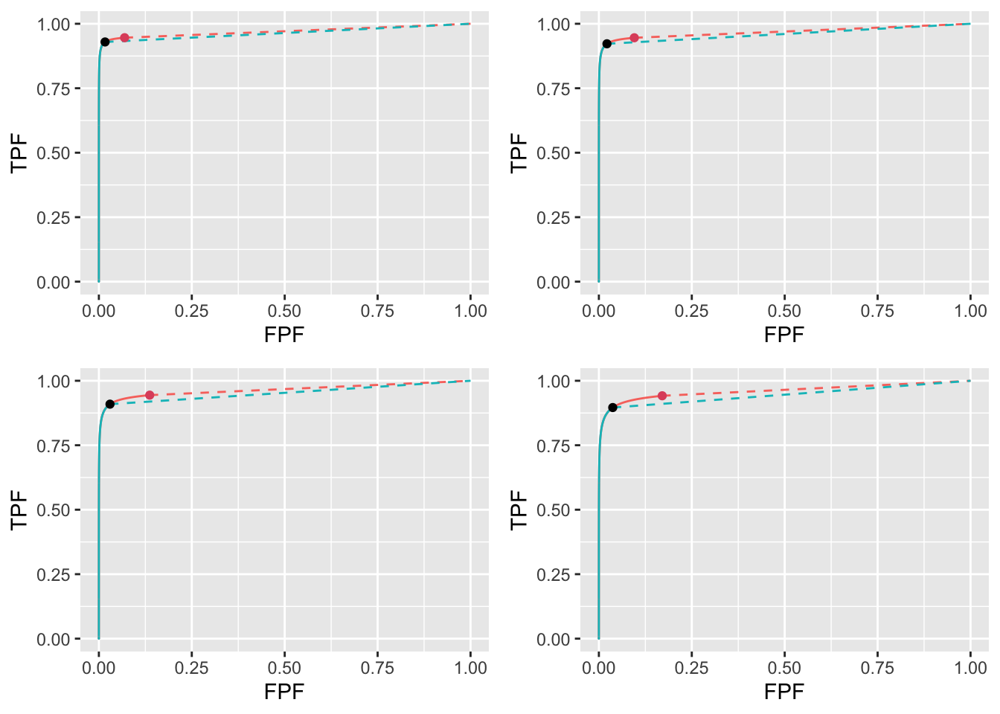
<p class="caption">(\#fig:optim-op-point-high-performance-vary-lambda-roc)High performance varying $\lambda$ ROC plots for the two optimization methods with superimposed operating points. The color coding is as in previous figures. The values of $\lambda$ are: top-left $\lambda = 1$, top-right $\lambda = 2$, bottom-left $\lambda = 5$ and bottom-right $\lambda = 10$.</p>
</div>


#### Low performance varying $\lambda$ {#optim-op-point-low-performance-vary-lambda}


```r
muArr <- c(1)
nuArr <- c(0.2)
lambdaArr <- c(1, 2, 5, 10)
```


##### Summary table


<table class="table table-striped table-hover table-condensed table-responsive" style="font-size: 10px; margin-left: auto; margin-right: auto;">
<caption style="font-size: initial !important;">(\#tab:optim-op-point-low-performance-vary-lambda-table)Results for $\mu = 1$, $\nu = 0.2$ and varying $\lambda$. Column labeling as in previous tables.</caption>
 <thead>
  <tr>
   <th style="text-align:left;"> FOM </th>
   <th style="text-align:left;"> $\lambda$ </th>
   <th style="text-align:left;"> $\zeta_1$ </th>
   <th style="text-align:left;"> $\text{wAFROC}_\text{AUC}$ </th>
   <th style="text-align:left;"> $\text{ROC}_\text{AUC}$ </th>
   <th style="text-align:left;"> $\left( \text{NLF}, \text{LLF}\right)$ </th>
  </tr>
 </thead>
<tbody>
  <tr>
   <td style="text-align:left;"> $\text{wAFROC}_\text{AUC}$ </td>
   <td style="text-align:left;"> 1 </td>
   <td style="text-align:left;"> 2.081 </td>
   <td style="text-align:left;"> 0.505 </td>
   <td style="text-align:left;"> 0.520 </td>
   <td style="text-align:left;"> (0.019, 0.028) </td>
  </tr>
  <tr>
   <td style="text-align:left;">  </td>
   <td style="text-align:left;"> 2 </td>
   <td style="text-align:left;"> 2.795 </td>
   <td style="text-align:left;"> 0.501 </td>
   <td style="text-align:left;"> 0.505 </td>
   <td style="text-align:left;"> (0.005, 0.007) </td>
  </tr>
  <tr>
   <td style="text-align:left;">  </td>
   <td style="text-align:left;"> 5 </td>
   <td style="text-align:left;"> 3.718 </td>
   <td style="text-align:left;"> 0.500 </td>
   <td style="text-align:left;"> 0.500 </td>
   <td style="text-align:left;"> (0.001, 0.001) </td>
  </tr>
  <tr>
   <td style="text-align:left;">  </td>
   <td style="text-align:left;"> 10 </td>
   <td style="text-align:left;"> 4.412 </td>
   <td style="text-align:left;"> 0.500 </td>
   <td style="text-align:left;"> 0.500 </td>
   <td style="text-align:left;"> (0.000, 0.000) </td>
  </tr>
  <tr>
   <td style="text-align:left;"> Youden-index </td>
   <td style="text-align:left;"> 1 </td>
   <td style="text-align:left;"> 0.284 </td>
   <td style="text-align:left;"> 0.423 </td>
   <td style="text-align:left;"> 0.587 </td>
   <td style="text-align:left;"> (0.388, 0.153) </td>
  </tr>
  <tr>
   <td style="text-align:left;">  </td>
   <td style="text-align:left;"> 2 </td>
   <td style="text-align:left;"> 0.734 </td>
   <td style="text-align:left;"> 0.380 </td>
   <td style="text-align:left;"> 0.566 </td>
   <td style="text-align:left;"> (0.463, 0.121) </td>
  </tr>
  <tr>
   <td style="text-align:left;">  </td>
   <td style="text-align:left;"> 5 </td>
   <td style="text-align:left;"> 1.237 </td>
   <td style="text-align:left;"> 0.335 </td>
   <td style="text-align:left;"> 0.542 </td>
   <td style="text-align:left;"> (0.540, 0.081) </td>
  </tr>
  <tr>
   <td style="text-align:left;">  </td>
   <td style="text-align:left;"> 10 </td>
   <td style="text-align:left;"> 1.568 </td>
   <td style="text-align:left;"> 0.309 </td>
   <td style="text-align:left;"> 0.528 </td>
   <td style="text-align:left;"> (0.585, 0.057) </td>
  </tr>
</tbody>
</table>


##### FROC


<div class="figure">
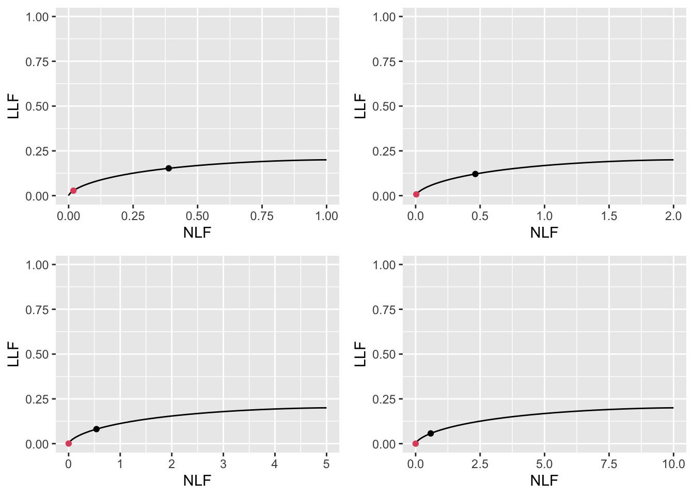
<p class="caption">(\#fig:optim-op-point-low-performance-vary-lambda-froc)Low performance varying $\lambda$ FROC plots with superimposed operating points. The red dot corresponds to $\text{wAFROC}_\text{AUC}$ optimization and the black dot to Youden-index optimization. The values of $\lambda$ are: top-left $\lambda = 1$, top-right $\lambda = 2$, bottom-left $\lambda = 5$ and bottom-right $\lambda = 10$.</p>
</div>


##### wAFROC


<div class="figure">
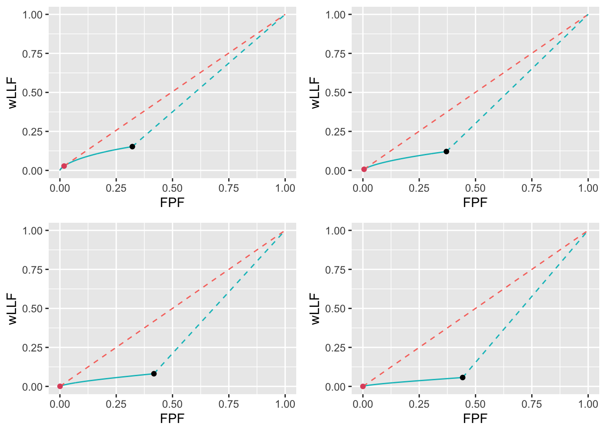
<p class="caption">(\#fig:optim-op-point-low-performance-vary-lambda-wafroc)Low performance varying $\lambda$ wAFROC plots for the two optimization methods with superimposed operating points. The color coding is as in previous figures. The values of $\lambda$ are: top-left $\lambda = 1$, top-right $\lambda = 2$, bottom-left $\lambda = 5$ and bottom-right $\lambda = 10$.</p>
</div>


##### ROC


<div class="figure">
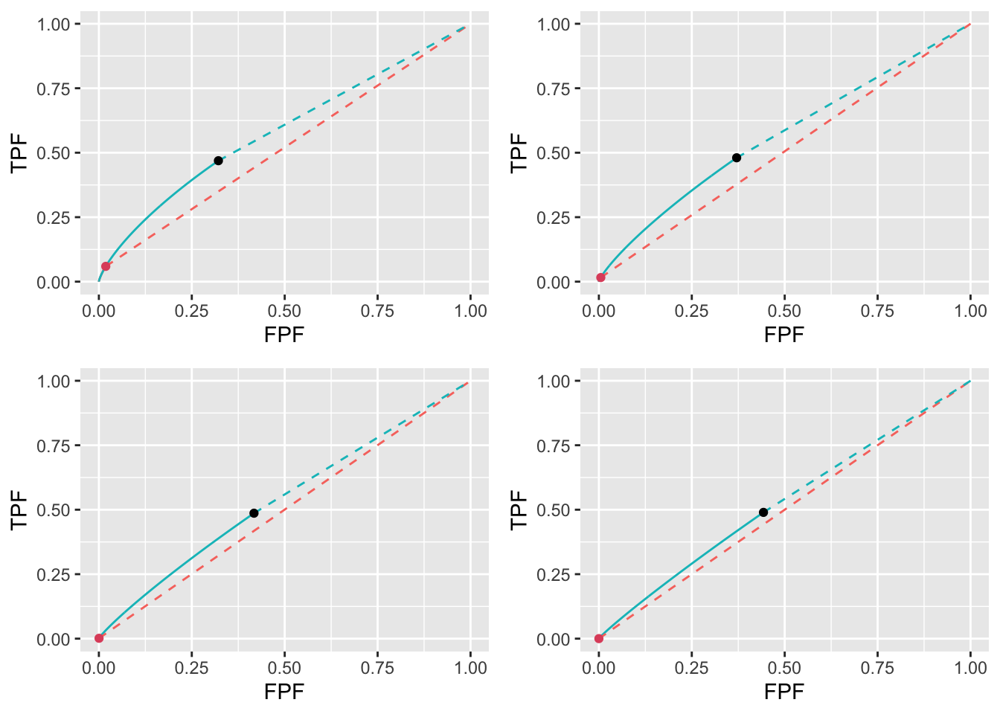
<p class="caption">(\#fig:optim-op-point-low-performance-vary-lambda-roc)Low performance varying $\lambda$ ROC plots for the two optimization methods with superimposed operating points. The color coding is as in previous figures. The values of $\lambda$ are: top-left $\lambda = 1$, top-right $\lambda = 2$, bottom-left $\lambda = 5$ and bottom-right $\lambda = 10$.</p>
</div>


#### High performance varying $\nu$ {#optim-op-point-high-performance-vary-nu}


```r
muArr <- c(4)
lambdaArr <- c(1)
nuArr <- c(0.6, 0.7, 0.8, 0.9)
```


##### Summary table


<table class="table table-striped table-hover table-condensed table-responsive" style="font-size: 10px; margin-left: auto; margin-right: auto;">
<caption style="font-size: initial !important;">(\#tab:optim-op-point-high-performance-vary-nu-table)Results for $\mu = 4$, $\lambda = 1$ and varying $\nu$. Column labeling as in previous tables.</caption>
 <thead>
  <tr>
   <th style="text-align:left;"> FOM </th>
   <th style="text-align:left;"> $\nu$ </th>
   <th style="text-align:left;"> $\zeta_1$ </th>
   <th style="text-align:left;"> $\text{wAFROC}_\text{AUC}$ </th>
   <th style="text-align:left;"> $\text{ROC}_\text{AUC}$ </th>
   <th style="text-align:left;"> $\left( \text{NLF}, \text{LLF}\right)$ </th>
  </tr>
 </thead>
<tbody>
  <tr>
   <td style="text-align:left;"> $\text{wAFROC}_\text{AUC}$ </td>
   <td style="text-align:left;"> 0.6 </td>
   <td style="text-align:left;"> 1.905 </td>
   <td style="text-align:left;"> 0.788 </td>
   <td style="text-align:left;"> 0.855 </td>
   <td style="text-align:left;"> (0.028, 0.589) </td>
  </tr>
  <tr>
   <td style="text-align:left;">  </td>
   <td style="text-align:left;"> 0.7 </td>
   <td style="text-align:left;"> 1.796 </td>
   <td style="text-align:left;"> 0.839 </td>
   <td style="text-align:left;"> 0.898 </td>
   <td style="text-align:left;"> (0.036, 0.690) </td>
  </tr>
  <tr>
   <td style="text-align:left;">  </td>
   <td style="text-align:left;"> 0.8 </td>
   <td style="text-align:left;"> 1.663 </td>
   <td style="text-align:left;"> 0.890 </td>
   <td style="text-align:left;"> 0.936 </td>
   <td style="text-align:left;"> (0.048, 0.792) </td>
  </tr>
  <tr>
   <td style="text-align:left;">  </td>
   <td style="text-align:left;"> 0.9 </td>
   <td style="text-align:left;"> 1.463 </td>
   <td style="text-align:left;"> 0.942 </td>
   <td style="text-align:left;"> 0.970 </td>
   <td style="text-align:left;"> (0.072, 0.895) </td>
  </tr>
  <tr>
   <td style="text-align:left;"> Youden-index </td>
   <td style="text-align:left;"> 0.6 </td>
   <td style="text-align:left;"> 2.063 </td>
   <td style="text-align:left;"> 0.788 </td>
   <td style="text-align:left;"> 0.852 </td>
   <td style="text-align:left;"> (0.020, 0.584) </td>
  </tr>
  <tr>
   <td style="text-align:left;">  </td>
   <td style="text-align:left;"> 0.7 </td>
   <td style="text-align:left;"> 2.080 </td>
   <td style="text-align:left;"> 0.837 </td>
   <td style="text-align:left;"> 0.894 </td>
   <td style="text-align:left;"> (0.019, 0.681) </td>
  </tr>
  <tr>
   <td style="text-align:left;">  </td>
   <td style="text-align:left;"> 0.8 </td>
   <td style="text-align:left;"> 2.100 </td>
   <td style="text-align:left;"> 0.886 </td>
   <td style="text-align:left;"> 0.931 </td>
   <td style="text-align:left;"> (0.018, 0.777) </td>
  </tr>
  <tr>
   <td style="text-align:left;">  </td>
   <td style="text-align:left;"> 0.9 </td>
   <td style="text-align:left;"> 2.124 </td>
   <td style="text-align:left;"> 0.935 </td>
   <td style="text-align:left;"> 0.964 </td>
   <td style="text-align:left;"> (0.017, 0.873) </td>
  </tr>
</tbody>
</table>


##### FROC


<div class="figure">
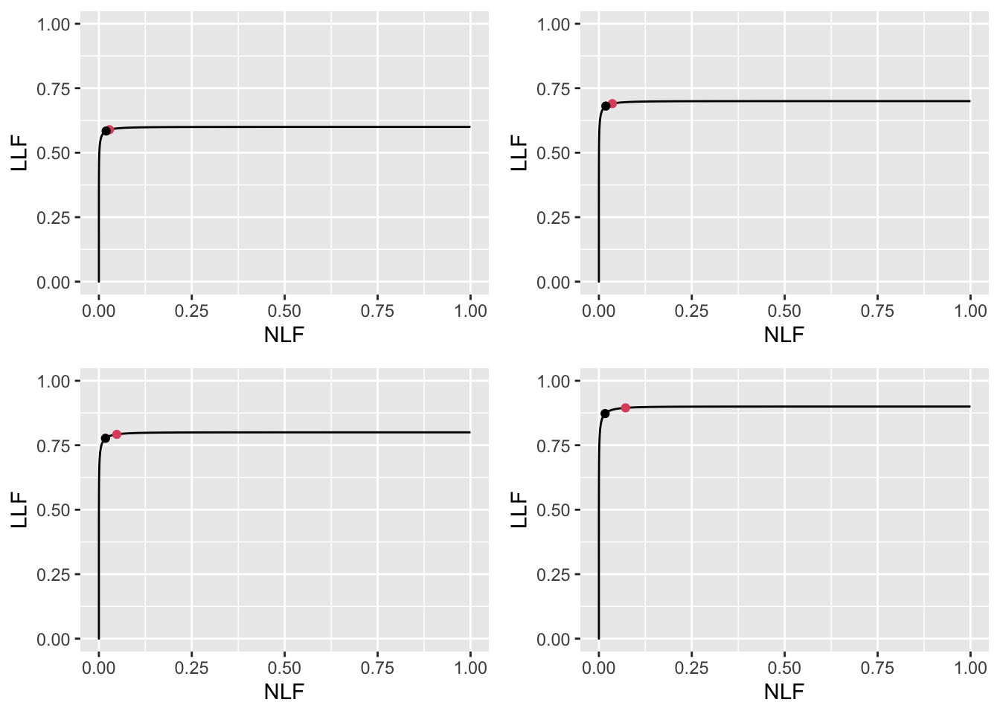
<p class="caption">(\#fig:optim-op-point-high-performance-vary-nu-froc)High performance varying $\nu$ FROC plots with superimposed operating points. The red dot corresponds to $\text{wAFROC}_\text{AUC}$ optimization and the black dot to Youden-index optimization. The values of $\nu$ are: top-left $\nu = 0.6$, top-right $\nu = 0.7$, bottom-left $\nu = 0.8$ and bottom-right $\nu = 0.9$.</p>
</div>


##### wAFROC


<div class="figure">
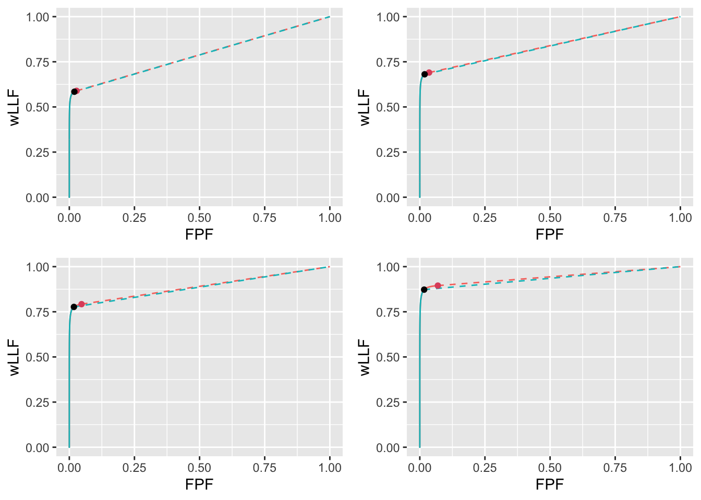
<p class="caption">(\#fig:optim-op-point-high-performance-vary-nu-wafroc)High performance varying $\nu$ wAFROC plots for the two optimization methods with superimposed operating points. The color coding is as in previous figures. The values of $\nu$ are: top-left $\nu = 0.6$, top-right $\nu = 0.7$, bottom-left $\nu = 0.8$ and bottom-right $\nu = 0.9$.</p>
</div>


##### ROC


<div class="figure">
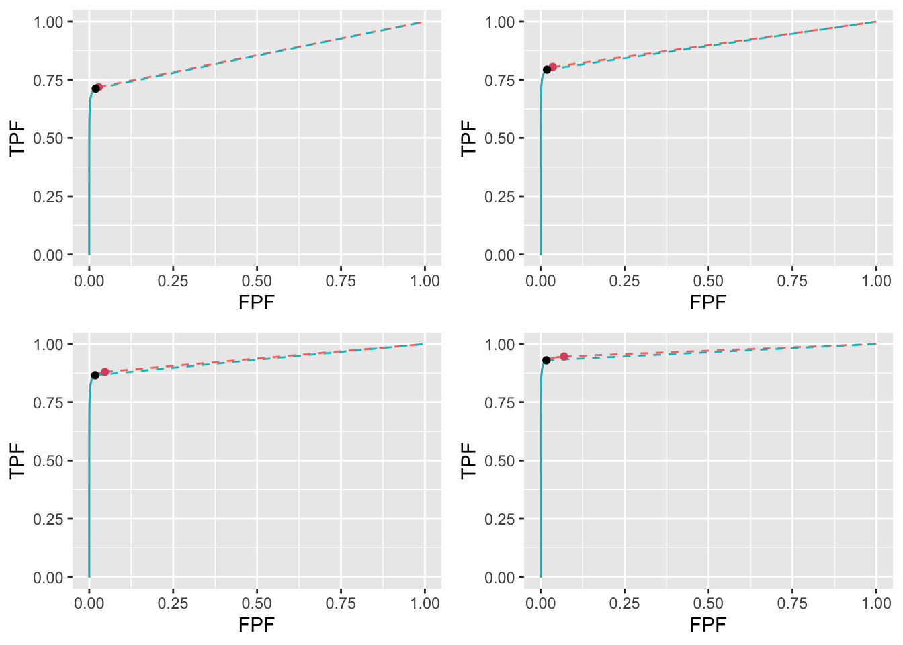
<p class="caption">(\#fig:optim-op-point-high-performance-vary-nu-roc)High performance varying $\nu$ ROC plots for the two optimization methods with superimposed operating points. The color coding is as in previous figures. The values of $\nu$ are: top-left $\nu = 0.6$, top-right $\nu = 0.7$, bottom-left $\nu = 0.8$ and bottom-right $\nu = 0.9$.</p>
</div>


#### Low performance varying $\nu$ {#optim-op-point-low-performance-vary-nu}


```r
muArr <- c(1)
lambdaArr <- c(10)
nuArr <- c(0.1, 0.2, 0.3, 0.4)
```


##### Summary table


<table class="table table-striped table-hover table-condensed table-responsive" style="font-size: 10px; margin-left: auto; margin-right: auto;">
<caption style="font-size: initial !important;">(\#tab:optim-op-point-low-performance-vary-nu-table)Results for $\mu = 1$, $\lambda = 10$ and varying $\nu$. Column labeling as in previous tables.</caption>
 <thead>
  <tr>
   <th style="text-align:left;"> FOM </th>
   <th style="text-align:left;"> $\nu$ </th>
   <th style="text-align:left;"> $\zeta_1$ </th>
   <th style="text-align:left;"> $\text{wAFROC}_\text{AUC}$ </th>
   <th style="text-align:left;"> $\text{ROC}_\text{AUC}$ </th>
   <th style="text-align:left;"> $\left( \text{NLF}, \text{LLF}\right)$ </th>
  </tr>
 </thead>
<tbody>
  <tr>
   <td style="text-align:left;"> $\text{wAFROC}_\text{AUC}$ </td>
   <td style="text-align:left;"> 0.1 </td>
   <td style="text-align:left;"> 5.000 </td>
   <td style="text-align:left;"> 0.500 </td>
   <td style="text-align:left;"> 0.500 </td>
   <td style="text-align:left;"> (0.000, 0.000) </td>
  </tr>
  <tr>
   <td style="text-align:left;">  </td>
   <td style="text-align:left;"> 0.2 </td>
   <td style="text-align:left;"> 4.412 </td>
   <td style="text-align:left;"> 0.500 </td>
   <td style="text-align:left;"> 0.500 </td>
   <td style="text-align:left;"> (0.000, 0.000) </td>
  </tr>
  <tr>
   <td style="text-align:left;">  </td>
   <td style="text-align:left;"> 0.3 </td>
   <td style="text-align:left;"> 4.006 </td>
   <td style="text-align:left;"> 0.500 </td>
   <td style="text-align:left;"> 0.500 </td>
   <td style="text-align:left;"> (0.000, 0.000) </td>
  </tr>
  <tr>
   <td style="text-align:left;">  </td>
   <td style="text-align:left;"> 0.4 </td>
   <td style="text-align:left;"> 3.718 </td>
   <td style="text-align:left;"> 0.500 </td>
   <td style="text-align:left;"> 0.501 </td>
   <td style="text-align:left;"> (0.001, 0.001) </td>
  </tr>
  <tr>
   <td style="text-align:left;"> Youden-index </td>
   <td style="text-align:left;"> 0.1 </td>
   <td style="text-align:left;"> 1.563 </td>
   <td style="text-align:left;"> 0.292 </td>
   <td style="text-align:left;"> 0.514 </td>
   <td style="text-align:left;"> (0.590, 0.029) </td>
  </tr>
  <tr>
   <td style="text-align:left;">  </td>
   <td style="text-align:left;"> 0.2 </td>
   <td style="text-align:left;"> 1.568 </td>
   <td style="text-align:left;"> 0.309 </td>
   <td style="text-align:left;"> 0.528 </td>
   <td style="text-align:left;"> (0.585, 0.057) </td>
  </tr>
  <tr>
   <td style="text-align:left;">  </td>
   <td style="text-align:left;"> 0.3 </td>
   <td style="text-align:left;"> 1.572 </td>
   <td style="text-align:left;"> 0.325 </td>
   <td style="text-align:left;"> 0.542 </td>
   <td style="text-align:left;"> (0.580, 0.085) </td>
  </tr>
  <tr>
   <td style="text-align:left;">  </td>
   <td style="text-align:left;"> 0.4 </td>
   <td style="text-align:left;"> 1.577 </td>
   <td style="text-align:left;"> 0.342 </td>
   <td style="text-align:left;"> 0.556 </td>
   <td style="text-align:left;"> (0.574, 0.113) </td>
  </tr>
</tbody>
</table>


##### FROC


<div class="figure">
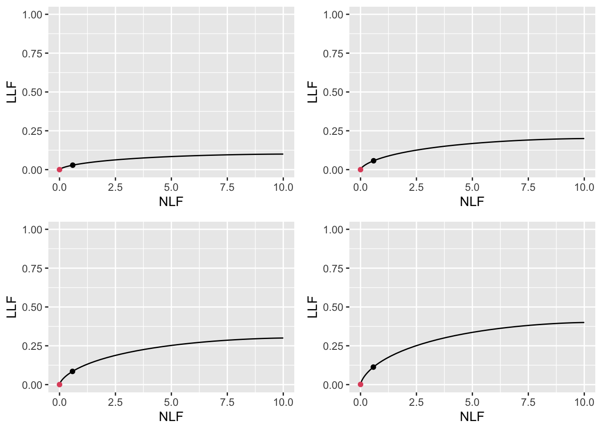
<p class="caption">(\#fig:optim-op-point-low-performance-vary-nu-froc)Low performance varying $\nu$ FROC plots with superimposed operating points. The red dot corresponds to $\text{wAFROC}_\text{AUC}$ optimization and the black dot to Youden-index optimization. The values of $\nu$ are: top-left $\nu = 0.1$, top-right $\nu = 0.2$, bottom-left $\nu = 0.3$ and bottom-right $\nu = 0.4$.</p>
</div>


##### wAFROC


<div class="figure">

<p class="caption">(\#fig:optim-op-point-low-performance-vary-nu-wafroc)Low performance varying $\nu$ wAFROC plots for the two optimization methods with superimposed operating points. The color coding is as in previous figures. The values of $\nu$ are: top-left $\nu = 0.1$, top-right $\nu = 0.2$, bottom-left $\nu = 0.3$ and bottom-right $\nu = 0.4$.</p>
</div>


##### ROC


<div class="figure">

<p class="caption">(\#fig:optim-op-point-low-performance-vary-nu-roc)Low performance varying $\nu$ ROC plots for the two optimization methods with superimposed operating points. The color coding is as in previous figures. The values of $\nu$ are: top-left $\nu = 0.1$, top-right $\nu = 0.2$, bottom-left $\nu = 0.3$ and bottom-right $\nu = 0.4$.</p>
</div>


