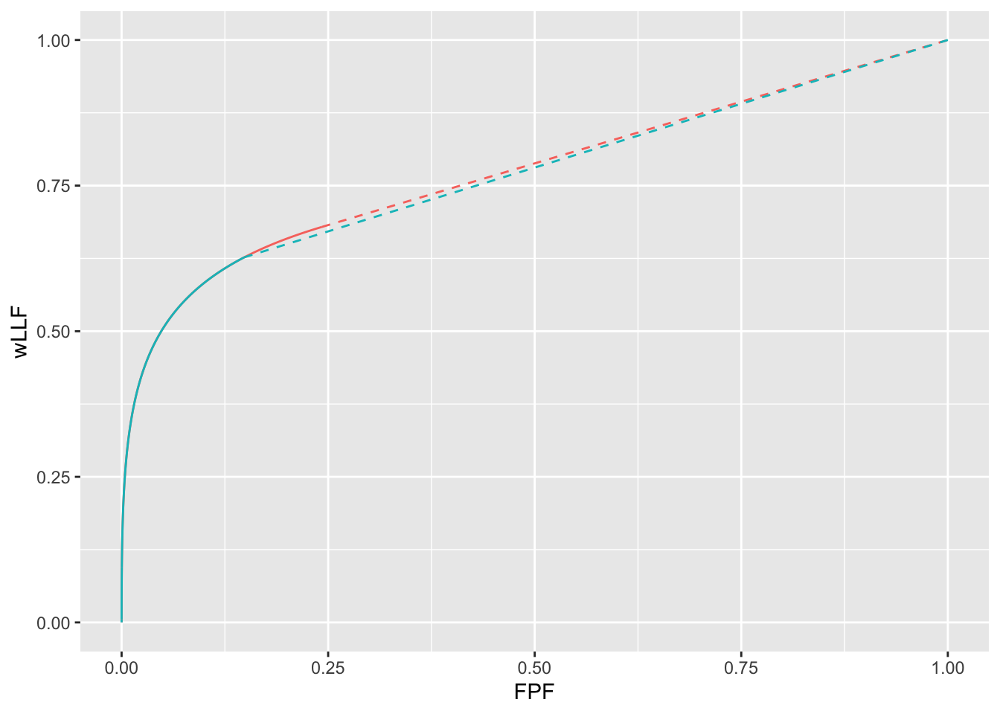

# Optimal operating point {#optim-op-point}

---
output:
  rmarkdown::pdf_document:
    fig_caption: yes        
    includes:  
      in_header: R/learn/my_header.tex
---


## TBA How much finished {#optim-op-point-how-much-finished}
95%

Discussion needs more work; coding is done


## Introduction {#optim-op-point-intro}

A familiar problem for the computer aided detection or artificial intelligence (CAD/AI) algorithm designer is how to determine the optimal reporting threshold of the algorithm. Assuming that designer level mark-rating FROC data is available for the algorithm, a decision needs to be made as to the optimal reporting threshold, i.e., the minimum rating of a mark before it is shown to the radiologist (or the next stage of the AI algorithm -- in what follows references to CAD apply equally to AI algorithms). 

The problem has been solved in the context of ROC analysis [@metz1978rocmethodology], namely, the optimal operating point on the ROC corresponds to a slope determined by disease prevalence and the cost of decisions in the four basic binary paradigm categories: true and false positives and true and false negatives. In practice the costs are difficult to quantify. However, for equal numbers of diseased and non-diseased cases and equal costs it can be shown that the slope of the ROC curve at the optimal point is unity. For a proper ROC curve this corresponds to the point that maximizes the Youden-index [@youden1950index]. Typically it is maximized at the point that is closest to the (0,1) corner of the ROC. 

Lacking a procedure for determining it analytically CAD designers, in consultation with radiologists, set site-specific reporting thresholds. For example, if radiologists at a site are comfortable with more false marks as the price of potentially greater lesion-level sensitivity, the reporting threshold for them is adjusted downward. 

This chapter describes an analytic method for finding the optimal reporting threshold. The method is based on maximizing AUC (area under curve) of the wAFROC curve. The method is compared to the Youden-index based method.   


## Methods {#optim-op-point-methods}

Terminology: 
Non-lesion localizations = NLs, i.e., location level "false positives".
Lesion localizations = LLs, i.e., location level "true positives".
Latent marks = perceived suspicious regions that are not necessarily marked.

Background on the radiological search model (RSM) is provided in Chapter \@ref(rsm). The model predicts ROC, FROC and wAFROC curves: these are completely defined by the four RSM parameters -- $\mu, \lambda, \nu, \zeta_1$ -- which have the following meanings:

* The $\mu$ parameter, $\mu \ge 0$, is the perceptual signal-to-noise-ratio of lesions. Higher values of $\mu$ lead to increased separation of two unit variance normal distributions determining the ratings of perceived NLs and LL. As $\mu$ increases performance of the algorithm increases.

* The $\lambda$ parameter, $\lambda \ge 0$, determines the mean number of latent NLs per case. Higher values lead to more latent NL marks per case and decreased performance. 

* The $\nu$ parameter, $0 \le \nu \le 1$, determines the probability of latent LLs, i.e., the probability that any present lesion will be perceived. Higher values of $\nu$ lead to more latent LL marks and increased performance.  

* The $\zeta_1$ parameter determines if a suspicious region found by the algorithm is actually marked: if the z-sample exceeds $\zeta_1$ the latent mark is actually marked. Higher values correspond to more stringent reporting criteria and fewer reported marks. Performance, as measured by wAFROC-AUC or the Youden-index, peaks at an optimal value of $\zeta_1$. The purpose of this chapter is to investigate this effect, i.e., given values of the other RSM parameters and the figure of merit to be optimized (i.e., wAFROC-AUC or the Youden-index), to determine the optimal value of $\zeta_1$.  


In the following sections each of the first three parameters is varied in turn and the corresponding optimal $\zeta_1$ determined by maximizing one of two figures of merit (FOMs), namely, the wAFROC-AUC and the Youden-index. The value maximizing wAFROC-AUC is denoted $\zeta_{1} \left ( 1, \mu, \lambda, \nu \right )$ and that maximizing the Youden-index is denoted $\zeta_{1} \left ( 2, \mu, \lambda, \nu \right )$. 


The wAFROC figure of merit is implemented in the `RJafroc` function `UtilAnalyticalAucsRSM`. It is calculated using Eqn. \@ref(eq:rsm-pred-wllf). The Youden-index is defined as sensitivity plus specificity minus 1. Sensitivity is implemented in function `RSM_yROC` and specificity is the complement of `RSM_xROC`. 


## Varying $\lambda$ optimizations{#optim-op-point-vary-lambda}

In the following $f$ is used as an abbreviation, with $f = 1$ denoting the wAFROC-AUC figure of merit and $f = 2$ denoting the Youden-index.


```r
mu <- 2
nuP <- 0.9
lambdaPArr <- c(1, 2, 5, 10)
lesDistr <- c(0.5, 0.5)
relWeights <- c(0.5, 0.5)
```


For $\mu = 2$ and $\nu = 0.9$ both wAFROC-AUC and Youden-index optimizations were performed for $\lambda = 1, 2, 5, 10$. It is assumed that half of the diseased cases contain one lesion, the rest contain two lesions, and the lesions are assigned equal weights (i.e., equal clinical importance).


The following quantities were calculated:

1. $\zeta_{1} \left ( f, \mu, \lambda, \nu \right )$: the optimal thresholds;

1. $\text{wAFROC} \left (f, \mu, \lambda, \nu \right )$: the value of the wAFROC-AUC. For consistency we always report wAFROC-AUC even when the optimized quantity is the Youden-index;

1. $\text{ROC} \left (f, \mu, \lambda, \nu \right )$: the AUCs under the ROC curves; 

1. $\text{NLF} \left (f, \mu, \lambda, \nu \right )$ and $\text{LLF} \left (f, \mu, \lambda, \nu \right )$: the coordinates of the optimal operating points on the FROC curve.   


Table \@ref(tab:optim-op-point-table-vary-lambda) summarizes the results. The column labeled FOM shows the quantity being maximized (wAFROC-AUC or the Youden-index), the column labeled $\lambda$ lists the 4 values of $\lambda$, $\zeta_1$ is the optimal value of $\zeta_1$ that maximizes the chosen figure of merit. The column labeled wAFROC is the AUC under the wAFROC curve, the column labeled ROC is the AUC under the ROC curve, and $\left( \text{NLF}, \text{LLF}\right)$ is the operating point on the FROC curve corresponding to the value of $\zeta_1$ in the third column. All quantities in columns 3 through 6 are functions of $f, \mu, \lambda, \nu$. 


<table class="table" style="margin-left: auto; margin-right: auto;">
<caption>(\#tab:optim-op-point-table-vary-lambda)Summary of optimization results for $\mu = 2$, $\nu = 0.9$ and 4 values of $\lambda$. FOM = figure of merit.</caption>
 <thead>
  <tr>
   <th style="text-align:left;"> FOM </th>
   <th style="text-align:left;"> $\lambda$ </th>
   <th style="text-align:left;"> $\zeta_1$ </th>
   <th style="text-align:left;"> $\text{wAFROC}$ </th>
   <th style="text-align:left;"> $\text{ROC}$ </th>
   <th style="text-align:left;"> $\left( \text{NLF}, \text{LLF}\right)$ </th>
  </tr>
 </thead>
<tbody>
  <tr>
   <td style="text-align:left;"> wAFROC </td>
   <td style="text-align:left;"> 1 </td>
   <td style="text-align:left;"> -0.007 </td>
   <td style="text-align:left;"> 0.864 </td>
   <td style="text-align:left;"> 0.929 </td>
   <td style="text-align:left;"> (0.503, 0.880) </td>
  </tr>
  <tr>
   <td style="text-align:left;"> wAFROC </td>
   <td style="text-align:left;"> 2 </td>
   <td style="text-align:left;"> 0.474 </td>
   <td style="text-align:left;"> 0.809 </td>
   <td style="text-align:left;"> 0.900 </td>
   <td style="text-align:left;"> (0.636, 0.843) </td>
  </tr>
  <tr>
   <td style="text-align:left;"> wAFROC </td>
   <td style="text-align:left;"> 5 </td>
   <td style="text-align:left;"> 1.272 </td>
   <td style="text-align:left;"> 0.715 </td>
   <td style="text-align:left;"> 0.840 </td>
   <td style="text-align:left;"> (0.509, 0.690) </td>
  </tr>
  <tr>
   <td style="text-align:left;"> wAFROC </td>
   <td style="text-align:left;"> 10 </td>
   <td style="text-align:left;"> 1.856 </td>
   <td style="text-align:left;"> 0.645 </td>
   <td style="text-align:left;"> 0.774 </td>
   <td style="text-align:left;"> (0.317, 0.502) </td>
  </tr>
  <tr>
   <td style="text-align:left;"> Youden </td>
   <td style="text-align:left;"> 1 </td>
   <td style="text-align:left;"> 1.095 </td>
   <td style="text-align:left;"> 0.831 </td>
   <td style="text-align:left;"> 0.899 </td>
   <td style="text-align:left;"> (0.137, 0.735) </td>
  </tr>
  <tr>
   <td style="text-align:left;"> Youden </td>
   <td style="text-align:left;"> 2 </td>
   <td style="text-align:left;"> 1.362 </td>
   <td style="text-align:left;"> 0.781 </td>
   <td style="text-align:left;"> 0.865 </td>
   <td style="text-align:left;"> (0.173, 0.664) </td>
  </tr>
  <tr>
   <td style="text-align:left;"> Youden </td>
   <td style="text-align:left;"> 5 </td>
   <td style="text-align:left;"> 1.695 </td>
   <td style="text-align:left;"> 0.705 </td>
   <td style="text-align:left;"> 0.811 </td>
   <td style="text-align:left;"> (0.225, 0.558) </td>
  </tr>
  <tr>
   <td style="text-align:left;"> Youden </td>
   <td style="text-align:left;"> 10 </td>
   <td style="text-align:left;"> 1.934 </td>
   <td style="text-align:left;"> 0.644 </td>
   <td style="text-align:left;"> 0.766 </td>
   <td style="text-align:left;"> (0.265, 0.474) </td>
  </tr>
</tbody>
</table>


Inspection of this table reveals the following effects:

1. For either FOM, as $\lambda$ increases the optimal threshold $\zeta_{1} \left ( f, \mu, \lambda, \nu \right )$ increases and $\text{wAFROC} \left ( f, \mu, \lambda, \nu \right )$, $\text{ROC} \left ( f, \mu, \lambda, \nu \right )$ and $\text{LLF} \left ( f, \mu, \lambda, \nu \right )$ decrease. Equivalently, CAD performance decreases, regardless of how it is measured (i.e., wAFROC-AUC, ROC-AUC or optimal lesion level sensitivity). This is due to two reinforcing effects: performance goes down with increasing numbers of NLs per case (more location level false positives are generated) and performance goes down with increasing optimal reporting threshold (see Section \@ref(rsm-pred-roc-curve-aucs-zeta1) for explanation of the $\zeta_1$ dependence of AUC performance). [$\text{NLF} \left ( f, \mu, \lambda, \nu \right )$, the lesion level "false positive rate", does not have an unambiguous dependence. For $f = 1$ it peaks at $\lambda = 2$ while for  $f = 2$ it increases as $\lambda$ increases.] 

1. The wAFROC based based optimal thresholds are smaller than the corresponding Youden-index based optimal thresholds, i.e., $\zeta_{1} \left ( 1, \mu, \lambda, \nu \right ) < \zeta_{1} \left ( 2, \mu, \lambda, \nu \right )$. A small threshold corresponds to a less strict reporting criterion.

1. For fixed $\mu, \lambda, \nu$ the operating point on the FROC for $f = 2$ is below that corresponding to $f = 1$:
    + $\text{NLF} \left (2, \mu, \lambda, \nu \right ) < \text{NLF} \left (1, \mu, \lambda, \nu \right )$ and 
    + $\text{LLF} \left (2, \mu, \lambda, \nu \right ) < \text{LLF} \left (1, \mu, \lambda, \nu \right )$. 
    + The difference decreases with increasing $\lambda$. 
    + These effects are illustrated in Fig. \@ref(fig:optim-op-point-vary-lambda-froc).

1. For fixed $\mu, \lambda, \nu$ the Youden-index based optimization yields lesser performance than the corresponding wAFROC-AUC based optimization:

    + $\text{wAFROC} \left (2, \mu, \lambda, \nu \right ) < \text{wAFROC} \left (1, \mu, \lambda, \nu \right )$ and 
    + $\text{ROC} \left (2, \mu, \lambda, \nu \right ) < \text{ROC} \left (1, \mu, \lambda, \nu \right )$. 
    + The difference decreases with increasing $\lambda$. 
    + These effects are illustrated in Fig. \@ref(fig:optim-op-point-vary-lambda-wafroc).


The third effect is illustrated by the FROC plots with superimposed operating points for varying $\lambda$ shown in Fig. \@ref(fig:optim-op-point-vary-lambda-froc). The black dots correspond to $f = 1$ and the red dots correspond to $f = 2$. The black dots are consistently above the red dots and the separation of the dots is greatest for $\lambda = 1$ and smallest for $\lambda = 10$. The last statement will be generalized later to the following: *the difference in optimal thresholds found by the two optimization methods is greatest for intermediate levels of performance and smallest for very poor or very good performance.*  

The FROC plots also illustrate the decrease in $\text{LLF} \left ( f, \mu, \lambda, \nu \right )$ with increasing $\lambda$, which is part of the first effect (the black dots move to smaller ordinates, as do the red dots). However, the accompanying change in $\text{NLF} \left ( f, \mu, \lambda, \nu \right )$ rules out, based on the FROC, an unambiguous determination of the direction of the change in overall performance. 

 


<div class="figure">

<p class="caption">(\#fig:optim-op-point-vary-lambda-froc)FROC plots with superimposed operating points for varying $\lambda$. The black dot corresponds to wAFROC AUC optimization and the red dot to Youden-index optimization.</p>
</div>


The decrease in $\text{wAFROC} \left ( f, \mu, \lambda, \nu \right )$ with increasing $\lambda$ (contained in the first effect) is illustrated in Fig. \@ref(fig:optim-op-point-vary-lambda-wafroc) which shows wAFROC plots for the two optimization methods. Each plot consists of a continuous line followed by a dashed line. The "green red red-dashed curve" ^[Since the two plots overlap in the initial steep portion of the plots it is necessary to adopt a perhaps unconventional color coding convention in describing each plot: the green red red-dashed curve starts off as the continuous green line - which overlaps a red line - followed by the continuous red line and completed by the dashed red line.] corresponds to wAFROC-AUC optimization and the green green-dashed curve corresponds to Youden-index optimization. 

The transition from continuous to dashed is determined by the value of $\zeta_1$. The transition occurs at a higher value of $\zeta_1$ for the Youden-index optimization, which is the second effect. The stricter Youden-index based reporting threshold sacrifices some of the area under the wAFROC. This results in lower performance particularly for the lower values of $\lambda$. At the highest value of $\lambda$ the values of optimal $\zeta_1$ are similar and both methods make similar predictions, as evident from the wAFROC plots.


<div class="figure">

<p class="caption">(\#fig:optim-op-point-vary-lambda-wafroc)wAFROC plots for the two optimization methods: the green red red-dashed curve curve corresponds to wAFROC-AUC optimization and the green green-dashed curve corresponds to Youden-index optimization. For all except the highest value of $\lambda$ the wAFROC optimizations yield greater performance than do the Youden-index based optimizations.</p>
</div>


The decrease in $\text{ROC} \left ( f, \mu, \lambda, \nu \right )$ with increasing $\lambda$ (also contained in the first effect) is illustrated in Fig. \@ref(fig:optim-op-point-vary-lambda-roc) which shows RSM-predicted ROC plots for the two optimization methods. Again, each plot consists of a continuous line followed by a dashed line and a similar color-coding convention is used as in Fig. \@ref(fig:optim-op-point-vary-lambda-wafroc). The ROC plots show similar dependencies as described for the wAFROC plots: specifically, the stricter Youden-index based reporting threshold sacrifices some of the area under the ROC resulting in lower performance, particularly for the lower values of $\lambda$. 


<div class="figure">

<p class="caption">(\#fig:optim-op-point-vary-lambda-roc)ROC plots for the two optimization methods: the green-red-red-dashed curve corresponds to wAFROC-AUC optimization and the green-green curve corresponds to Youden-index optimization.</p>
</div>


Since the ROC curves show a similar dependence as the wAFROC curves one may wonder why not maximize the AUC under the ROC, instead of AUC under the wAFROC? It can be shown that as long as one restricts to proper ROC models, this will always yield $\zeta_1 = -\infty$. For a proper ROC curve the slope decreases monotonically as the operating point moves up the curve and at each point the slope is greater than that of the straight line connecting the point to (1,1). This geometry ensures that AUC under any curve with a finite $\zeta_1$ is smaller than that under the full curve. Therefore maximum AUC can only be attained by choosing $\zeta_1 = -\infty$. This is illustrated in Fig. \@ref(fig:binormal-model-threshold-dependence-2) which shows a binormal ROC curve corresponding to $a = 2$ and $b = 1$, which is a proper ROC curve. The dot is the operating point corresponding to $\zeta_1 = 1.5$. In the region above the dot the continuous curve is above the dotted line, meaning performance of an observer who adopts a finite $\zeta_1$ is less than performance of an observer who rates all cases, i.e., adopts $\zeta_1 = -\infty$.


<div class="figure">

<p class="caption">(\#fig:binormal-model-threshold-dependence-2)In the region above the dot the proper curve is above the dotted line, meaning performance of an observer who adopts a finite $\zeta_1$ is less than performance of an observer who adopts $\zeta_1 = -\infty$.</p>
</div>


## Varying $\nu$ and $\mu$ optimizations{#optim-op-point-vary-nu-mu}

Results of varying $\nu$ are in Appendix 1 \@ref(optim-op-point-vary-nu). Table \@ref(tab:optim-op-point-table-vary-nu) summarizes the results. FROC plots are in Fig. \@ref(fig:optim-op-point-vary-nu-froc), wAFROC plots are in Fig. \@ref(fig:optim-op-point-vary-nu-wafroc) and ROC plots are in Fig. \@ref(fig:optim-op-point-vary-nu-roc). The results are similar to those described previously for varying $\lambda$ but, since unlike increasing $\lambda$ increasing $\nu$ has the opposite effect, namely increasing performance, the directions of the effects are reversed. Another difference is that the Youden-index based optimal threshold is almost independent of $\nu$. The main result, that wAFROC optimization yields lower reporting theshold and higher performance than Youden-index optimization, remains unchanged and the difference between the two methods decreases as performance decreases.


Results of varying $\mu$ are in Appendix 2 \@ref(optim-op-point-vary-mu). Table \@ref(tab:optim-op-point-table-vary-mu) summarizes the results. FROC plots are in Fig. \@ref(fig:optim-op-point-vary-mu-froc), wAFROC plots are in Fig. \@ref(fig:optim-op-point-vary-mu-wafroc) and ROC plots are in Fig. \@ref(fig:optim-op-point-vary-mu-roc). The results are similar to those described previously for varying $\lambda$ but, since unlike increasing $\lambda$ increasing $\mu$ has the opposite effect, namely increasing performance, the directions of the effects are reversed. The main result, that wAFROC optimization yields lower reporting theshold and higher performance than Youden-index optimization, remains unchanged. This example illustrates that the difference in wAFROC and ROC AUCs between the two methods decreases as performance increases.


Summarizing, regardless of how performance is changed, wAFROC optimization yields lower reporting theshold and higher performance than Youden-index optimization. The difference between the two methods is large for intermediate values of performance, e.g., ROC-AUC, but decreases for either very poor (ROC-AUC below ~ 0.7) or very good  (ROC-AUC above ~ 0.95).


## Using the method {#optim-op-point-how-to-use-method}
Assume that one has designed an algorithmic observer that has been optimized with respect to all other parameters except the reporting threshold. At this point the algorithm reports every suspicious region, no matter how low the malignancy index. The mark-rating pairs are entered into a `RJafroc` format Excel input file, as describe [here](https://dpc10ster.github.io/RJafrocQuickStart/quick-start-froc-data-format.html). The next step is to read the data file -- `DfReadDataFile()` -- convert it to an ROC dataset -- `DfFroc2Roc()` -- and then perform a radiological search model (RSM) fit to the dataset using function `FitRsmRoc()`. This yields the necessary $\lambda, \mu, \nu$ parameters. These values are used to perform the computations described in this chapter to determine the optimal reporting threshold. The RSM parameter values and the reporting threshold determine the optimal reporting point on the FROC curve. The designer sets the algorithm to only report marks with confidence levels exceeding this threshold. 


## A CAD application {#optim-op-point-application}

The standalone CAD LROC dataset described in [@hupse2013standalone] was used to create the quasi-FROC ROC-AUC equivalent dataset embedded in `RJafroc` as object `datasetCadSimuFroc`. In the following code the first reader for this dataset, corresponding to CAD, is extracted using `DfExtractDataset` (the other reader data, corresponding to radiologists who interpreted the same cases, are not used here). The function `DfFroc2Roc` converts this to an ROC dataset. The function `DfBinDataset` bins the data to about 7 bins. Each diseased case contains one lesion: `lesDistr = c(1)`. `FitRsmRoc` fits the binned ROC dataset to the radiological search model (RSM). Object `fit` contains the RSM parameters required to perform the optimizations described in previous sections.  


```r
ds <- datasetCadSimuFroc
dsCad <- DfExtractDataset(ds, rdrs = 1)
dsCadRoc <- DfFroc2Roc(dsCad)
dsCadRocBinned <- DfBinDataset(dsCadRoc, opChType = "ROC")
lesDistr <- c(1)
relWeights <- c(1)
fit <- FitRsmRoc(dsCadRocBinned, lesDistr)
cat("fitted values: \nmu = ", fit$mu, 
    "\nlambda = ", fit$lambdaP, 
    "\nnu = ", fit$nuP, "\n")
#> fitted values: 
#> mu =  2.755784 
#> lambda =  6.778332 
#> nu =  0.8033886
```


Table \@ref(tab:optim-op-point-table4) summarizes the results.


<table class="table" style="margin-left: auto; margin-right: auto;">
<caption>(\#tab:optim-op-point-table4)Summary of optimization results for example FROC dataset. The wAFROC column always displays wAFROC-AUC, even though the optimized quantity may the Youden-index, as in the last four rows.</caption>
 <thead>
  <tr>
   <th style="text-align:left;"> FOM </th>
   <th style="text-align:left;"> $\lambda$ </th>
   <th style="text-align:left;"> $\zeta_1$ </th>
   <th style="text-align:left;"> $\text{wAFROC}$ </th>
   <th style="text-align:left;"> $\text{ROC}$ </th>
   <th style="text-align:left;"> $\left( \text{NLF}, \text{LLF}\right)$ </th>
  </tr>
 </thead>
<tbody>
  <tr>
   <td style="text-align:left;"> wAFROC </td>
   <td style="text-align:left;"> 6.778 </td>
   <td style="text-align:left;"> 1.739 </td>
   <td style="text-align:left;"> 0.774 </td>
   <td style="text-align:left;"> 0.815 </td>
   <td style="text-align:left;"> (0.278, 0.679) </td>
  </tr>
  <tr>
   <td style="text-align:left;"> Youden </td>
   <td style="text-align:left;"> 6.778 </td>
   <td style="text-align:left;"> 1.982 </td>
   <td style="text-align:left;"> 0.770 </td>
   <td style="text-align:left;"> 0.798 </td>
   <td style="text-align:left;"> (0.161, 0.627) </td>
  </tr>
</tbody>
</table>


The wAFROC-AUC based optimization yields slightly larger figure of merit as measured by wAFROC-AUC, see Fig. \@ref(fig:optim-op-point-application-wafroc) and larger figure of merit as measured by ROC-AUC, see Fig. \@ref(fig:optim-op-point-application-roc).  


Fig. \@ref(fig:optim-op-point-application-froc) shows FROC curves with superimposed optimal operating points. 


<div class="figure">

<p class="caption">(\#fig:optim-op-point-application-froc)FROC plots with superposed optimal operating points. Black dot is using wAFROC optimization and red dot is using Youden-index optimization.</p>
</div>


<div class="figure">

<p class="caption">(\#fig:optim-op-point-application-wafroc)The color coding is as in previous figures. The two wAFROC-AUCs are 0.774 (wAFROC optimization) and 0.770 (Youden-index optimization).</p>
</div>


<div class="figure">

<p class="caption">(\#fig:optim-op-point-application-roc)The color coding is as in previous figures. The two ROC-AUCs are 0.815 (wAFROC-AUC optimization) and 0.798 (Youden-index optimization).</p>
</div>


## Discussion {#optim-op-point-discussion}

In Table \@ref(tab:optim-op-point-table-vary-lambda) the $\lambda$ parameter controls the average number of perceived NLs per case. For $\lambda = 1$ there is, on average, one perceived NL for every non-diseased case and the optimal wAFROC-based threshold is $\zeta_{1;1,\mu, \lambda = 1, \nu}$ = -0.007. For $\lambda = 10$ there are ten perceived NLs for every non-diseased case and the optimal wAFROC-based threshold is $\zeta_{1;1,\mu, \lambda = 10, \nu}$ = 1.856. The increase in $\zeta_1$ should make sense to CAD algorithm designers: with increasing numbers of NLs per case it is necessary to increase the reporting threshold (i.e., adopt a stricter criteria) if only because otherwise the reader would be subjected to 10 times the number of NLs/case for the same number of LLs/case. 

The ROC-AUCs are reported as a check of the less familiar wAFROC-AUC figure of merit. The ordering of the two optimization methods is independent of whether it is measured via the wAFROC-AUC or the ROC-AUC: either way the wAFROC-AUC optimizations yield higher AUC values and higher operating points on the FROC than the corresponding Youden-index optimizations.   


## Appendix 1: Varying $\nu$ optimizations{#optim-op-point-vary-nu}

For $\mu = 2$ and $\lambda = 1$ optimizations were performed for $\nu = 0.6, 0.7, 0.8, 0.9$. 


```r
mu <- 2
lambdaP <- 1
nuPArr <- c(0.6, 0.7, 0.8, 0.9)
lesDistr <- c(0.5,0.5)
relWeights <- c(0.5,0.5)
```


<table class="table" style="margin-left: auto; margin-right: auto;">
<caption>(\#tab:optim-op-point-table-vary-nu)Summary of optimization results for $\mu = 2$, $\lambda = 1$ and 4 values of $\nu$.</caption>
 <thead>
  <tr>
   <th style="text-align:left;"> FOM </th>
   <th style="text-align:left;"> $\nu$ </th>
   <th style="text-align:left;"> $\zeta_1$ </th>
   <th style="text-align:left;"> $\text{wAFROC}$ </th>
   <th style="text-align:left;"> $\text{ROC}$ </th>
   <th style="text-align:left;"> $\left( \text{NLF}, \text{LLF}\right)$ </th>
  </tr>
 </thead>
<tbody>
  <tr>
   <td style="text-align:left;"> wAFROC </td>
   <td style="text-align:left;"> 0.6 </td>
   <td style="text-align:left;"> 0.888 </td>
   <td style="text-align:left;"> 0.701 </td>
   <td style="text-align:left;"> 0.804 </td>
   <td style="text-align:left;"> (0.187, 0.520) </td>
  </tr>
  <tr>
   <td style="text-align:left;"> wAFROC </td>
   <td style="text-align:left;"> 0.7 </td>
   <td style="text-align:left;"> 0.674 </td>
   <td style="text-align:left;"> 0.751 </td>
   <td style="text-align:left;"> 0.851 </td>
   <td style="text-align:left;"> (0.250, 0.635) </td>
  </tr>
  <tr>
   <td style="text-align:left;"> wAFROC </td>
   <td style="text-align:left;"> 0.8 </td>
   <td style="text-align:left;"> 0.407 </td>
   <td style="text-align:left;"> 0.805 </td>
   <td style="text-align:left;"> 0.893 </td>
   <td style="text-align:left;"> (0.342, 0.756) </td>
  </tr>
  <tr>
   <td style="text-align:left;"> wAFROC </td>
   <td style="text-align:left;"> 0.9 </td>
   <td style="text-align:left;"> -0.007 </td>
   <td style="text-align:left;"> 0.864 </td>
   <td style="text-align:left;"> 0.929 </td>
   <td style="text-align:left;"> (0.503, 0.880) </td>
  </tr>
  <tr>
   <td style="text-align:left;"> Youden </td>
   <td style="text-align:left;"> 0.6 </td>
   <td style="text-align:left;"> 1.022 </td>
   <td style="text-align:left;"> 0.700 </td>
   <td style="text-align:left;"> 0.797 </td>
   <td style="text-align:left;"> (0.153, 0.502) </td>
  </tr>
  <tr>
   <td style="text-align:left;"> Youden </td>
   <td style="text-align:left;"> 0.7 </td>
   <td style="text-align:left;"> 1.044 </td>
   <td style="text-align:left;"> 0.745 </td>
   <td style="text-align:left;"> 0.835 </td>
   <td style="text-align:left;"> (0.148, 0.581) </td>
  </tr>
  <tr>
   <td style="text-align:left;"> Youden </td>
   <td style="text-align:left;"> 0.8 </td>
   <td style="text-align:left;"> 1.069 </td>
   <td style="text-align:left;"> 0.788 </td>
   <td style="text-align:left;"> 0.868 </td>
   <td style="text-align:left;"> (0.143, 0.659) </td>
  </tr>
  <tr>
   <td style="text-align:left;"> Youden </td>
   <td style="text-align:left;"> 0.9 </td>
   <td style="text-align:left;"> 1.095 </td>
   <td style="text-align:left;"> 0.831 </td>
   <td style="text-align:left;"> 0.899 </td>
   <td style="text-align:left;"> (0.137, 0.735) </td>
  </tr>
</tbody>
</table>


Table \@ref(tab:optim-op-point-table-vary-nu) summarizes the results.

1. For wAFROC-AUC FOM as $\nu$ increases the optimal threshold *decreases* and both $\text{wAFROC} \left ( 1, \mu, \lambda, \nu \right )$ and $\text{ROC} \left ( 1, \mu, \lambda, \nu \right )$ *increase*. CAD performance increases, regardless of how it is measured. Performance increases with increasing numbers of LLs per case and this effect is reinforced by performance going up with decreasing optimal reporting threshold. [Since both $\text{LLF} \left ( f, \mu, \lambda, \nu \right )$ and $\text{NLF} \left ( f, \mu, \lambda, \nu \right )$ increase with increasing $\nu$, neither FROC-curve based measure has an unambiguous interpretation.  

1. The wAFROC based based optimal thresholds are smaller than the corresponding Youden-index based optimal thresholds, i.e., $\zeta_{1} \left ( 1, \mu, \lambda, \nu \right ) < \zeta_{1} \left ( 2, \mu, \lambda, \nu \right )$. A smaller threshold corresponds to a less strict reporting criterion.

1. For fixed $\mu, \lambda, \nu$ the operating point on the FROC for $f = 2$ is below that corresponding to $f = 1$:
    + $\text{NLF} \left (2, \mu, \lambda, \nu \right ) < \text{NLF} \left (1, \mu, \lambda, \nu \right )$ and 
    + $\text{LLF} \left (2, \mu, \lambda, \nu \right ) < \text{LLF} \left (1, \mu, \lambda, \nu \right )$. 
    + The difference increases with increasing $\nu$. 
    + These effects are illustrated in Fig. \@ref(fig:optim-op-point-vary-nu-froc).

1. For fixed $\mu, \lambda, \nu$ the Youden-index based optimization yields lesser performance than the corresponding wAFROC-AUC based optimization:

    + $\text{wAFROC} \left (2, \mu, \lambda, \nu \right ) < \text{wAFROC} \left (1, \mu, \lambda, \nu \right )$ and 
    + $\text{ROC} \left (2, \mu, \lambda, \nu \right ) < \text{ROC} \left (1, \mu, \lambda, \nu \right )$. 
    + The difference decreases with decreasing $\nu$. 
    + These effects are illustrated in Fig. \@ref(fig:optim-op-point-vary-nu-wafroc).


The third effect is illustrated by the FROC plots with superimposed operating points for varying $\nu$ shown in Fig. \@ref(fig:optim-op-point-vary-nu-froc). The black dots are consistently above the red dots and the separation of the dots is greatest for $\nu = 0.9$ and smallest for $\nu = 0.6$. The difference in optimal thresholds found by the two optimization methods is greatest for poor performance.  

The FROC plots also illustrate the decrease in $\text{LLF} \left ( f, \mu, \lambda, \nu \right )$ with increasing $\nu$ (the black dots move to larger ordinates, as do the red dots). However, the accompanying change in $\text{NLF} \left ( f, \mu, \lambda, \nu \right )$ rules out an FROC curve based unambiguous determination of the direction of the change in overall performance. 

 


<div class="figure">

<p class="caption">(\#fig:optim-op-point-vary-nu-froc)FROC plots with superimposed operating points for varying $\nu$. The black dot corresponds to wAFROC AUC optimization and the red dot to Youden-index optimization.</p>
</div>


<div class="figure">

<p class="caption">(\#fig:optim-op-point-vary-nu-wafroc)wAFROC plots for the two optimization methods. The color coding is as in previous figures.</p>
</div>


<div class="figure">

<p class="caption">(\#fig:optim-op-point-vary-nu-roc)ROC plots for the two optimization methods. The color coding is as in previous figures.</p>
</div>


## Appendix 2: Varying $\mu$ optimizations{#optim-op-point-vary-mu}

For $\lambda = 1$ and $\nu = 0.9$ optimizations were performed for $\mu = 1, 2, 3, 4$. 


```r
lambdaP <- 1
nuP <- 0.9
muArr <- c(1, 2, 3, 4)
lesDistr <- c(0.5,0.5)
relWeights <- c(0.5,0.5)
```


<table class="table" style="margin-left: auto; margin-right: auto;">
<caption>(\#tab:optim-op-point-table-vary-mu)Summary of optimization results for $\lambda = 1$, $\nu = 0.9$  and 4 values of $\mu$.</caption>
 <thead>
  <tr>
   <th style="text-align:left;"> FOM </th>
   <th style="text-align:left;"> $\mu$ </th>
   <th style="text-align:left;"> $\zeta_1$ </th>
   <th style="text-align:left;"> $\text{wAFROC}$ </th>
   <th style="text-align:left;"> $\text{ROC}$ </th>
   <th style="text-align:left;"> $\left( \text{NLF}, \text{LLF}\right)$ </th>
  </tr>
 </thead>
<tbody>
  <tr>
   <td style="text-align:left;"> wAFROC </td>
   <td style="text-align:left;"> 1 </td>
   <td style="text-align:left;"> -1.663 </td>
   <td style="text-align:left;"> 0.745 </td>
   <td style="text-align:left;"> 0.850 </td>
   <td style="text-align:left;"> (0.952, 0.897) </td>
  </tr>
  <tr>
   <td style="text-align:left;"> wAFROC </td>
   <td style="text-align:left;"> 2 </td>
   <td style="text-align:left;"> -0.007 </td>
   <td style="text-align:left;"> 0.864 </td>
   <td style="text-align:left;"> 0.929 </td>
   <td style="text-align:left;"> (0.503, 0.880) </td>
  </tr>
  <tr>
   <td style="text-align:left;"> wAFROC </td>
   <td style="text-align:left;"> 3 </td>
   <td style="text-align:left;"> 0.808 </td>
   <td style="text-align:left;"> 0.922 </td>
   <td style="text-align:left;"> 0.961 </td>
   <td style="text-align:left;"> (0.210, 0.887) </td>
  </tr>
  <tr>
   <td style="text-align:left;"> wAFROC </td>
   <td style="text-align:left;"> 4 </td>
   <td style="text-align:left;"> 1.463 </td>
   <td style="text-align:left;"> 0.942 </td>
   <td style="text-align:left;"> 0.970 </td>
   <td style="text-align:left;"> (0.072, 0.895) </td>
  </tr>
  <tr>
   <td style="text-align:left;"> Youden </td>
   <td style="text-align:left;"> 1 </td>
   <td style="text-align:left;"> 0.462 </td>
   <td style="text-align:left;"> 0.704 </td>
   <td style="text-align:left;"> 0.815 </td>
   <td style="text-align:left;"> (0.322, 0.634) </td>
  </tr>
  <tr>
   <td style="text-align:left;"> Youden </td>
   <td style="text-align:left;"> 2 </td>
   <td style="text-align:left;"> 1.095 </td>
   <td style="text-align:left;"> 0.831 </td>
   <td style="text-align:left;"> 0.899 </td>
   <td style="text-align:left;"> (0.137, 0.735) </td>
  </tr>
  <tr>
   <td style="text-align:left;"> Youden </td>
   <td style="text-align:left;"> 3 </td>
   <td style="text-align:left;"> 1.629 </td>
   <td style="text-align:left;"> 0.903 </td>
   <td style="text-align:left;"> 0.945 </td>
   <td style="text-align:left;"> (0.052, 0.823) </td>
  </tr>
  <tr>
   <td style="text-align:left;"> Youden </td>
   <td style="text-align:left;"> 4 </td>
   <td style="text-align:left;"> 2.124 </td>
   <td style="text-align:left;"> 0.935 </td>
   <td style="text-align:left;"> 0.964 </td>
   <td style="text-align:left;"> (0.017, 0.873) </td>
  </tr>
</tbody>
</table>


Table \@ref(tab:optim-op-point-table-vary-mu) summarizes the results.

1. For either FOM as $\mu$ increases the optimal threshold *increases* and both $\text{wAFROC} \left ( f, \mu, \lambda, \nu \right )$ and $\text{ROC} \left ( f, \mu, \lambda, \nu \right )$ *increase*. CAD performance increases, regardless of how it is measured. Performance increases with increasing separation of the sampling distributions of NLs and LLs and the negative effect of increasing optimal reporting thresholds is not enough to overcome this. [Since $\text{LLF} \left ( f, \mu, \lambda, \nu \right )$ is relatively constant while $\text{NLF} \left ( f, \mu, \lambda, \nu \right )$ decreases sharply with increasing $\mu$, this is one example where an FROC-curve based measure does have an unambiguous interpretation, namely performance is higher for the larger values of $\mu$.  

1. The wAFROC based based optimal thresholds are smaller than the corresponding Youden-index based optimal thresholds. A smaller threshold corresponds to a less strict reporting criterion and greater wAFROC-AUC and ROC-AUC performance.

1. For fixed $\mu, \lambda, \nu$ the operating point on the FROC for $f = 2$ is below that corresponding to $f = 1$. The difference decreases with increasing $\mu$. These effects are illustrated in Fig. \@ref(fig:optim-op-point-vary-mu-froc). The black dots are consistently above the red dots and the separation of the dots is greatest for $\mu = 1$ and smallest for $\mu = 4$.  


1. For fixed $\mu, \lambda, \nu$ the Youden-index based optimization yields lesser performance than the corresponding wAFROC-AUC based optimization. The difference decreases with increasing $\mu$. These effects are illustrated in Fig. \@ref(fig:optim-op-point-vary-mu-wafroc).


<div class="figure">

<p class="caption">(\#fig:optim-op-point-vary-mu-froc)FROC plots with superimposed operating points for varying $\mu$. The black dot corresponds to wAFROC AUC optimization and the red dot to Youden-index optimization.</p>
</div>


<div class="figure">

<p class="caption">(\#fig:optim-op-point-vary-mu-wafroc)wAFROC plots for the two optimization methods. The color coding is as in previous figures.</p>
</div>


The continuous section of each curve ends at the optimal threshold listed in Table \@ref(tab:optim-op-point-table-vary-mu), namely $\zeta_1$ = -1.663 for the green-red-red-dashed curve and $\zeta_1$ = 0.462 for the green curve. The lower performance represented by the green curve, based on Youden-index maximization, is due to the adoption of an overly strict threshold.


<div class="figure">

<p class="caption">(\#fig:optim-op-point-vary-mu-roc)ROC plots for the two optimization methods. The color coding is as in previous figures.</p>
</div>


The continuous section of each curve ends at the optimal threshold listed in Table \@ref(tab:optim-op-point-table-vary-mu). The lower performance represented by the green curve, based on Youden-index maximization, is due to the adoption of an overly strict threshold.


## References {#optim-op-point-references}
