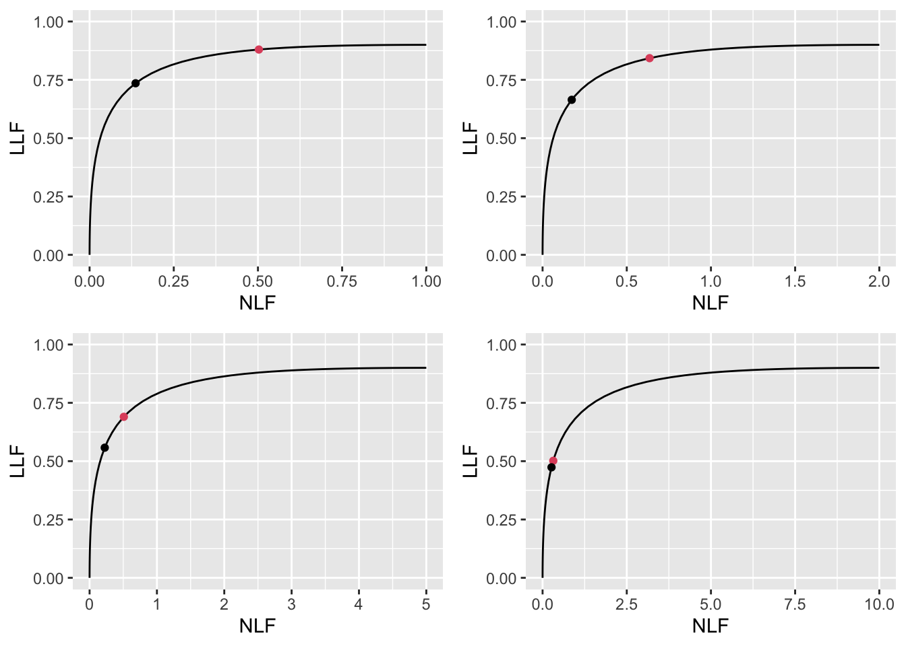

# Optimal operating point on FROC {#optim-op-point}

---
output:
  rmarkdown::pdf_document:
    fig_caption: yes        
    includes:  
      in_header: R/learn/my_header.tex
---

## TBA How much finished {#optim-op-point-how-much-finished}
80%

Discussion and Intro need more work; coding is done

## Introduction {#optim-op-point-intro}

This chapter deals with finding the optimal reporting threshold of an algorithmic observer, such as CAD/AI. We assume that designer level FROC data is available for the algorithm, i.e., the data consists of mark-rating pairs, with continuous-scale ratings, and a decision needs to be made as to the optimal reporting threshold, i.e., the minimum rating of a mark before it is shown to the radiologist. This is a familiar problem faced by a CAD/AI algorithm designer. 

The problem has been solved in the context of ROC analysis [@metz1978rocmethodology], namely, the optimal operating point on the ROC corresponds to a slope determined by disease prevalence and the cost of decisions in the four basic binary paradigm categories: true and false positives and true and false negatives. In practice the costs are difficult to quantify. However, for equal numbers of diseased and non-diseased cases and equal costs it can be shown that the slope of the ROC curve at the optimal point is unity. For a proper ROC curve this corresponds to the point that maximizes the Youden-index [@youden1950index], defined as the sum of sensitivity and specificity minus one. Typically it is maximized at the point that is closest to the (0,1) corner of the ROC. 

CAD/AI produces FROC data and lacking a procedure for setting it analytically, CAD/AI manufacturers, in consultation with radiologists, set site-specific reporting thresholds. For example, if radiologists at a site are comfortable with more false marks as the price of potentially greater lesion-level sensitivity, the reporting threshold for them is adjusted downward. 

This chapter describes an analytic method for finding the optimal reporting threshold. The method is based on maximizing AUC (area under curve) under the wAFROC curve. The method is compared to the Youden-index based method.   

## Methods {#optim-op-point-methods}

Terminology: 
Non-lesion localizations = NLs, i.e., location level "false positives".
Lesion localizations = LLs, i.e., location level "true positives".
Latent marks = perceived suspicious regions that are not necessarily marked.

Background on the radiological search model (RSM) is provided in Chapter \@ref(rsm). The model predicts ROC, FROC and wAFROC curves. These curves are completely defined by the RSM parameters -- $\lambda$, $\nu$, $\mu$ and $\zeta_1$ -- which have the following meanings:

* The $\mu$ parameter, $\mu \ge 0$, is the perceptual signal to noise ratio of lesions. Higher values of $\mu$ lead to increased separation of two unit variance normal distributions determining the ratings of perceived NLs and LL. As $\mu$ increases performance of the algorithm increases.

* The $\lambda$ parameter, $\lambda \ge 0$, determines the mean number of latent NLs per case. Higher values lead to more latent NL marks per case and decreased performance. 

* The $\nu$ parameter, $0 \le \nu \le 1$, determines the probability of latent LLs, i.e., the probability that any present lesion will be perceived. Higher values of $\nu$ lead to more latent LL marks and increased performance.  

* The $\zeta_1$ parameter determines if a suspicious region found by the algorithm is actually marked (if the z-sample exceeds $\zeta_1$ the latent mark becomes an actual mark). Higher values correspond to more stringent reporting criteria and fewer reported marks. Performance, as measured by wAFROC-AUC or the Youden-index, peaks at an optimal value of $\zeta_1$. The purpose of this chapter is to investigate this effect, i.e., given values of the other RSM parameters and the figure of merit to be optimized (i.e., wAFROC-AUC or the Youden-index), to determine the optimal value of $\zeta_1$.  

TBA (lay out rationale for following material) In the following sections each of the first three parameters is varied in turn and the corresponding optimal $\zeta_1$ determined by maximizing one of two figures of merit (FOMs), namely, the wAFROC-AUC and the Youden-index. The value maximizing wAFROC-AUC is denoted $\zeta_{1;1\mu \lambda \nu}$ and that maximizing the Youden-index is denoted $\zeta_{2;\mu \lambda \nu}$. 

The wAFROC figure of merit is implemented in the `RJafroc` function `UtilAnalyticalAucsRSM`. It was assumed that half of the diseased cases contain one lesion and the rest contain two lesions and the lesions are assigned equal weights (i.e., clinical importance).

The Youden-index is defined as the sum of sensitivity and specificity minus 1. Sensitivity is implemented in function `RSM_yROC` and specificity is `(1 - RSM_xROC)`. 

In the following $f$ is used as an index, with $f = 1$ standing for the wAFROC-AUC figure of merit and $f = 2$ for the Youden-index.

## Optimizations involving varying $\lambda$  {#optim-op-point-vary-lambda}

For $\mu = 2$ and $\nu = 0.9$ both wAFROC-AUC ($f=1$) and Youden-index ($f = 2$) optimizations were performed for $\lambda = 1, 2, 5, 10$. The following quantities were calculated:

* $\zeta_{1} \left ( f\mu \lambda \nu \right )$, the optimal thresholds resulting from the optimizations;
* $\text{wAFROC} \left (f\mu \lambda \nu \right )$, the optimal value of the wAFROC-AUC for the two types of optimizations. For consistency we always report wAFROC-AUC even when the optimized quantity is the Youden-index;
* $\text{ROC} \left (f\mu \lambda \nu \right )$, the AUCs under the ROC curves for the two optimizations;   
* $\text{NLF} \left (f\mu \lambda \nu \right )$ and $\text{LLF} \left (f\mu \lambda \nu \right )$: the coordinates of the optimal operating points on the FROC curve for two optimizations.   

Table \@ref(tab:optim-op-point-table-vary-lambda) summarizes the results. The column labeled FOM shows the quantity being maximized: wAFROC-AUC or the Youden-index, the column labeled $\lambda$ lists the 4 values of $\lambda$, $\zeta_1$ is the optimal value of $\zeta_1$ that maximizes the chosen figure of merit. The column labeled wAFROC is the AUC under the wAFROC curve, the column labeled ROC is the AUC under the ROC curve, and $\left( \text{NLF}, \text{LLF}\right)$ is the optimal operating point on the FROC curve. All quantities in columns 3 through 6 are functions of $f\mu \lambda \nu$. 

<table class="table" style="margin-left: auto; margin-right: auto;">
<caption>(\#tab:optim-op-point-table-vary-lambda)Summary of optimization results for $\mu = 2$, $\nu = 0.9$ and 4 values of $\lambda$.</caption>
 <thead>
  <tr>
   <th style="text-align:left;"> FOM </th>
   <th style="text-align:left;"> $\lambda$ </th>
   <th style="text-align:left;"> $\zeta_1$ </th>
   <th style="text-align:left;"> $\text{wAFROC}$ </th>
   <th style="text-align:left;"> $\text{ROC}$ </th>
   <th style="text-align:left;"> $\left( \text{NLF}, \text{LLF}\right)$ </th>
  </tr>
 </thead>
<tbody>
  <tr>
   <td style="text-align:left;"> wAFROC </td>
   <td style="text-align:left;"> 1 </td>
   <td style="text-align:left;"> -0.007 </td>
   <td style="text-align:left;"> 0.864 </td>
   <td style="text-align:left;"> 0.929 </td>
   <td style="text-align:left;"> (0.503, 0.880) </td>
  </tr>
  <tr>
   <td style="text-align:left;"> wAFROC </td>
   <td style="text-align:left;"> 2 </td>
   <td style="text-align:left;"> 0.474 </td>
   <td style="text-align:left;"> 0.809 </td>
   <td style="text-align:left;"> 0.900 </td>
   <td style="text-align:left;"> (0.636, 0.843) </td>
  </tr>
  <tr>
   <td style="text-align:left;"> wAFROC </td>
   <td style="text-align:left;"> 5 </td>
   <td style="text-align:left;"> 1.272 </td>
   <td style="text-align:left;"> 0.715 </td>
   <td style="text-align:left;"> 0.840 </td>
   <td style="text-align:left;"> (0.509, 0.690) </td>
  </tr>
  <tr>
   <td style="text-align:left;"> wAFROC </td>
   <td style="text-align:left;"> 10 </td>
   <td style="text-align:left;"> 1.856 </td>
   <td style="text-align:left;"> 0.645 </td>
   <td style="text-align:left;"> 0.774 </td>
   <td style="text-align:left;"> (0.317, 0.502) </td>
  </tr>
  <tr>
   <td style="text-align:left;"> Youden </td>
   <td style="text-align:left;"> 1 </td>
   <td style="text-align:left;"> 1.095 </td>
   <td style="text-align:left;"> 0.831 </td>
   <td style="text-align:left;"> 0.899 </td>
   <td style="text-align:left;"> (0.137, 0.735) </td>
  </tr>
  <tr>
   <td style="text-align:left;"> Youden </td>
   <td style="text-align:left;"> 2 </td>
   <td style="text-align:left;"> 1.362 </td>
   <td style="text-align:left;"> 0.781 </td>
   <td style="text-align:left;"> 0.865 </td>
   <td style="text-align:left;"> (0.173, 0.664) </td>
  </tr>
  <tr>
   <td style="text-align:left;"> Youden </td>
   <td style="text-align:left;"> 5 </td>
   <td style="text-align:left;"> 1.695 </td>
   <td style="text-align:left;"> 0.705 </td>
   <td style="text-align:left;"> 0.811 </td>
   <td style="text-align:left;"> (0.225, 0.558) </td>
  </tr>
  <tr>
   <td style="text-align:left;"> Youden </td>
   <td style="text-align:left;"> 10 </td>
   <td style="text-align:left;"> 1.934 </td>
   <td style="text-align:left;"> 0.644 </td>
   <td style="text-align:left;"> 0.766 </td>
   <td style="text-align:left;"> (0.265, 0.474) </td>
  </tr>
</tbody>
</table>

Inspection of this table reveals the following trends.

* For either FOM as $\lambda$ increases the optimal threshold $\zeta_{1} \left ( f\mu \lambda \nu \right )$ increases.
* The Youden-index based optimal thresholds are each higher than the corresponding wAFROC based optimal thresholds, i.e., $\zeta_{1} \left ( 1\mu \lambda \nu \right ) < \zeta_{1} \left ( 2\mu \lambda \nu \right )$. 
* For either FOM as $\lambda$ increases $\text{wAFROC} \left ( f\mu \lambda \nu \right )$, $\text{ROC} \left ( f\mu \lambda \nu \right )$ and $\text{LLF} \left ( f\mu \lambda \nu \right )$ decrease. Equivalently, CAD/AI performance decreases, regardless of how it is measured (i.e., wAFROC-AUC or ROC-AUC) and lesion level sensitivity decreases.   
* For fixed $\mu, \lambda, \nu$ the operating point on the FROC for $f = 2$ is below that corresponding to $f = 1$, i.e., $\text{NLF} \left (2\mu \lambda \nu \right ) < \text{NLF} \left (1\mu \lambda \nu \right )$ and $\text{LLF} \left (2\mu \lambda \nu \right ) < \text{LLF} \left (1\mu \lambda \nu \right )$.
* For fixed $\mu, \lambda, \nu$ the Youden-index based optimization yields lesser performance than the corresponding wAFROC-AUC based optimization; i.e., $\text{wAFROC} \left (2\mu \lambda \nu \right ) < \text{wAFROC} \left (1\mu \lambda \nu \right )$ and $\text{ROC} \left (2\mu \lambda \nu \right ) < \text{ROC} \left (1\mu \lambda \nu \right )$. However, the difference decreases with increasing $\lambda$.

All else being the same, with larger $\lambda$ overall performance is expected to be lower as confirmed by the decrease in wAFROC-AUC and ROC-AUC values. This is due to two reinforcing effects: performance goes down with increasing numbers of NLs per case (more lesion level false positives are generated) and performance goes down with increasing optimal reporting threshold (see Chapter TBA for the explanation of the $\zeta_1$ dependence of AUC performance). 

For the Youden-index optimizations the optimal thresholds are collectively higher than the corresponding wAFROC optimizations, especially for the lower values of $\lambda$: $\zeta_{1;2,\mu, \lambda = 1, \nu}$ = 1.095 and $\zeta_{1;2,\mu, \lambda = 10, \nu}$ = 1.934. This results in lower wAFROC-AUC and ROC-AUC values when using Youden-index optimizations.

### Illustrative FROC plots

TBA

(\#fig:optim-op-point-vary-lambda-froc)FROC plots with superimposed operating points for varying $\lambda$. The black dot corresponds to wAFROC AUC optimization and the red dot to Youden-index optimization.

TBA These plots illustrate the previous comments, namely, as $\lambda$ increases, the optimal operating point moves *down* the scaled curve corresponding to adoption of progressively more stringent reporting thresholds.

TBA The right panel shows the optimal operating point when the Youden-index is maximized. It has the same general features as the previous example but, taken as a whole, the group of four operating points in the right panel are below-left those in the left panel, representing higher values of optimal $\zeta_1$, i.e., more stringent reporting criteria. As seen in Table \@ref(tab:optim-op-point-table-vary-lambda) the overly strict criteria resulting from using Youden-index optimizations, lead to lower true performance: i.e., lower wAFROC-AUC and lower ROC-AUC. It also yields lower values of $\text{LLF}$, i.e., fewer correctly localized lesions.

### Illustrative wAFROC plots

Fig. \@ref(fig:optim-op-point-vary-lambda-wafroc) shows wAFROC plots for the two optimization methods. Each plot consists of a continuous line followed by a dashed line. The "green-red-red-dashed curve" ^[Since the two plots overlap in the initial steep portion of the plots it is necessary to adopt a perhaps unconventional color coding convention in describing each plot: the green-red-red-dashed curve starts off as the continuous green line - which overlaps a red line - followed by the continuous red line and completed by the dashed red line.] corresponds to wAFROC-AUC optimization and the green-green-dashed curve corresponds to Youden-index optimization. 

The transition from continuous to dashed is determined by the value of $\zeta_1$. It occurs at a higher value of $\zeta_1$ for the Youden-index optimization, Table \@ref(tab:optim-op-point-table-vary-lambda). The stricter reporting threshold sacrifices some of the area under the wAFROC resulting in lower performance, particularly for the lower values of $\lambda$. At the highest value of $\lambda$ the values of optimal $\zeta_1$ are similar and both methods make similar predictions: the corresponding wAFROC-AUCs are 0.645 and  0.644.

(\#fig:optim-op-point-vary-lambda-wafroc)wAFROC plots for the two optimization methods: the green-red-red-dashed curve corresponds to wAFROC-AUC optimization and the green-green curve corresponds to Youden-index optimization.

The continuous section of each curve ends at the optimal threshold listed in Table \@ref(tab:optim-op-point-table-vary-lambda), namely $\zeta_1$ = -0.007 for the green-red-red-dashed curve and $\zeta_1$ = 1.095 for the green curve. The lower performance represented by the green curve, based on Youden-index maximization, is due to the adoption of an overly strict threshold.

### Illustrative ROC plots

To confirm true performance one compares ROC curves.    

TBA ROC curves for wAFROC-AUC and Youden-index optimizations: both curves correspond to $\mu = 2$, $\nu = 1$ and $\lambda = 1$. The optimal reporting theshold $\zeta_1$ is determined by the selected FOM. The green-red-red-dashed curve corresponds to FOM = wAFROC-AUC and the green curve corresponds to FOM = Youden-index. The stricter reporting threshold found by the Youden-index based method sacrifices a considerable amount of area under the ROC.  The two ROC-AUCs are 0.929 and 0.899, respectively.

(\#fig:optim-op-point-vary-lambda-roc)ROC plots for the two optimization methods: the green-red-red-dashed curve corresponds to wAFROC-AUC optimization and the green-green curve corresponds to Youden-index optimization.

The continuous section of each curve ends at the optimal threshold listed in Table \@ref(tab:optim-op-point-table-vary-lambda). The lower performance represented by the green curve, based on Youden-index maximization, is due to the adoption of an overly strict threshold.

## Discussion {#optim-op-point-discussion}

In Table \@ref(tab:optim-op-point-table-vary-lambda) the $\lambda$ parameter controls the average number of perceived NLs per case. For $\lambda = 1$ there is, on average, one perceived NL for every non-diseased case and the optimal wAFROC-based threshold is $\zeta_{1;1,\mu, \lambda = 1, \nu}$ = -0.007. For $\lambda = 10$ there are ten perceived NLs for every non-diseased case and the optimal wAFROC-based threshold is $\zeta_{1;1,\mu, \lambda = 10, \nu}$ = 1.856. The increase in $\zeta_1$ should make sense to CAD/AI algorithm designers: with increasing numbers of NLs per case it is necessary to increase the reporting threshold (i.e., adopt a stricter criteria) if only because otherwise the reader would be subjected to 10 times the number of NLs/case for the same number of LLs/case. 

The ROC-AUCs are reported as a check of the less familiar wAFROC-AUC figure of merit. The ordering of the two optimization methods is independent of whether it is measured via the wAFROC-AUC or the ROC-AUC: either way the wAFROC-AUC optimizations yield higher AUC values and higher operating points on the FROC than the corresponding Youden-index optimizations.   

## Appendix 1: Optimizations involving varying $\nu$  {#optim-op-point-vary-nu}

For $\mu = 2$ and $\lambda = 1$ optimizations were performed for $\nu = 0.6, 0.7, 0.8, 0.9$. 

Table \@ref(tab:optim-op-point-table-vary-nu) summarizes these results. The column labeled FOM shows the quantity being maximized, $\nu$ corresponds to the 4 values of $\nu$, $\zeta_1$ is the optimal value of $\zeta_1$ that maximizes the chosen figure of merit. All quantities in columns 3 through 6 are functions of $f\mu \lambda \nu$, where f = 1 for wAFROC and f = 2 for Youden-index. The column labeled wAFROC is the AUC under the wAFROC curve, the column labeled ROC is the AUC under the ROC curve, and $\left( \text{NLF}, \text{LLF}\right)$ is the optimal operating point on the FROC curve. 

<table class="table" style="margin-left: auto; margin-right: auto;">
<caption>(\#tab:optim-op-point-table-vary-nu)Summary of optimization results for $\mu = 2$, $\lambda = 1$ and 4 values of $\nu$.</caption>
 <thead>
  <tr>
   <th style="text-align:left;"> FOM </th>
   <th style="text-align:left;"> $\nu$ </th>
   <th style="text-align:left;"> $\zeta_1$ </th>
   <th style="text-align:left;"> $\text{wAFROC}$ </th>
   <th style="text-align:left;"> $\text{ROC}$ </th>
   <th style="text-align:left;"> $\left( \text{NLF}, \text{LLF}\right)$ </th>
  </tr>
 </thead>
<tbody>
  <tr>
   <td style="text-align:left;"> wAFROC </td>
   <td style="text-align:left;"> 0.6 </td>
   <td style="text-align:left;"> 0.888 </td>
   <td style="text-align:left;"> 0.701 </td>
   <td style="text-align:left;"> 0.804 </td>
   <td style="text-align:left;"> (0.187, 0.520) </td>
  </tr>
  <tr>
   <td style="text-align:left;"> wAFROC </td>
   <td style="text-align:left;"> 0.7 </td>
   <td style="text-align:left;"> 0.674 </td>
   <td style="text-align:left;"> 0.751 </td>
   <td style="text-align:left;"> 0.851 </td>
   <td style="text-align:left;"> (0.250, 0.635) </td>
  </tr>
  <tr>
   <td style="text-align:left;"> wAFROC </td>
   <td style="text-align:left;"> 0.8 </td>
   <td style="text-align:left;"> 0.407 </td>
   <td style="text-align:left;"> 0.805 </td>
   <td style="text-align:left;"> 0.893 </td>
   <td style="text-align:left;"> (0.342, 0.756) </td>
  </tr>
  <tr>
   <td style="text-align:left;"> wAFROC </td>
   <td style="text-align:left;"> 0.9 </td>
   <td style="text-align:left;"> -0.007 </td>
   <td style="text-align:left;"> 0.864 </td>
   <td style="text-align:left;"> 0.929 </td>
   <td style="text-align:left;"> (0.503, 0.880) </td>
  </tr>
  <tr>
   <td style="text-align:left;"> Youden </td>
   <td style="text-align:left;"> 0.6 </td>
   <td style="text-align:left;"> 1.022 </td>
   <td style="text-align:left;"> 0.700 </td>
   <td style="text-align:left;"> 0.797 </td>
   <td style="text-align:left;"> (0.153, 0.502) </td>
  </tr>
  <tr>
   <td style="text-align:left;"> Youden </td>
   <td style="text-align:left;"> 0.7 </td>
   <td style="text-align:left;"> 1.044 </td>
   <td style="text-align:left;"> 0.745 </td>
   <td style="text-align:left;"> 0.835 </td>
   <td style="text-align:left;"> (0.148, 0.581) </td>
  </tr>
  <tr>
   <td style="text-align:left;"> Youden </td>
   <td style="text-align:left;"> 0.8 </td>
   <td style="text-align:left;"> 1.069 </td>
   <td style="text-align:left;"> 0.788 </td>
   <td style="text-align:left;"> 0.868 </td>
   <td style="text-align:left;"> (0.143, 0.659) </td>
  </tr>
  <tr>
   <td style="text-align:left;"> Youden </td>
   <td style="text-align:left;"> 0.9 </td>
   <td style="text-align:left;"> 1.095 </td>
   <td style="text-align:left;"> 0.831 </td>
   <td style="text-align:left;"> 0.899 </td>
   <td style="text-align:left;"> (0.137, 0.735) </td>
  </tr>
</tbody>
</table>

The $\lambda$ parameter controls the average number of perceived NLs per case. For $\lambda = 1$ there is, on average, one perceived NL for every non-diseased case and the optimal wAFROC-based threshold is $\zeta_{1;1,\mu, \lambda = 1, \nu}$ = 0.888. For $\lambda = 10$ there are ten perceived NLs for every non-diseased case and the optimal wAFROC-based threshold is $\zeta_{1;1,\mu, \lambda = 10, \nu}$ = -0.007. The increase in $\zeta_1$ effect should be familiar to CAD/AI algorithm designers: with increasing numbers of NLs per case it is necessary to increase the reporting threshold (i.e., adopt a stricter reporting criteria). Also, overall CAD/AI performance decreases, regardless of how it is measured (i.e., wAFROC-AUC or ROC-AUC) and the optimal operating point on the FROC, $\left( \text{NLF}, \text{LLF}\right)$, moves down the curve.   

With larger $\lambda$ overall optimized performance is expected to be lower as confirmed by the corresponding wAFROC-AUC and ROC-AUC values. This is due to two reinforcing effects: performance goes down with increasing numbers of NLs per case and performance goes down with increasing reporting threshold. 

While these effects are also true for the Youden-index optimizations, the optimal thresholds are collectively higher than the corresponding wAFROC optimizations, especially for the lower values of $\lambda$: $\zeta_{1;2,\mu, \lambda = 1, \nu}$ = 1.022 and $\zeta_{1;2,\mu, \lambda = 10, \nu}$ = 1.095. This results in lower wAFROC-AUC and ROC-AUC values when using Youden-index optimizations.

### Illustrative FROC plots

TBA

(\#fig:optim-op-point-vary-nu-froc)FROC plots with superimposed operating points for varying $\nu$. The black dot corresponds to wAFROC AUC optimization and the red dot to Youden-index optimization.

TBA These plots illustrate the previous comments, namely, as $\lambda$ increases, the optimal operating point moves *down* the scaled curve corresponding to adoption of progressively more stringent reporting thresholds.

### Illustrative wAFROC plots

To visualize true performance one compares wAFROC curves.    

TBA wAFROC curves for wAFROC-AUC and Youden-index optimizations: both curves correspond to $\mu = 2$, $\nu = 1$ and $\lambda = 1$. The optimal reporting theshold $\zeta_1$ is determined by the selected FOM. The green-red-red-dashed curve corresponds to FOM = wAFROC-AUC and the green curve corresponds to FOM = Youden-index. The stricter reporting threshold found by the Youden-index based method sacrifices a considerable amount of area under the wAFROC.  The two wAFROC-AUCs are 0.880 and 0.856, respectively.

(\#fig:optim-op-point-vary-nu-wafroc)wAFROC plots for the two optimization methods: the green-red-red-dashed curve corresponds to wAFROC-AUC optimization and the green-green curve corresponds to Youden-index optimization.

The continuous section of each curve ends at the optimal threshold listed in Table \@ref(tab:optim-op-point-table-vary-nu), namely $\zeta_1$ = 0.888 for the green-red-red-dashed curve and $\zeta_1$ = 1.022 for the green curve. The lower performance represented by the green curve, based on Youden-index maximization, is due to the adoption of an overly strict threshold.

### Illustrative ROC plots

To confirm true performance one compares ROC curves.    

TBA ROC curves for wAFROC-AUC and Youden-index optimizations: both curves correspond to $\mu = 2$, $\nu = 1$ and $\lambda = 1$. TBA The optimal reporting theshold $\zeta_1$ is determined by the selected FOM. The green-red-red-dashed curve corresponds to FOM = wAFROC-AUC and the green curve corresponds to FOM = Youden-index. The stricter reporting threshold found by the Youden-index based method sacrifices a considerable amount of area under the ROC.  The two ROC-AUCs are 0.929 and 0.899, respectively.

(\#fig:optim-op-point-vary-nu-roc)ROC plots for the two optimization methods: the green-red-red-dashed curve corresponds to wAFROC-AUC optimization and the green-green curve corresponds to Youden-index optimization.

The continuous section of each curve ends at the optimal threshold listed in Table \@ref(tab:optim-op-point-table-vary-nu). The lower performance represented by the green curve, based on Youden-index maximization, is due to the adoption of an overly strict threshold.

## Appendix 2: Optimizations involving varying $\mu$  {#optim-op-point-vary-mu}

For $\lambda = 1$ and $\nu = 0.9$ optimizations were performed for $\mu = 1, 2, 3, 4$. 

Table \@ref(tab:optim-op-point-table-vary-mu) summarizes these results. 

<table class="table" style="margin-left: auto; margin-right: auto;">
<caption>(\#tab:optim-op-point-table-vary-mu)Summary of optimization results for $\lambda = 1$, $\nu = 0.9$  and 4 values of $\mu$.</caption>
 <thead>
  <tr>
   <th style="text-align:left;"> FOM </th>
   <th style="text-align:left;"> $\mu$ </th>
   <th style="text-align:left;"> $\zeta_1$ </th>
   <th style="text-align:left;"> $\text{wAFROC}$ </th>
   <th style="text-align:left;"> $\text{ROC}$ </th>
   <th style="text-align:left;"> $\left( \text{NLF}, \text{LLF}\right)$ </th>
  </tr>
 </thead>
<tbody>
  <tr>
   <td style="text-align:left;"> wAFROC </td>
   <td style="text-align:left;"> 1 </td>
   <td style="text-align:left;"> -1.663 </td>
   <td style="text-align:left;"> 0.745 </td>
   <td style="text-align:left;"> 0.850 </td>
   <td style="text-align:left;"> (0.952, 0.897) </td>
  </tr>
  <tr>
   <td style="text-align:left;"> wAFROC </td>
   <td style="text-align:left;"> 2 </td>
   <td style="text-align:left;"> -0.007 </td>
   <td style="text-align:left;"> 0.864 </td>
   <td style="text-align:left;"> 0.929 </td>
   <td style="text-align:left;"> (0.503, 0.880) </td>
  </tr>
  <tr>
   <td style="text-align:left;"> wAFROC </td>
   <td style="text-align:left;"> 3 </td>
   <td style="text-align:left;"> 0.808 </td>
   <td style="text-align:left;"> 0.922 </td>
   <td style="text-align:left;"> 0.961 </td>
   <td style="text-align:left;"> (0.210, 0.887) </td>
  </tr>
  <tr>
   <td style="text-align:left;"> wAFROC </td>
   <td style="text-align:left;"> 4 </td>
   <td style="text-align:left;"> 1.463 </td>
   <td style="text-align:left;"> 0.942 </td>
   <td style="text-align:left;"> 0.970 </td>
   <td style="text-align:left;"> (0.072, 0.895) </td>
  </tr>
  <tr>
   <td style="text-align:left;"> Youden </td>
   <td style="text-align:left;"> 1 </td>
   <td style="text-align:left;"> 0.462 </td>
   <td style="text-align:left;"> 0.704 </td>
   <td style="text-align:left;"> 0.815 </td>
   <td style="text-align:left;"> (0.322, 0.634) </td>
  </tr>
  <tr>
   <td style="text-align:left;"> Youden </td>
   <td style="text-align:left;"> 2 </td>
   <td style="text-align:left;"> 1.095 </td>
   <td style="text-align:left;"> 0.831 </td>
   <td style="text-align:left;"> 0.899 </td>
   <td style="text-align:left;"> (0.137, 0.735) </td>
  </tr>
  <tr>
   <td style="text-align:left;"> Youden </td>
   <td style="text-align:left;"> 3 </td>
   <td style="text-align:left;"> 1.629 </td>
   <td style="text-align:left;"> 0.903 </td>
   <td style="text-align:left;"> 0.945 </td>
   <td style="text-align:left;"> (0.052, 0.823) </td>
  </tr>
  <tr>
   <td style="text-align:left;"> Youden </td>
   <td style="text-align:left;"> 4 </td>
   <td style="text-align:left;"> 2.124 </td>
   <td style="text-align:left;"> 0.935 </td>
   <td style="text-align:left;"> 0.964 </td>
   <td style="text-align:left;"> (0.017, 0.873) </td>
  </tr>
</tbody>
</table>

TBA

### Illustrative FROC plots

TBA

(\#fig:optim-op-point-vary-mu-froc)FROC plots with superimposed operating points for varying $\mu$. The black dot corresponds to wAFROC AUC optimization and the red dot to Youden-index optimization.

TBA These plots illustrate the previous comments, namely, as $\lambda$ increases, the optimal operating point moves *down* the scaled curve corresponding to adoption of progressively more stringent reporting thresholds.

### Illustrative wAFROC plots

To visualize true performance one compares wAFROC curves.    

TBA wAFROC curves for wAFROC-AUC and Youden-index optimizations: both curves correspond to $\mu = 2$, $\nu = 1$ and $\lambda = 1$. The optimal reporting theshold $\zeta_1$ is determined by the selected FOM. The green-red-red-dashed curve corresponds to FOM = wAFROC-AUC and the green curve corresponds to FOM = Youden-index. The stricter reporting threshold found by the Youden-index based method sacrifices a considerable amount of area under the wAFROC.  The two wAFROC-AUCs are 0.880 and 0.856, respectively.

(\#fig:optim-op-point-vary-mu-wafroc)wAFROC plots for the two optimization methods: the green-red-red-dashed curve corresponds to wAFROC-AUC optimization and the green-green curve corresponds to Youden-index optimization.

The continuous section of each curve ends at the optimal threshold listed in Table \@ref(tab:optim-op-point-table-vary-mu), namely $\zeta_1$ = -1.663 for the green-red-red-dashed curve and $\zeta_1$ = 0.462 for the green curve. The lower performance represented by the green curve, based on Youden-index maximization, is due to the adoption of an overly strict threshold.

### Illustrative ROC plots

To confirm true performance one compares ROC curves.    

TBA ROC curves for wAFROC-AUC and Youden-index optimizations: both curves correspond to $\mu = 2$, $\nu = 1$ and $\lambda = 1$. TBA The optimal reporting theshold $\zeta_1$ is determined by the selected FOM. The green-red-red-dashed curve corresponds to FOM = wAFROC-AUC and the green curve corresponds to FOM = Youden-index. The stricter reporting threshold found by the Youden-index based method sacrifices a considerable amount of area under the ROC.  The two ROC-AUCs are 0.929 and 0.899, respectively.

(\#fig:optim-op-point-vary-mu-roc)ROC plots for the two optimization methods: the green-red-red-dashed curve corresponds to wAFROC-AUC optimization and the green-green curve corresponds to Youden-index optimization.

The continuous section of each curve ends at the optimal threshold listed in Table \@ref(tab:optim-op-point-table-vary-mu). The lower performance represented by the green curve, based on Youden-index maximization, is due to the adoption of an overly strict threshold.

## References {#optim-op-point-references}
