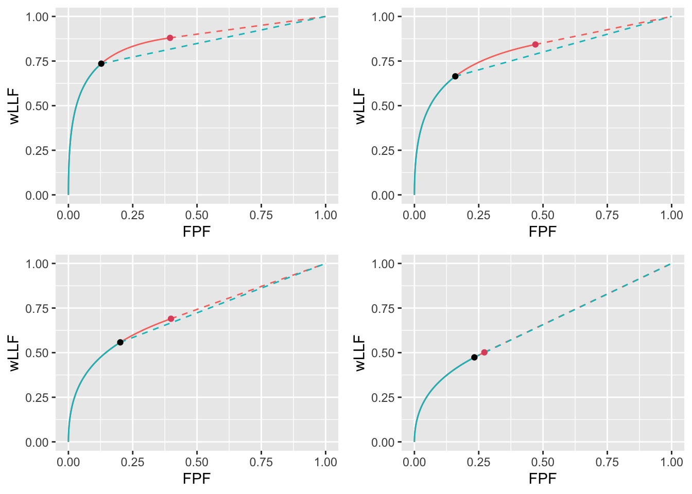

# CAD optimal operating point I {#optim-op-point}

---
output:
  rmarkdown::pdf_document:
    fig_caption: yes        
---


## TBA How much finished {#optim-op-point-how-much-finished}
95%

Discussion needs more work


## Introduction {#optim-op-point-intro}

A familiar problem for the computer aided detection or artificial intelligence (CAD/AI) algorithm designer is how to set the reporting threshold of the algorithm. Assuming designer level mark-rating FROC data is available for the algorithm a decision needs to be made as to the optimal reporting threshold, i.e., the minimum rating of a mark before it is shown to the radiologist (or the next stage of the AI algorithm -- in what follows references to CAD apply equally to AI algorithms). 

The problem has been solved in the context of ROC analysis [@metz1978rocmethodology], namely, the optimal operating point on the ROC corresponds to where its slope equals a specific value determined by disease prevalence and the cost of decisions in the four basic binary paradigm categories: true and false positives and true and false negatives. In practice the costs are difficult to quantify. However, for equal numbers of diseased and non-diseased cases and equal costs it can be shown that the slope of the ROC curve at the optimal operating point is unity. For a proper ROC curve this corresponds to the point that maximizes the Youden-index [@youden1950index]. Typically this index is maximized at the point that is closest to the (0,1) corner of the ROC. 

Lacking a procedure for determining it analytically currently CAD designers (in consultation with radiologists) set imaging site-specific reporting thresholds. For example, if radiologists at an imaging site are comfortable with more false marks as the price of potentially greater lesion-level sensitivity, the reporting threshold for them is adjusted downward. 

This chapter describes an analytic method for finding the optimal reporting threshold. The method is based on maximizing AUC (area under curve) of the wAFROC curve. The method is compared to the Youden-index based method.   


## Methods {#optim-op-point-methods}

**Terminology**

>
* Non-lesion localizations = NLs, i.e., location level "false positives".
* Lesion localizations = LLs, i.e., location level "true positives".
* Latent marks = perceived suspicious regions that are not necessarily marked. There is a distinction, see below, between perceived and actual marks.

Background on the radiological search model (RSM) is provided in Chapter \@ref(rsm). The model predicts ROC, FROC and wAFROC curves and is characterized by the three parameters -- $\mu, \lambda, \nu$ -- with the following meanings:

* The $\mu$ parameter, $\mu \ge 0$, is the perceptual signal-to-noise-ratio of lesions. Higher values of $\mu$ lead to increasing separation of two unit variance normal distributions determining the ratings of perceived NLs and LL. As $\mu$ increases performance of the algorithm increases.

* The $\lambda$ parameter, $\lambda \ge 0$, determines the mean number of latent NLs per case. Higher values lead to more latent NL marks per case and decreased performance. 

* The $\nu$ parameter, $0 \le \nu \le 1$, determines the probability of latent LLs, i.e., the probability that any present lesion will be perceived. Higher values of $\nu$ lead to more latent LL marks and increased performance.  


Additionally, there is a threshold parameter $\zeta_1$ with the property that only if the rating of a latent mark exceeds $\zeta_1$ the latent mark is actually marked. Therefore higher values of $\zeta_1$ correspond to more stringent reporting criteria and fewer actual marks. As will be shown next **net performance as measured by wAFROC-AUC or the Youden-index peaks at an optimal value of $\zeta_1$**. The purpose of this chapter is to investigate this effect, i.e., given the 3 RSM parameters and the figure of merit to be optimized (i.e., wAFROC-AUC or the Youden-index), to determine the optimal value of $\zeta_1$.  


In the following sections the RSM $\lambda$ parameter is varied (for fixed $\mu$ and $\nu$) and the corresponding optimal $\zeta_1$ determined by maximizing either wAFROC-AUC or the Youden-index. The value maximizing wAFROC-AUC is denoted $\zeta_{1} \left ( 1, \mu, \lambda, \nu \right )$ and that maximizing the Youden-index is denoted $\zeta_{1} \left ( 2, \mu, \lambda, \nu \right )$. These results are termed varying $\lambda$ optimizations. 


To keep this chapter to a reasonable length the results for varying $\mu$ or $\nu$ are only summarized in this chapter. The detailed results presented in Chapter \@ref(cad-optim-op-point-2) (this chapter also has results for the limiting cases of high and low ROC performance).


The wAFROC figure of merit is implemented in the `RJafroc` function `UtilAnalyticalAucsRSM`. The Youden-index is defined as sensitivity plus specificity minus 1. Sensitivity is implemented in function `RSM_yROC` and specificity is the complement of `RSM_xROC`. 


## Varying $\lambda$ optimizations{#optim-op-point-vary-lambda}

In the following $f = 1$ denotes wAFROC-AUC optimization and $f = 2$ denotes Youden-index optimization.


For $\mu = 2$ and $\nu = 0.9$ wAFROC-AUC and Youden-index optimizations were performed for $\lambda = 1, 2, 5, 10$. Half of the diseased cases contained one lesion and the rest contained two lesions. On cases with two lesions the lesions were assigned equal weights (i.e., equal clinical importance).


The following quantities were calculated:

* $\zeta_{1}$: the optimal threshold;

* $\text{wAFROC}$: the value of the wAFROC-AUC; we always report wAFROC-AUC even when the optimized quantity is the Youden-index;

* $\text{ROC}$: the AUC under the ROC curve; we always report ROC-AUC even when the optimized quantity is the Youden-index; 

* $\text{NLF}$ and $\text{LLF}$: the coordinates of the operating point on the FROC curve corresponding to $\zeta_{1}$.   


### Summary table


Table \@ref(tab:optim-op-point-table-vary-lambda) summarizes the results. The FOM column shows the quantity being maximized, the $\lambda$ column lists the 4 values of $\lambda$, the $\zeta_1$ column is the optimal value that maximizes the chosen figure of merit. The wAFROC column is the AUC under the wAFROC curve, the ROC column is the AUC under the ROC curve, and the $\left( \text{NLF},  \text{LLF}\right)$ column is the operating point on the FROC curve. 


<table class="table table-striped table-hover table-condensed table-responsive" style="font-size: 10px; margin-left: auto; margin-right: auto;">
<caption style="font-size: initial !important;">(\#tab:optim-op-point-table-vary-lambda)Summary of optimization results for $\mu = 2$, $\nu = 0.9$ and 4 values of $\lambda$. FOM = figure of merit. wAFROC = wAFROC-AUC, ROC = ROC-AUC, (NLF,LLF) = operating point on FROC.</caption>
 <thead>
  <tr>
   <th style="text-align:left;"> FOM </th>
   <th style="text-align:left;"> $\lambda$ </th>
   <th style="text-align:left;"> $\zeta_1$ </th>
   <th style="text-align:left;"> $\text{wAFROC}$ </th>
   <th style="text-align:left;"> $\text{ROC}$ </th>
   <th style="text-align:left;"> $\left( \text{NLF}, \text{LLF}\right)$ </th>
  </tr>
 </thead>
<tbody>
  <tr>
   <td style="text-align:left;"> wAFROC </td>
   <td style="text-align:left;"> 1 </td>
   <td style="text-align:left;"> -0.007 </td>
   <td style="text-align:left;"> 0.864 </td>
   <td style="text-align:left;"> 0.929 </td>
   <td style="text-align:left;"> (0.503, 0.880) </td>
  </tr>
  <tr>
   <td style="text-align:left;">  </td>
   <td style="text-align:left;"> 2 </td>
   <td style="text-align:left;"> 0.474 </td>
   <td style="text-align:left;"> 0.809 </td>
   <td style="text-align:left;"> 0.900 </td>
   <td style="text-align:left;"> (0.636, 0.843) </td>
  </tr>
  <tr>
   <td style="text-align:left;">  </td>
   <td style="text-align:left;"> 5 </td>
   <td style="text-align:left;"> 1.272 </td>
   <td style="text-align:left;"> 0.715 </td>
   <td style="text-align:left;"> 0.840 </td>
   <td style="text-align:left;"> (0.509, 0.690) </td>
  </tr>
  <tr>
   <td style="text-align:left;">  </td>
   <td style="text-align:left;"> 10 </td>
   <td style="text-align:left;"> 1.856 </td>
   <td style="text-align:left;"> 0.645 </td>
   <td style="text-align:left;"> 0.774 </td>
   <td style="text-align:left;"> (0.317, 0.502) </td>
  </tr>
  <tr>
   <td style="text-align:left;"> Youden </td>
   <td style="text-align:left;"> 1 </td>
   <td style="text-align:left;"> 1.095 </td>
   <td style="text-align:left;"> 0.831 </td>
   <td style="text-align:left;"> 0.899 </td>
   <td style="text-align:left;"> (0.137, 0.735) </td>
  </tr>
  <tr>
   <td style="text-align:left;">  </td>
   <td style="text-align:left;"> 2 </td>
   <td style="text-align:left;"> 1.362 </td>
   <td style="text-align:left;"> 0.781 </td>
   <td style="text-align:left;"> 0.865 </td>
   <td style="text-align:left;"> (0.173, 0.664) </td>
  </tr>
  <tr>
   <td style="text-align:left;">  </td>
   <td style="text-align:left;"> 5 </td>
   <td style="text-align:left;"> 1.695 </td>
   <td style="text-align:left;"> 0.705 </td>
   <td style="text-align:left;"> 0.811 </td>
   <td style="text-align:left;"> (0.225, 0.558) </td>
  </tr>
  <tr>
   <td style="text-align:left;">  </td>
   <td style="text-align:left;"> 10 </td>
   <td style="text-align:left;"> 1.934 </td>
   <td style="text-align:left;"> 0.644 </td>
   <td style="text-align:left;"> 0.766 </td>
   <td style="text-align:left;"> (0.265, 0.474) </td>
  </tr>
</tbody>
</table>


Inspection of this table reveals the following:

1. For either FOM as $\lambda$ increases the optimal threshold $\zeta_{1}$ increases (meaning a stricter threshold is required) and $\text{wAFROC}$, $\text{ROC}$ and $\text{LLF}$ decreases (i.e., CAD performance decreases regardless of how it is measured).  


1. The wAFROC based optimal thresholds are smaller (corresponding to a less strict reporting criterion) than the corresponding Youden-index based optimal thresholds. This has the following effects:

    + The Youden-index based operating point is below-left the wAFROC based operating point. 
    + The difference decreases with increasing $\lambda$. 
    + These effects are illustrated in Fig. \@ref(fig:optim-op-point-vary-lambda-froc).


1. The Youden-index based optimizations yield lower performance than the corresponding wAFROC-AUC based optimizations:

    + $\text{wAFROC} \left (2, \mu, \lambda, \nu \right ) < \text{wAFROC} \left (1, \mu, \lambda, \nu \right )$ 
    + $\text{ROC} \left (2, \mu, \lambda, \nu \right ) < \text{ROC} \left (1, \mu, \lambda, \nu \right )$. 
    + The difference decreases with increasing $\lambda$. 
    + These effects are illustrated in Fig. \@ref(fig:optim-op-point-vary-lambda-wafroc).


### FROC


The second effect is illustrated by the FROC plots with superimposed operating points for varying $\lambda$ shown in Fig. \@ref(fig:optim-op-point-vary-lambda-froc). The black dots correspond to wAFROC based optimizations and the red dots correspond to Youden-index based optimizations. The black dots are consistently above the red dots and the separation of the dots decreases as $\lambda$ increases. In other words, for large $\lambda$ it makes less difference which optimization method is used.

 


<div class="figure">

<p class="caption">(\#fig:optim-op-point-vary-lambda-froc)FROC plots with superimposed operating points for varying $\lambda$. The red dot corresponds to wAFROC AUC optimization and the black dot to Youden-index optimization.</p>
</div>


### wAFROC


The decrease in $\text{wAFROC}$ with increasing $\lambda$ is illustrated in Fig. \@ref(fig:optim-op-point-vary-lambda-wafroc) which shows wAFROC plots for the two optimization methods. Each plot consists of a continuous curve followed by a dashed line. The red curve, corresponding to wAFROC-AUC optimization $f = 1$, which appears as a "green solid-red dashed-red" curve (the curve is in fact a red curve complicated by superposition of the green curve over part of its traverse), and the "solid-green dashed-green" curve corresponds to Youden-index optimization $f = 2$. 

The transition from continuous to dashed is determined by the value of $\zeta_1$. It occurs at a higher value of $\zeta_1$ for the Youden-index optimization and consequently the stricter Youden-index based threshold sacrifices some of the area under the wAFROC. This results in lower performance particularly for the lower values of $\lambda$. At the highest value of $\lambda$ the values of optimal $\zeta_1$ are similar and both methods make similar predictions.


<div class="figure">

<p class="caption">(\#fig:optim-op-point-vary-lambda-wafroc)wAFROC plots for the two optimization methods: the "green solid-red dashed-red" curve corresponds to wAFROC-AUC optimization and the "solid-green dashed-green" curve corresponds to Youden-index optimization. The wAFROC optimizations yield greater performance than do Youden-index optimizations and the difference decreases with increasing $\lambda$.</p>
</div>


### ROC


The decrease in $\text{ROC}$ with increasing $\lambda$ is illustrated in Fig. \@ref(fig:optim-op-point-vary-lambda-roc) which shows RSM-predicted ROC plots for the two optimization methods. Again, each plot consists of a continuous curve followed by a dashed curve and a similar color-coding convention is used as in Fig. \@ref(fig:optim-op-point-vary-lambda-wafroc). The ROC plots show similar dependencies as described for the wAFROC plots: specifically, the stricter Youden-index based reporting threshold sacrifices some of the area under the ROC resulting in lower performance, particularly for the lower values of $\lambda$. 


<div class="figure">

<p class="caption">(\#fig:optim-op-point-vary-lambda-roc)ROC plots for the two optimization methods: the "green solid-red dashed-red" curve corresponds to wAFROC-AUC optimization and the "solid-green dashed-green" curve corresponds to Youden-index optimization. The wAFROC optimizations yield greater performance than Youden-index optimizations and the difference decreases with increasing $\lambda$.</p>
</div>


### Why not maximize ROC-AUC?

Since the ROC curves show a similar dependence as the wAFROC curves why not maximize ROC-AUC instead of wAFROC-AUC? As long as one restricts to proper ROC models this will always result in $\zeta_1 = -\infty$, i.e., all latent marks are to be shown to the radiologist. This result can be understood from the following geometrical argument. 

For a proper ROC curve the slope decreases monotonically as the operating point moves up the curve and at each point the slope is greater than that of the straight curve connecting the point to (1,1). This geometry ensures that AUC under any curve with a finite $\zeta_1$ is smaller than that under the full curve. Therefore maximum AUC can only be attained by choosing $\zeta_1 = -\infty$. This is illustrated in Fig. \@ref(fig:binormal-model-threshold-dependence-2) which shows a proper ROC curve (corresponding to $a = 2$ and $b = 1$; the dot corresponds to $\zeta_1 = 1.5$.). In the region above the dot the continuous curve is above the dotted line, meaning AUC performance of an observer who adopts a finite $\zeta_1$ is less than performance of an observer who adopts $\zeta_1 = -\infty$.


<div class="figure">

<p class="caption">(\#fig:binormal-model-threshold-dependence-2)In the region above the dot the proper curve is above the dotted line, meaning performance of an observer who adopts a finite $\zeta_1$ is less than performance of an observer who adopts $\zeta_1 = -\infty$.</p>
</div>


## Varying $\nu$ and $\mu$ optimizations{#optim-op-point-vary-nu-mu}

Details of varying $\nu$ (with $\mu$ and $\lambda$ held constant) are in Chapter \@ref(cad-optim-op-point-2) Section \@ref(optim-op-point-vary-nu). The results, summarized in Table \@ref(tab:optim-op-point-table-vary-nu), are similar to those just described for varying $\lambda$ but, since unlike as was the case with increasing $\lambda$, increasing $\nu$ results in increasing performance, the directions of the effects are reversed. For either optimization method as $\nu$ increases both wAFROC-AUC and ROC-AUC increase. The optimal reporting threshold $\zeta_1$ decreases sharply (laxer reporting threshold) for wAFROC optimization, i.e., the FROC operating point moves up the curve. In contrast the Youden-index based optimal threshold is almost independent of $\nu$ which results in relatively constant NLF while LLF increases with increasing $\nu$, see Fig. \@ref(fig:optim-op-point-vary-nu-froc)). As before, wAFROC optimization yields lower reporting threshold and higher performance than Youden-index optimization (particularly for larger $\nu$). See Fig. \@ref(fig:optim-op-point-vary-nu-wafroc) for the wAFROC performance comparison between the two optimization methods and Fig. \@ref(fig:optim-op-point-vary-nu-roc) for the ROC performance comparison. The difference between the two optimization methods increases with increasing $\nu$ (for comparison the difference between the two optimization methods decreases with increasing $\lambda$).

Details of varying $\mu$ (with $\lambda$ and $\nu$ held constant) are in Chapter \@ref(cad-optim-op-point-2) Section \@ref(optim-op-point-vary-mu). The results are summarized in Table \@ref(tab:optim-op-point-table-vary-mu).  Increasing $\mu$ is accompanied by increasing $\zeta_1$ (stricter reporting threshold) and increasing wAFROC-AUC and ROC-AUC. Performance measured either way is higher for wAFROC optimizations but the difference tends to shrink at the larger values of $\mu$. LLF is relatively constant for wAFROC optimizations while it increases slowly with $\mu$ for Youden-index optimizations. NLF decreases with increasing $\mu$ for both optimization methods, i.e, the FROC operating point shifts down-left, see Fig. \@ref(fig:optim-op-point-vary-mu-froc)). Again, wAFROC optimization yields a lower reporting threshold and higher performance than Youden-index optimization, see Fig. \@ref(fig:optim-op-point-vary-mu-wafroc) for the wAFROC performance comparison and Fig. \@ref(fig:optim-op-point-vary-mu-roc) for the ROC performance comparison. The difference between the two optimization methods decreases with increasing $\mu$.

## Very high or very low performance{#optim-op-point-vary-nu-limiting-situations}

Limiting situations covering high and low performances are described in \@ref(optim-op-point-limiting-situations). 

For high performance, defined as $\text{ROC-AUC} > 0.9$, both methods place the optimal operating point on the sharp bend near the upper-left corner of the operating characteristics. The wAFROC based method chooses a lower threshold than the Youden-index method resulting in a higher operating point on the FROC and higher wAFROC-AUC and ROC-AUC. The difference between the two methods decreases as $\text{ROC-AUC} \rightarrow 1$. 

For low performance, defined as $0.5 < \text{ROC-AUC} < 0.6$, the Youden-index method selected a lower threshold compared to wAFROC optimization, resulting in a higher operating point on the FROC, greater ROC-AUC but sharply lower wAFROC-AUC. The difference between the two methods increases as $\text{ROC-AUC} \rightarrow 0.5$. In this limit the wAFROC method severely limits the numbers of marks shown to the radiologist as compared to the Youden-index based method.  


## Using the method {#optim-op-point-how-to-use-method}
Assume that one has designed an algorithmic observer that has been optimized with respect to all other parameters except the reporting threshold. At this point the algorithm reports every suspicious region no matter how low the malignancy index. The mark-rating pairs are entered into a `RJafroc` format Excel input file, as describe [here](https://dpc10ster.github.io/RJafrocQuickStart/quick-start-froc-data-format.html). The next step is to read the data file -- `DfReadDataFile()` -- convert it to an ROC dataset -- `DfFroc2Roc()` -- and then perform a radiological search model (RSM) fit to the dataset using function `FitRsmRoc()`. This yields the necessary $\lambda, \mu, \nu$ parameters. These values are used to perform the computations described in this chapter to determine the optimal reporting threshold. The RSM parameter values and the reporting threshold determine the optimal reporting point on the FROC curve. The designer sets the algorithm to only report marks with confidence levels exceeding this threshold. These steps are illustrated in the following example.


## A CAD application {#optim-op-point-application}

The standalone CAD LROC dataset described in [@hupse2013standalone] was used to create the quasi-FROC ROC-AUC equivalent dataset which is embedded in `RJafroc` as object `datasetCadSimuFroc`. In the following code the first reader for this dataset, corresponding to CAD, is extracted using `DfExtractDataset` (the other reader data, corresponding to radiologists who interpreted the same cases, are not used here). The function `DfFroc2Roc` converts this to an ROC dataset. The function `DfBinDataset` bins the data to about 7 bins. Each diseased case contains one lesion: `lesDistr = c(1)`. `FitRsmRoc` fits the binned ROC dataset to the radiological search model (RSM). Object `fit` contains the RSM parameters required to perform the optimizations described in previous sections.  


```r
ds <- datasetCadSimuFroc
dsCad <- DfExtractDataset(ds, rdrs = 1)
dsCadRoc <- DfFroc2Roc(dsCad)
dsCadRocBinned <- DfBinDataset(dsCadRoc, opChType = "ROC")
lesDistrCad <- c(1)
relWeightsCad <- c(1)
fit <- FitRsmRoc(dsCadRocBinned, lesDistrCad)
cat(sprintf("fitted values: mu = %5.3f,", fit$mu), 
    sprintf("lambda = %5.3f,", fit$lambda), 
    sprintf("nu = %5.3f.", fit$nu)) 
#> fitted values: mu = 2.756, lambda = 6.778, nu = 0.803.
```


### Summary table

Table \@ref(tab:optim-op-point-table4) summarizes the results. As compared to Youden-index optimization the wAFROC-AUC based optimization results in a lower reporting threshold $\zeta_1$, larger figures of merit -- see Fig. \@ref(fig:optim-op-point-application-wafroc) for wAFROC-AUC and Fig. \@ref(fig:optim-op-point-application-roc) for ROC-AUC -- and a higher operating point on the FROC, see Fig. \@ref(fig:optim-op-point-application-froc). These results match the trends shown in Table \@ref(tab:optim-op-point-table-vary-lambda).  


<table class="table table-striped table-hover table-condensed table-responsive" style="font-size: 10px; margin-left: auto; margin-right: auto;">
<caption style="font-size: initial !important;">(\#tab:optim-op-point-table4)Summary of optimization results for example CAD FROC dataset. Table header row as in the previous table.</caption>
 <thead>
  <tr>
   <th style="text-align:left;"> FOM </th>
   <th style="text-align:left;"> $\lambda$ </th>
   <th style="text-align:left;"> $\zeta_1$ </th>
   <th style="text-align:left;"> $\text{wAFROC}$ </th>
   <th style="text-align:left;"> $\text{ROC}$ </th>
   <th style="text-align:left;"> $\left( \text{NLF}, \text{LLF}\right)$ </th>
  </tr>
 </thead>
<tbody>
  <tr>
   <td style="text-align:left;"> wAFROC </td>
   <td style="text-align:left;"> 6.778 </td>
   <td style="text-align:left;"> 1.739 </td>
   <td style="text-align:left;"> 0.774 </td>
   <td style="text-align:left;"> 0.815 </td>
   <td style="text-align:left;"> (0.278, 0.679) </td>
  </tr>
  <tr>
   <td style="text-align:left;"> Youden </td>
   <td style="text-align:left;">  </td>
   <td style="text-align:left;"> 1.982 </td>
   <td style="text-align:left;"> 0.770 </td>
   <td style="text-align:left;"> 0.798 </td>
   <td style="text-align:left;"> (0.161, 0.627) </td>
  </tr>
</tbody>
</table>


### FROC


Fig. \@ref(fig:optim-op-point-application-froc) shows FROC curves with superimposed optimal operating points. With NLF = 0.278, a four-view mammogram would show about 1.2 false CAD marks per patient and lesion-level sensitivity would be about 68 percent.


<div class="figure">

<p class="caption">(\#fig:optim-op-point-application-froc)FROC plots with superposed optimal operating points. The red dot is using wAFROC optimization and black dot is using Youden-index optimization.</p>
</div>


### wAFROC


Fig. \@ref(fig:optim-op-point-application-wafroc) shows wAFROC curves using the two methods. The red curve is using wAFROC-AUC optimization and the green curve is using Youden-index optimization. The difference in AUCs is small - following the trend described in Section \@ref(optim-op-point-vary-nu-mu) for the larger values of $\lambda$.


<div class="figure">

<p class="caption">(\#fig:optim-op-point-application-wafroc)The color coding is as in previous figures. The two wAFROC-AUCs are 0.774 (wAFROC optimization) and 0.770 (Youden-index optimization).</p>
</div>


### ROC


Fig. \@ref(fig:optim-op-point-application-roc) shows ROC curves using the two methods. The red curve is using wAFROC-AUC optimization and the green curve is using Youden-index optimization. 


<div class="figure">

<p class="caption">(\#fig:optim-op-point-application-roc)The color coding is as in previous figures. The two ROC-AUCs are 0.815 (wAFROC optimization) and 0.798 (Youden-index optimization).</p>
</div>


## TBA Discussion {#optim-op-point-discussion}

In Table \@ref(tab:optim-op-point-table-vary-lambda) the $\lambda$ parameter controls the average number of perceived NLs per case. For $\lambda = 1$ there is, on average, one perceived NL for every non-diseased case and the optimal wAFROC-based threshold is TBA $\zeta_{1;1,\mu, \lambda = 1, \nu}$ = -0.007. For $\lambda = 10$ there are ten perceived NLs for every non-diseased case and the optimal wAFROC-based threshold is $\zeta_{1;1,\mu, \lambda = 10, \nu}$ = -0.007. The increase in $\zeta_1$ should make sense to CAD algorithm designers: with increasing numbers of NLs per case it is necessary to increase the reporting threshold (i.e., adopt a stricter criteria) if only because otherwise the reader would be subjected to 10 times the number of NLs/case for the same number of LLs/case. 


The ROC-AUCs are reported as a check of the less familiar wAFROC-AUC figure of merit. The ordering of the two optimization methods is independent of whether it is measured via the wAFROC-AUC or the ROC-AUC: either way the wAFROC-AUC optimizations yield higher AUC values and higher operating points on the FROC than the corresponding Youden-index optimizations.   

In this example the difference in wAFROC-AUC, ROC-AUC and the operating points between the two methods decreases as performance *increases*, which is the opposite of that found when $\lambda$ or $\nu$ were varied. With constant $\lambda$ and $\nu$ the *numbers* of NLs and LLs are unchanging; all that happens is the *values* of the z-samples from LLs increase as $\mu$ increases, which allows the optimal threshold to increase (this can be understood as a pure "ROC-type" effect: as the normal distributions are more widely separated, the optimal threshold will increase, approaching, in the limit, half the separation, since in that limit TPF = 1 and FPF = 0).

This is due to two reinforcing effects: performance goes down with increasing numbers of NLs per case and performance goes down with increasing optimal reporting threshold (see Section \@ref(rsm-predictions-roc-curve-aucs-zeta1) for explanation of the $\zeta_1$ dependence of AUC performance). It is difficult to unambiguously infer performance based on the FROC operating points: as $\lambda$ increases LLF decreases but for $f = 1$ NLF peaks while for $f = 2$ it increases.

The FROC plots also illustrate the decrease in $\text{LLF}$ with increasing $\lambda$: the black dots move to smaller ordinates, as do the red dots, which would seem to imply decreasing performance. However, the accompanying change in $\text{NLF}$ rules out an unambiguous determination of the direction of the change in overall performance based on the FROC. 


TBA For very low performance, defined as $0.5 < \text{ROC-AUC} < 0.6$, the Youden-index method chooses a lower threshold compared to wAFROC optimization, resulting in a higher operating point on the FROC, greater ROC-AUC but sharply lower wAFROC-AUC. The difference between the two methods increases as $\text{ROC-AUC} \rightarrow 0.5$. In this limit the wAFROC method severely limits the numbers of marks shown to the radiologist as compared to the Youden-index based method.  


