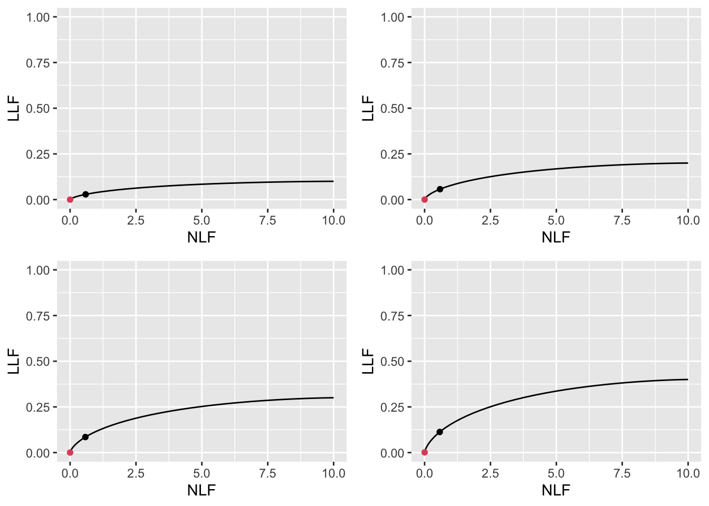

# Optimal operating point appendices {#optim-op-point-appendices}

---
output:
  rmarkdown::pdf_document:
    fig_caption: yes        
    includes:  
      in_header: R/learn/my_header.tex
---


## Appendix I: Varying $\nu$ optimizations{#optim-op-point-vary-nu}

For $\mu = 2$ and $\lambda = 1$ optimizations were performed for $\nu = 0.6, 0.7, 0.8, 0.9$. 


```r
muArr <- c(2)
lambdaPArr <- c(1)
nuPArr <- c(0.6, 0.7, 0.8, 0.9)
lesDistr <- c(0.5, 0.5)
relWeights <- c(0.5, 0.5)
```


### Summary table


<table class="table" style="margin-left: auto; margin-right: auto;">
<caption>(\#tab:optim-op-point-table-vary-nu)Summary of optimization results for $\mu = 2$, $\lambda = 1$ and 4 values of $\nu$.</caption>
 <thead>
  <tr>
   <th style="text-align:left;"> FOM </th>
   <th style="text-align:left;"> $\nu$ </th>
   <th style="text-align:left;"> $\zeta_1$ </th>
   <th style="text-align:left;"> $\text{wAFROC}$ </th>
   <th style="text-align:left;"> $\text{ROC}$ </th>
   <th style="text-align:left;"> $\left( \text{NLF}, \text{LLF}\right)$ </th>
  </tr>
 </thead>
<tbody>
  <tr>
   <td style="text-align:left;"> wAFROC </td>
   <td style="text-align:left;"> 0.6 </td>
   <td style="text-align:left;"> 0.888 </td>
   <td style="text-align:left;"> 0.701 </td>
   <td style="text-align:left;"> 0.804 </td>
   <td style="text-align:left;"> (0.187, 0.520) </td>
  </tr>
  <tr>
   <td style="text-align:left;"> wAFROC </td>
   <td style="text-align:left;"> 0.7 </td>
   <td style="text-align:left;"> 0.674 </td>
   <td style="text-align:left;"> 0.751 </td>
   <td style="text-align:left;"> 0.851 </td>
   <td style="text-align:left;"> (0.250, 0.635) </td>
  </tr>
  <tr>
   <td style="text-align:left;"> wAFROC </td>
   <td style="text-align:left;"> 0.8 </td>
   <td style="text-align:left;"> 0.407 </td>
   <td style="text-align:left;"> 0.805 </td>
   <td style="text-align:left;"> 0.893 </td>
   <td style="text-align:left;"> (0.342, 0.756) </td>
  </tr>
  <tr>
   <td style="text-align:left;"> wAFROC </td>
   <td style="text-align:left;"> 0.9 </td>
   <td style="text-align:left;"> -0.007 </td>
   <td style="text-align:left;"> 0.864 </td>
   <td style="text-align:left;"> 0.929 </td>
   <td style="text-align:left;"> (0.503, 0.880) </td>
  </tr>
  <tr>
   <td style="text-align:left;"> Youden </td>
   <td style="text-align:left;"> 0.6 </td>
   <td style="text-align:left;"> 1.022 </td>
   <td style="text-align:left;"> 0.700 </td>
   <td style="text-align:left;"> 0.797 </td>
   <td style="text-align:left;"> (0.153, 0.502) </td>
  </tr>
  <tr>
   <td style="text-align:left;"> Youden </td>
   <td style="text-align:left;"> 0.7 </td>
   <td style="text-align:left;"> 1.044 </td>
   <td style="text-align:left;"> 0.745 </td>
   <td style="text-align:left;"> 0.835 </td>
   <td style="text-align:left;"> (0.148, 0.581) </td>
  </tr>
  <tr>
   <td style="text-align:left;"> Youden </td>
   <td style="text-align:left;"> 0.8 </td>
   <td style="text-align:left;"> 1.069 </td>
   <td style="text-align:left;"> 0.788 </td>
   <td style="text-align:left;"> 0.868 </td>
   <td style="text-align:left;"> (0.143, 0.659) </td>
  </tr>
  <tr>
   <td style="text-align:left;"> Youden </td>
   <td style="text-align:left;"> 0.9 </td>
   <td style="text-align:left;"> 1.095 </td>
   <td style="text-align:left;"> 0.831 </td>
   <td style="text-align:left;"> 0.899 </td>
   <td style="text-align:left;"> (0.137, 0.735) </td>
  </tr>
</tbody>
</table>


Table \@ref(tab:optim-op-point-table-vary-nu) summarizes the results.

1. For wAFROC-AUC FOM as $\nu$ increases the optimal threshold *decreases* and both $\text{wAFROC} \left ( 1, \mu, \lambda, \nu \right )$ and $\text{ROC} \left ( 1, \mu, \lambda, \nu \right )$ *increase*. CAD performance increases, regardless of how it is measured. Performance increases with increasing numbers of LLs per case and this effect is reinforced by performance going up with decreasing optimal reporting threshold. [Since both $\text{LLF} \left ( f, \mu, \lambda, \nu \right )$ and $\text{NLF} \left ( f, \mu, \lambda, \nu \right )$ increase with increasing $\nu$, neither FROC-curve based measure has an unambiguous interpretation.  

1. The wAFROC based based optimal thresholds are smaller than the corresponding Youden-index based optimal thresholds, i.e., $\zeta_{1} \left ( 1, \mu, \lambda, \nu \right ) < \zeta_{1} \left ( 2, \mu, \lambda, \nu \right )$. A smaller threshold corresponds to a less strict reporting criterion.

1. For fixed $\mu, \lambda, \nu$ the operating point on the FROC for $f = 2$ is below that corresponding to $f = 1$:
    + $\text{NLF} \left (2, \mu, \lambda, \nu \right ) < \text{NLF} \left (1, \mu, \lambda, \nu \right )$ and 
    + $\text{LLF} \left (2, \mu, \lambda, \nu \right ) < \text{LLF} \left (1, \mu, \lambda, \nu \right )$. 
    + The difference increases with increasing $\nu$. 
    + These effects are illustrated in Fig. \@ref(fig:optim-op-point-vary-nu-froc).

1. For fixed $\mu, \lambda, \nu$ the Youden-index based optimization yields lesser performance than the corresponding wAFROC-AUC based optimization:

    + $\text{wAFROC} \left (2, \mu, \lambda, \nu \right ) < \text{wAFROC} \left (1, \mu, \lambda, \nu \right )$ and 
    + $\text{ROC} \left (2, \mu, \lambda, \nu \right ) < \text{ROC} \left (1, \mu, \lambda, \nu \right )$. 
    + The difference decreases with decreasing $\nu$. 
    + These effects are illustrated in Fig. \@ref(fig:optim-op-point-vary-nu-wafroc).


### FROC

The third effect is illustrated by the FROC plots with superimposed operating points for varying $\nu$ shown in Fig. \@ref(fig:optim-op-point-vary-nu-froc). The black dots are consistently above the red dots and the separation of the dots is greatest for $\nu = 0.9$ and smallest for $\nu = 0.6$. The difference in optimal thresholds found by the two optimization methods is greatest for poor performance.  

The FROC plots also illustrate the decrease in $\text{LLF} \left ( f, \mu, \lambda, \nu \right )$ with increasing $\nu$ (the black dots move to larger ordinates, as do the red dots). However, the accompanying change in $\text{NLF} \left ( f, \mu, \lambda, \nu \right )$ rules out an FROC curve based unambiguous determination of the direction of the change in overall performance. 


<div class="figure">

<p class="caption">(\#fig:optim-op-point-vary-nu-froc)FROC plots with superimposed operating points for varying $\nu$. The black dot corresponds to wAFROC AUC optimization and the red dot to Youden-index optimization.</p>
</div>


### wAFROC


 


<div class="figure">

<p class="caption">(\#fig:optim-op-point-vary-nu-wafroc)wAFROC plots for the two optimization methods. The color coding is as in previous figures.</p>
</div>


### ROC


<div class="figure">

<p class="caption">(\#fig:optim-op-point-vary-nu-roc)ROC plots for the two optimization methods. The color coding is as in previous figures.</p>
</div>


## Appendix II: Varying $\mu$ optimizations{#optim-op-point-vary-mu}

For $\lambda = 1$ and $\nu = 0.9$ optimizations were performed for $\mu = 1, 2, 3, 4$. 


```r
muArr <- c(1, 2, 3, 4)
lambdaPArr <- 1
nuPArr <- 0.9
lesDistr <- c(0.5, 0.5)
relWeights <- c(0.5, 0.5)
```


### Summary table


<table class="table" style="margin-left: auto; margin-right: auto;">
<caption>(\#tab:optim-op-point-table-vary-mu)Summary of optimization results for 4 values of $\mu$, $\lambda = 1$, $\nu = 0.9$.</caption>
 <thead>
  <tr>
   <th style="text-align:left;"> FOM </th>
   <th style="text-align:left;"> $\mu$ </th>
   <th style="text-align:left;"> $\zeta_1$ </th>
   <th style="text-align:left;"> $\text{wAFROC}$ </th>
   <th style="text-align:left;"> $\text{ROC}$ </th>
   <th style="text-align:left;"> $\left( \text{NLF}, \text{LLF}\right)$ </th>
  </tr>
 </thead>
<tbody>
  <tr>
   <td style="text-align:left;"> wAFROC </td>
   <td style="text-align:left;"> 1 </td>
   <td style="text-align:left;"> -1.663 </td>
   <td style="text-align:left;"> 0.745 </td>
   <td style="text-align:left;"> 0.850 </td>
   <td style="text-align:left;"> (0.952, 0.897) </td>
  </tr>
  <tr>
   <td style="text-align:left;"> wAFROC </td>
   <td style="text-align:left;"> 2 </td>
   <td style="text-align:left;"> -0.007 </td>
   <td style="text-align:left;"> 0.864 </td>
   <td style="text-align:left;"> 0.929 </td>
   <td style="text-align:left;"> (0.503, 0.880) </td>
  </tr>
  <tr>
   <td style="text-align:left;"> wAFROC </td>
   <td style="text-align:left;"> 3 </td>
   <td style="text-align:left;"> 0.808 </td>
   <td style="text-align:left;"> 0.922 </td>
   <td style="text-align:left;"> 0.961 </td>
   <td style="text-align:left;"> (0.210, 0.887) </td>
  </tr>
  <tr>
   <td style="text-align:left;"> wAFROC </td>
   <td style="text-align:left;"> 4 </td>
   <td style="text-align:left;"> 1.463 </td>
   <td style="text-align:left;"> 0.942 </td>
   <td style="text-align:left;"> 0.970 </td>
   <td style="text-align:left;"> (0.072, 0.895) </td>
  </tr>
  <tr>
   <td style="text-align:left;"> Youden </td>
   <td style="text-align:left;"> 1 </td>
   <td style="text-align:left;"> 0.462 </td>
   <td style="text-align:left;"> 0.704 </td>
   <td style="text-align:left;"> 0.815 </td>
   <td style="text-align:left;"> (0.322, 0.634) </td>
  </tr>
  <tr>
   <td style="text-align:left;"> Youden </td>
   <td style="text-align:left;"> 2 </td>
   <td style="text-align:left;"> 1.095 </td>
   <td style="text-align:left;"> 0.831 </td>
   <td style="text-align:left;"> 0.899 </td>
   <td style="text-align:left;"> (0.137, 0.735) </td>
  </tr>
  <tr>
   <td style="text-align:left;"> Youden </td>
   <td style="text-align:left;"> 3 </td>
   <td style="text-align:left;"> 1.629 </td>
   <td style="text-align:left;"> 0.903 </td>
   <td style="text-align:left;"> 0.945 </td>
   <td style="text-align:left;"> (0.052, 0.823) </td>
  </tr>
  <tr>
   <td style="text-align:left;"> Youden </td>
   <td style="text-align:left;"> 4 </td>
   <td style="text-align:left;"> 2.124 </td>
   <td style="text-align:left;"> 0.935 </td>
   <td style="text-align:left;"> 0.964 </td>
   <td style="text-align:left;"> (0.017, 0.873) </td>
  </tr>
</tbody>
</table>


Table \@ref(tab:optim-op-point-table-vary-mu) summarizes the results.

1. For either FOM as $\mu$ increases the optimal threshold *increases* and both $\text{wAFROC} \left ( f, \mu, \lambda, \nu \right )$ and $\text{ROC} \left ( f, \mu, \lambda, \nu \right )$ *increase*. CAD performance increases, regardless of how it is measured. Performance increases with increasing separation of the sampling distributions of NLs and LLs and the negative effect of increasing optimal reporting thresholds is not enough to overcome this. [Since $\text{LLF} \left ( f, \mu, \lambda, \nu \right )$ is relatively constant while $\text{NLF} \left ( f, \mu, \lambda, \nu \right )$ decreases sharply with increasing $\mu$, this is one example where an FROC-curve based measure does have an unambiguous interpretation, namely performance is higher for the larger values of $\mu$.  

1. The wAFROC based based optimal thresholds are smaller than the corresponding Youden-index based optimal thresholds. A smaller threshold corresponds to a less strict reporting criterion and greater wAFROC-AUC and ROC-AUC performance.

1. For fixed $\mu, \lambda, \nu$ the operating point on the FROC for $f = 2$ is below that corresponding to $f = 1$. The difference decreases with increasing $\mu$. These effects are illustrated in Fig. \@ref(fig:optim-op-point-vary-mu-froc). The black dots are consistently above the red dots and the separation of the dots is greatest for $\mu = 1$ and smallest for $\mu = 4$.  


1. For fixed $\mu, \lambda, \nu$ the Youden-index based optimization yields lesser performance than the corresponding wAFROC-AUC based optimization. The difference decreases with increasing $\mu$. These effects are illustrated in Fig. \@ref(fig:optim-op-point-vary-mu-wafroc).


### FROC


<div class="figure">

<p class="caption">(\#fig:optim-op-point-vary-mu-froc)FROC plots with superimposed operating points for varying $\mu$. The black dot corresponds to wAFROC AUC optimization and the red dot to Youden-index optimization.</p>
</div>


### wAFROC


<div class="figure">

<p class="caption">(\#fig:optim-op-point-vary-mu-wafroc)wAFROC plots for the two optimization methods. The color coding is as in previous figures.</p>
</div>


TBA The continuous section of each curve ends at the optimal threshold listed in Table \@ref(tab:optim-op-point-table-vary-mu), namely $\zeta_1$ = -1.663 for the green-red-red-dashed curve and $\zeta_1$ = 0.462 for the green curve. The lower performance represented by the green curve, based on Youden-index maximization, is due to the adoption of an overly strict threshold.


### ROC


<div class="figure">

<p class="caption">(\#fig:optim-op-point-vary-mu-roc)ROC plots for the two optimization methods. The color coding is as in previous figures.</p>
</div>


The continuous section of each curve ends at the optimal threshold listed in Table \@ref(tab:optim-op-point-table-vary-mu). The lower performance represented by the green curve, based on Youden-index maximization, is due to the adoption of an overly strict threshold.


## Appendix III: Limiting situations {#optim-op-point-limiting-situations}

### High performance vary mu {#optim-op-point-high-performance-vary-mu}


```r
muArr <- c(2, 3, 4, 5)
nuPArr <- c(0.9)
lambdaPArr <- c(1)
lesDistr <- c(0.5, 0.5)
relWeights <- c(0.5, 0.5)
```


#### Summary table


<table class="table" style="margin-left: auto; margin-right: auto;">
<caption>(\#tab:optim-op-point-high-performance-vary-mu-table-vary-all)Summary of optimization results for 4 values of $\mu$, $\lambda = 1$ and $nu = 0.9$. Row labeling as in previous tables.</caption>
 <thead>
  <tr>
   <th style="text-align:left;"> FOM </th>
   <th style="text-align:left;"> $\mu$ </th>
   <th style="text-align:left;"> $\zeta_1$ </th>
   <th style="text-align:left;"> $\text{wAFROC}$ </th>
   <th style="text-align:left;"> $\text{ROC}$ </th>
   <th style="text-align:left;"> $\left( \text{NLF}, \text{LLF}\right)$ </th>
  </tr>
 </thead>
<tbody>
  <tr>
   <td style="text-align:left;"> wAFROC </td>
   <td style="text-align:left;"> 2 </td>
   <td style="text-align:left;"> -0.007 </td>
   <td style="text-align:left;"> 0.864 </td>
   <td style="text-align:left;"> 0.929 </td>
   <td style="text-align:left;"> (0.503, 0.880) </td>
  </tr>
  <tr>
   <td style="text-align:left;"> wAFROC </td>
   <td style="text-align:left;"> 3 </td>
   <td style="text-align:left;"> 0.808 </td>
   <td style="text-align:left;"> 0.922 </td>
   <td style="text-align:left;"> 0.961 </td>
   <td style="text-align:left;"> (0.210, 0.887) </td>
  </tr>
  <tr>
   <td style="text-align:left;"> wAFROC </td>
   <td style="text-align:left;"> 4 </td>
   <td style="text-align:left;"> 1.463 </td>
   <td style="text-align:left;"> 0.942 </td>
   <td style="text-align:left;"> 0.970 </td>
   <td style="text-align:left;"> (0.072, 0.895) </td>
  </tr>
  <tr>
   <td style="text-align:left;"> wAFROC </td>
   <td style="text-align:left;"> 5 </td>
   <td style="text-align:left;"> 2.063 </td>
   <td style="text-align:left;"> 0.948 </td>
   <td style="text-align:left;"> 0.972 </td>
   <td style="text-align:left;"> (0.020, 0.899) </td>
  </tr>
  <tr>
   <td style="text-align:left;"> Youden </td>
   <td style="text-align:left;"> 2 </td>
   <td style="text-align:left;"> 1.095 </td>
   <td style="text-align:left;"> 0.831 </td>
   <td style="text-align:left;"> 0.899 </td>
   <td style="text-align:left;"> (0.137, 0.735) </td>
  </tr>
  <tr>
   <td style="text-align:left;"> Youden </td>
   <td style="text-align:left;"> 3 </td>
   <td style="text-align:left;"> 1.629 </td>
   <td style="text-align:left;"> 0.903 </td>
   <td style="text-align:left;"> 0.945 </td>
   <td style="text-align:left;"> (0.052, 0.823) </td>
  </tr>
  <tr>
   <td style="text-align:left;"> Youden </td>
   <td style="text-align:left;"> 4 </td>
   <td style="text-align:left;"> 2.124 </td>
   <td style="text-align:left;"> 0.935 </td>
   <td style="text-align:left;"> 0.964 </td>
   <td style="text-align:left;"> (0.017, 0.873) </td>
  </tr>
  <tr>
   <td style="text-align:left;"> Youden </td>
   <td style="text-align:left;"> 5 </td>
   <td style="text-align:left;"> 2.608 </td>
   <td style="text-align:left;"> 0.946 </td>
   <td style="text-align:left;"> 0.970 </td>
   <td style="text-align:left;"> (0.005, 0.892) </td>
  </tr>
</tbody>
</table>


#### FROC


<div class="figure">

<p class="caption">(\#fig:optim-op-point-low-performance-vary-mu-vary-all-froc)FROC plots with superimposed operating points for varying $\nu$. The black dot corresponds to wAFROC AUC optimization and the red dot to Youden-index optimization.</p>
</div>


#### wAFROC


<div class="figure">

<p class="caption">(\#fig:optim-op-point-high-performance-vary-mu-vary-all-wafroc)wAFROC plots for the two optimization methods. The color coding is as in previous figures.</p>
</div>


#### ROC


<div class="figure">

<p class="caption">(\#fig:optim-op-point-high-performance-vary-mu-vary-all-roc)ROC plots for the two optimization methods. The color coding is as in previous figures.</p>
</div>


### Low performance vary mu {#optim-op-point-low-performance-vary-mu}


```r
muArr <- c(1, 2, 3, 4)
nuPArr <- c(0.1)
lambdaPArr <- c(10)
lesDistr <- c(0.5, 0.5)
relWeights <- c(0.5, 0.5)
```


#### Summary table


<table class="table" style="margin-left: auto; margin-right: auto;">
<caption>(\#tab:optim-op-point-low-performance-vary-mu-table-vary-all)Summary of optimization results for 4 values of $\mu$, $\lambda = 1$ and $nu = 0.9$. Row labeling as in previous tables.</caption>
 <thead>
  <tr>
   <th style="text-align:left;"> FOM </th>
   <th style="text-align:left;"> $\mu$ </th>
   <th style="text-align:left;"> $\zeta_1$ </th>
   <th style="text-align:left;"> $\text{wAFROC}$ </th>
   <th style="text-align:left;"> $\text{ROC}$ </th>
   <th style="text-align:left;"> $\left( \text{NLF}, \text{LLF}\right)$ </th>
  </tr>
 </thead>
<tbody>
  <tr>
   <td style="text-align:left;"> wAFROC </td>
   <td style="text-align:left;"> 1 </td>
   <td style="text-align:left;"> 5.000 </td>
   <td style="text-align:left;"> 0.500 </td>
   <td style="text-align:left;"> 0.500 </td>
   <td style="text-align:left;"> (0.000, 0.000) </td>
  </tr>
  <tr>
   <td style="text-align:left;"> wAFROC </td>
   <td style="text-align:left;"> 2 </td>
   <td style="text-align:left;"> 3.298 </td>
   <td style="text-align:left;"> 0.502 </td>
   <td style="text-align:left;"> 0.507 </td>
   <td style="text-align:left;"> (0.005, 0.010) </td>
  </tr>
  <tr>
   <td style="text-align:left;"> wAFROC </td>
   <td style="text-align:left;"> 3 </td>
   <td style="text-align:left;"> 3.018 </td>
   <td style="text-align:left;"> 0.518 </td>
   <td style="text-align:left;"> 0.536 </td>
   <td style="text-align:left;"> (0.013, 0.049) </td>
  </tr>
  <tr>
   <td style="text-align:left;"> wAFROC </td>
   <td style="text-align:left;"> 4 </td>
   <td style="text-align:left;"> 3.130 </td>
   <td style="text-align:left;"> 0.536 </td>
   <td style="text-align:left;"> 0.559 </td>
   <td style="text-align:left;"> (0.009, 0.081) </td>
  </tr>
  <tr>
   <td style="text-align:left;"> Youden </td>
   <td style="text-align:left;"> 1 </td>
   <td style="text-align:left;"> 1.563 </td>
   <td style="text-align:left;"> 0.292 </td>
   <td style="text-align:left;"> 0.514 </td>
   <td style="text-align:left;"> (0.590, 0.029) </td>
  </tr>
  <tr>
   <td style="text-align:left;"> Youden </td>
   <td style="text-align:left;"> 2 </td>
   <td style="text-align:left;"> 1.865 </td>
   <td style="text-align:left;"> 0.397 </td>
   <td style="text-align:left;"> 0.535 </td>
   <td style="text-align:left;"> (0.311, 0.055) </td>
  </tr>
  <tr>
   <td style="text-align:left;"> Youden </td>
   <td style="text-align:left;"> 3 </td>
   <td style="text-align:left;"> 2.198 </td>
   <td style="text-align:left;"> 0.478 </td>
   <td style="text-align:left;"> 0.555 </td>
   <td style="text-align:left;"> (0.140, 0.079) </td>
  </tr>
  <tr>
   <td style="text-align:left;"> Youden </td>
   <td style="text-align:left;"> 4 </td>
   <td style="text-align:left;"> 2.564 </td>
   <td style="text-align:left;"> 0.523 </td>
   <td style="text-align:left;"> 0.567 </td>
   <td style="text-align:left;"> (0.052, 0.092) </td>
  </tr>
</tbody>
</table>


#### FROC


<div class="figure">

<p class="caption">(\#fig:optim-op-point-low-performance-vary-mu-vary-all)FROC plots with superimposed operating points for varying $\nu$. The black dot corresponds to wAFROC AUC optimization and the red dot to Youden-index optimization.</p>
</div>


#### wAFROC


<div class="figure">

<p class="caption">(\#fig:optim-op-point-low-performance-vary-mu-vary-all-wafroc)wAFROC plots for the two optimization methods. The color coding is as in previous figures.</p>
</div>


#### ROC


<div class="figure">

<p class="caption">(\#fig:optim-op-point-low-performance-vary-mu-vary-all-roc)ROC plots for the two optimization methods. The color coding is as in previous figures.</p>
</div>


### High performance vary lambda {#optim-op-point-high-performance-vary-lambda}


```r
muArr <- c(4)
nuPArr <- c(0.9)
lambdaPArr <- c(1,2,5,10)
lesDistr <- c(0.5, 0.5)
relWeights <- c(0.5, 0.5)
```


#### Summary table


<table class="table" style="margin-left: auto; margin-right: auto;">
<caption>(\#tab:optim-op-point-high-performance-vary-lambda-table-vary-all)Summary of optimization results for 4 values of $\mu$, $\lambda = 1$ and $nu = 0.9$. Row labeling as in previous tables.</caption>
 <thead>
  <tr>
   <th style="text-align:left;"> FOM </th>
   <th style="text-align:left;"> $\lambda$ </th>
   <th style="text-align:left;"> $\zeta_1$ </th>
   <th style="text-align:left;"> $\text{wAFROC}$ </th>
   <th style="text-align:left;"> $\text{ROC}$ </th>
   <th style="text-align:left;"> $\left( \text{NLF}, \text{LLF}\right)$ </th>
  </tr>
 </thead>
<tbody>
  <tr>
   <td style="text-align:left;"> wAFROC </td>
   <td style="text-align:left;"> 1 </td>
   <td style="text-align:left;"> 1.463 </td>
   <td style="text-align:left;"> 0.942 </td>
   <td style="text-align:left;"> 0.970 </td>
   <td style="text-align:left;"> (0.072, 0.895) </td>
  </tr>
  <tr>
   <td style="text-align:left;"> wAFROC </td>
   <td style="text-align:left;"> 2 </td>
   <td style="text-align:left;"> 1.644 </td>
   <td style="text-align:left;"> 0.938 </td>
   <td style="text-align:left;"> 0.968 </td>
   <td style="text-align:left;"> (0.100, 0.892) </td>
  </tr>
  <tr>
   <td style="text-align:left;"> wAFROC </td>
   <td style="text-align:left;"> 5 </td>
   <td style="text-align:left;"> 1.889 </td>
   <td style="text-align:left;"> 0.930 </td>
   <td style="text-align:left;"> 0.965 </td>
   <td style="text-align:left;"> (0.147, 0.884) </td>
  </tr>
  <tr>
   <td style="text-align:left;"> wAFROC </td>
   <td style="text-align:left;"> 10 </td>
   <td style="text-align:left;"> 2.082 </td>
   <td style="text-align:left;"> 0.920 </td>
   <td style="text-align:left;"> 0.960 </td>
   <td style="text-align:left;"> (0.187, 0.875) </td>
  </tr>
  <tr>
   <td style="text-align:left;"> Youden </td>
   <td style="text-align:left;"> 1 </td>
   <td style="text-align:left;"> 2.124 </td>
   <td style="text-align:left;"> 0.935 </td>
   <td style="text-align:left;"> 0.964 </td>
   <td style="text-align:left;"> (0.017, 0.873) </td>
  </tr>
  <tr>
   <td style="text-align:left;"> Youden </td>
   <td style="text-align:left;"> 2 </td>
   <td style="text-align:left;"> 2.291 </td>
   <td style="text-align:left;"> 0.928 </td>
   <td style="text-align:left;"> 0.960 </td>
   <td style="text-align:left;"> (0.022, 0.861) </td>
  </tr>
  <tr>
   <td style="text-align:left;"> Youden </td>
   <td style="text-align:left;"> 5 </td>
   <td style="text-align:left;"> 2.508 </td>
   <td style="text-align:left;"> 0.915 </td>
   <td style="text-align:left;"> 0.952 </td>
   <td style="text-align:left;"> (0.030, 0.839) </td>
  </tr>
  <tr>
   <td style="text-align:left;"> Youden </td>
   <td style="text-align:left;"> 10 </td>
   <td style="text-align:left;"> 2.669 </td>
   <td style="text-align:left;"> 0.903 </td>
   <td style="text-align:left;"> 0.944 </td>
   <td style="text-align:left;"> (0.038, 0.818) </td>
  </tr>
</tbody>
</table>


#### FROC


<div class="figure">

<p class="caption">(\#fig:optim-op-point-high-performance-vary-lambda-vary-all-froc)FROC plots with superimposed operating points for varying $\nu$. The black dot corresponds to wAFROC AUC optimization and the red dot to Youden-index optimization.</p>
</div>


#### wAFROC


<div class="figure">

<p class="caption">(\#fig:optim-op-point-high-performance-vary-lambda-vary-all-wafroc)wAFROC plots for the two optimization methods. The color coding is as in previous figures.</p>
</div>


#### ROC


<div class="figure">

<p class="caption">(\#fig:optim-op-point-high-performance-vary-lambda-vary-all-roc)ROC plots for the two optimization methods. The color coding is as in previous figures.</p>
</div>


### Low performance vary lambda  {#optim-op-point-low-performance-vary-lambda}


```r
muArr <- c(1)
nuPArr <- c(0.2)
lambdaPArr <- c(1, 2, 5, 10)
lesDistr <- c(0.5, 0.5)
relWeights <- c(0.5, 0.5)
```


#### Summary table


<table class="table" style="margin-left: auto; margin-right: auto;">
<caption>(\#tab:optim-op-point-low-performance-vary-lambda-table-vary-all)Summary of optimization results for 4 values of $\mu$, $\lambda = 1$ and $nu = 0.9$. Row labeling as in previous tables.</caption>
 <thead>
  <tr>
   <th style="text-align:left;"> FOM </th>
   <th style="text-align:left;"> $\lambda$ </th>
   <th style="text-align:left;"> $\zeta_1$ </th>
   <th style="text-align:left;"> $\text{wAFROC}$ </th>
   <th style="text-align:left;"> $\text{ROC}$ </th>
   <th style="text-align:left;"> $\left( \text{NLF}, \text{LLF}\right)$ </th>
  </tr>
 </thead>
<tbody>
  <tr>
   <td style="text-align:left;"> wAFROC </td>
   <td style="text-align:left;"> 1 </td>
   <td style="text-align:left;"> 2.081 </td>
   <td style="text-align:left;"> 0.505 </td>
   <td style="text-align:left;"> 0.520 </td>
   <td style="text-align:left;"> (0.019, 0.028) </td>
  </tr>
  <tr>
   <td style="text-align:left;"> wAFROC </td>
   <td style="text-align:left;"> 2 </td>
   <td style="text-align:left;"> 2.795 </td>
   <td style="text-align:left;"> 0.501 </td>
   <td style="text-align:left;"> 0.505 </td>
   <td style="text-align:left;"> (0.005, 0.007) </td>
  </tr>
  <tr>
   <td style="text-align:left;"> wAFROC </td>
   <td style="text-align:left;"> 5 </td>
   <td style="text-align:left;"> 3.718 </td>
   <td style="text-align:left;"> 0.500 </td>
   <td style="text-align:left;"> 0.500 </td>
   <td style="text-align:left;"> (0.001, 0.001) </td>
  </tr>
  <tr>
   <td style="text-align:left;"> wAFROC </td>
   <td style="text-align:left;"> 10 </td>
   <td style="text-align:left;"> 4.412 </td>
   <td style="text-align:left;"> 0.500 </td>
   <td style="text-align:left;"> 0.500 </td>
   <td style="text-align:left;"> (0.000, 0.000) </td>
  </tr>
  <tr>
   <td style="text-align:left;"> Youden </td>
   <td style="text-align:left;"> 1 </td>
   <td style="text-align:left;"> 0.284 </td>
   <td style="text-align:left;"> 0.423 </td>
   <td style="text-align:left;"> 0.587 </td>
   <td style="text-align:left;"> (0.388, 0.153) </td>
  </tr>
  <tr>
   <td style="text-align:left;"> Youden </td>
   <td style="text-align:left;"> 2 </td>
   <td style="text-align:left;"> 0.734 </td>
   <td style="text-align:left;"> 0.380 </td>
   <td style="text-align:left;"> 0.566 </td>
   <td style="text-align:left;"> (0.463, 0.121) </td>
  </tr>
  <tr>
   <td style="text-align:left;"> Youden </td>
   <td style="text-align:left;"> 5 </td>
   <td style="text-align:left;"> 1.237 </td>
   <td style="text-align:left;"> 0.335 </td>
   <td style="text-align:left;"> 0.542 </td>
   <td style="text-align:left;"> (0.540, 0.081) </td>
  </tr>
  <tr>
   <td style="text-align:left;"> Youden </td>
   <td style="text-align:left;"> 10 </td>
   <td style="text-align:left;"> 1.568 </td>
   <td style="text-align:left;"> 0.309 </td>
   <td style="text-align:left;"> 0.528 </td>
   <td style="text-align:left;"> (0.585, 0.057) </td>
  </tr>
</tbody>
</table>


#### FROC


<div class="figure">

<p class="caption">(\#fig:optim-op-point-low-performance-vary-lambda-vary-all-froc)FROC plots with superimposed operating points for varying $\nu$. The black dot corresponds to wAFROC AUC optimization and the red dot to Youden-index optimization.</p>
</div>


#### wAFROC


<div class="figure">

<p class="caption">(\#fig:optim-op-point-low-performance-vary-lambda-vary-all-wafroc)wAFROC plots for the two optimization methods. The color coding is as in previous figures.</p>
</div>


#### ROC


<div class="figure">

<p class="caption">(\#fig:optim-op-point-low-performance-vary-lambda-vary-all-roc)ROC plots for the two optimization methods. The color coding is as in previous figures.</p>
</div>


### High performance vary nu {#optim-op-point-high-performance-vary-nu}


```r
muArr <- c(4)
lambdaPArr <- c(1)
nuPArr <- c(0.6, 0.7, 0.8, 0.9)
lesDistr <- c(0.5, 0.5)
relWeights <- c(0.5, 0.5)
```


#### Summary table


<table class="table" style="margin-left: auto; margin-right: auto;">
<caption>(\#tab:optim-op-point-high-performance-vary-nu-table-vary-all)Summary of optimization results for 4 values of $\mu$, $\lambda = 1$ and $nu = 0.9$. Row labeling as in previous tables.</caption>
 <thead>
  <tr>
   <th style="text-align:left;"> FOM </th>
   <th style="text-align:left;"> $\nu$ </th>
   <th style="text-align:left;"> $\zeta_1$ </th>
   <th style="text-align:left;"> $\text{wAFROC}$ </th>
   <th style="text-align:left;"> $\text{ROC}$ </th>
   <th style="text-align:left;"> $\left( \text{NLF}, \text{LLF}\right)$ </th>
  </tr>
 </thead>
<tbody>
  <tr>
   <td style="text-align:left;"> wAFROC </td>
   <td style="text-align:left;"> 0.6 </td>
   <td style="text-align:left;"> 1.905 </td>
   <td style="text-align:left;"> 0.788 </td>
   <td style="text-align:left;"> 0.855 </td>
   <td style="text-align:left;"> (0.028, 0.589) </td>
  </tr>
  <tr>
   <td style="text-align:left;"> wAFROC </td>
   <td style="text-align:left;"> 0.7 </td>
   <td style="text-align:left;"> 1.796 </td>
   <td style="text-align:left;"> 0.839 </td>
   <td style="text-align:left;"> 0.898 </td>
   <td style="text-align:left;"> (0.036, 0.690) </td>
  </tr>
  <tr>
   <td style="text-align:left;"> wAFROC </td>
   <td style="text-align:left;"> 0.8 </td>
   <td style="text-align:left;"> 1.663 </td>
   <td style="text-align:left;"> 0.890 </td>
   <td style="text-align:left;"> 0.936 </td>
   <td style="text-align:left;"> (0.048, 0.792) </td>
  </tr>
  <tr>
   <td style="text-align:left;"> wAFROC </td>
   <td style="text-align:left;"> 0.9 </td>
   <td style="text-align:left;"> 1.463 </td>
   <td style="text-align:left;"> 0.942 </td>
   <td style="text-align:left;"> 0.970 </td>
   <td style="text-align:left;"> (0.072, 0.895) </td>
  </tr>
  <tr>
   <td style="text-align:left;"> Youden </td>
   <td style="text-align:left;"> 0.6 </td>
   <td style="text-align:left;"> 2.063 </td>
   <td style="text-align:left;"> 0.788 </td>
   <td style="text-align:left;"> 0.852 </td>
   <td style="text-align:left;"> (0.020, 0.584) </td>
  </tr>
  <tr>
   <td style="text-align:left;"> Youden </td>
   <td style="text-align:left;"> 0.7 </td>
   <td style="text-align:left;"> 2.080 </td>
   <td style="text-align:left;"> 0.837 </td>
   <td style="text-align:left;"> 0.894 </td>
   <td style="text-align:left;"> (0.019, 0.681) </td>
  </tr>
  <tr>
   <td style="text-align:left;"> Youden </td>
   <td style="text-align:left;"> 0.8 </td>
   <td style="text-align:left;"> 2.100 </td>
   <td style="text-align:left;"> 0.886 </td>
   <td style="text-align:left;"> 0.931 </td>
   <td style="text-align:left;"> (0.018, 0.777) </td>
  </tr>
  <tr>
   <td style="text-align:left;"> Youden </td>
   <td style="text-align:left;"> 0.9 </td>
   <td style="text-align:left;"> 2.124 </td>
   <td style="text-align:left;"> 0.935 </td>
   <td style="text-align:left;"> 0.964 </td>
   <td style="text-align:left;"> (0.017, 0.873) </td>
  </tr>
</tbody>
</table>


#### FROC


<div class="figure">

<p class="caption">(\#fig:optim-op-point-high-performance-vary-nu-vary-all-froc)FROC plots with superimposed operating points for varying $\nu$. The black dot corresponds to wAFROC AUC optimization and the red dot to Youden-index optimization.</p>
</div>


#### wAFROC


<div class="figure">

<p class="caption">(\#fig:optim-op-point-high-performance-vary-nu-vary-all-wafroc)wAFROC plots for the two optimization methods. The color coding is as in previous figures.</p>
</div>


#### ROC


<div class="figure">

<p class="caption">(\#fig:optim-op-point-high-performance-vary-nu-vary-all-roc)ROC plots for the two optimization methods. The color coding is as in previous figures.</p>
</div>


### Low performance vary nu {#optim-op-point-low-performance-vary-nu}


```r
muArr <- c(1)
lambdaPArr <- c(10)
nuPArr <- c(0.1, 0.2, 0.3, 0.4)
lesDistr <- c(0.5, 0.5)
relWeights <- c(0.5, 0.5)
```


#### Summary table


<table class="table" style="margin-left: auto; margin-right: auto;">
<caption>(\#tab:optim-op-point-low-performance-vary-nu-table-vary-all)Summary of optimization results for 4 values of $\mu$, $\lambda = 1$ and $\nu = 0.9$. Row labeling as in previous tables.</caption>
 <thead>
  <tr>
   <th style="text-align:left;"> FOM </th>
   <th style="text-align:left;"> $\nu$ </th>
   <th style="text-align:left;"> $\zeta_1$ </th>
   <th style="text-align:left;"> $\text{wAFROC}$ </th>
   <th style="text-align:left;"> $\text{ROC}$ </th>
   <th style="text-align:left;"> $\left( \text{NLF}, \text{LLF}\right)$ </th>
  </tr>
 </thead>
<tbody>
  <tr>
   <td style="text-align:left;"> wAFROC </td>
   <td style="text-align:left;"> 0.1 </td>
   <td style="text-align:left;"> 5.000 </td>
   <td style="text-align:left;"> 0.500 </td>
   <td style="text-align:left;"> 0.500 </td>
   <td style="text-align:left;"> (0.000, 0.000) </td>
  </tr>
  <tr>
   <td style="text-align:left;"> wAFROC </td>
   <td style="text-align:left;"> 0.2 </td>
   <td style="text-align:left;"> 4.412 </td>
   <td style="text-align:left;"> 0.500 </td>
   <td style="text-align:left;"> 0.500 </td>
   <td style="text-align:left;"> (0.000, 0.000) </td>
  </tr>
  <tr>
   <td style="text-align:left;"> wAFROC </td>
   <td style="text-align:left;"> 0.3 </td>
   <td style="text-align:left;"> 4.006 </td>
   <td style="text-align:left;"> 0.500 </td>
   <td style="text-align:left;"> 0.500 </td>
   <td style="text-align:left;"> (0.000, 0.000) </td>
  </tr>
  <tr>
   <td style="text-align:left;"> wAFROC </td>
   <td style="text-align:left;"> 0.4 </td>
   <td style="text-align:left;"> 3.718 </td>
   <td style="text-align:left;"> 0.500 </td>
   <td style="text-align:left;"> 0.501 </td>
   <td style="text-align:left;"> (0.001, 0.001) </td>
  </tr>
  <tr>
   <td style="text-align:left;"> Youden </td>
   <td style="text-align:left;"> 0.1 </td>
   <td style="text-align:left;"> 1.563 </td>
   <td style="text-align:left;"> 0.292 </td>
   <td style="text-align:left;"> 0.514 </td>
   <td style="text-align:left;"> (0.590, 0.029) </td>
  </tr>
  <tr>
   <td style="text-align:left;"> Youden </td>
   <td style="text-align:left;"> 0.2 </td>
   <td style="text-align:left;"> 1.568 </td>
   <td style="text-align:left;"> 0.309 </td>
   <td style="text-align:left;"> 0.528 </td>
   <td style="text-align:left;"> (0.585, 0.057) </td>
  </tr>
  <tr>
   <td style="text-align:left;"> Youden </td>
   <td style="text-align:left;"> 0.3 </td>
   <td style="text-align:left;"> 1.572 </td>
   <td style="text-align:left;"> 0.325 </td>
   <td style="text-align:left;"> 0.542 </td>
   <td style="text-align:left;"> (0.580, 0.085) </td>
  </tr>
  <tr>
   <td style="text-align:left;"> Youden </td>
   <td style="text-align:left;"> 0.4 </td>
   <td style="text-align:left;"> 1.577 </td>
   <td style="text-align:left;"> 0.342 </td>
   <td style="text-align:left;"> 0.556 </td>
   <td style="text-align:left;"> (0.574, 0.113) </td>
  </tr>
</tbody>
</table>


#### FROC


<div class="figure">

<p class="caption">(\#fig:optim-op-point-low-performance-vary-nu-vary-all-froc)FROC plots with superimposed operating points for varying $\nu$. The black dot corresponds to wAFROC AUC optimization and the red dot to Youden-index optimization.</p>
</div>


#### wAFROC


<div class="figure">

<p class="caption">(\#fig:optim-op-point-low-performance-vary-nu-vary-all-wafroc)wAFROC plots for the two optimization methods. The color coding is as in previous figures.</p>
</div>


#### ROC


<div class="figure">

<p class="caption">(\#fig:optim-op-point-low-performance-vary-nu-vary-all-roc)ROC plots for the two optimization methods. The color coding is as in previous figures.</p>
</div>


