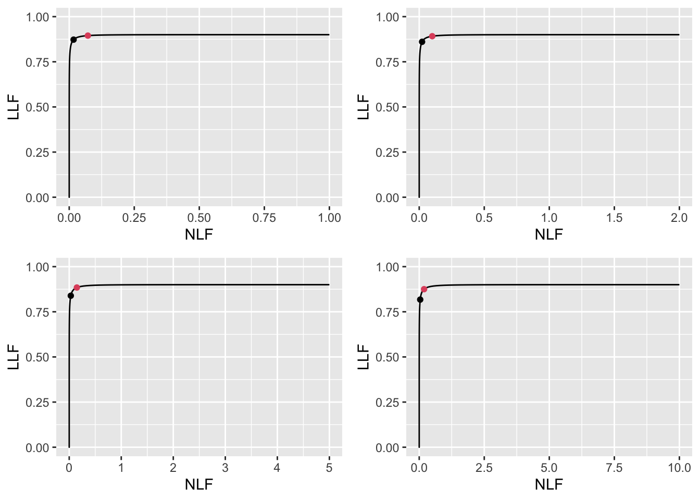

# CAD optimal operating point II {#cad-optim-op-point-2}

---
output:
  rmarkdown::pdf_document:
    fig_caption: yes        
---


## Varying $\nu$ optimizations{#optim-op-point-vary-nu}

For $\mu = 2$ and $\lambda = 1$ optimizations were performed for $\nu = 0.6, 0.7, 0.8, 0.9$. 


### Summary table


<table class="table table-striped table-hover table-condensed table-responsive" style="font-size: 10px; margin-left: auto; margin-right: auto;">
<caption style="font-size: initial !important;">(\#tab:optim-op-point-table-vary-nu)Summary of optimization results for $\mu = 2$, $\lambda = 1$ and varying $\nu$.</caption>
 <thead>
  <tr>
   <th style="text-align:left;"> FOM </th>
   <th style="text-align:left;"> $\nu$ </th>
   <th style="text-align:left;"> $\zeta_1$ </th>
   <th style="text-align:left;"> $\text{wAFROC}$ </th>
   <th style="text-align:left;"> $\text{ROC}$ </th>
   <th style="text-align:left;"> $\left( \text{NLF}, \text{LLF}\right)$ </th>
  </tr>
 </thead>
<tbody>
  <tr>
   <td style="text-align:left;"> wAFROC </td>
   <td style="text-align:left;"> 0.6 </td>
   <td style="text-align:left;"> 0.888 </td>
   <td style="text-align:left;"> 0.701 </td>
   <td style="text-align:left;"> 0.804 </td>
   <td style="text-align:left;"> (0.187, 0.520) </td>
  </tr>
  <tr>
   <td style="text-align:left;">  </td>
   <td style="text-align:left;"> 0.7 </td>
   <td style="text-align:left;"> 0.674 </td>
   <td style="text-align:left;"> 0.751 </td>
   <td style="text-align:left;"> 0.851 </td>
   <td style="text-align:left;"> (0.250, 0.635) </td>
  </tr>
  <tr>
   <td style="text-align:left;">  </td>
   <td style="text-align:left;"> 0.8 </td>
   <td style="text-align:left;"> 0.407 </td>
   <td style="text-align:left;"> 0.805 </td>
   <td style="text-align:left;"> 0.893 </td>
   <td style="text-align:left;"> (0.342, 0.756) </td>
  </tr>
  <tr>
   <td style="text-align:left;">  </td>
   <td style="text-align:left;"> 0.9 </td>
   <td style="text-align:left;"> -0.007 </td>
   <td style="text-align:left;"> 0.864 </td>
   <td style="text-align:left;"> 0.929 </td>
   <td style="text-align:left;"> (0.503, 0.880) </td>
  </tr>
  <tr>
   <td style="text-align:left;"> Youden </td>
   <td style="text-align:left;"> 0.6 </td>
   <td style="text-align:left;"> 1.022 </td>
   <td style="text-align:left;"> 0.700 </td>
   <td style="text-align:left;"> 0.797 </td>
   <td style="text-align:left;"> (0.153, 0.502) </td>
  </tr>
  <tr>
   <td style="text-align:left;">  </td>
   <td style="text-align:left;"> 0.7 </td>
   <td style="text-align:left;"> 1.044 </td>
   <td style="text-align:left;"> 0.745 </td>
   <td style="text-align:left;"> 0.835 </td>
   <td style="text-align:left;"> (0.148, 0.581) </td>
  </tr>
  <tr>
   <td style="text-align:left;">  </td>
   <td style="text-align:left;"> 0.8 </td>
   <td style="text-align:left;"> 1.069 </td>
   <td style="text-align:left;"> 0.788 </td>
   <td style="text-align:left;"> 0.868 </td>
   <td style="text-align:left;"> (0.143, 0.659) </td>
  </tr>
  <tr>
   <td style="text-align:left;">  </td>
   <td style="text-align:left;"> 0.9 </td>
   <td style="text-align:left;"> 1.095 </td>
   <td style="text-align:left;"> 0.831 </td>
   <td style="text-align:left;"> 0.899 </td>
   <td style="text-align:left;"> (0.137, 0.735) </td>
  </tr>
</tbody>
</table>


### FROC


<div class="figure">

<p class="caption">(\#fig:optim-op-point-vary-nu-froc)FROC plots with superimposed operating points for varying $\nu$. The red dot corresponds to wAFROC AUC optimization and the black dot to Youden-index optimization. The values of $\nu$ are: top-left $\nu = 0.6$, top-right $\nu = 0.7$, bottom-left $\nu = 0.8$ and bottom-right $\nu = 0.9$.</p>
</div>


### wAFROC


 


<div class="figure">

<p class="caption">(\#fig:optim-op-point-vary-nu-wafroc)wAFROC plots for the two optimization methods. The color coding is as in previous figures. The values of $\nu$ are: top-left $\nu = 0.6$, top-right $\nu = 0.7$, bottom-left $\nu = 0.8$ and bottom-right $\nu = 0.9$.</p>
</div>


### ROC


<div class="figure">

<p class="caption">(\#fig:optim-op-point-vary-nu-roc)ROC plots for the two optimization methods. The color coding is as in previous figures. The values of $\nu$ are: top-left $\nu = 0.6$, top-right $\nu = 0.7$, bottom-left $\nu = 0.8$ and bottom-right $\nu = 0.9$.</p>
</div>


## Varying $\mu$ optimizations{#optim-op-point-vary-mu}

For $\lambda = 1$ and $\nu = 0.9$ optimizations were performed for $\mu = 1, 2, 3, 4$. 


```r
muArr <- c(1, 2, 3, 4)
lambdaArr <- 1
nuArr <- 0.9
lesDistr <- c(0.5, 0.5)
relWeights <- c(0.5, 0.5)
```


### Summary table


<table class="table table-striped table-hover table-condensed table-responsive" style="font-size: 10px; margin-left: auto; margin-right: auto;">
<caption style="font-size: initial !important;">(\#tab:optim-op-point-table-vary-mu)Summary of optimization results for $\lambda = 1$, $\nu = 0.9$ and varying $\mu$.</caption>
 <thead>
  <tr>
   <th style="text-align:left;"> FOM </th>
   <th style="text-align:left;"> $\mu$ </th>
   <th style="text-align:left;"> $\zeta_1$ </th>
   <th style="text-align:left;"> $\text{wAFROC}$ </th>
   <th style="text-align:left;"> $\text{ROC}$ </th>
   <th style="text-align:left;"> $\left( \text{NLF}, \text{LLF}\right)$ </th>
  </tr>
 </thead>
<tbody>
  <tr>
   <td style="text-align:left;"> wAFROC </td>
   <td style="text-align:left;"> 1 </td>
   <td style="text-align:left;"> -1.663 </td>
   <td style="text-align:left;"> 0.745 </td>
   <td style="text-align:left;"> 0.850 </td>
   <td style="text-align:left;"> (0.952, 0.897) </td>
  </tr>
  <tr>
   <td style="text-align:left;">  </td>
   <td style="text-align:left;"> 2 </td>
   <td style="text-align:left;"> -0.007 </td>
   <td style="text-align:left;"> 0.864 </td>
   <td style="text-align:left;"> 0.929 </td>
   <td style="text-align:left;"> (0.503, 0.880) </td>
  </tr>
  <tr>
   <td style="text-align:left;">  </td>
   <td style="text-align:left;"> 3 </td>
   <td style="text-align:left;"> 0.808 </td>
   <td style="text-align:left;"> 0.922 </td>
   <td style="text-align:left;"> 0.961 </td>
   <td style="text-align:left;"> (0.210, 0.887) </td>
  </tr>
  <tr>
   <td style="text-align:left;">  </td>
   <td style="text-align:left;"> 4 </td>
   <td style="text-align:left;"> 1.463 </td>
   <td style="text-align:left;"> 0.942 </td>
   <td style="text-align:left;"> 0.970 </td>
   <td style="text-align:left;"> (0.072, 0.895) </td>
  </tr>
  <tr>
   <td style="text-align:left;"> Youden </td>
   <td style="text-align:left;"> 1 </td>
   <td style="text-align:left;"> 0.462 </td>
   <td style="text-align:left;"> 0.704 </td>
   <td style="text-align:left;"> 0.815 </td>
   <td style="text-align:left;"> (0.322, 0.634) </td>
  </tr>
  <tr>
   <td style="text-align:left;">  </td>
   <td style="text-align:left;"> 2 </td>
   <td style="text-align:left;"> 1.095 </td>
   <td style="text-align:left;"> 0.831 </td>
   <td style="text-align:left;"> 0.899 </td>
   <td style="text-align:left;"> (0.137, 0.735) </td>
  </tr>
  <tr>
   <td style="text-align:left;">  </td>
   <td style="text-align:left;"> 3 </td>
   <td style="text-align:left;"> 1.629 </td>
   <td style="text-align:left;"> 0.903 </td>
   <td style="text-align:left;"> 0.945 </td>
   <td style="text-align:left;"> (0.052, 0.823) </td>
  </tr>
  <tr>
   <td style="text-align:left;">  </td>
   <td style="text-align:left;"> 4 </td>
   <td style="text-align:left;"> 2.124 </td>
   <td style="text-align:left;"> 0.935 </td>
   <td style="text-align:left;"> 0.964 </td>
   <td style="text-align:left;"> (0.017, 0.873) </td>
  </tr>
</tbody>
</table>


### FROC


<div class="figure">

<p class="caption">(\#fig:optim-op-point-vary-mu-froc)FROC plots with superimposed operating points for varying $\mu$. The red dot corresponds to wAFROC optimization and the black dot to Youden-index optimization. The values of $\mu$ are: top-left $\mu = 1$, top-right $\mu = 2$, bottom-left $\mu = 3$ and bottom-right $\mu = 4$.</p>
</div>


### wAFROC


<div class="figure">

<p class="caption">(\#fig:optim-op-point-vary-mu-wafroc)wAFROC plots for the two optimization methods. The color coding is as in previous figures. The values of $\mu$ are: top-left $\mu = 1$, top-right $\mu = 2$, bottom-left $\mu = 3$ and bottom-right $\mu = 4$.</p>
</div>


### ROC


<div class="figure">

<p class="caption">(\#fig:optim-op-point-vary-mu-roc)ROC plots for the two optimization methods. The color coding is as in previous figures. The values of $\mu$ are: top-left $\mu = 1$, top-right $\mu = 2$, bottom-left $\mu = 3$ and bottom-right $\mu = 4$.</p>
</div>


## Limiting cases {#optim-op-point-limiting-situations}

### High performance vary $\mu$ {#optim-op-point-high-performance-vary-mu}


```r
muArr <- c(2, 3, 4, 5)
nuArr <- c(0.9)
lambdaArr <- c(1)
lesDistr <- c(0.5, 0.5)
relWeights <- c(0.5, 0.5)
```


#### Summary table


<table class="table table-striped table-hover table-condensed table-responsive" style="font-size: 10px; margin-left: auto; margin-right: auto;">
<caption style="font-size: initial !important;">(\#tab:optim-op-point-high-performance-vary-mu-table-vary-all)Summary of optimization results for $\lambda = 1$ and $\nu = 0.9$ and varying $\mu$.</caption>
 <thead>
  <tr>
   <th style="text-align:left;"> FOM </th>
   <th style="text-align:left;"> $\mu$ </th>
   <th style="text-align:left;"> $\zeta_1$ </th>
   <th style="text-align:left;"> $\text{wAFROC}$ </th>
   <th style="text-align:left;"> $\text{ROC}$ </th>
   <th style="text-align:left;"> $\left( \text{NLF}, \text{LLF}\right)$ </th>
  </tr>
 </thead>
<tbody>
  <tr>
   <td style="text-align:left;"> wAFROC </td>
   <td style="text-align:left;"> 2 </td>
   <td style="text-align:left;"> -0.007 </td>
   <td style="text-align:left;"> 0.864 </td>
   <td style="text-align:left;"> 0.929 </td>
   <td style="text-align:left;"> (0.503, 0.880) </td>
  </tr>
  <tr>
   <td style="text-align:left;">  </td>
   <td style="text-align:left;"> 3 </td>
   <td style="text-align:left;"> 0.808 </td>
   <td style="text-align:left;"> 0.922 </td>
   <td style="text-align:left;"> 0.961 </td>
   <td style="text-align:left;"> (0.210, 0.887) </td>
  </tr>
  <tr>
   <td style="text-align:left;">  </td>
   <td style="text-align:left;"> 4 </td>
   <td style="text-align:left;"> 1.463 </td>
   <td style="text-align:left;"> 0.942 </td>
   <td style="text-align:left;"> 0.970 </td>
   <td style="text-align:left;"> (0.072, 0.895) </td>
  </tr>
  <tr>
   <td style="text-align:left;">  </td>
   <td style="text-align:left;"> 5 </td>
   <td style="text-align:left;"> 2.063 </td>
   <td style="text-align:left;"> 0.948 </td>
   <td style="text-align:left;"> 0.972 </td>
   <td style="text-align:left;"> (0.020, 0.899) </td>
  </tr>
  <tr>
   <td style="text-align:left;"> Youden </td>
   <td style="text-align:left;"> 2 </td>
   <td style="text-align:left;"> 1.095 </td>
   <td style="text-align:left;"> 0.831 </td>
   <td style="text-align:left;"> 0.899 </td>
   <td style="text-align:left;"> (0.137, 0.735) </td>
  </tr>
  <tr>
   <td style="text-align:left;">  </td>
   <td style="text-align:left;"> 3 </td>
   <td style="text-align:left;"> 1.629 </td>
   <td style="text-align:left;"> 0.903 </td>
   <td style="text-align:left;"> 0.945 </td>
   <td style="text-align:left;"> (0.052, 0.823) </td>
  </tr>
  <tr>
   <td style="text-align:left;">  </td>
   <td style="text-align:left;"> 4 </td>
   <td style="text-align:left;"> 2.124 </td>
   <td style="text-align:left;"> 0.935 </td>
   <td style="text-align:left;"> 0.964 </td>
   <td style="text-align:left;"> (0.017, 0.873) </td>
  </tr>
  <tr>
   <td style="text-align:left;">  </td>
   <td style="text-align:left;"> 5 </td>
   <td style="text-align:left;"> 2.608 </td>
   <td style="text-align:left;"> 0.946 </td>
   <td style="text-align:left;"> 0.970 </td>
   <td style="text-align:left;"> (0.005, 0.892) </td>
  </tr>
</tbody>
</table>


#### FROC


<div class="figure">

<p class="caption">(\#fig:optim-op-point-low-performance-vary-mu-vary-all-froc)FROC plots with superimposed operating points for varying $\nu$. The red dot corresponds to wAFROC AUC optimization and the black dot to Youden-index optimization. The values of $\mu$ are: top-left $\mu = 2$, top-right $\mu = 3$, bottom-left $\mu = 4$ and bottom-right $\mu = 5$.</p>
</div>


#### wAFROC


<div class="figure">

<p class="caption">(\#fig:optim-op-point-high-performance-vary-mu-vary-all-wafroc)wAFROC plots for the two optimization methods. The color coding is as in previous figures. The values of $\mu$ are: top-left $\mu = 2$, top-right $\mu = 3$, bottom-left $\mu = 4$ and bottom-right $\mu = 5$.</p>
</div>


#### ROC


<div class="figure">

<p class="caption">(\#fig:optim-op-point-high-performance-vary-mu-vary-all-roc)ROC plots for the two optimization methods. The color coding is as in previous figures. The values of $\mu$ are: top-left $\mu = 2$, top-right $\mu = 3$, bottom-left $\mu = 4$ and bottom-right $\mu = 5$.</p>
</div>


### Low performance vary $\mu$ {#optim-op-point-low-performance-vary-mu}


```r
muArr <- c(1, 2, 3, 4)
nuArr <- c(0.1)
lambdaArr <- c(10)
lesDistr <- c(0.5, 0.5)
relWeights <- c(0.5, 0.5)
```


#### Summary table


<table class="table table-striped table-hover table-condensed table-responsive" style="font-size: 10px; margin-left: auto; margin-right: auto;">
<caption style="font-size: initial !important;">(\#tab:optim-op-point-low-performance-vary-mu-table-vary-all)Summary of optimization results for $\lambda = 10$ and $nu = 0.1$ and varying $\mu$. Column labeling as in previous tables.</caption>
 <thead>
  <tr>
   <th style="text-align:left;"> FOM </th>
   <th style="text-align:left;"> $\mu$ </th>
   <th style="text-align:left;"> $\zeta_1$ </th>
   <th style="text-align:left;"> $\text{wAFROC}$ </th>
   <th style="text-align:left;"> $\text{ROC}$ </th>
   <th style="text-align:left;"> $\left( \text{NLF}, \text{LLF}\right)$ </th>
  </tr>
 </thead>
<tbody>
  <tr>
   <td style="text-align:left;"> wAFROC </td>
   <td style="text-align:left;"> 1 </td>
   <td style="text-align:left;"> 5.000 </td>
   <td style="text-align:left;"> 0.500 </td>
   <td style="text-align:left;"> 0.500 </td>
   <td style="text-align:left;"> (0.000, 0.000) </td>
  </tr>
  <tr>
   <td style="text-align:left;">  </td>
   <td style="text-align:left;"> 2 </td>
   <td style="text-align:left;"> 3.298 </td>
   <td style="text-align:left;"> 0.502 </td>
   <td style="text-align:left;"> 0.507 </td>
   <td style="text-align:left;"> (0.005, 0.010) </td>
  </tr>
  <tr>
   <td style="text-align:left;">  </td>
   <td style="text-align:left;"> 3 </td>
   <td style="text-align:left;"> 3.018 </td>
   <td style="text-align:left;"> 0.518 </td>
   <td style="text-align:left;"> 0.536 </td>
   <td style="text-align:left;"> (0.013, 0.049) </td>
  </tr>
  <tr>
   <td style="text-align:left;">  </td>
   <td style="text-align:left;"> 4 </td>
   <td style="text-align:left;"> 3.130 </td>
   <td style="text-align:left;"> 0.536 </td>
   <td style="text-align:left;"> 0.559 </td>
   <td style="text-align:left;"> (0.009, 0.081) </td>
  </tr>
  <tr>
   <td style="text-align:left;"> Youden </td>
   <td style="text-align:left;"> 1 </td>
   <td style="text-align:left;"> 1.563 </td>
   <td style="text-align:left;"> 0.292 </td>
   <td style="text-align:left;"> 0.514 </td>
   <td style="text-align:left;"> (0.590, 0.029) </td>
  </tr>
  <tr>
   <td style="text-align:left;">  </td>
   <td style="text-align:left;"> 2 </td>
   <td style="text-align:left;"> 1.865 </td>
   <td style="text-align:left;"> 0.397 </td>
   <td style="text-align:left;"> 0.535 </td>
   <td style="text-align:left;"> (0.311, 0.055) </td>
  </tr>
  <tr>
   <td style="text-align:left;">  </td>
   <td style="text-align:left;"> 3 </td>
   <td style="text-align:left;"> 2.198 </td>
   <td style="text-align:left;"> 0.478 </td>
   <td style="text-align:left;"> 0.555 </td>
   <td style="text-align:left;"> (0.140, 0.079) </td>
  </tr>
  <tr>
   <td style="text-align:left;">  </td>
   <td style="text-align:left;"> 4 </td>
   <td style="text-align:left;"> 2.564 </td>
   <td style="text-align:left;"> 0.523 </td>
   <td style="text-align:left;"> 0.567 </td>
   <td style="text-align:left;"> (0.052, 0.092) </td>
  </tr>
</tbody>
</table>


#### FROC


<div class="figure">

<p class="caption">(\#fig:optim-op-point-low-performance-vary-mu-vary-all)FROC plots with superimposed operating points for varying $\nu$. The red dot corresponds to wAFROC AUC optimization and the black dot to Youden-index optimization. The values of $\mu$ are: top-left $\mu = 1$, top-right $\mu = 2$, bottom-left $\mu = 3$ and bottom-right $\mu = 4$.</p>
</div>


#### wAFROC


<div class="figure">

<p class="caption">(\#fig:optim-op-point-low-performance-vary-mu-vary-all-wafroc)wAFROC plots for the two optimization methods. The color coding is as in previous figures. The values of $\mu$ are: top-left $\mu = 1$, top-right $\mu = 2$, bottom-left $\mu = 3$ and bottom-right $\mu = 4$.</p>
</div>


#### ROC


<div class="figure">

<p class="caption">(\#fig:optim-op-point-low-performance-vary-mu-vary-all-roc)ROC plots for the two optimization methods. The color coding is as in previous figures. The values of $\mu$ are: top-left $\mu = 1$, top-right $\mu = 2$, bottom-left $\mu = 3$ and bottom-right $\mu = 4$.</p>
</div>


### High performance vary $\lambda$ {#optim-op-point-high-performance-vary-lambda}


```r
muArr <- c(4)
nuArr <- c(0.9)
lambdaArr <- c(1,2,5,10)
lesDistr <- c(0.5, 0.5)
relWeights <- c(0.5, 0.5)
```


#### Summary table


<table class="table table-striped table-hover table-condensed table-responsive" style="font-size: 10px; margin-left: auto; margin-right: auto;">
<caption style="font-size: initial !important;">(\#tab:optim-op-point-high-performance-vary-lambda-table-vary-all)Summary of optimization results for $\mu = 4$, $nu = 0.9$ and varying lambda. Column labeling as in previous tables.</caption>
 <thead>
  <tr>
   <th style="text-align:left;"> FOM </th>
   <th style="text-align:left;"> $\lambda$ </th>
   <th style="text-align:left;"> $\zeta_1$ </th>
   <th style="text-align:left;"> $\text{wAFROC}$ </th>
   <th style="text-align:left;"> $\text{ROC}$ </th>
   <th style="text-align:left;"> $\left( \text{NLF}, \text{LLF}\right)$ </th>
  </tr>
 </thead>
<tbody>
  <tr>
   <td style="text-align:left;"> wAFROC </td>
   <td style="text-align:left;"> 1 </td>
   <td style="text-align:left;"> 1.463 </td>
   <td style="text-align:left;"> 0.942 </td>
   <td style="text-align:left;"> 0.970 </td>
   <td style="text-align:left;"> (0.072, 0.895) </td>
  </tr>
  <tr>
   <td style="text-align:left;">  </td>
   <td style="text-align:left;"> 2 </td>
   <td style="text-align:left;"> 1.644 </td>
   <td style="text-align:left;"> 0.938 </td>
   <td style="text-align:left;"> 0.968 </td>
   <td style="text-align:left;"> (0.100, 0.892) </td>
  </tr>
  <tr>
   <td style="text-align:left;">  </td>
   <td style="text-align:left;"> 5 </td>
   <td style="text-align:left;"> 1.889 </td>
   <td style="text-align:left;"> 0.930 </td>
   <td style="text-align:left;"> 0.965 </td>
   <td style="text-align:left;"> (0.147, 0.884) </td>
  </tr>
  <tr>
   <td style="text-align:left;">  </td>
   <td style="text-align:left;"> 10 </td>
   <td style="text-align:left;"> 2.082 </td>
   <td style="text-align:left;"> 0.920 </td>
   <td style="text-align:left;"> 0.960 </td>
   <td style="text-align:left;"> (0.187, 0.875) </td>
  </tr>
  <tr>
   <td style="text-align:left;"> Youden </td>
   <td style="text-align:left;"> 1 </td>
   <td style="text-align:left;"> 2.124 </td>
   <td style="text-align:left;"> 0.935 </td>
   <td style="text-align:left;"> 0.964 </td>
   <td style="text-align:left;"> (0.017, 0.873) </td>
  </tr>
  <tr>
   <td style="text-align:left;">  </td>
   <td style="text-align:left;"> 2 </td>
   <td style="text-align:left;"> 2.291 </td>
   <td style="text-align:left;"> 0.928 </td>
   <td style="text-align:left;"> 0.960 </td>
   <td style="text-align:left;"> (0.022, 0.861) </td>
  </tr>
  <tr>
   <td style="text-align:left;">  </td>
   <td style="text-align:left;"> 5 </td>
   <td style="text-align:left;"> 2.508 </td>
   <td style="text-align:left;"> 0.915 </td>
   <td style="text-align:left;"> 0.952 </td>
   <td style="text-align:left;"> (0.030, 0.839) </td>
  </tr>
  <tr>
   <td style="text-align:left;">  </td>
   <td style="text-align:left;"> 10 </td>
   <td style="text-align:left;"> 2.669 </td>
   <td style="text-align:left;"> 0.903 </td>
   <td style="text-align:left;"> 0.944 </td>
   <td style="text-align:left;"> (0.038, 0.818) </td>
  </tr>
</tbody>
</table>


#### FROC


<div class="figure">

<p class="caption">(\#fig:optim-op-point-high-performance-vary-lambda-vary-all-froc)FROC plots with superimposed operating points for varying $\nu$. The red dot corresponds to wAFROC AUC optimization and the black dot to Youden-index optimization. The values of $\lambda$ are: top-left $\lambda = 1$, top-right $\lambda = 2$, bottom-left $\lambda = 5$ and bottom-right $\lambda = 10$.</p>
</div>


#### wAFROC


<div class="figure">

<p class="caption">(\#fig:optim-op-point-high-performance-vary-lambda-vary-all-wafroc)wAFROC plots for the two optimization methods. The color coding is as in previous figures. The values of $\lambda$ are: top-left $\lambda = 1$, top-right $\lambda = 2$, bottom-left $\lambda = 5$ and bottom-right $\lambda = 10$.</p>
</div>


#### ROC


<div class="figure">

<p class="caption">(\#fig:optim-op-point-high-performance-vary-lambda-vary-all-roc)ROC plots for the two optimization methods. The color coding is as in previous figures. The values of $\lambda$ are: top-left $\lambda = 1$, top-right $\lambda = 2$, bottom-left $\lambda = 5$ and bottom-right $\lambda = 10$.</p>
</div>


### Low performance vary $\lambda$ {#optim-op-point-low-performance-vary-lambda}


```r
muArr <- c(1)
nuArr <- c(0.2)
lambdaArr <- c(1, 2, 5, 10)
lesDistr <- c(0.5, 0.5)
relWeights <- c(0.5, 0.5)
```


#### Summary table


<table class="table table-striped table-hover table-condensed table-responsive" style="font-size: 10px; margin-left: auto; margin-right: auto;">
<caption style="font-size: initial !important;">(\#tab:optim-op-point-low-performance-vary-lambda-table-vary-all)Summary of optimization results for $\mu = 1$, $\nu = 0.2$ and varying $\lambda$. Column labeling as in previous tables.</caption>
 <thead>
  <tr>
   <th style="text-align:left;"> FOM </th>
   <th style="text-align:left;"> $\lambda$ </th>
   <th style="text-align:left;"> $\zeta_1$ </th>
   <th style="text-align:left;"> $\text{wAFROC}$ </th>
   <th style="text-align:left;"> $\text{ROC}$ </th>
   <th style="text-align:left;"> $\left( \text{NLF}, \text{LLF}\right)$ </th>
  </tr>
 </thead>
<tbody>
  <tr>
   <td style="text-align:left;"> wAFROC </td>
   <td style="text-align:left;"> 1 </td>
   <td style="text-align:left;"> 2.081 </td>
   <td style="text-align:left;"> 0.505 </td>
   <td style="text-align:left;"> 0.520 </td>
   <td style="text-align:left;"> (0.019, 0.028) </td>
  </tr>
  <tr>
   <td style="text-align:left;">  </td>
   <td style="text-align:left;"> 2 </td>
   <td style="text-align:left;"> 2.795 </td>
   <td style="text-align:left;"> 0.501 </td>
   <td style="text-align:left;"> 0.505 </td>
   <td style="text-align:left;"> (0.005, 0.007) </td>
  </tr>
  <tr>
   <td style="text-align:left;">  </td>
   <td style="text-align:left;"> 5 </td>
   <td style="text-align:left;"> 3.718 </td>
   <td style="text-align:left;"> 0.500 </td>
   <td style="text-align:left;"> 0.500 </td>
   <td style="text-align:left;"> (0.001, 0.001) </td>
  </tr>
  <tr>
   <td style="text-align:left;">  </td>
   <td style="text-align:left;"> 10 </td>
   <td style="text-align:left;"> 4.412 </td>
   <td style="text-align:left;"> 0.500 </td>
   <td style="text-align:left;"> 0.500 </td>
   <td style="text-align:left;"> (0.000, 0.000) </td>
  </tr>
  <tr>
   <td style="text-align:left;"> Youden </td>
   <td style="text-align:left;"> 1 </td>
   <td style="text-align:left;"> 0.284 </td>
   <td style="text-align:left;"> 0.423 </td>
   <td style="text-align:left;"> 0.587 </td>
   <td style="text-align:left;"> (0.388, 0.153) </td>
  </tr>
  <tr>
   <td style="text-align:left;">  </td>
   <td style="text-align:left;"> 2 </td>
   <td style="text-align:left;"> 0.734 </td>
   <td style="text-align:left;"> 0.380 </td>
   <td style="text-align:left;"> 0.566 </td>
   <td style="text-align:left;"> (0.463, 0.121) </td>
  </tr>
  <tr>
   <td style="text-align:left;">  </td>
   <td style="text-align:left;"> 5 </td>
   <td style="text-align:left;"> 1.237 </td>
   <td style="text-align:left;"> 0.335 </td>
   <td style="text-align:left;"> 0.542 </td>
   <td style="text-align:left;"> (0.540, 0.081) </td>
  </tr>
  <tr>
   <td style="text-align:left;">  </td>
   <td style="text-align:left;"> 10 </td>
   <td style="text-align:left;"> 1.568 </td>
   <td style="text-align:left;"> 0.309 </td>
   <td style="text-align:left;"> 0.528 </td>
   <td style="text-align:left;"> (0.585, 0.057) </td>
  </tr>
</tbody>
</table>


#### FROC


<div class="figure">

<p class="caption">(\#fig:optim-op-point-low-performance-vary-lambda-vary-all-froc)FROC plots with superimposed operating points for varying $\nu$. The red dot corresponds to wAFROC AUC optimization and the black dot to Youden-index optimization. The values of $\lambda$ are: top-left $\lambda = 1$, top-right $\lambda = 2$, bottom-left $\lambda = 5$ and bottom-right $\lambda = 10$.</p>
</div>


#### wAFROC


<div class="figure">

<p class="caption">(\#fig:optim-op-point-low-performance-vary-lambda-vary-all-wafroc)wAFROC plots for the two optimization methods. The color coding is as in previous figures. The values of $\lambda$ are: top-left $\lambda = 1$, top-right $\lambda = 2$, bottom-left $\lambda = 5$ and bottom-right $\lambda = 10$.</p>
</div>


#### ROC


<div class="figure">

<p class="caption">(\#fig:optim-op-point-low-performance-vary-lambda-vary-all-roc)ROC plots for the two optimization methods. The color coding is as in previous figures. The values of $\lambda$ are: top-left $\lambda = 1$, top-right $\lambda = 2$, bottom-left $\lambda = 5$ and bottom-right $\lambda = 10$.</p>
</div>


### High performance vary $\nu$ {#optim-op-point-high-performance-vary-nu}


```r
muArr <- c(4)
lambdaArr <- c(1)
nuArr <- c(0.6, 0.7, 0.8, 0.9)
lesDistr <- c(0.5, 0.5)
relWeights <- c(0.5, 0.5)
```


#### Summary table


<table class="table table-striped table-hover table-condensed table-responsive" style="font-size: 10px; margin-left: auto; margin-right: auto;">
<caption style="font-size: initial !important;">(\#tab:optim-op-point-high-performance-vary-nu-table-vary-all)Summary of optimization results for $\mu = 4$, $\lambda = 1$ and varying $\nu$. Column labeling as in previous tables.</caption>
 <thead>
  <tr>
   <th style="text-align:left;"> FOM </th>
   <th style="text-align:left;"> $\nu$ </th>
   <th style="text-align:left;"> $\zeta_1$ </th>
   <th style="text-align:left;"> $\text{wAFROC}$ </th>
   <th style="text-align:left;"> $\text{ROC}$ </th>
   <th style="text-align:left;"> $\left( \text{NLF}, \text{LLF}\right)$ </th>
  </tr>
 </thead>
<tbody>
  <tr>
   <td style="text-align:left;"> wAFROC </td>
   <td style="text-align:left;"> 0.6 </td>
   <td style="text-align:left;"> 1.905 </td>
   <td style="text-align:left;"> 0.788 </td>
   <td style="text-align:left;"> 0.855 </td>
   <td style="text-align:left;"> (0.028, 0.589) </td>
  </tr>
  <tr>
   <td style="text-align:left;">  </td>
   <td style="text-align:left;"> 0.7 </td>
   <td style="text-align:left;"> 1.796 </td>
   <td style="text-align:left;"> 0.839 </td>
   <td style="text-align:left;"> 0.898 </td>
   <td style="text-align:left;"> (0.036, 0.690) </td>
  </tr>
  <tr>
   <td style="text-align:left;">  </td>
   <td style="text-align:left;"> 0.8 </td>
   <td style="text-align:left;"> 1.663 </td>
   <td style="text-align:left;"> 0.890 </td>
   <td style="text-align:left;"> 0.936 </td>
   <td style="text-align:left;"> (0.048, 0.792) </td>
  </tr>
  <tr>
   <td style="text-align:left;">  </td>
   <td style="text-align:left;"> 0.9 </td>
   <td style="text-align:left;"> 1.463 </td>
   <td style="text-align:left;"> 0.942 </td>
   <td style="text-align:left;"> 0.970 </td>
   <td style="text-align:left;"> (0.072, 0.895) </td>
  </tr>
  <tr>
   <td style="text-align:left;"> Youden </td>
   <td style="text-align:left;"> 0.6 </td>
   <td style="text-align:left;"> 2.063 </td>
   <td style="text-align:left;"> 0.788 </td>
   <td style="text-align:left;"> 0.852 </td>
   <td style="text-align:left;"> (0.020, 0.584) </td>
  </tr>
  <tr>
   <td style="text-align:left;">  </td>
   <td style="text-align:left;"> 0.7 </td>
   <td style="text-align:left;"> 2.080 </td>
   <td style="text-align:left;"> 0.837 </td>
   <td style="text-align:left;"> 0.894 </td>
   <td style="text-align:left;"> (0.019, 0.681) </td>
  </tr>
  <tr>
   <td style="text-align:left;">  </td>
   <td style="text-align:left;"> 0.8 </td>
   <td style="text-align:left;"> 2.100 </td>
   <td style="text-align:left;"> 0.886 </td>
   <td style="text-align:left;"> 0.931 </td>
   <td style="text-align:left;"> (0.018, 0.777) </td>
  </tr>
  <tr>
   <td style="text-align:left;">  </td>
   <td style="text-align:left;"> 0.9 </td>
   <td style="text-align:left;"> 2.124 </td>
   <td style="text-align:left;"> 0.935 </td>
   <td style="text-align:left;"> 0.964 </td>
   <td style="text-align:left;"> (0.017, 0.873) </td>
  </tr>
</tbody>
</table>


#### FROC


<div class="figure">

<p class="caption">(\#fig:optim-op-point-high-performance-vary-nu-vary-all-froc)FROC plots with superimposed operating points for varying $\nu$. The red dot corresponds to wAFROC AUC optimization and the black dot to Youden-index optimization. The values of $\nu$ are: top-left $\nu = 0.6$, top-right $\nu = 0.7$, bottom-left $\nu = 0.8$ and bottom-right $\nu = 0.9$.</p>
</div>


#### wAFROC


<div class="figure">

<p class="caption">(\#fig:optim-op-point-high-performance-vary-nu-vary-all-wafroc)wAFROC plots for the two optimization methods. The color coding is as in previous figures. The values of $\nu$ are: top-left $\nu = 0.6$, top-right $\nu = 0.7$, bottom-left $\nu = 0.8$ and bottom-right $\nu = 0.9$.</p>
</div>


#### ROC


<div class="figure">

<p class="caption">(\#fig:optim-op-point-high-performance-vary-nu-vary-all-roc)ROC plots for the two optimization methods. The color coding is as in previous figures. The values of $\nu$ are: top-left $\nu = 0.6$, top-right $\nu = 0.7$, bottom-left $\nu = 0.8$ and bottom-right $\nu = 0.9$.</p>
</div>


### Low performance vary $\nu$ {#optim-op-point-low-performance-vary-nu}


```r
muArr <- c(1)
lambdaArr <- c(10)
nuArr <- c(0.1, 0.2, 0.3, 0.4)
lesDistr <- c(0.5, 0.5)
relWeights <- c(0.5, 0.5)
```


#### Summary table


<table class="table table-striped table-hover table-condensed table-responsive" style="font-size: 10px; margin-left: auto; margin-right: auto;">
<caption style="font-size: initial !important;">(\#tab:optim-op-point-low-performance-vary-nu-table-vary-all)Summary of optimization results for $\mu = 1$, $\lambda = 10$ and varying $\nu$. Column labeling as in previous tables.</caption>
 <thead>
  <tr>
   <th style="text-align:left;"> FOM </th>
   <th style="text-align:left;"> $\nu$ </th>
   <th style="text-align:left;"> $\zeta_1$ </th>
   <th style="text-align:left;"> $\text{wAFROC}$ </th>
   <th style="text-align:left;"> $\text{ROC}$ </th>
   <th style="text-align:left;"> $\left( \text{NLF}, \text{LLF}\right)$ </th>
  </tr>
 </thead>
<tbody>
  <tr>
   <td style="text-align:left;"> wAFROC </td>
   <td style="text-align:left;"> 0.1 </td>
   <td style="text-align:left;"> 5.000 </td>
   <td style="text-align:left;"> 0.500 </td>
   <td style="text-align:left;"> 0.500 </td>
   <td style="text-align:left;"> (0.000, 0.000) </td>
  </tr>
  <tr>
   <td style="text-align:left;">  </td>
   <td style="text-align:left;"> 0.2 </td>
   <td style="text-align:left;"> 4.412 </td>
   <td style="text-align:left;"> 0.500 </td>
   <td style="text-align:left;"> 0.500 </td>
   <td style="text-align:left;"> (0.000, 0.000) </td>
  </tr>
  <tr>
   <td style="text-align:left;">  </td>
   <td style="text-align:left;"> 0.3 </td>
   <td style="text-align:left;"> 4.006 </td>
   <td style="text-align:left;"> 0.500 </td>
   <td style="text-align:left;"> 0.500 </td>
   <td style="text-align:left;"> (0.000, 0.000) </td>
  </tr>
  <tr>
   <td style="text-align:left;">  </td>
   <td style="text-align:left;"> 0.4 </td>
   <td style="text-align:left;"> 3.718 </td>
   <td style="text-align:left;"> 0.500 </td>
   <td style="text-align:left;"> 0.501 </td>
   <td style="text-align:left;"> (0.001, 0.001) </td>
  </tr>
  <tr>
   <td style="text-align:left;"> Youden </td>
   <td style="text-align:left;"> 0.1 </td>
   <td style="text-align:left;"> 1.563 </td>
   <td style="text-align:left;"> 0.292 </td>
   <td style="text-align:left;"> 0.514 </td>
   <td style="text-align:left;"> (0.590, 0.029) </td>
  </tr>
  <tr>
   <td style="text-align:left;">  </td>
   <td style="text-align:left;"> 0.2 </td>
   <td style="text-align:left;"> 1.568 </td>
   <td style="text-align:left;"> 0.309 </td>
   <td style="text-align:left;"> 0.528 </td>
   <td style="text-align:left;"> (0.585, 0.057) </td>
  </tr>
  <tr>
   <td style="text-align:left;">  </td>
   <td style="text-align:left;"> 0.3 </td>
   <td style="text-align:left;"> 1.572 </td>
   <td style="text-align:left;"> 0.325 </td>
   <td style="text-align:left;"> 0.542 </td>
   <td style="text-align:left;"> (0.580, 0.085) </td>
  </tr>
  <tr>
   <td style="text-align:left;">  </td>
   <td style="text-align:left;"> 0.4 </td>
   <td style="text-align:left;"> 1.577 </td>
   <td style="text-align:left;"> 0.342 </td>
   <td style="text-align:left;"> 0.556 </td>
   <td style="text-align:left;"> (0.574, 0.113) </td>
  </tr>
</tbody>
</table>


#### FROC


<div class="figure">

<p class="caption">(\#fig:optim-op-point-low-performance-vary-nu-vary-all-froc)FROC plots with superimposed operating points for varying $\nu$. The red dot corresponds to wAFROC AUC optimization and the black dot to Youden-index optimization. The values of $\nu$ are: top-left $\nu = 0.1$, top-right $\nu = 0.2$, bottom-left $\nu = 0.3$ and bottom-right $\nu = 0.4$.</p>
</div>


#### wAFROC


<div class="figure">

<p class="caption">(\#fig:optim-op-point-low-performance-vary-nu-vary-all-wafroc)wAFROC plots for the two optimization methods. The color coding is as in previous figures. The values of $\nu$ are: top-left $\nu = 0.1$, top-right $\nu = 0.2$, bottom-left $\nu = 0.3$ and bottom-right $\nu = 0.4$.</p>
</div>


#### ROC


<div class="figure">

<p class="caption">(\#fig:optim-op-point-low-performance-vary-nu-vary-all-roc)ROC plots for the two optimization methods. The color coding is as in previous figures. The values of $\nu$ are: top-left $\nu = 0.1$, top-right $\nu = 0.2$, bottom-left $\nu = 0.3$ and bottom-right $\nu = 0.4$.</p>
</div>


