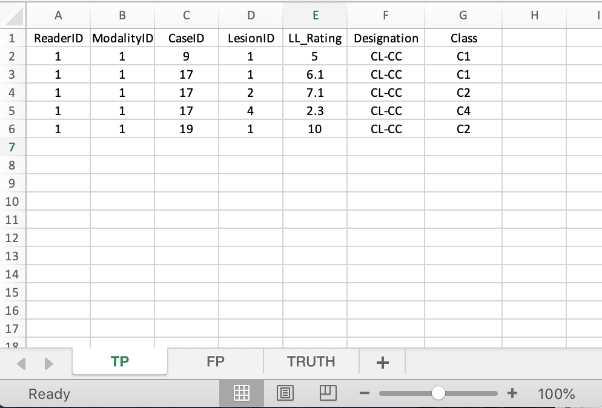
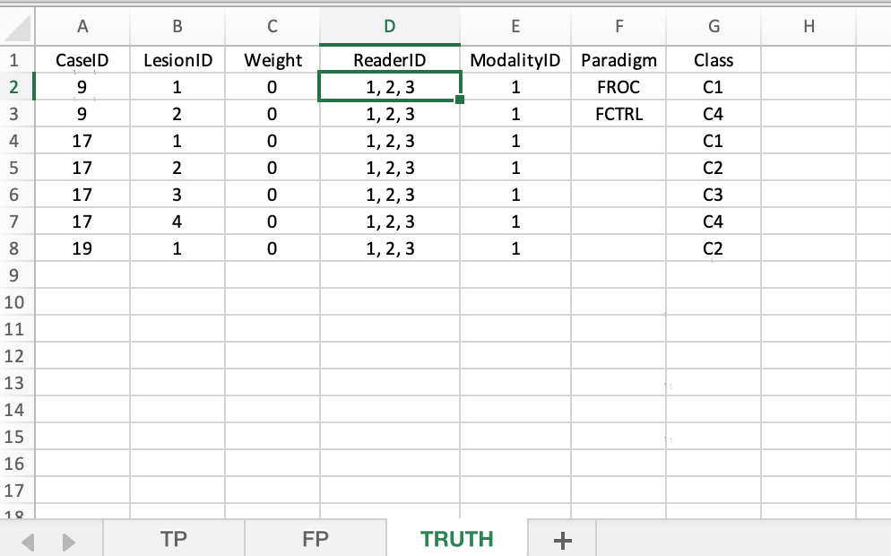
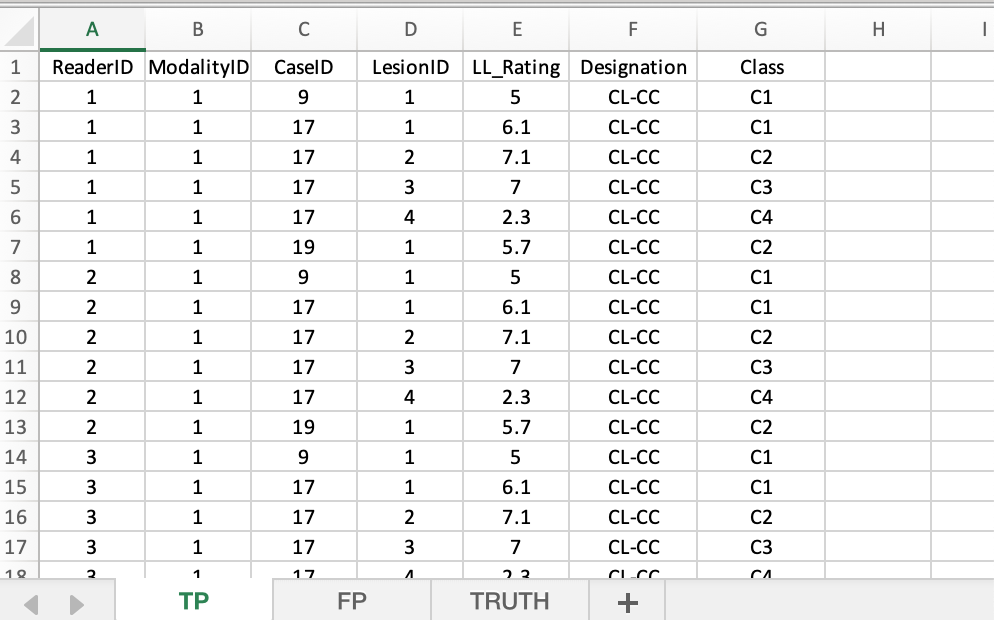

# Localization - classification tasks {#classification-tasks}

```{r setup, include = FALSE}
  knitr::opts_chunk$set(
  collapse = TRUE,
  comment = "#>"
  )
  library(RJafroc)
  library(ggplot2)
  library(kableExtra)
  library(gridExtra)
```


## TBA How much finished {#classification-tasks-how-much-finished}
10%


## Introduction {#classification-tasks-intro}

TBA: This project is a works-in-progress.

## Abbreviations {#classification-tasks-abbreviations}

-   Correct-localization correct-classification = **CL-CC**
-   Correct-localization incorrect-classification = **CL-IC**
-   Incorrect-localization classification not applicable = **IL-NA**

## History and basic idea {#classification-tasks-basic-idea}

This project started with a request to extend localization analysis software `RJafroc` to localization-classification tasks. Since this is new research the required data format is not in the `RJafroc` documentation. Some familiarity with basic localization task analysis is assumed.

The basic idea is that spatial localization is a special case of localization-with-classification. **CL-CC** marks are put in TP sheet and other are put in FP sheet.

## First example, File1.xlsx {#classification-tasks-example1}

-   This example is implemented in file `File1.xlsx`.
-   There are four classes of lesions: `C1`, `C2`, `C3`and `C4`.
-   The rating scale is 1 - 10 and positive-directed.
-   The dataset has 3 cases: 9, 17 and 19.

### `Truth` sheet {#classification-tasks-example1-truth}

This has the ground truth of for cases and lesions, and specifies their class types.

```{r File1Truth, echo=FALSE,out.width="50%",out.height="20%",fig.cap="Truth worksheet for File1.xlsx",fig.show='hold',fig.align='center'}
knitr::include_graphics("images/classification/File1Truth.png")
```

-   Case 9 has two lesions, with classes `C1` and `C4`.
-   Case 17 has four lesions, with classes `C1`, `C2`, `C3`and `C4`.
-   Case 19 has one lesion, with class `C2`.

### `TP` sheet {#classification-tasks-example1-tp}

This holds CL-CC marks.

```{r File1TP, echo=FALSE,out.width="50%",out.height="20%",fig.cap="TP worksheet for File1.xlsx",fig.show='hold',fig.align='center'}
knitr::include_graphics("images/classification/File1TP.png")
```

#### Case 9 {#classification-tasks-example1-case9}

-   Lesion `C1`, `lesionID` = 1, **CL-CC** mark rated 5.

#### Case 17 {#classification-tasks-example1-case17}

-   Lesion `C1`, `lesionID` = 1, **CL-CC** mark rated 6.1.
-   Lesion `C2`, `lesionID` = 2, **CL-CC** mark rated 7.1.
-   Lesion `C4`, `lesionID` = 4, **CL-CC** mark rated 2.3.

#### Case 19 {#classification-tasks-example1-case19}

-   Lesion `C2`, `lesionID` = 1, **CL-CC** mark rated 5.7.

### `FP` sheet {#classification-tasks-example1-fp}

-   This holds **IL-NA** and **CL-IC** marks.
-   `ClassTrue` is the true class of the lesion.
-   `ClassDx` is the indicated or diagnosed class of the lesion.

```{r File1FP, echo=FALSE,out.width="50%",out.height="20%",fig.cap="FP worksheet for File1.xlsx",fig.show='hold',fig.align='center'}
knitr::include_graphics("images/classification/File1FP.png")
```

#### Case 9 {#classification-tasks-example1-fp-case9}

-   **CL-IC** mark rated 5.5, `C2` classified as `C3`.
-   **IL-NA** mark rated 1.2.

#### Case 17 {#classification-tasks-example1-fp-case17}

-   **CL-IC** mark rated 7, `C3` classified as `C2`.
-   **IL-NA** mark rated 2.3.
-   **IL-NA** mark rated 2.1.

#### Case 19 {#classification-tasks-example1-fp-case19}

-   **IL-NA** mark rated 1.4.
-   **CL-IC** mark rated 6.1, `C2` classified as `C3`.

### The two ratings arrays

```{r}
fileName <- "R/CH83-ClassificationTask/File1.xlsx"
x <- DfReadDataFile(fileName = fileName)
x$ratings$NL[1,1,,]
x$ratings$LL[1,1,,]
```

The FOM is shown next:

```{r}
print(UtilFigureOfMerit(x, FOM = "wAFROC1"))
```

## Second example, File2.xlsx {#classification-tasks-example2}

I increased the LL rating for case 19 to 10; this should increase the FOM. This example is implemented in file `File2.xlsx`.

```{r File2TP, echo=FALSE,out.width="50%",out.height="20%",fig.cap="TP worksheet for File2.xlsx",fig.show='hold',fig.align='center'}

```

```{r}
fileName <- "R/CH83-ClassificationTask/File2.xlsx"
x <- DfReadDataFile(fileName = fileName)
print(UtilFigureOfMerit(x, FOM = "wAFROC1"))
```

## Third example, File3.xlsx {#classification-tasks-example3}

Starting with original file, I transferred a **CL-IC** for case 17 to the TP sheet, where it is a **CL_CC** mark. This should increase the FOM as credit is given for **CL-CC.** This example is implemented in file `File3.xlsx`.

```{r File3TPFP, echo=FALSE,out.width="50%",out.height="20%",fig.cap="TP and FP worksheets for File3.xlsx",fig.show='hold',fig.align='center'}
knitr::include_graphics(c("images/classification/File3TP.png", "images/classification/File3FP.png"))
```

```{r}
fileName <- "R/CH83-ClassificationTask/File3.xlsx"
x <- DfReadDataFile(fileName = fileName)
print(UtilFigureOfMerit(x, FOM = "wAFROC1"))
```

## Fourth example, File4.xlsx {#classification-tasks-example4}

So far we have dealt with one modality and one reader.

-   Additional algorithmic readers can be added under `readerID`.
-   They should not be added as additional treatments (has to do with treatment being regarded as a fixed factor and reader as as random factor in the analysis).
-   The starting point is `File3.xlsx`. I duplicated the data from this for two additional readers to create a single-modality three-reader dataset `File4.xlsx`.
-   Shown next are the three worksheets.

```{r File4Truth, echo=FALSE,out.width="50%",out.height="20%",fig.cap="Truth worksheet for File4.xlsx",fig.show='hold',fig.align='center'}

```

```{r File4TP, echo=FALSE,out.width="50%",out.height="20%",fig.cap="TP worksheet for File4.xlsx",fig.show='hold',fig.align='center'}

```

```{r File4FP, echo=FALSE,out.width="50%",out.height="20%",fig.cap="FP worksheet for File4.xlsx",fig.show='hold',fig.align='center'}
knitr::include_graphics("images/classification/File4FP.png")
```

-   Shown next are the three FOMs. Note that they are identical.

```{r}
fileName <- "R/CH83-ClassificationTask/File4.xlsx"
x <- DfReadDataFile(fileName = fileName)
print(UtilFigureOfMerit(x, FOM = "wAFROC1"))
```

## Fifth example, File5.xlsx {#classification-tasks-example5}

-   Need to add some randomness to the ratings.
-   I randomly added to the ratings from a uniform distribution in the range -0.5 to +0.5.
-   This is very crude, as in practice the the number of marks will also vary from reader to reader.
-   But file `File5.xlsx` should give one the general idea of how to extend to several algorithmic readers.
-   Note that now the FOMs are not identical.

```{r}
fileName <- "R/CH83-ClassificationTask/File5.xlsx"
x <- DfReadDataFile(fileName = fileName)
print(UtilFigureOfMerit(x, FOM = "wAFROC1"))
```

## Precautions {#classification-tasks-precautions}

-   Unlike regular `RJafroc` analysis, there is no error checking of the classification codes `C1`, etc. For example, if a lesion with class `C1` is recorded in the TP sheet as a **CL-CC** and it is also mistakenly recorded in the FP sheet as a **CL-IC**, the program does not know about the mistake. Multiple FP on the same case are allowed in FROC analysis.
-   I suggest that the extra columns in the sample files be recorded for your dataset. This will enable me to subsequently include error-checking code for data entry mistakes.
-   For example, the columns `Designation`, `ClassTrue` and `ClassRx` in the `FP` sheet are currently not read by the software.
-   To make further progress you need to drastically reduce the file size (once the new method is fully developed you can always add the remaining cases and readers). The current file size makes it impossible to fully develop the system. Most studies in this field are done with 2-3 modalities and about 100-200 cases.

## Discussion {#classification-tasks-discussion}

## References {#classification-tasks--references}
